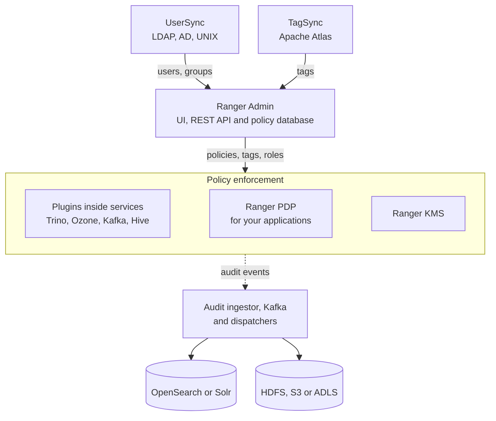
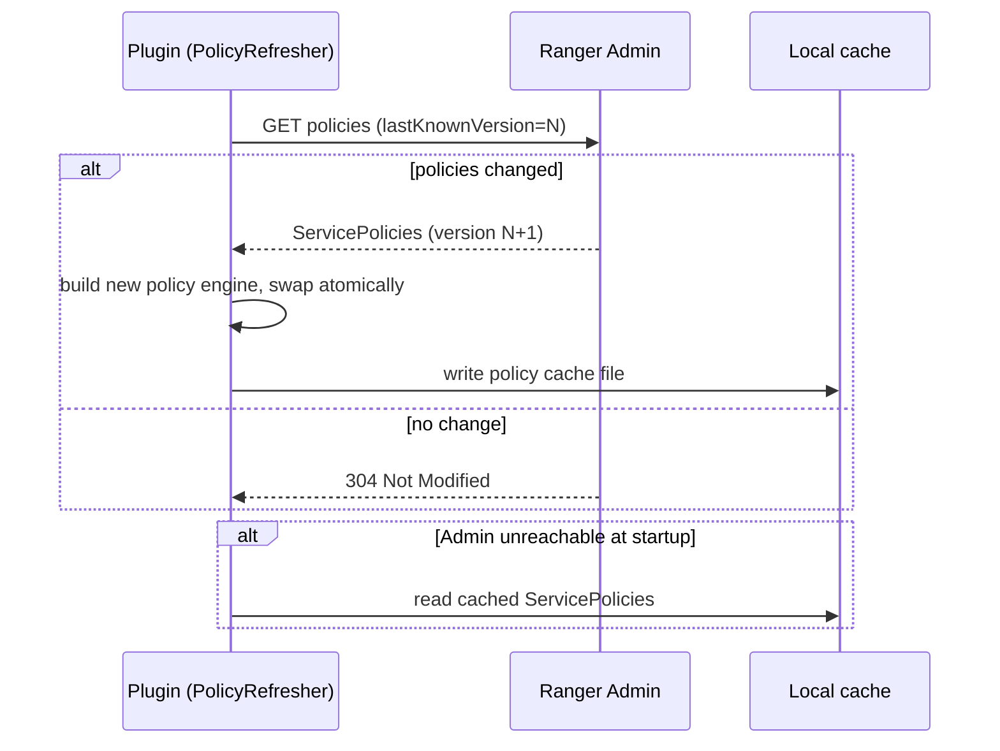
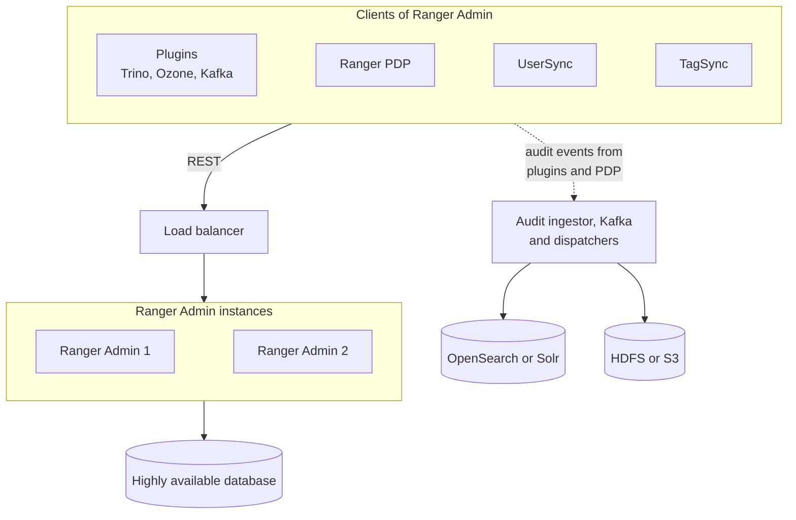

<!---
  Licensed to the Apache Software Foundation (ASF) under one or more
  contributor license agreements.  See the NOTICE file distributed with
  this work for additional information regarding copyright ownership.
  The ASF licenses this file to You under the Apache License, Version 2.0
  (the "License"); you may not use this file except in compliance with
  the License.  You may obtain a copy of the License at

      http://www.apache.org/licenses/LICENSE-2.0

  Unless required by applicable law or agreed to in writing, software
  distributed under the License is distributed on an "AS IS" BASIS,
  WITHOUT WARRANTIES OR CONDITIONS OF ANY KIND, either express or implied.
  See the License for the specific language governing permissions and
  limitations under the License.
-->

# Ranger Architecture

Apache Ranger is a framework for defining, enforcing, and auditing access to data across many
services from one place. You write authorization policies once in the **Ranger Admin** web
application; the services you protect (Polaris, Trino, Ozone, Kafka, Hive, and so on) enforce those
policies themselves through an embedded library called a **plugin**, and your own applications can
do the same through the authorization API or the **Ranger PDP** server. Every access decision the plugins
make can be written to a central **audit** store, so you can answer "who accessed what, when, and
was it allowed" for the whole platform.

The key design point is that enforcement never depends on a round trip to a central server.
Plugins download policies from Ranger Admin, keep a local copy, and evaluate every request in
memory inside the protected service. If Ranger Admin is unavailable, plugins keep enforcing the last
policies they received. This gives Ranger high throughput and no single point of failure on the
authorization path.

This page describes the components, how data flows between them, typical deployment layouts,
and where to read about high availability.

## Components

| Component | Runs as | Purpose |
|-----------|---------|---------|
| [Ranger Admin](../services/admin/service.md) | Web application (`security-admin` module) | Policy store, REST API and web UI for policies, services, users, roles, zones, tags, and audit search. |
| Policy database | MySQL, PostgreSQL, Oracle, SQL Server, or SQL Anywhere | Persists everything Ranger Admin manages. Plugins never talk to it directly. |
| [Plugins](plugin-architecture.md) | Library inside the protected service process | Download policies, evaluate access requests in-process, and emit audit events. |
| Ranger PDP | REST server (`pdp` module) | Policy decision point: applications send an authorization request over HTTP and receive a decision. |
| [UserSync](../services/usersync/service.md) | Standalone service (`ugsync` module) | Pulls users and groups from LDAP, Active Directory, UNIX, or files into Ranger Admin for use in policies. |
| [TagSync](../services/tagsync/service.md) | Standalone service (`tagsync` module) | Pulls classifications (tags) from Apache Atlas or files into Ranger Admin for tag-based policies. |
| [Ranger KMS](../services/kms/service.md) | Web application (`kms` module) | Key management service, compatible with the Hadoop KMS API, whose key operations are authorized by Ranger policies. |
| Audit server | Ingestor and dispatchers (`audit-server` module) | Receives audit events from plugins over REST, buffers them in Kafka, and dispatches them to Solr, OpenSearch, or HDFS. |
| Audit stores | Solr, OpenSearch, Elasticsearch, HDFS, object stores, log files | Keep audit events. Ranger Admin queries the index store to show audits in the UI. |

### Component diagram

Ranger Admin also reads the audit index (OpenSearch or Solr) to show audits in its UI.

Plugins can also write audit events directly to Solr, Elasticsearch, OpenSearch, HDFS, or log files
without going through the audit server; the audit server is the newer path that decouples the
protected service from the audit store. It is the default in the development Docker setup on master
and is not yet part of a release.

## Data flows

### Policy download (Admin to plugins)

Plugins **pull** policies; Ranger Admin never pushes. Each plugin runs a `PolicyRefresher` thread
that, at a configurable interval (`ranger.plugin.<type>.policy.pollIntervalMs`, default 30000 ms),
calls Ranger Admin with the last policy version it knows about. Admin returns the full policy set
(or only the deltas, when `ranger.plugin.<type>.supports.policy.deltas=true`) if anything changed,
otherwise HTTP 304 (Not Modified) with no body.

The download request is `GET /service/plugins/secure/policies/download/{serviceName}?lastKnownVersion=N`,
and the cache file is named `<appId>_<serviceName>.json`.

* The same loop also downloads roles (`/service/roles/secure/download/{serviceName}`). When the
  service definition declares the enrichers, each enricher runs its own refresher for tags
  (`/service/tags/secure/download/{serviceName}`),
  the user store (`/service/xusers/secure/download/{serviceName}`), and GDS data
  (`/service/gds/secure/download/{serviceName}`). Non-Kerberos deployments use the same paths
  without the `secure/` segment.
* Policies are cached on local disk under `ranger.plugin.<type>.policy.cache.dir` so a service can
  restart and enforce policies even while Ranger Admin is down.
* Ranger Admin records each download in the **Audit > Plugins** and **Plugin Status** tabs, which is
  how you verify that a plugin is connected and up to date.

### Access authorization (inside the protected service)

An access request never leaves the process. The service's authorizer hook (for example Hive's
`HiveAuthorizer`, Kafka's `Authorizer`, or Ozone's `IAccessAuthorizer`) builds a
`RangerAccessRequest` and calls `RangerBasePlugin.isAccessAllowed()`. The policy engine matches the
resource against a trie of policies, evaluates tag-based and resource-based policies in order, and
returns a `RangerAccessResult`. The [policy model](policy-model.md) page explains the evaluation
order.

### Audit

Every evaluated request that has auditing enabled produces an `AuthzAuditEvent`. The audit framework
(`agents-audit`) queues events asynchronously, batches them, and spools to local disk if a
destination is slow or unavailable, so auditing never blocks the request path. Destinations are
enabled per plugin with `xasecure.audit.destination.<name>` properties in
`ranger-<type>-audit.xml`; `auditserver`, `hdfs`, `solr`, `elasticsearch`, `opensearch`, and `log4j`
are the common ones.

### User and group sync

UserSync reads users and groups from its configured source (LDAP, Active Directory, UNIX
`/etc/passwd` and `/etc/group`, or a file), converts them to Ranger's model, and posts them to Ranger Admin over
REST. Sync is incremental after the first full run.

### Tag sync

TagSync subscribes to Atlas entity change notifications on Kafka (or polls Atlas REST, or reads
a file), maps Atlas classifications to Ranger tags on service resources, and pushes them to Ranger
Admin. Plugins then download the tags with their policies, which is what makes
tag-based policies work without any per-resource
policy edits.

## Deployment topology

A minimal production deployment has:

1. One or more Ranger Admin instances behind a load balancer, sharing one database.
2. UserSync (one instance; it is a sync job, not on the request path).
3. TagSync if you use Atlas classifications.
4. A plugin configured in each protected service. Plugins live inside the service's own JVM, so they
   scale with the service.
5. An audit index store (Solr or OpenSearch) for UI search, optionally with HDFS or object storage
   for long-term retention, and optionally the audit server in front of them.
6. Ranger KMS if you use HDFS transparent encryption.
7. Ranger PDP if you have applications that call Ranger over REST instead of embedding a plugin.

The `dev-support/ranger-docker` compose files in the repository bring up these components on one
machine with a single Ranger Admin instance (Admin, database, UserSync, TagSync, PDP, KMS, audit
server, OpenSearch or Solr, and protected services such as Trino, Ozone, Kafka, Knox, Hadoop, Hive, and
HBase), built from source. It is the fastest way to see all the pieces together. The released images
on Docker Hub cover Ranger Admin, its database and Solr. See
[Running Ranger with Docker](../getting-started/docker.md) for both.

## High availability

* **Ranger Admin** is stateless apart from the database, so you can run several instances behind a
  load balancer and point plugins at the load balancer URL (or a comma-separated list of Admin URLs
  in `ranger.plugin.<type>.policy.rest.url`). The `ranger-common-ha` module provides
  ZooKeeper/Curator based active-instance election for components that need a single active
  instance.
* **Plugins** keep working when Admin is down: they enforce the last downloaded policies and,
  after a restart, load them from the local cache directory. Audit events are spooled locally
  until the destination is reachable again.
* **Ranger KMS** can run multiple instances sharing one database;
* **UserSync and TagSync** are periodic sync jobs; run one instance and restart it on failure. A
  short outage only delays new users, groups, or tags reaching Ranger.
* **Audit server** components are horizontally scalable Kafka producers and consumers; run more
  dispatcher instances to increase indexing throughput.

## Further reading

* [Policy model](policy-model.md): how policies are structured and evaluated.
* [Plugin architecture](plugin-architecture.md): what happens inside a plugin.
* [Ranger Admin](../services/admin/service.md),
  Security hardening.
* [Introduction](../getting-started/introduction.md) for the supported-services table and key concepts.
* Source: [`agents-common`](https://github.com/apache/ranger/tree/master/agents-common),
  [`security-admin`](https://github.com/apache/ranger/tree/master/security-admin),
  [`dev-support/ranger-docker`](https://github.com/apache/ranger/tree/master/dev-support/ranger-docker).
