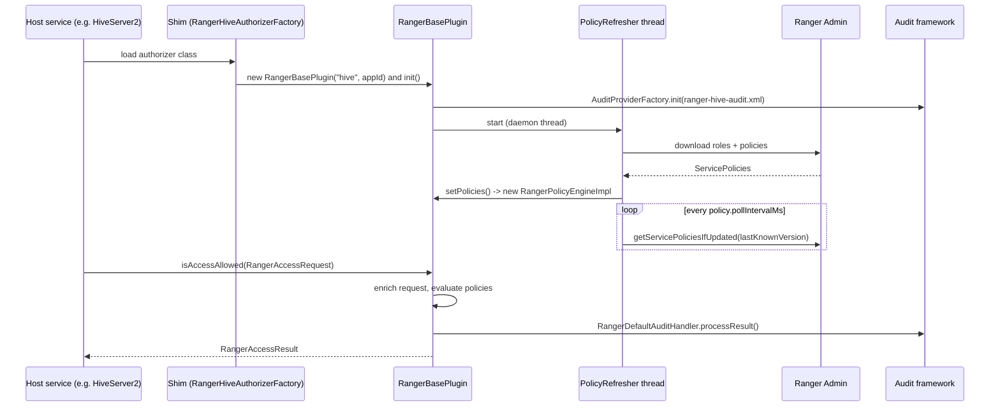
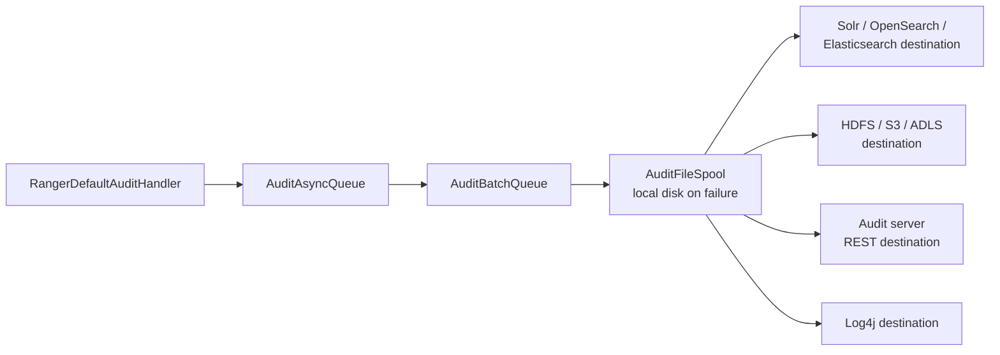

<!---
  Licensed to the Apache Software Foundation (ASF) under one or more
  contributor license agreements.  See the NOTICE file distributed with
  this work for additional information regarding copyright ownership.
  The ASF licenses this file to You under the Apache License, Version 2.0
  (the "License"); you may not use this file except in compliance with
  the License.  You may obtain a copy of the License at

      http://www.apache.org/licenses/LICENSE-2.0

  Unless required by applicable law or agreed to in writing, software
  distributed under the License is distributed on an "AS IS" BASIS,
  WITHOUT WARRANTIES OR CONDITIONS OF ANY KIND, either express or implied.
  See the License for the specific language governing permissions and
  limitations under the License.
-->

# Plugin Architecture

A Ranger plugin is the piece of Ranger that lives inside the service being protected. When you
configure the Hive plugin, for example, you add a set of jars and configuration files to HiveServer2
so that, on every query, Hive asks Ranger's embedded policy engine whether the user may run it. The plugin
downloads policies from Ranger Admin in the background, keeps them in memory and on local disk, and
sends audit records for each decision. Nothing on the query path calls out to Ranger Admin.

All plugins share the same core, `RangerBasePlugin` from the `agents-common` module, and a
service-specific adapter that translates the host's authorization callback (Hive's
`HiveAuthorizer`, HDFS's `INodeAttributeProvider`, a Kafka `Authorizer`, an HBase coprocessor, and
so on) into Ranger's request model. This page describes that shared core: lifecycle, configuration,
policy refresh, the request and result objects, context enrichers and condition evaluators, the
service-definition model, class-loader isolation, and auditing. If you want to write a plugin for
your own application, read this page first and then Custom plugins.

## Lifecycle



1. The host service instantiates the plugin's entry class (through the shim; see
   [Shim and class loader](#shim-and-class-loader-isolation)).
2. The entry class creates a `RangerBasePlugin(serviceType, appId)` and calls `init()`. The
   constructor loads `ranger-<type>-security.xml`, `ranger-<type>-audit.xml`, and
   `ranger-<type>-policymgr-ssl.xml` from the classpath into a `RangerPluginConfig`.
3. `init()` initializes the audit framework, then starts a `PolicyRefresher` thread that performs
   an initial synchronous download of roles and policies (falling back to the local cache) and
   schedules periodic refreshes.
4. Each downloaded policy set becomes a new `RangerPolicyEngineImpl`, which is swapped in
   atomically; in-flight requests finish on the old engine.
5. The host calls `isAccessAllowed()` (and `evalDataMaskPolicies()` / `evalRowFilterPolicies()`
   for services that support them) for each operation. The configured
   `RangerAccessResultProcessor`, normally `RangerDefaultAuditHandler`, turns each result into an
   audit event.
6. `cleanup()` stops the refresher and releases the engine when the host shuts down.

## RangerBasePlugin API

The methods a host adapter uses most, from
[`RangerBasePlugin`](https://github.com/apache/ranger/blob/master/agents-common/src/main/java/org/apache/ranger/plugin/service/RangerBasePlugin.java):

`RangerBasePlugin(String serviceType, String appId)`
:   Create a plugin for a service type (`hive`, `hdfs`, your custom type). `appId` distinguishes
    several hosts of the same type (for example `hiveServer2` and `hiveMetastore`) in audit and
    cache file names.

`init()`
:   Load audit configuration, start policy refresh, initialize chained plugins.

`setResultProcessor(RangerAccessResultProcessor)`
:   Install the audit handler.

`isAccessAllowed(RangerAccessRequest)`, `isAccessAllowed(Collection<RangerAccessRequest>)`
:   Evaluate access policies (policy type 0). Overloads take an explicit result processor.

`evalDataMaskPolicies(request, resultProcessor)`
:   Evaluate data-mask policies; the result carries the mask type and expression.

`evalRowFilterPolicies(request, resultProcessor)`
:   Evaluate row-filter policies; the result carries the filter expression.

`getResourceACLs(request)`
:   Return the effective allow/deny per user, group, and role for a resource (used by Hive
    `SHOW GRANT`, the HBase coprocessor's `getUserPermissions`, and similar).

`grantAccess(GrantRevokeRequest, ...)`, `revokeAccess(...)`
:   Forward SQL `GRANT`/`REVOKE` statements to Ranger Admin so they become policies.

`refreshPoliciesAndTags()`
:   Force an immediate refresh.

`getServiceDef()`, `getPolicyVersion()`, `getConfig()`
:   Introspection.

`cleanup()`
:   Stop background threads.

The minimal host adapter looks like the sample in
[`ranger-examples/plugin-sampleapp`](https://github.com/apache/ranger/blob/master/ranger-examples/plugin-sampleapp/src/main/java/org/apache/ranger/examples/sampleapp/RangerAuthorizer.java):

```java title="RangerAuthorizer.java (excerpt)"
plugin = new RangerBasePlugin("sampleapp", "sampleapp");
plugin.setResultProcessor(new RangerDefaultAuditHandler(plugin.getConfig()));
plugin.init();

RangerAccessResourceImpl resource = new RangerAccessResourceImpl();
resource.setValue("path", fileName); // "path" must be a resource name in the servicedef JSON

RangerAccessRequest request = new RangerAccessRequestImpl(resource, accessType, user, userGroups, null);
RangerAccessResult  result  = plugin.isAccessAllowed(request);

return result != null && result.getIsAllowed();
```

## Configuration

`RangerPluginConfig` reads three XML files for the service type from the classpath of the protected
service: `ranger-<type>-security.xml`, `ranger-<type>-audit.xml` and the TLS settings file. Three optional
files for a specific service name (`ranger-<type>-<serviceName>-security.xml` and so on) override them. This
section shows the properties read by `agents-common`, which every plugin shares. Individual
plugin pages add the properties specific to their service.

### ranger-&lt;type&gt;-security.xml { #security-xml }

Keys start with `ranger.plugin.<type>`, where `<type>` is the service type (`hive`, `trino`, `kafka`, ...).
The example below uses `trino`; replace it with your service type. Only the service name and the Ranger
Admin URL are mandatory. Every other property is shown with its default value, and the groups follow the
order in which the plugin uses them: connecting to Ranger Admin, authenticating, refreshing policies,
describing the request, resolving users and groups, optional engine features, and engine tuning.

```xml title="ranger-trino-security.xml"
<configuration>
  <!-- Connection -->
  <property>
    <name>ranger.plugin.trino.service.name</name>
    <value>dev_trino</value>
    <description>MANDATORY: Name of the service in Ranger Admin whose policies this plugin enforces.</description>
  </property>
  <property>
    <name>ranger.plugin.trino.policy.rest.url</name>
    <value>http://ranger-admin:6080</value>
    <description>MANDATORY: Ranger Admin URL, for example http://ranger-admin:6080. Comma-separated list
      for HA.</description>
  </property>
  <property>
    <name>ranger.plugin.trino.policy.rest.ssl.config.file</name>
    <value></value>
    <description>ranger-trino-policymgr-ssl.xml with keystore and truststore settings for HTTPS to Admin.
      Default: not set.</description>
  </property>
  <property>
    <name>ranger.plugin.trino.policy.source.impl</name>
    <value>org.apache.ranger.admin.client.RangerAdminRESTClient</value>
    <description>Class that fetches policies. Replace it to load policies from another source.</description>
  </property>
  <property>
    <name>ranger.plugin.trino.policy.rest.client.connection.timeoutMs</name>
    <value>120000</value>
    <description>HTTP connect timeout to Admin. Unit: milliseconds.</description>
  </property>
  <property>
    <name>ranger.plugin.trino.policy.rest.client.read.timeoutMs</name>
    <value>30000</value>
    <description>HTTP read timeout. Unit: milliseconds.</description>
  </property>
  <property>
    <name>ranger.plugin.trino.policy.rest.client.max.retry.attempts</name>
    <value>3</value>
    <description>Retries per download attempt.</description>
  </property>
  <property>
    <name>ranger.plugin.trino.policy.rest.client.retry.interval.ms</name>
    <value>1000</value>
    <description>Delay between retries. Unit: milliseconds.</description>
  </property>
  <property>
    <name>ranger.plugin.trino.policy.rest.client.cookie.enabled</name>
    <value>true</value>
    <description>Reuse the Admin session cookie between requests.</description>
  </property>

  <!-- Authentication to Ranger Admin -->
  <property>
    <name>ranger.plugin.trino.policy.rest.client.jwt.supplier</name>
    <value></value>
    <description>Supplier&lt;String&gt; implementation that returns the bearer token. It needs a
      constructor taking a Hadoop Configuration or a no-argument constructor. When not set and
      jwt.source is set, org.apache.ranger.plugin.authn.DefaultTokenSupplier is used. Default:
      not set.</description>
  </property>
  <property>
    <name>ranger.plugin.trino.policy.rest.client.jwt.source</name>
    <value></value>
    <description>Where DefaultTokenSupplier reads the token: env, file or cred. Default: not set.</description>
  </property>
  <property>
    <name>ranger.plugin.trino.policy.rest.client.jwt.env</name>
    <value></value>
    <description>For env: environment variable holding the token. Default: not set.</description>
  </property>
  <property>
    <name>ranger.plugin.trino.policy.rest.client.jwt.file</name>
    <value></value>
    <description>For file: file holding the token; re-read when it changes. Default: not set.</description>
  </property>
  <property>
    <name>ranger.plugin.trino.policy.rest.client.jwt.cred.file</name>
    <value></value>
    <description>For cred: credential store holding the token; re-read at most once a minute. Default:
      not set.</description>
  </property>
  <property>
    <name>ranger.plugin.trino.policy.rest.client.jwt.cred.alias</name>
    <value></value>
    <description>For cred: alias of the token in the credential store. Default: not set.</description>
  </property>

  <!-- Policy refresh and cache -->
  <property>
    <name>ranger.plugin.trino.policy.cache.dir</name>
    <value>/etc/ranger/dev_trino/policycache</value>
    <description>Directory for the cache file &lt;appId&gt;_&lt;serviceName&gt;.json, plus roles, tags,
      and user-store caches. Default: not set.</description>
  </property>
  <property>
    <name>ranger.plugin.trino.policy.pollIntervalMs</name>
    <value>30000</value>
    <description>How often the refresher asks Admin for updates. Unit: milliseconds.</description>
  </property>
  <property>
    <name>ranger.plugin.trino.supports.policy.deltas</name>
    <value>false</value>
    <description>Ask Admin for incremental policy changes instead of the full set.</description>
  </property>
  <property>
    <name>ranger.plugin.trino.supports.tag.deltas</name>
    <value>false</value>
    <description>Ask Admin for incremental tag changes.</description>
  </property>
  <property>
    <name>ranger.plugin.trino.preserve.deltas</name>
    <value>false</value>
    <description>Keep versioned copies of the cache file.</description>
  </property>
  <property>
    <name>ranger.plugin.trino.dedup.strings</name>
    <value>true</value>
    <description>Intern strings in downloaded policies to reduce heap use.</description>
  </property>

  <!-- Request context -->
  <property>
    <name>ranger.plugin.trino.access.cluster.name</name>
    <value></value>
    <description>Cluster name sent with requests and audits; used by cluster-based conditions. Default:
      not set.</description>
  </property>
  <property>
    <name>ranger.plugin.trino.access.cluster.type</name>
    <value></value>
    <description>Cluster type, used the same way. Default: not set.</description>
  </property>
  <property>
    <name>ranger.plugin.trino.use.x-forwarded-for.ipaddress</name>
    <value>false</value>
    <description>Take the client IP from X-Forwarded-For when the request passed through a proxy.</description>
  </property>
  <property>
    <name>ranger.plugin.trino.trusted.proxy.ipaddresses</name>
    <value></value>
    <description>Proxies trusted for the X-Forwarded-For header. Default: not set.</description>
  </property>

  <!-- Users and groups -->
  <property>
    <name>ranger.plugin.trino.super.users</name>
    <value></value>
    <description>Users always allowed, bypassing policies. Default: not set.</description>
  </property>
  <property>
    <name>ranger.plugin.trino.super.groups</name>
    <value></value>
    <description>Groups always allowed, bypassing policies. Default: not set.</description>
  </property>
  <property>
    <name>ranger.plugin.trino.service.admins</name>
    <value></value>
    <description>Users treated as service admins by the engine. Default: not set.</description>
  </property>
  <property>
    <name>ranger.plugin.trino.audit.exclude.users</name>
    <value></value>
    <description>Users whose requests are not audited. Default: not set.</description>
  </property>
  <property>
    <name>ranger.plugin.trino.audit.exclude.groups</name>
    <value></value>
    <description>Groups whose requests are not audited. Default: not set.</description>
  </property>
  <property>
    <name>ranger.plugin.trino.audit.exclude.roles</name>
    <value></value>
    <description>Roles whose requests are not audited. Default: not set.</description>
  </property>
  <property>
    <name>ranger.plugin.trino.use.rangerGroups</name>
    <value>false</value>
    <description>Add the user's groups from the Ranger user store to the request.</description>
  </property>
  <property>
    <name>ranger.plugin.trino.use.only.rangerGroups</name>
    <value>false</value>
    <description>Ignore groups supplied by the host and use only Ranger's.</description>
  </property>
  <property>
    <name>ranger.plugin.trino.convert.emailToUser</name>
    <value>false</value>
    <description>Map an email-address principal to a Ranger user name through the user store.</description>
  </property>

  <!-- Enrichers, fallback and chaining -->
  <property>
    <name>ranger.plugin.trino.is.fallback.supported</name>
    <value>false</value>
    <description>Return "undetermined" to the host instead of deny when no policy matches. HDFS sets this
      from xasecure.add-hadoop-authorization.</description>
  </property>
  <property>
    <name>ranger.plugin.trino.enable.implicit.userstore.enricher</name>
    <value>false</value>
    <description>Load the user store even if the service definition does not declare the enricher. Turned
      on automatically by the Ranger-groups and email options above.</description>
  </property>
  <property>
    <name>ranger.plugin.trino.enable.implicit.gdsinfo.enricher</name>
    <value>true</value>
    <description>Load GDS dataset information.</description>
  </property>
  <property>
    <name>ranger.plugin.trino.chained.services</name>
    <value></value>
    <description>Other services whose policies are consulted after this one; see Chained plugins.
      Default: not set.</description>
  </property>
  <property>
    <name>ranger.plugin.trino.chained.services.SERVICE_NAME.impl</name>
    <value></value>
    <description>RangerChainedPlugin implementation for each chained service. Default: not set. Replace
      SERVICE_NAME with the chained service's name.</description>
  </property>

  <!-- Policy engine options -->
  <property>
    <name>ranger.plugin.trino.policyengine.option.disable.context.enrichers</name>
    <value>false</value>
    <description>Skip tag, user-store, and GDS enrichers.</description>
  </property>
  <property>
    <name>ranger.plugin.trino.policyengine.option.disable.custom.conditions</name>
    <value>false</value>
    <description>Ignore policy conditions.</description>
  </property>
  <property>
    <name>ranger.plugin.trino.policyengine.option.disable.tagpolicy.evaluation</name>
    <value>false</value>
    <description>Skip tag-based policies.</description>
  </property>
  <property>
    <name>ranger.plugin.trino.policyengine.option.disable.policy.refresher</name>
    <value>false</value>
    <description>Do not start the refresher; policies must be set programmatically.</description>
  </property>
  <property>
    <name>ranger.plugin.trino.policyengine.option.disable.tag.retriever</name>
    <value>false</value>
    <description>Skip the background download of tags.</description>
  </property>
  <property>
    <name>ranger.plugin.trino.policyengine.option.disable.userstore.retriever</name>
    <value>false</value>
    <description>Skip the background download of the user store.</description>
  </property>
  <property>
    <name>ranger.plugin.trino.policyengine.option.disable.gdsinfo.retriever</name>
    <value>false</value>
    <description>Skip the background download of GDS information.</description>
  </property>
  <property>
    <name>ranger.plugin.trino.policyengine.option.disable.role.resolution</name>
    <value>true</value>
    <description>When false, roles named in a policy are expanded to their users and groups when the
      policy's ACL summary is built.</description>
  </property>
  <property>
    <name>ranger.plugin.trino.policyengine.option.disable.trie.lookup.prefilter</name>
    <value>false</value>
    <description>Evaluate every policy instead of trie-selected candidates (debugging only).</description>
  </property>
  <property>
    <name>ranger.plugin.trino.policyengine.option.cache.audit.results</name>
    <value>true</value>
    <description>Cache the audit-enabled decision per resource.</description>
  </property>
  <property>
    <name>ranger.plugin.trino.policyengine.option.enable.resourcematcher.reuse</name>
    <value>true</value>
    <description>Share resource matchers between policies with identical resources.</description>
  </property>
  <property>
    <name>ranger.plugin.trino.policyengine.option.optimize.trie.for.retrieval</name>
    <value>false</value>
    <description>Use more memory for faster lookups in the resource trie.</description>
  </property>
  <property>
    <name>ranger.plugin.trino.policyengine.option.optimize.trie.for.space</name>
    <value>false</value>
    <description>Use less memory at the cost of slower lookups in the resource trie.</description>
  </property>
  <property>
    <name>ranger.plugin.trino.policyengine.option.optimize.tag.trie.for.retrieval</name>
    <value>false</value>
    <description>Same as optimize.trie.for.retrieval, for the tag trie.</description>
  </property>
  <property>
    <name>ranger.plugin.trino.policyengine.option.optimize.tag.trie.for.space</name>
    <value>false</value>
    <description>Same as optimize.trie.for.space, for the tag trie.</description>
  </property>
</configuration>
```

The plugin's REST client authenticates to Ranger Admin with Kerberos (SPNEGO) when the host process has a
Kerberos login, with HTTP Basic when `policy.rest.client.username` and `policy.rest.client.password` are
set, or with a bearer token. For bearer tokens the client holds a token supplier
(`java.util.function.Supplier<String>`) and calls it for every request, so tokens can be refreshed without
restarting the plugin. The supplier is chosen from configuration when the plugin is created, or set in code
with `RangerBasePlugin.registerTokenSupplier(Supplier<String>)`. A supplier class that cannot be loaded,
does not implement `Supplier`, or cannot be instantiated fails plugin initialization with an
`IllegalArgumentException`.

The `policyengine.option` defaults shown are those for plugins; Ranger Admin uses different defaults for
its own embedded engine. `is.fallback.supported` is set by the HDFS plugin from
`xasecure.add-hadoop-authorization`, and chained services are described in
[Chained plugins](#chained-plugins).

### ranger-&lt;type&gt;-audit.xml { #audit-xml }

Audit properties keep the `xasecure.audit` prefix. A destination is switched on with
`xasecure.audit.destination.<name>=true` and configured with properties under the same prefix, where
`<name>` is one of `auditserver`, `solr`, `elasticsearch`, `opensearch`, `hdfs`, `log4j` and the other
destinations provided by `agents-audit`. The example sends audits to the audit server.

```xml title="ranger-trino-audit.xml"
<configuration>
  <property>
    <name>xasecure.audit.is.enabled</name>
    <value>true</value>
    <description>Master switch for auditing in this plugin.</description>
  </property>
  <property>
    <name>xasecure.audit.destination.auditserver</name>
    <value>true</value>
    <description>Set to true to enable the destination. Default: not set.</description>
  </property>
  <property>
    <name>xasecure.audit.destination.auditserver.url</name>
    <value>http://ranger-audit-ingestor:7081</value>
    <description>URL of the audit ingestor. Default: not set.</description>
  </property>
  <property>
    <name>xasecure.audit.destination.auditserver.batch.filespool.dir</name>
    <value>/var/log/trino/audit/auditserver/spool</value>
    <description>Local spool directory used when the destination is unavailable.
      Default: not set.</description>
  </property>
  <property>
    <name>xasecure.audit.provider.filecache.is.enabled</name>
    <value>false</value>
    <description>Write events to a local file cache first and forward from there.</description>
  </property>
</configuration>
```

The full property reference is on the Audit framework page.

## Policy refresher

`PolicyRefresher` is a daemon thread plus a timer. At startup it calls `loadRoles()` and
`loadPolicy()` synchronously so the plugin has policies before serving its first request; then a
timer enqueues a download trigger every `policy.pollIntervalMs`.

* **Download.** `RangerAdminRESTClient.getServicePoliciesIfUpdated(lastKnownVersion,
  lastActivationTime)` calls `/service/plugins/secure/policies/download/{serviceName}` (or the
  non-`secure` path when Kerberos is off) with `lastKnownVersion`, `pluginId`, `clusterName`,
  `supportsPolicyDeltas`, and `pluginCapabilities`. Admin answers with `ServicePolicies` only when
  the version changed.
* **Apply.** `RangerBasePlugin.setPolicies()` builds a new `RangerPolicyEngineImpl` (or applies
  deltas to a copy of the current one), attaches enrichers, and swaps it in.
* **Cache.** The applied policies are written to `<policy.cache.dir>/<appId>_<serviceName>.json`.
  If Admin cannot be reached at startup, the cache is read instead. If Admin reports that the
  service no longer exists, the cache file is renamed aside and the plugin runs with no policies.
* **Failure.** Any other error is logged and the plugin keeps the last known policies; the next
  poll tries again.
* **Roles, tags, user store, GDS.** `RangerRolesProvider`, `RangerTagEnricher`,
  `RangerUserStoreEnricher`, and `RangerGdsEnricher` each run the same download-and-cache pattern
  against their own endpoints, using the polling intervals from their enricher options.
* **Force refresh.** The plugin exposes `refreshPoliciesAndTags()` for hosts that want to refresh
  after a `GRANT`.

Every download is reported back to Admin, which is what populates the **Audit > Plugins** and
**Plugin Status** tabs in the UI.

## Request and result

`RangerAccessRequest` describes what is being attempted. The host adapter fills a
`RangerAccessRequestImpl`:

`resource`
:   A `RangerAccessResource` (map of resource level to value, for example `database=finance, table=orders`), optionally with an owner.

`accessType`
:   The access type from the service definition (`select`, `write`, ...). A special value `_any` asks "any access at all", used for existence checks.

`user`, `userGroups`, `userRoles`
:   The principal. Roles are normally resolved by the engine from Ranger roles.

`accessTime`
:   When the access happens (drives validity schedules and time-of-day conditions).

`clientIPAddress`, `remoteIPAddress`, `forwardedAddresses`
:   Network origin, used by IP conditions and audits.

`clientType`, `action`, `requestData`, `sessionId`
:   Host-specific details recorded in audits (for Hive: `HIVESERVER2`, the command type, and the query text).

`clusterName`, `clusterType`
:   From configuration; used by cluster conditions.

`context`
:   A map populated by context enrichers (tags, user attributes, GDS info) and by the host (for example resources accessed together).

`resourceMatchingScope`
:   `SELF` or `SELF_OR_DESCENDANTS`, for checks such as "may the user access anything under this database".


`RangerAccessResult` is what comes back:

`isAccessDetermined`, `isAllowed`
:   The decision. `isAccessDetermined=false` means no policy matched (see fallback in [Policy model](policy-model.md#evaluation-order)).

`policyId`, `policyVersion`, `policyPriority`, `zoneName`
:   Which policy decided, from which zone.

`isAudited`, `auditPolicyId`, `auditLogId`
:   Whether an audit record is produced and which policy's audit flag decided that.

`reason`
:   Free text, for example `superuser` or `matched deny-all-else policy`.

`maskType`, `maskedValue`, `maskCondition`
:   For data-mask evaluations.

`filterExpr`
:   For row-filter evaluations.

`datasets`, `projects`, `allowedByDatasets`, `allowedByProjects`
:   GDS information.

`evaluatedPoliciesCount`
:   Diagnostics.


## Context enrichers and condition evaluators

**Context enrichers** run before evaluation and add information to `request.context`. They are
declared in the service definition (`contextEnrichers`) or enabled implicitly by configuration:

`RangerTagEnricher`
:   Adds the tags attached to the resource, from the tag service linked to this service. Options:
    `tagRetrieverClassName` (`RangerAdminTagRetriever` in the shipped tag service definition;
    `RangerFileBasedTagRetriever` reads a file), `tagRefresherPollingInterval` (ms, default 60000), `disableTrieLookupPrefilter`.

`RangerUserStoreEnricher`
:   Adds user and group attributes, Ranger groups, and the email-to-user mapping. Options:
    `userStoreRetrieverClassName` (default `RangerAdminUserStoreRetriever`),
    `userStoreRefresherPollingInterval` (ms, default 3600000).

`RangerGdsEnricher`
:   Adds the Governed Data Sharing datasets and projects that include the resource. Options:
    `retrieverClassName` (default `RangerAdminGdsInfoRetriever`), `refresherPollingInterval`
    (ms, default 60000).

Geolocation providers (`RangerFileBasedGeolocationProvider`)
:   Add location attributes for the client IP. Options are provider-specific.

**Condition evaluators** implement `RangerConditionEvaluator`. A service definition references them
from its `policyConditions`, by class name in `evaluator`. The evaluators shipped in
`org.apache.ranger.plugin.conditionevaluator` are:

- **Request origin and time**
    - `RangerIpMatcher`: client IP address or range.
    - `RangerTimeOfDayMatcher`: time-of-day windows.
    - `RangerValidityScheduleConditionEvaluator`: validity schedules on a policy item.
- **Cluster**
    - `RangerAccessedFromClusterCondition` and `RangerAccessedNotFromClusterCondition`: the cluster
      name the request came from.
    - `RangerAccessedFromClusterTypeCondition` and `RangerAccessedNotFromClusterTypeCondition`: the
      cluster type.
- **Request context**
    - `RangerContextAttributeValueInCondition` and `RangerContextAttributeValueNotInCondition`: a
      value that an enricher or the host placed in the request context.
    - `RangerActionMatcher`: the action named in the request.
- **Tags**
    - `RangerTagsAllPresentConditionEvaluator`: all listed tags are on the resource.
    - `RangerAnyOfExpectedTagsPresentConditionEvaluator`: at least one listed tag is on the resource.
    - `RangerNoneOfExpectedTagsPresentConditionEvaluator`: none of the listed tags is on the resource.
- **Hive**
    - `RangerHiveResourcesAccessedTogetherCondition` and
      `RangerHiveResourcesNotAccessedTogetherCondition`: resources used together in one query.
- **Script**
    - `RangerScriptConditionEvaluator`: a JavaScript expression over the request, resource, user and
      tags (`REQ`, `RES`, `USER`, `TAG`).
    - `RangerScriptTemplateConditionEvaluator`: a fixed script declared in the service definition
      (`scriptTemplate` in the evaluator options). The policy only chooses whether the script must
      evaluate to true (`yes`) or false (`no`).

See Policy conditions for usage and
Custom conditions and enrichers for writing your own.

## Service definition model

A service definition (`RangerServiceDef`) is the JSON contract between a plugin, Ranger Admin's
UI, and the policy engine. Top-level fields:

`name`, `displayName`, `label`, `description`
:   Identity of the service type. `name` is what plugins pass as `serviceType`.

`implClass`
:   `RangerBaseService` subclass that Ranger Admin loads for test-connection and resource lookup.

`options`
:   Map of service-wide switches: `enableDenyAndExceptionsInPolicies`, `enableTagBasedPolicies`,
    `enableImplicitConditionExpression`, `rrnResourceSepChar`.

`configs`
:   List of `RangerServiceConfigDef`: the properties an admin fills in when creating a service.
    Each has `name`, `type`, `subType`, `mandatory`, `defaultValue`, `validationRegEx`, `uiHint`,
    `label`.

`resources`
:   List of `RangerResourceDef`: the resource hierarchy. Each has `name`, `type`, `level`, `parent`,
    `mandatory`, `lookupSupported`, `recursiveSupported`, `excludesSupported`, `matcher`
    (`RangerDefaultResourceMatcher`, `RangerPathResourceMatcher`, `RangerURLResourceMatcher`),
    `matcherOptions` (`wildCard`, `ignoreCase`, `pathSeparatorChar`), `validationRegEx`, `uiHint`,
    `accessTypeRestrictions`, `isValidLeaf`.

`accessTypes`
:   List of `RangerAccessTypeDef`: the permissions. Each has `name`, `label`, `impliedGrants` (for
    example Hive `all` implies every other type), and `category` (`CREATE`, `READ`, `UPDATE`,
    `DELETE`, `MANAGE`).

`policyConditions`
:   List of `RangerPolicyConditionDef`: conditions available in the policy editor. Each has `name`,
    `evaluator` class, `evaluatorOptions`, `uiHint`, `label`.

`contextEnrichers`
:   List of `RangerContextEnricherDef`: enrichers to run. Each has `name`, `enricher` class,
    `enricherOptions`.

`enums`
:   List of `RangerEnumDef`: named value lists (`name`, `elements`, `defaultIndex`) usable by
    `configs` of type `enum`.

`dataMaskDef`
:   `RangerDataMaskDef`: `maskTypes` (each with `name`, `label`, `transformer` expression,
    `dataMaskOptions`), plus the subset of `accessTypes` and `resources` that masking applies to.

`rowFilterDef`
:   `RangerRowFilterDef`: the `accessTypes` and `resources` that row filtering applies to.

Every item carries an `itemId` that must stay stable across versions of the definition; Ranger
Admin uses it to migrate existing policies when a definition is updated. The Hive definition,
[`ranger-servicedef-hive.json`](https://github.com/apache/ranger/blob/master/agents-common/src/main/resources/service-defs/ranger-servicedef-hive.json),
is a good reference for a full definition with masking and row filtering; `ranger-servicedef-tag.json`
shows a definition whose only purpose is enrichers and conditions.

## Shim and class loader isolation

Plugins bring their own dependency versions (Jersey, Jackson, HTTP client, and so on) that may
conflict with the host service's. To avoid this, each plugin archive contains two layers:

* `lib/ranger-<type>-plugin-shim-<version>.jar` and `ranger-plugin-classloader-<version>.jar` go
  on the host's normal classpath. The shim contains only thin proxy classes.
* `lib/ranger-<type>-plugin-impl/` holds the real plugin (`ranger-<type>-plugin`,
  `ranger-plugins-common`, `ranger-audit-core`, `ranger-audit-dest-auditserver`,
  `ranger-authz-api`, `ranger-plugins-cred`, `ranger-common-utils`, `ugsync-util`) and all their
  dependencies.

The shim class (for Hive, `RangerHiveAuthorizerFactory` in `ranger-hive-plugin-shim`) creates a
`RangerPluginClassLoader` for the plugin type, which locates the `ranger-<type>-plugin-impl`
directory next to the shim jar and loads every jar in it. The class loader is child-first: it looks
in the impl directory before delegating to the host's class loader, so the plugin sees its own
dependency versions while still being able to load host classes (`HiveConf`, Hadoop
`UserGroupInformation`). Around every call into the implementation, the shim calls
`activate()` (which sets the thread context class loader to the plugin loader) and `deactivate()`
(which restores it):

```java title="RangerHiveAuthorizerFactory.java (shim, excerpt)"
rangerPluginClassLoader = RangerPluginClassLoader.getInstance("hive", this.getClass());

Class<HiveAuthorizerFactory> cls = (Class<HiveAuthorizerFactory>) Class.forName(
        "org.apache.ranger.authorization.hive.authorizer.RangerHiveAuthorizerFactory", true, rangerPluginClassLoader);

activatePluginClassLoader();
rangerHiveAuthorizerFactoryImpl = cls.newInstance();
deactivatePluginClassLoader();
```

The shim and the implementation use the same fully qualified class name; only the class loader
differs. Plugins that run in a process without dependency conflicts (or that you embed in your own
application) can skip the shim and depend on `ranger-plugins-common` directly.

## Audit handler

`RangerDefaultAuditHandler` implements `RangerAccessResultProcessor`. For every result with
`isAudited=true` it builds an `AuthzAuditEvent` and hands it to the audit framework
(`AuditProviderFactory` in `agents-audit`). The event fields, as serialized to the audit store,
are: `repoType`, `repo` (service name), `reqUser`, `evtTime`, `access`, `resource`, `resType`,
`action`, `result`, `agent`, `policy`, `policy_version`, `reason`, `enforcer`, `sess`, `cliType`,
`cliIP`, `reqData`, `agentHost`, `logType`, `id`, `seq_num`, `event_count`, `event_dur_ms`, `tags`,
`datasets`, `projects`, `cluster_name`, `zone_name`, and `additional_info`. When the summary
queue (`AuditSummaryQueue`, `summary.interval.ms`) is enabled, repeated identical events within
the interval are collapsed into one record with `event_count` and `event_dur_ms`.

The framework pipeline is asynchronous so audit never blocks the request:



Hosts that need custom audit behavior (HDFS writes one event for the several checks of one file-system operation, Hive attaches the query
text, multi-resource requests log once) subclass `RangerDefaultAuditHandler` or use
`RangerMultiResourceAuditHandler`. Users, groups, or roles listed in the
`ranger.plugin.<type>.audit.exclude.*` properties are never audited; audit filters defined in the
service configuration (`ranger.plugin.audit.filters`) give finer control.

## Chained plugins

A plugin can consult the policies of another service after its own. The Hive plugin, for example,
can chain the HDFS plugin so that a Hive URL grant is checked against HDFS policies. Configure
`ranger.plugin.<type>.chained.services=<otherService>` and
`ranger.plugin.<type>.chained.services.<otherService>.impl=<RangerChainedPlugin subclass>`. The
chained plugin has its own refresher and policy engine; `RangerBasePlugin` merges its result with
the primary result. Set `ranger.plugin.<type>.bypass.chained.plugin.evaluation.if.access.is.determined=true`
to skip the chained evaluation once the primary engine has decided.

## Further reading

* [Policy model](policy-model.md): how the engine orders and combines policies.
* [Ranger architecture](architecture.md): where plugins sit in the overall system.
* Source: [`agents-common`](https://github.com/apache/ranger/tree/master/agents-common),
  [`ranger-plugin-classloader`](https://github.com/apache/ranger/tree/master/ranger-plugin-classloader),
  [`agents-audit`](https://github.com/apache/ranger/tree/master/agents-audit),
  [`ranger-examples/plugin-sampleapp`](https://github.com/apache/ranger/tree/master/ranger-examples/plugin-sampleapp).
