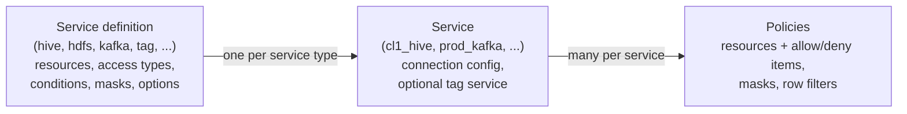
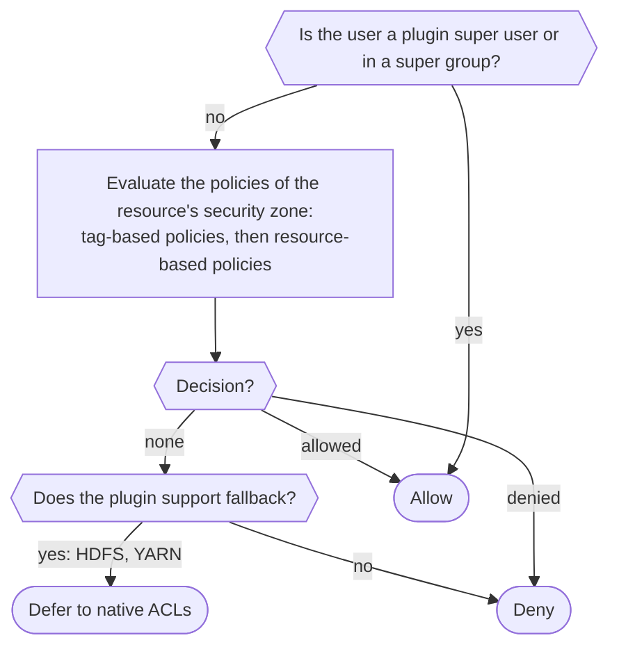

<!---
  Licensed to the Apache Software Foundation (ASF) under one or more
  contributor license agreements.  See the NOTICE file distributed with
  this work for additional information regarding copyright ownership.
  The ASF licenses this file to You under the Apache License, Version 2.0
  (the "License"); you may not use this file except in compliance with
  the License.  You may obtain a copy of the License at

      http://www.apache.org/licenses/LICENSE-2.0

  Unless required by applicable law or agreed to in writing, software
  distributed under the License is distributed on an "AS IS" BASIS,
  WITHOUT WARRANTIES OR CONDITIONS OF ANY KIND, either express or implied.
  See the License for the specific language governing permissions and
  limitations under the License.
-->

# Policy Model

A Ranger policy answers one question: *which users may perform which actions on which resources,
and under what conditions?* The same model is used for every service Ranger protects, whether the
resource is a Polaris namespace, a Trino column, an Ozone key, a Kafka topic, or an HDFS path. Because the model is
declarative, Ranger Admin can render a policy editor for any service, and the policy engine inside
every plugin can evaluate policies for any service without service-specific code.

This page explains the three layers of the model (service definition, service, policy), what a
policy contains, the difference between resource-based and tag-based policies, and, most
importantly, the exact order in which the policy engine evaluates policies so you can predict the
outcome of overlapping allow and deny rules.

## Three layers



Service definition
:   Describes a *type* of service: which resource levels exist (for Hive: `database`, `table`,
    `column`, `udf`, `url`, ...), which access types can be granted (`select`, `update`, `create`,
    ...), which custom conditions and context enrichers apply, whether data masking and row
    filtering are supported, and service-wide options. Ranger ships definitions as JSON under
    [`agents-common/src/main/resources/service-defs`](https://github.com/apache/ranger/tree/master/agents-common/src/main/resources/service-defs)
    and loads them into the database on first start. You can add your own with the REST API; The full field list is in
    [Plugin architecture](plugin-architecture.md#service-definition-model).

Service
:   An *instance* of a service definition, such as `cl1_hive` for one HiveServer2 cluster. It
    holds the connection properties Ranger Admin uses for test-connection and resource lookup
    (JDBC URL, credentials) and is the name a plugin uses to download its policies
    (`ranger.plugin.hive.service.name=cl1_hive`). A resource service can be linked to one tag
    service so that tag-based policies also apply to it.

Policy
:   A rule attached to a service. It names one set of resources and lists who may (or may not)
    perform which access types on them.

## Anatomy of a policy

Below is an access policy for a Hive service as returned by the REST API
(`GET /service/public/v2/api/policy/{id}`). Fields map one-to-one to
[`RangerPolicy`](https://github.com/apache/ranger/blob/master/agents-common/src/main/java/org/apache/ranger/plugin/model/RangerPolicy.java).

```json title="Hive access policy"
{
  "service":        "cl1_hive",
  "name":           "finance-db",
  "policyType":     0,
  "policyPriority": 0,
  "isEnabled":      true,
  "isAuditEnabled": true,
  "description":    "finance group may read the finance database; interns may not, except scott",
  "resources": {
    "database": { "values": ["finance"], "isExcludes": false, "isRecursive": false },
    "table":    { "values": ["*"],       "isExcludes": false, "isRecursive": false },
    "column":   { "values": ["*"],       "isExcludes": false, "isRecursive": false }
  },
  "policyItems": [
    {
      "accesses":      [ { "type": "select", "isAllowed": true } ],
      "users":         [],
      "groups":        [ "finance" ],
      "roles":         [],
      "conditions":    [],
      "delegateAdmin": false
    }
  ],
  "denyPolicyItems": [
    { "accesses": [ { "type": "select", "isAllowed": true } ], "groups": [ "interns" ] }
  ],
  "allowExceptions": [],
  "denyExceptions": [
    { "accesses": [ { "type": "select", "isAllowed": true } ], "users": [ "scott" ] }
  ],
  "validitySchedules": [
    { "startTime": "2026/01/01 00:00:00", "endTime": "2026/12/31 23:59:59", "timeZone": "UTC" }
  ],
  "policyLabels": [ "finance" ],
  "zoneName":     "",
  "isDenyAllElse": false
}
```

`policyType`
:   `0` access, `1` data mask, `2` row filter, `3` audit-only. Mask and row-filter policies carry
    `dataMaskPolicyItems` / `rowFilterPolicyItems` instead of allow/deny items.

`policyPriority`
:   `0` (`NORMAL`) or `1` (`OVERRIDE`). See [Priority](#policy-priority).

`resources`
:   One entry per resource level defined in the service definition. `values` may contain wildcards
    and macros; `isExcludes` inverts the match ("every database except these"); `isRecursive`
    applies to hierarchical resources such as paths.

`additionalResources`
:   Optional extra resource sets, so one policy can cover several unrelated resources.

`policyItems`
:   **Allow** items: each grants `accesses` to `users`, `groups`, and/or `roles`, optionally under
    `conditions`. `delegateAdmin: true` lets those principals manage policies for this resource.

`denyPolicyItems`
:   **Deny** items with the same structure.

`allowExceptions` / `denyExceptions`
:   Principals carved out of the allow or deny items.

`isDenyAllElse`
:   When `true`, every access not explicitly allowed by this policy is denied, without consulting
    other policies.

`validitySchedules`
:   Time windows during which the policy is in effect.

`policyLabels`
:   Free-form labels for grouping and searching policies.

`zoneName`
:   The [security zone](../features/sec-zone/intro.md) the policy belongs to; empty for the default
    (unzoned) set.

`isAuditEnabled`
:   Whether requests matched by this policy generate audit events.

Resource names support wildcards, macros, and user-attribute expressions:

| Resource value | Matches |
|----------------|---------|
| `test_*` | every resource whose name starts with `test_` |
| `/home/{USER}` | a path named after the requesting user |
| `/dept/${{USER.dept}}` | a path named after the requesting user's `dept` attribute |
| `{OWNER}` (in `users`) | the owner of the accessed resource, when the plugin supplies it |

User-attribute expressions need the user store enricher;

## Resource-based and tag-based policies

**Resource-based policies** name resources directly: database `sales`, table `orders`, column
`amount`. They belong to the service that owns the resource (`cl1_hive`).

**Tag-based policies** name a classification instead: `tag = PII`. They belong to a *tag service*
(a service of type `tag`), and apply to any resource in any linked service that carries that tag.
Tags reach the plugin through the `RangerTagEnricher` context enricher, which downloads them from
Ranger Admin (populated by [TagSync](../services/tagsync/service.md) or the REST API) and attaches
them to each access request. Tag policies can use tag attributes in conditions, for example
`TAG.piiType == 'email'`.

Tag-based policies are evaluated *before* resource-based policies (see below), so a deny on a tag
protects data no matter what resource-level policies exist, unless a resource policy with higher
priority allows it.

## Allow, deny, and exceptions

Each access policy has four lists of items:

| List | Effect on a matching request |
|------|------------------------------|
| Allow items (`policyItems`) | Grants the access. |
| Allow exceptions (`allowExceptions`) | Cancels a matching allow item; the request continues as if the allow item had not matched. |
| Deny items (`denyPolicyItems`) | Denies the access. |
| Deny exceptions (`denyExceptions`) | Cancels a matching deny item. |

Deny and exception lists exist only for services whose definition has the option
`enableDenyAndExceptionsInPolicies` set to `true`. The default is `true`; a few shipped
definitions (for example Elasticsearch, NiFi, Kylin, Sqoop) set it to `false`. Ranger Admin hides
the deny and exception sections of the policy editor when the option is off.

Exceptions let you write "everyone in `finance`, except contractors" or "deny `interns`, except
`scott`" in one policy instead of maintaining lists of individual users. Deny items are typically
used to protect sensitive resources from a broad group even if other policies would allow them.

## Policy priority

`policyPriority` is `NORMAL` (0) or `OVERRIDE` (1). The engine evaluates policies in descending
priority. An `OVERRIDE` policy that determines the access (allow or deny) is final; lower-priority
policies for the same resource are not consulted for that decision. Use `OVERRIDE` sparingly, for
example for a temporary grant that must win over an existing deny, or an emergency lockdown that
must win over existing allows.

Within the same priority, a deny that matches anywhere wins over an allow, as described in the
evaluation order below.

## Validity schedules

A policy with `validitySchedules` is applied only inside the listed windows. Each window has a
`startTime`, `endTime` (format `yyyy/MM/dd HH:mm:ss`), a `timeZone`, and optional `recurrences`.
A recurrence has a cron-like `schedule` (`minute`, `hour`, `dayOfMonth`, `dayOfWeek`, `month`,
`year`) and an `interval` (`days`, `hours`, `minutes`) for how long each occurrence lasts, so you
can express "weekdays from 09:00 for 8 hours" within the outer window. Outside all windows the
policy is skipped entirely, as if it did not exist. This is the mechanism for future-dated grants,
time-boxed access for a contractor, or business-hours-only access.

## Evaluation order

The policy engine (`RangerPolicyEngineImpl` and `RangerDefaultPolicyEvaluator` in `agents-common`)
evaluates a request as follows.



Step by step:

1. **Super users.** If the user is listed in `ranger.plugin.<type>.super.users` or belongs to a
   group in `ranger.plugin.<type>.super.groups`, the access is allowed with the reason `superuser`.
   The engine records this decision at the highest possible priority, so no policy, not even a deny
   policy, can override it. Policies are still consulted, but only to decide whether the access is
   audited. Super users are meant for the service's own system accounts.

    !!! note "Super users are not service admins"
        A super user bypasses authorization for data access in the plugin. Managing policies is a
        separate right: users and groups listed in `service.admin.users` and `service.admin.groups` in
        the service's configuration in Ranger Admin can manage that service's policies, roles, tags and
        security zones, and this gives them no access to the data itself.
2. **Zone selection.** The engine determines whether the resource falls inside a
   [security zone](../features/sec-zone/intro.md). If it does, only that zone's policies are used;
   otherwise the default (unzoned) policies are used. Tag policies are likewise taken from the zone
   when the zone is associated with the tag service, and from the default zone otherwise.
3. **Tag-based policies.** For every tag attached to the resource, the engine evaluates the
   matching tag policies (each policy is evaluated with the same deny-then-allow order as below).
   A deny or allow from a tag policy is recorded together with its priority.
4. **Resource-based policies.** Candidate policies are found with a resource trie, sorted with
   `OVERRIDE` before `NORMAL` and, within a priority, policies that have deny items first, and
   evaluated in turn. Policies outside their validity schedule are
   skipped. Inside each policy the order is:
    1. Deny items. If one matches, check deny exceptions; if none cancels it, the policy denies.
    2. Allow items. If one matches, check allow exceptions; if none cancels it, the policy allows.
    3. If nothing matched and `isDenyAllElse` is `true`, the policy denies.
5. **Combining results.** The engine stops as soon as the result is final:
    * A deny from a policy is final when no policy of the same or higher priority remains that
      could allow it. In practice a deny at the same priority always wins over an allow.
    * An allow is final once no policy with deny items remains to be checked at the same or higher
      priority.
    * A deny from a tag policy can be overridden only by a resource policy of *strictly higher*
      priority. An allow from a tag policy can still be denied by a resource policy of the same or
      higher priority.
6. **Undetermined.** If no policy matched, the result is undetermined. Most plugins treat this as a
   deny. Plugins that set `ranger.plugin.<type>.is.fallback.supported=true` return the
   undetermined result to the host service, which then applies its native authorization. The HDFS
   plugin does this when `xasecure.add-hadoop-authorization=true` (the default in the shipped
   template), so HDFS falls back to POSIX permissions and HDFS ACLs. The YARN plugin does the same when
   `ranger.add-yarn-authorization=true` (the default).

Data-mask and row-filter policies are evaluated separately (`evalDataMaskPolicies`,
`evalRowFilterPolicies`); for them the first matching policy item at the highest priority wins, and
there are no deny items.

### Worked example

Users `smith` and `roger` are in group `developer`; `clark` and `mike` are in group `datascientist`.
One HDFS policy on `/perm` contains:

* Deny: group `developer`, all accesses. Deny exception: user `roger`.
* Allow: group `datascientist` and user `roger`, all accesses. Allow exception: user `mike` for
  `write` and `execute`.

| User | Command | Result | Why |
|------|---------|--------|-----|
| roger | `hdfs dfs -ls /perm`, `hdfs dfs -mkdir /perm/dir1` | Allowed by Ranger | matches the deny item but is excluded by the deny exception; then matches the allow item as user `roger` |
| smith | `hdfs dfs -mkdir /perm/dir2` | Denied by Ranger | matches the deny item and is not excluded |
| clark | `hdfs dfs -mkdir /perm/dir3` | Allowed by Ranger | matches the allow item, no exception |
| mike | `hdfs dfs -mkdir /perm/dir4` | Falls back to HDFS ACL (denied there) | matches the allow item but is excluded for `write`; nothing else matches |
| mike | `hdfs dfs -ls /perm` | Falls back to HDFS ACL (allowed there) | listing needs `read` and `execute`; `execute` is excluded, so Ranger cannot allow the whole request |

The audit log shows which enforcer produced the decision: `ranger-acl` when a Ranger policy
determined it, `hadoop-acl` when HDFS fell back to native permissions.

## Related pages

* [Security zones](../features/sec-zone/intro.md).
* [Plugin architecture](plugin-architecture.md): how the engine is hosted and configured.
* Blog: [Apache Ranger policy model](../blog/policy-model.md).
* Further reading on cwiki: [Deny conditions and excludes](https://cwiki.apache.org/confluence/pages/viewpage.action?pageId=61323469),
  [How deny policies work](https://cwiki.apache.org/confluence/pages/viewpage.action?pageId=61331213).
