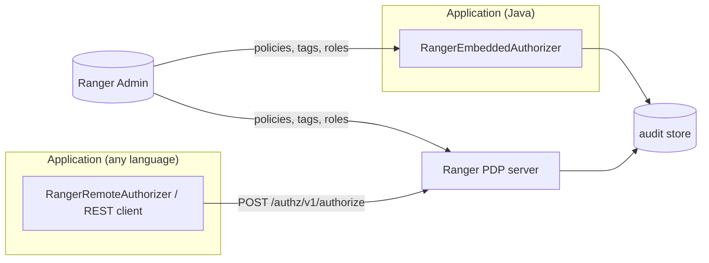

<!---
  Licensed to the Apache Software Foundation (ASF) under one or more
  contributor license agreements.  See the NOTICE file distributed with
  this work for additional information regarding copyright ownership.
  The ASF licenses this file to You under the Apache License, Version 2.0
  (the "License"); you may not use this file except in compliance with
  the License.  You may obtain a copy of the License at

      http://www.apache.org/licenses/LICENSE-2.0

  Unless required by applicable law or agreed to in writing, software
  distributed under the License is distributed on an "AS IS" BASIS,
  WITHOUT WARRANTIES OR CONDITIONS OF ANY KIND, either express or implied.
  See the License for the specific language governing permissions and
  limitations under the License.
-->

# Authorization API and PDP

The authorization API is the most direct way for an application to ask Ranger "may this user do this to that
resource?". You describe the user, the resource, and the permissions you need in a JSON document (or the
equivalent Java/Python object), and Ranger answers with a decision plus any row filter or data mask the
application must apply. The same request and response model is used whether the policies are evaluated inside
your process or by a remote Ranger PDP (policy decision point) server.

Three Maven modules implement it:

`authz-api` (`org.apache.ranger:ranger-authz-api`)
:   The abstract `RangerAuthorizer` class, the request/response model classes, and `RangerAuthorizerFactory`.
    It contains no policy evaluation code.

`authz-embedded` (`org.apache.ranger:authz-embedded`)
:   `RangerEmbeddedAuthorizer` evaluates requests in-process with a `RangerBasePlugin` per service. It downloads
    policies from Ranger Admin and writes audits.

`authz-remote` (`org.apache.ranger:authz-remote`)
:   `RangerRemoteAuthorizer` forwards each request over HTTP(S) to a Ranger PDP server (`/authz/v1/...`).

Because both implementations extend the same abstract class, an application can switch between embedded and
remote evaluation by changing one property (`ranger.authorizer.impl.class`) without touching its code.

!!! note "Two integration styles in the code base"
    The `authz-api` and `authz-embedded` modules were introduced in Ranger 2.8.0; the `authz-remote` client and the PDP server followed in 2.9.0. The Polaris authorizer and the PDP server use it. Most in-tree
    plugins (HDFS, Hive, HBase, Kafka, Ozone, ...) still use the older `RangerBasePlugin` /
    `RangerAccessRequest` API from `agents-common`; that API is described in
    [Plugin architecture](../arch/plugin-architecture.md) and [Custom plugins](../plugins/custom-plugin.md).
    Use the authz API for new integrations.

## Concepts

The terminology below comes from `authz-api/README.txt` and the model classes in
`authz-api/src/main/java/org/apache/ranger/authz/model/`.

User
:   The actor performing the action: a name, and optionally `groups`, `roles`, and free-form `attributes`
    (department, location, ...). Policies can match on any of these.

Resource
:   The object being accessed. It is named as `resource-type:resource-value`, for example
    `path:/warehouse/hive/mktg/visitors`, `table:db1.tbl1` or `table:default/sales`. The part before the first
    `:` is the *resource type*, the last resource in a hierarchy of the service definition (for Hive:
    `database/table/column`). The value is split on `/` into the hierarchy levels; escape a literal `/` in a
    value with `\/`. (See `RangerResourceNameParser` in `authz-api`.) A resource can also carry `attributes`
    (such as `OWNER`) and `subResources` (for example the columns of a table) so that one request authorizes a
    table and several columns at once.

Action
:   A label for what the caller is doing (`QUERY`, `LIST`, `CREATE`). It is recorded in the audit log only; the
    decision is based on `permissions`.

Permissions
:   The access types, as defined in the service definition, that the action needs (`select`, `read`, `write`,
    ...). A request can carry several; each is evaluated and reported separately.

Context
:   `serviceType` (the service-definition name, for example `hive`), `serviceName` (the Ranger service whose
    policies apply, for example `dev_hive`), `accessTime`, `clientIpAddress`, `forwardedIpAddresses` and an
    `additionalInfo` map. Well-known `additionalInfo` keys are `clientType`, `clusterName`, `clusterType` and
    `requestData` (constants on `RangerAccessContext`).

Decision
:   `ALLOW`, `DENY`, `NOT_DETERMINED` (no policy matched) or `PARTIAL` (`RangerAuthzResult.AccessDecision`).
    For a request with several permissions, any `DENY` makes the overall decision `DENY`; otherwise any
    `NOT_DETERMINED` wins over `ALLOW`.

Row filter / data mask
:   When a policy applies, the response can carry a `rowFilter.filterExpr` for the resource and a
    `dataMask` (`maskType`, `maskedValue`) per sub-resource. Ranger does not enforce these; the application
    must add them to the query before it runs.

## Request and response JSON

### Single resource

```json title="POST /authz/v1/authorize — request"
{
  "requestId": "hive-access-request",
  "user":      { "name": "gary.adams", "groups": [ "fte", "mktg" ], "roles": [ "analyst" ] },
  "access": {
    "resource":    { "name": "table:default/sales", "attributes": { "OWNER": "nancy.boxer" } },
    "action":      "QUERY",
    "permissions": [ "select" ]
  },
  "context": {
    "serviceType":     "hive",
    "serviceName":     "dev_hive",
    "accessTime":      1755543894,
    "clientIpAddress": "172.16.45.59",
    "additionalInfo":  { "clientType": "beeline", "clusterName": "cl1" }
  }
}
```

```json title="response"
{
  "requestId": "hive-access-request",
  "decision":  "ALLOW",
  "permissions": {
    "select": {
      "access":    { "decision": "ALLOW", "policy": { "id": 1, "version": 1 } },
      "rowFilter": { "filterExpr": "dept = 'mktg'", "policy": { "id": 11, "version": 3 } }
    }
  }
}
```

### Resource with sub-resources

Add `subResources` to authorize a table and its columns in one round trip. The top-level `access` result is
derived from the sub-resource results, and each sub-resource can carry its own `dataMask`:

```json title="request (access section only)"
"access": {
  "resource": {
    "name":         "table:db1/tbl1",
    "subResources": [ "column:col1", "column:col2" ]
  },
  "action":      "QUERY",
  "permissions": [ "select" ]
}
```

```json title="response (permissions section only)"
"permissions": {
  "select": {
    "access":    { "decision": "ALLOW" },
    "rowFilter": { "filterExpr": "dept = 'mktg'", "policy": { "id": 11, "version": 3 } },
    "subResources": {
      "column:col1": { "access":   { "decision": "ALLOW", "policy": { "id": 5, "version": 1 } },
                       "dataMask": { "maskType": "MASK_SHOW_LAST_4",
                                     "maskedValue": "mask_show_last_n({col}, 4, 'x', 'x', 'x', -1, '1')",
                                     "policy": { "id": 26, "version": 2 } } },
      "column:col2": { "access":   { "decision": "ALLOW", "policy": { "id": 2, "version": 1 } },
                       "dataMask": { "maskType": "MASK_HASH", "maskedValue": "mask_hash({col})",
                                     "policy": { "id": 27, "version": 4 } } }
    }
  }
}
```

If a permission is denied, its `dataMask` and `rowFilter` are cleared in the response.

### Multiple resources

`RangerMultiAuthzRequest` carries one `user`, one `context` and a list of `accesses`; the result contains a
list of per-access results plus an overall `decision`: `ALLOW` if every access is allowed, `DENY` if every
access is denied, `NOT_DETERMINED` if none could be determined, and `PARTIAL` for any mix.

```json title="POST /authz/v1/authorizeMulti — request"
{
  "requestId": "4aa68265-34f1-4115-b026-d88dff292669",
  "user":      { "name": "gary.adams", "groups": [ "fte", "mktg" ] },
  "accesses": [
    { "resource": { "name": "table:db1/tbl1" }, "action": "QUERY",  "permissions": [ "select" ] },
    { "resource": { "name": "table:db1/tbl2" }, "action": "QUERY",  "permissions": [ "select" ] },
    { "resource": { "name": "table:db1/vw1"  }, "action": "CREATE", "permissions": [ "create" ] }
  ],
  "context": { "serviceType": "hive", "serviceName": "dev_hive" }
}
```

### Other operations

`RangerAuthorizer` has four operations. Each one maps to a PDP endpoint:

| Method | Path | Description |
| --- | --- | --- |
| `POST` | `/authz/v1/authorize` | `authorize`: one resource (with optional sub-resources), one or more permissions. |
| `POST` | `/authz/v1/authorizeMulti` | `authorize` for several resources in one call. |
| `POST` | `/authz/v1/permissions` | `getResourcePermissions`: effective permissions on a resource for every user, group and role. |
| `POST` | `/authz/v1/filterResources` | `filterResources`: given a list of resources, return only those the user may access. |

The request and result classes of each operation are:

| Operation | Request class | Result class |
| --- | --- | --- |
| `authorize` | `RangerAuthzRequest` | `RangerAuthzResult` |
| `authorize` (multi) | `RangerMultiAuthzRequest` | `RangerMultiAuthzResult` |
| `getResourcePermissions` | `RangerResourcePermissionsRequest` | `RangerResourcePermissions` |
| `filterResources` | `RangerFilterResourcesRequest` | `RangerFilterResourcesResult` |

`getResourcePermissions` is built from `RangerBasePlugin.getResourceACLs`. The default implementation of
`filterResources` calls `authorize` once per resource.

The PDP paths are declared in `pdp/src/main/java/org/apache/ranger/pdp/rest/RangerPdpREST.java`
(`@Path("/v1")` under the `/authz` context). Setting up and securing the server itself is covered in
[Ranger PDP](../services/pdp/service.md).

### Validation errors

`RangerAuthorizer` validates every request before evaluation and throws `RangerAuthzException` with an error
code from `RangerAuthzApiErrorCode`, for example `missing user info`, `missing resource name`,
`permissions is empty. Nothing to authorize`, `service name or service type is mandatory`, or
`invalid resource "..." - does not match template "..."`. `accessTime` defaults to the current time and a
missing `additionalInfo` map is created for you.

## Java usage

### Dependencies

```xml
<dependency>
  <groupId>org.apache.ranger</groupId>
  <artifactId>ranger-authz-api</artifactId>
  <version>${ranger.version}</version>
</dependency>
<!-- pick one implementation -->
<dependency>
  <groupId>org.apache.ranger</groupId>
  <artifactId>authz-embedded</artifactId>   <!-- in-process evaluation -->
  <version>${ranger.version}</version>
</dependency>
<dependency>
  <groupId>org.apache.ranger</groupId>
  <artifactId>authz-remote</artifactId>     <!-- calls a PDP server -->
  <version>${ranger.version}</version>
</dependency>
```

### Create an authorizer once, authorize many times

```java
import org.apache.ranger.authz.api.RangerAuthorizer;
import org.apache.ranger.authz.api.RangerAuthorizerFactory;
import org.apache.ranger.authz.model.*;
import org.apache.ranger.authz.model.RangerAuthzResult.AccessDecision;
import org.apache.ranger.authz.model.RangerAuthzResult.DataMaskResult;
import org.apache.ranger.authz.model.RangerAuthzResult.RowFilterResult;

Properties props = new Properties();
props.load(new FileInputStream("ranger-authz.properties"));

// ranger.authorizer.impl.class selects RangerEmbeddedAuthorizer (default) or RangerRemoteAuthorizer
RangerAuthorizer authorizer = RangerAuthorizerFactory.createAuthorizer(props);
authorizer.init();

RangerUserInfo      user    = new RangerUserInfo("alice");
RangerAccessInfo    access  = new RangerAccessInfo("table:sales/customers/accounts", "QUERY", "select");
RangerAccessContext ctx     = new RangerAccessContext("hive", "dev_hive");
RangerAuthzRequest  request = new RangerAuthzRequest(user, access, ctx);

RangerAuthzResult result = authorizer.authorize(request);   // thread-safe

if (!AccessDecision.ALLOW.equals(result.getDecision())) {
    throw new AccessDeniedException();
}

RowFilterResult rowFilter = result.getPermissions().get("select").getRowFilter();
if (rowFilter != null && rowFilter.getFilterExpr() != null) {
    // add the filter expression to the query
}
DataMaskResult dataMask = result.getPermissions().get("select").getDataMask();
if (dataMask != null && dataMask.getMaskType() != null) {
    // apply the mask expression to the projected column
}

authorizer.close();   // at shutdown
```

`RangerAuthorizerFactory.createAuthorizer` instantiates the class named by `ranger.authorizer.impl.class`
(default `org.apache.ranger.authz.embedded.RangerEmbeddedAuthorizer`) through its `(Properties)` constructor.
You can also construct `RangerEmbeddedAuthorizer` or `RangerRemoteAuthorizer` directly.

A runnable version of this flow is `RemoteAuthzClient` in
[`ranger-examples/sample-client`](https://github.com/apache/ranger/blob/master/ranger-examples/sample-client/src/main/java/org/apache/ranger/examples/pdpclient/RemoteAuthzClient.java):
it reads a request JSON file and a properties file and prints the result. The class is packaged in
`ranger-<version>-sample-client.tar.gz`, but the `lib/` directory of that archive does not contain the
`authz-remote` jar or its Apache HttpClient dependency, so add them to the classpath:

```bash
java -cp "lib/*:<authz-remote jar and its dependencies>" \
     org.apache.ranger.examples.pdpclient.RemoteAuthzClient request.json ranger-authz-remote-authn-header.properties
```

The sample `request.json`, and header/JWT/Kerberos property files, ship in
`ranger-examples/sample-client/src/main/resources/` and in the root of the archive.

## Embedded authorizer configuration

`RangerEmbeddedAuthorizer` creates one `RangerBasePlugin` per service name on demand, so a
single authorizer can serve several Ranger services. Configuration is a flat `Properties` object; the
prefixes below are mapped onto the standard plugin properties (`ranger.plugin.<serviceType>.*`) and audit
properties (`xasecure.audit.*`) by `RangerAuthzConfig`. A complete template is
[`authz-embedded/src/conf/ranger-authz-embedded.properties`](https://github.com/apache/ranger/blob/master/authz-embedded/src/conf/ranger-authz-embedded.properties).

### Services

These properties tell the authorizer which Ranger services it serves and how to resolve a request that names
only a service or only a service type.

| Key | Default | Type | Description |
| --- | --- | --- | --- |
| `ranger.authz.init.services` | (none) | List | Service names whose plugins are created eagerly in `init()`; others are created on first request. |
| `ranger.authz.service.<name>.servicetype` | (none) | String | Service type of a service, used when a request gives only `serviceName`. |
| `ranger.authz.servicetype.<type>.default.service` | (none) | String | Service name to use when a request gives only `serviceType`. |
| `ranger.authz.app.type` | `ranger-authz` | String | Application type used as the audit `agentId`/app name. |

### Plugin property prefixes

Every plugin property (`policy.rest.url`, `policy.pollIntervalMs`, `policy.cache.dir`,
`policy.rest.ssl.config.file`, `policy.rest.client.connection.timeoutMs`, `policy.rest.client.read.timeoutMs`,
...) can be set at three levels by choosing a prefix. A more specific prefix overrides a more general one.

| Prefix | Applies to |
| --- | --- |
| `ranger.authz.default.<suffix>` | Every service, for example `ranger.authz.default.policy.rest.url`. |
| `ranger.authz.servicetype.<type>.<suffix>` | All services of one type. |
| `ranger.authz.service.<name>.<suffix>` | One service. |
| `ranger.authz.audit.<suffix>` | The audit framework; mapped to `xasecure.audit.<suffix>`, for example `destination.solr`, `destination.solr.urls`, `destination.hdfs.dir`, `destination.log4j`. |

Native plugin property names (`ranger.plugin.<type>.*` and `xasecure.*`) are honored as well and override the
prefixed forms. Precedence for a service: `default` < `servicetype` < `service` < `ranger.plugin.<type>.*`.

```properties title="ranger-authz-embedded.properties (example)"
ranger.authz.init.services=dev_hive
ranger.authz.service.dev_hive.servicetype=hive
ranger.authz.servicetype.hive.default.service=dev_hive

ranger.authz.default.policy.rest.url=http://localhost:6080
ranger.authz.default.policy.pollIntervalMs=30000
ranger.authz.default.policy.cache.dir=/etc/ranger/policycache

# authentication of the plugin to Ranger Admin: basic, JWT or Kerberos
ranger.authz.service.dev_hive.policy.rest.client.username=
ranger.authz.service.dev_hive.policy.rest.client.password=
# ranger.authz.service.dev_hive.policy.rest.client.jwt.source=env|file|cred
# ranger.authz.service.dev_hive.ugi.initialize=true
# ranger.authz.service.dev_hive.ugi.login.type=keytab
# ranger.authz.service.dev_hive.ugi.keytab.principal=
# ranger.authz.service.dev_hive.ugi.keytab.file=

ranger.authz.audit.destination.log4j=enabled
ranger.authz.audit.destination.log4j.logger=ranger_audit
```

The template also shows alternative policy sources for tests and offline use:
`ranger.authz.default.policy.source.impl=org.apache.ranger.admin.client.EmbeddedResourcePolicySource` with
`policy.source.embedded_resource.path`, or `...LocalFolderPolicySource` with `policy.source.local_folder.path`.

## Remote authorizer configuration

`RangerRemoteAuthorizer` sends each request to a PDP server. Set `ranger.authorizer.impl.class` to
`org.apache.ranger.authz.remote.RangerRemoteAuthorizer` and configure the properties below (constants in
`RangerRemoteAuthzConfig`; template in
[`authz-remote/src/conf/ranger-authz-remote.properties`](https://github.com/apache/ranger/blob/master/authz-remote/src/conf/ranger-authz-remote.properties)).

### Connection

| Key | Default | Type | Description |
| --- | --- | --- | --- |
| `ranger.authz.remote.pdp.url` | (none) | URL | Required. PDP base URL, e.g. `http://localhost:6500`. `/authz/v1` is appended unless already present. |
| `ranger.authz.remote.pdp.connect.timeout.ms` | `5000` | Duration (ms) | Connection timeout. |
| `ranger.authz.remote.pdp.read.timeout.ms` | `30000` | Duration (ms) | Read timeout. |
| `ranger.authz.remote.header.<name>` | (none) | String | Extra HTTP header sent with every call. |

### Authentication

The client authenticates to the PDP with a trusted header, a JWT bearer token or Kerberos (SPNEGO).

| Key | Default | Type | Description |
| --- | --- | --- | --- |
| `ranger.authz.remote.authn.type` | `none` | Enum | One of `none`, `header`, `jwt`, `kerberos`. |
| `ranger.authz.remote.authn.header.<name>` | (none) | String | For `header`: header to send, e.g. `ranger.authz.remote.authn.header.X-Forwarded-User=test-user`. |
| `ranger.authz.remote.authn.jwt.source` | (none) | Enum | For `jwt`: where the token comes from, `env` or `file`. |
| `ranger.authz.remote.authn.jwt.env` | (none) | String | Environment variable holding the bearer token. |
| `ranger.authz.remote.authn.jwt.file` | (none) | Path | File holding the bearer token. |

### Kerberos

| Key | Default | Type | Description |
| --- | --- | --- | --- |
| `ranger.authz.remote.authn.kerberos.principal` | (none) | String | Client principal. Required for `kerberos`. |
| `ranger.authz.remote.authn.kerberos.keytab` | (none) | Path | Keytab of the client principal. Required for `kerberos`. |
| `ranger.authz.remote.authn.kerberos.debug` | `false` | Boolean | Enable JDK Kerberos debug output. |
| `ranger.authz.remote.authn.kerberos.spnego.strip.port` | `true` | Boolean | Build the SPNEGO service name without the port. |
| `ranger.authz.remote.authn.kerberos.spnego.use.canonical.hostname` | `true` | Boolean | Canonicalize the host in the SPNEGO service name. |
| `ranger.authz.remote.authn.kerberos.jaas.context.name` | `RangerRemoteClientKerberos` | String | JAAS context name. |
| `ranger.authz.remote.authn.kerberos.jaas.login.module` | `com.sun.security.auth.module.Krb5LoginModule` | Class | JAAS login module. |
| `ranger.authz.remote.authn.kerberos.jaas.store.key` | `true` | Boolean | JAAS `storeKey` option. |
| `ranger.authz.remote.authn.kerberos.jaas.is.initiator` | `true` | Boolean | JAAS `isInitiator` option. |
| `ranger.authz.remote.authn.kerberos.jaas.do.not.prompt` | `true` | Boolean | JAAS `doNotPrompt` option. |
| `ranger.authz.remote.authn.kerberos.jaas.use.ticket.cache` | `false` | Boolean | JAAS `useTicketCache` option. |
| `ranger.authz.remote.authn.kerberos.jaas.refresh.krb5.config` | `true` | Boolean | JAAS `refreshKrb5Config` option. |

### TLS

| Key | Default | Type | Description |
| --- | --- | --- | --- |
| `ranger.authz.remote.ssl.truststore.file` | (none) | Path | Truststore holding the PDP certificate. |
| `ranger.authz.remote.ssl.truststore.password` | (none) | Password | Truststore password. |
| `ranger.authz.remote.ssl.truststore.type` | `PKCS12` | String | Truststore type. |
| `ranger.authz.remote.ssl.keystore.file` | (none) | Path | Client keystore for mutual TLS. |
| `ranger.authz.remote.ssl.keystore.password` | (none) | Password | Keystore password. |
| `ranger.authz.remote.ssl.keystore.type` | `PKCS12` | String | Keystore type. |
| `ranger.authz.remote.ssl.disable.hostname.verification` | `false` | Boolean | Skip hostname verification (testing only). |

```properties title="ranger-authz-remote.properties (JWT from an environment variable)"
ranger.authorizer.impl.class=org.apache.ranger.authz.remote.RangerRemoteAuthorizer
ranger.authz.remote.pdp.url=http://localhost:6500
ranger.authz.remote.authn.type=jwt
ranger.authz.remote.authn.jwt.source=env
ranger.authz.remote.authn.jwt.env=RANGER_PDP_JWT
```

!!! warning "Delegation and fail-closed behavior"
    The PDP only lets *trusted* callers authorize on behalf of another user (`user.name` different from the
    authenticated caller) or supply user groups, roles and attributes or resource attributes; other callers
    receive `403 FORBIDDEN`. And a
    transport failure is not a decision: treat a timeout or connection error as a denial unless your
    application has an explicitly designed fallback.

## Choosing embedded or remote



| Aspect | Embedded (`authz-embedded`) | Remote (`authz-remote`, PDP REST) |
| --- | --- | --- |
| Where policies are evaluated | In the application JVM | In the PDP server |
| Latency | Local, no network call per request | One HTTP round trip per request |
| Dependencies | Ranger plugin libraries on the classpath | The `authz-remote` client, or any language via REST |
| Policy freshness | Plugin polls Admin (`policy.pollIntervalMs`), keeps a local cache | Managed by the PDP |
| Audit | Written by the application's audit provider | Written by the PDP |
| Availability | Works from cache if Admin is down | Depends on PDP availability |

## Further reading

- [Ranger PDP service](../services/pdp/service.md) — installing and securing the PDP server.
- [Python client](../features/client-interface/python.md) — `RangerPDPClient` for the same endpoints.
- [Client libraries overview](../features/client-interface/intro.md).
- Blog: [Integrating applications with Apache Ranger](../blog/integrating-applications.md).
- Source: [`authz-api/README.txt`](https://github.com/apache/ranger/blob/master/authz-api/README.txt),
  [`authz-remote/README.md`](https://github.com/apache/ranger/blob/master/authz-remote/README.md).
