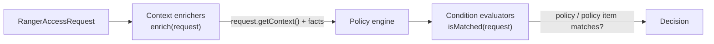

<!---
  Licensed to the Apache Software Foundation (ASF) under one or more
  contributor license agreements.  See the NOTICE file distributed with
  this work for additional information regarding copyright ownership.
  The ASF licenses this file to You under the Apache License, Version 2.0
  (the "License"); you may not use this file except in compliance with
  the License.  You may obtain a copy of the License at

      http://www.apache.org/licenses/LICENSE-2.0

  Unless required by applicable law or agreed to in writing, software
  distributed under the License is distributed on an "AS IS" BASIS,
  WITHOUT WARRANTIES OR CONDITIONS OF ANY KIND, either express or implied.
  See the License for the specific language governing permissions and
  limitations under the License.
-->

# Custom conditions and enrichers

A Ranger policy normally matches on *who* (users, groups, roles) and *what* (resources, access types). Policy
conditions add a third dimension: *under which circumstances*. Built-in conditions cover client IP ranges,
time of day, tags on the resource, the cluster a request came from and free-form JavaScript expressions.
When those are not enough, you can write your own condition evaluator, and, if the information the
condition needs is not in the request, a context enricher that adds it.

Both are plain Java classes loaded by the plugin from the service definition: a *context enricher* runs once
per request before evaluation and puts extra facts into the request context (for example the project or
country of the user); a *condition evaluator* runs for each policy or policy item that uses the condition and
returns true or false. This page walks through the interfaces, the sample implementations in
`ranger-examples/conditions-enrichers`, how to declare them in a service definition, and how to deploy the
jar. For the policy-author view of the built-in conditions see
[Policy conditions](../features/policies/policy-conditions.md).



## How they fit into a service definition

A service definition declares which evaluators and enrichers exist for that service type. Policy authors then
pick a condition by `name` and give it values; the plugin instantiates the `evaluator` class by name.

```json title="Service definition excerpt"
"policyConditions": [
  {
    "itemId":           1,
    "name":             "user-in-project",
    "evaluator":        "org.apache.ranger.plugin.conditionevaluator.RangerSampleSimpleMatcher",
    "evaluatorOptions": { "CONTEXT_NAME": "PROJECT" },
    "validationRegEx":  "",
    "validationMessage": "",
    "uiHint":           "{ \"isMultiValue\":true }",
    "label":            "Project",
    "description":      "Projects the user must belong to"
  }
],
"contextEnrichers": [
  {
    "itemId":          1,
    "name":            "project-provider",
    "enricher":        "org.apache.ranger.plugin.contextenricher.RangerSampleProjectProvider",
    "enricherOptions": { "contextName": "PROJECT", "dataFile": "/etc/ranger/data/userProject.txt" }
  }
]
```

Fields of a `policyConditions` entry (`RangerPolicyConditionDef`):

| Field | Type | Description |
| --- | --- | --- |
| `itemId` | Long | Unique numeric id within the list. |
| `name` | String | Condition name that policies refer to in `conditions[].type`. |
| `evaluator` | String | Fully qualified class implementing `RangerConditionEvaluator`. |
| `evaluatorOptions` | Map | String key/value pairs passed to the class; the contents are class-specific. |
| `label` | String | Name shown in the policy form of the Admin UI. |
| `description` | String | Help text shown in the Admin UI. |
| `uiHint` | String | JSON string that selects the input widget: `isMultiValue`, `singleValue` or `isMultiline` set to `true`. |
| `validationRegEx` | String | Regular expression the Admin UI applies to entered values. |
| `validationMessage` | String | Message shown when validation fails. |

Fields of a `contextEnrichers` entry (`RangerContextEnricherDef`):

| Field | Type | Description |
| --- | --- | --- |
| `itemId` | Long | Unique numeric id within the list. |
| `name` | String | Enricher name, used in logs and returned by `getName()`. |
| `enricher` | String | Fully qualified class implementing `RangerContextEnricher`. |
| `enricherOptions` | Map | String key/value pairs passed to the class. `"IsEnabled": "false"` disables an enricher without removing it. |

A condition can be attached at two levels of a policy:

- `policy.conditions` — evaluated first; if false, the whole policy is skipped (including its audit setting).
- `policyItem.conditions` — evaluated per policy item after users/groups/roles and access type matched.

All conditions on a policy (or item) must be true (logical AND). If a policy refers to a condition name that
the service definition does not declare, the condition is ignored with an error in the plugin log.

!!! tip "The implicit `_expression` condition"
    Every service definition, even one with an empty `policyConditions` list, gets an implicit condition named
    `_expression` backed by `RangerScriptConditionEvaluator` (`ServiceDefUtil.createImplicitExpressionConditionDef`).
    Before writing Java, check whether a JavaScript expression over the request, user attributes and tags does
    what you need; see [ABAC](../features/abac.md).

## Built-in evaluators

All live in `agents-common/src/main/java/org/apache/ranger/plugin/conditionevaluator/`.

| Class | Matches when |
| --- | --- |
| `RangerIpMatcher` | The client IP matches one of the values (`10.1.*`, `2001:db8::*`, `*`). |
| `RangerTimeOfDayMatcher` | The access time falls in a range such as `9am-5pm` or `9:30 AM - 4:00 p.m.`. |
| `RangerActionMatcher` | `request.getAction()` matches one of the values (used by the Ozone service definition). |
| `RangerValidityScheduleConditionEvaluator` | The access time is inside one of the JSON validity schedules given as values. |
| `RangerScriptConditionEvaluator` | The policy value, evaluated as a script, returns true. |
| `RangerScriptTemplateConditionEvaluator` | The script in the `scriptTemplate` option returns true. A policy value of `no` or `false` inverts the result. |
| `RangerContextAttributeValueInCondition` | The context attribute named by the `attributeName` option is one of the values. |
| `RangerContextAttributeValueNotInCondition` | The context attribute is not one of the values. |

Tag evaluators look at the tag types on the accessed resource:

| Class | Matches when |
| --- | --- |
| `RangerAnyOfExpectedTagsPresentConditionEvaluator` | At least one of the listed tag types is present. |
| `RangerNoneOfExpectedTagsPresentConditionEvaluator` | None of the listed tag types is present. |
| `RangerTagsAllPresentConditionEvaluator` | All of the listed tag types are present. |

Cluster evaluators compare the cluster the request came from:

| Class | Matches when |
| --- | --- |
| `RangerAccessedFromClusterCondition` | `request.getClusterName()` is one of the values. |
| `RangerAccessedNotFromClusterCondition` | `request.getClusterName()` is not one of the values. |
| `RangerAccessedFromClusterTypeCondition` | `request.getClusterType()` is one of the values. |
| `RangerAccessedNotFromClusterTypeCondition` | `request.getClusterType()` is not one of the values. |

Two Hive-only evaluators inspect the other resources of the same query (`REQUESTED_RESOURCES` in the context):

| Class | Matches when |
| --- | --- |
| `RangerHiveResourcesAccessedTogetherCondition` | The query also touches the listed `db.table.column` patterns. |
| `RangerHiveResourcesNotAccessedTogetherCondition` | The query does not touch the listed patterns. |

Only the script and context-attribute evaluators read `evaluatorOptions`:

| Option | Used by | Description |
| --- | --- | --- |
| `engineName` | Script evaluators | Script engine name; default `JavaScript`. |
| `scriptTemplate` | `RangerScriptTemplateConditionEvaluator` | The script to run; the tag service definition uses it for `accessed-after-expiry`. |
| `attributeName` | Context-attribute evaluators | Key to read with `request.getContext().get(...)`. |

## Built-in enrichers

All live in `agents-common/src/main/java/org/apache/ranger/plugin/contextenricher/`.

| Class | Adds to the context |
| --- | --- |
| `RangerTagEnricher` | `TAGS`: tags of the accessed resource, fetched by a `RangerTagRetriever`. |
| `RangerUserStoreEnricher` | `USERSTORE`: user and group attributes for ABAC. |
| `RangerGdsEnricher` | Governed Data Sharing information. |
| `RangerFileBasedGeolocationProvider` | `LOCATION_<prefix><attribute>` entries looked up from the client IP in a geolocation file. |

The main `enricherOptions` of each enricher:

| Enricher | Option | Description |
| --- | --- | --- |
| `RangerTagEnricher` | `tagRetrieverClassName` | `RangerAdminTagRetriever`, or `RangerFileBasedTagRetriever` together with `serviceTagsFileName`. |
| `RangerTagEnricher` | `tagRefresherPollingInterval` | Refresh interval in ms; default `60000`. |
| `RangerTagEnricher` | `disableTrieLookupPrefilter` | Turn off the resource trie used to find tagged resources. |
| `RangerUserStoreEnricher` | `userStoreRetrieverClassName` | `RangerAdminUserStoreRetriever` or `externalretrievers.RangerMultiSourceUserStoreRetriever`. |
| `RangerUserStoreEnricher` | `userStoreRefresherPollingInterval` | Refresh interval in ms; default `3600000`. |
| `RangerGdsEnricher` | `retrieverClassName` | Class that fetches the GDS information. |
| `RangerGdsEnricher` | `refresherPollingInterval` | Refresh interval in ms; default `60000`. |
| `RangerFileBasedGeolocationProvider` | `FilePath` | Geolocation data file. |
| `RangerFileBasedGeolocationProvider` | `IPInDotFormat` | Whether the file holds IP addresses in dotted notation; default `true`. |
| `RangerFileBasedGeolocationProvider` | `ForceRead` | Re-read the file even if it was already loaded; default `true`. |
| `RangerFileBasedGeolocationProvider` | `geolocation.meta.prefix` | Prefix inserted into the `LOCATION_` context keys. |

The tag service definition wires `RangerTagEnricher` with `RangerAdminTagRetriever`; the geolocation and
external user-store retrievers are documented in
[`contextenricher/externalretrievers/README.md`](https://github.com/apache/ranger/blob/master/agents-common/src/main/java/org/apache/ranger/plugin/contextenricher/externalretrievers/README.md)
and [ABAC](../features/abac.md).

## Writing a condition evaluator

Implement `org.apache.ranger.plugin.conditionevaluator.RangerConditionEvaluator`, normally by extending
`RangerAbstractConditionEvaluator`, which stores the three objects the plugin injects:

```java
public interface RangerConditionEvaluator {
    void setConditionDef(RangerPolicyConditionDef conditionDef);   // from the service definition
    void setPolicyItemCondition(RangerPolicyItemCondition condition); // from the policy: type + values
    void setServiceDef(RangerServiceDef serviceDef);
    void init();
    boolean isMatched(RangerAccessRequest request);
}
```

`conditionDef.getEvaluatorOptions()` gives you the options from the service definition and
`condition.getValues()` the values the policy author typed. The plugin creates the evaluator with
`Class.forName(...).newInstance()`, calls the three setters, then `init()`, so the class needs a public no-arg
constructor. `isMatched` is called on the request path and must be fast and thread-safe.

The sample below, `RangerSampleSimpleMatcher` from
[`ranger-examples/conditions-enrichers`](https://github.com/apache/ranger/tree/master/ranger-examples/conditions-enrichers),
compares a context attribute (named by the `CONTEXT_NAME` option) with the policy values using file-name
style wildcards:

```java title="RangerSampleSimpleMatcher.java (abridged)"
package org.apache.ranger.plugin.conditionevaluator;

public class RangerSampleSimpleMatcher extends RangerAbstractConditionEvaluator {
    public static final String CONTEXT_NAME = "CONTEXT_NAME";

    private       boolean      allowAny;
    private       String       contextName;
    private final List<String> values = new ArrayList<>();

    @Override
    public void init() {
        super.init();

        if (condition == null || conditionDef == null
                || CollectionUtils.isEmpty(condition.getValues())
                || MapUtils.isEmpty(conditionDef.getEvaluatorOptions())
                || StringUtils.isEmpty(conditionDef.getEvaluatorOptions().get(CONTEXT_NAME))) {
            allowAny = true;                       // misconfigured: never block access
        } else {
            contextName = conditionDef.getEvaluatorOptions().get(CONTEXT_NAME);
            values.addAll(condition.getValues());
        }
    }

    @Override
    public boolean isMatched(RangerAccessRequest request) {
        if (allowAny) {
            return true;
        }

        String requestValue = extractValue(request, contextName);   // request.getContext().get(contextName)

        if (StringUtils.isNotBlank(requestValue)) {
            for (String policyValue : values) {
                if (FilenameUtils.wildcardMatch(requestValue, policyValue)) {
                    return true;
                }
            }
        }

        return false;
    }
}
```

Points worth copying:

- Decide what a missing value means. The sample treats a misconfigured condition as "always true"; a
  security-sensitive condition should probably do the opposite.
- Read the request context, not global state. Useful accessors in `RangerAccessRequest`: `getUser()`,
  `getUserGroups()`, `getUserRoles()`, `getClientIPAddress()`, `getAccessTime()`, `getAction()`,
  `getClusterName()`, `getClusterType()`, `getContext()`. `RangerAccessRequestUtil` exposes the engine's own
  context entries: `getRequestTagsFromContext`, `getRequestUserStoreFromContext`, `getRequestedResourcesFromContext`.
- Keep the class stateless after `init()`; one instance serves all requests for that policy item.

## Writing a context enricher

Implement `org.apache.ranger.plugin.contextenricher.RangerContextEnricher`, normally by extending
`RangerAbstractContextEnricher`:

```java
public interface RangerContextEnricher {
    void setEnricherDef(RangerContextEnricherDef enricherDef);
    void setServiceName(String serviceName);
    void setServiceDef(RangerServiceDef serviceDef);
    void setAppId(String appId);
    void init();
    void enrich(RangerAccessRequest request);
    void enrich(RangerAccessRequest request, Object dataStore);
    boolean preCleanup();
    void cleanup();
    String getName();
}
```

`RangerAbstractContextEnricher` provides `getOption(name[, default])`, `getBooleanOption`, `getLongOption`
(from `enricherOptions`), `getConfig(name, default)` / `getIntConfig` / `getBooleanConfig` (from the plugin's
`ranger-<service>-security.xml` configuration), `getPropertyPrefix()` (`ranger.plugin.<serviceType>`),
`readProperties(fileName)` (file path, then classpath), and access to the plugin context. Its `init()`
registers the enricher with the plugin's auth context, so always call `super.init()`.

`RangerSampleProjectProvider` reads a `user=project` properties file and adds the user's project to the
request context under the configured key:

```java title="RangerSampleProjectProvider.java (abridged)"
package org.apache.ranger.plugin.contextenricher;

public class RangerSampleProjectProvider extends RangerAbstractContextEnricher {
    private String     contextName = "PROJECT";
    private Properties userProjectMap;

    @Override
    public void init() {
        super.init();

        contextName = getOption("contextName", "PROJECT");

        String dataFile = getOption("dataFile", "/etc/ranger/data/userProject.txt");

        userProjectMap = readProperties(dataFile);
    }

    @Override
    public void enrich(RangerAccessRequest request) {
        if (request != null && userProjectMap != null && request.getUser() != null) {
            String project = userProjectMap.getProperty(request.getUser());

            if (request.getContext() != null && StringUtils.isNotEmpty(project)) {
                request.getContext().put(contextName, project);
            }
        }
    }
}
```

```properties title="/etc/ranger/data/userProject.txt"
alice=apollo
bob=gemini
```

`RangerSampleCountryProvider` in the same module is identical apart from its defaults (`COUNTRY`,
`/etc/ranger/data/userCountry.txt`), showing how one evaluator (`RangerSampleSimpleMatcher` with
`CONTEXT_NAME=COUNTRY`) can serve several conditions.

Enrichers are created once per policy-engine instance. When a full policy download replaces the engine, new
enricher instances are created and initialized, and the old ones receive `preCleanup()` and `cleanup()`; when
policy deltas are applied, the existing instances are shared with the updated engine and `init()` is not re-run.
If your data source changes over time, refresh it from a background thread
as `RangerTagEnricher` and `RangerUserStoreEnricher` do with their `*Retriever` classes and polling intervals,
and release the thread in `cleanup()`. `enrich()` runs on every request; keep it to a map lookup. Enrichers are
built only by the service's main policy repository (a security zone's repository builds none); the request
processor runs them for every request, whatever zone the resource belongs to.

## Build and deploy

1. Build the classes against `ranger-plugins-common`:

    ```xml
    <dependency>
        <groupId>org.apache.ranger</groupId>
        <artifactId>ranger-plugins-common</artifactId>
        <version>${ranger.version}</version>
    </dependency>
    ```

    The examples module builds with `mvn -pl ranger-examples/conditions-enrichers -am package` (or with the
    `ranger-examples` profile) and includes a JUnit test, `RangerSampleSimpleMatcherTest`, that constructs the
    evaluator with a mocked `RangerAccessRequest` — a good template for testing your own class without a
    running plugin.

2. Copy the jar (and any third-party dependencies) into the plugin's implementation directory next to the
   component's libraries: `<component-lib-dir>/ranger-<serviceType>-plugin-impl/` (for example
   `/usr/lib/hive/lib/ranger-hive-plugin-impl/`). `RangerPluginClassLoader` adds every file in that directory
   to an isolated class loader, so no configuration change is needed. Restart the component.

3. Update the service definition — add the `policyConditions` / `contextEnrichers` entries — with
   `PUT /service/public/v2/api/servicedef/name/<serviceType>` (see [REST API](rest-api.md)); for a new service
   type, register the whole definition with `POST`. Plugins pick up the new definition with the next policy
   download.

4. Add the condition to a policy in the Admin UI (it appears under *Policy conditions* with the `label` you
   gave) or through the API:

    ```json
    "policyItems": [
      {
        "accesses":   [ { "type": "select", "isAllowed": true } ],
        "groups":     [ "analysts" ],
        "conditions": [ { "type": "user-in-project", "values": [ "apollo", "gem*" ] } ]
      }
    ]
    ```

5. Verify in the plugin log (`DEBUG` on `org.apache.ranger.plugin.conditionevaluator` and
   `org.apache.ranger.plugin.contextenricher`) that the classes were instantiated; a `ClassNotFoundException`
   there means the jar is not in the `-plugin-impl` directory of the process that hosts the plugin.

## Testing without a cluster

The policy engine tests in `agents-common` load a service definition, policies and requests from JSON
(`agents-common/src/test/resources/policyengine/`), including custom enrichers — see
`policyengine/plugin/test_auth_context.json`, which wires a test enricher through `enricherOptions.dataFile`.
Copy that layout to write an offline test for your classes; details in
[Testing and tools](testing-and-tools.md#policy-engine-test-cases).

## Further reading

- [Policy conditions](../features/policies/policy-conditions.md) — the built-in conditions from a policy author's point of view.
- [ABAC](../features/abac.md) — user-store enricher and expressions.
- [Plugin architecture](../arch/plugin-architecture.md) — where enrichers and evaluators run inside a plugin.
- [Custom plugins](../plugins/custom-plugin.md) — writing a whole service definition and plugin.
- Source: [`ranger-examples/conditions-enrichers`](https://github.com/apache/ranger/tree/master/ranger-examples/conditions-enrichers),
  [`agents-common/.../conditionevaluator`](https://github.com/apache/ranger/tree/master/agents-common/src/main/java/org/apache/ranger/plugin/conditionevaluator),
  [`agents-common/.../contextenricher`](https://github.com/apache/ranger/tree/master/agents-common/src/main/java/org/apache/ranger/plugin/contextenricher).
