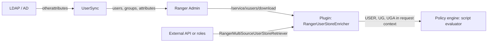

<!---
  Licensed to the Apache Software Foundation (ASF) under one or more
  contributor license agreements.  See the NOTICE file distributed with
  this work for additional information regarding copyright ownership.
  The ASF licenses this file to You under the Apache License, Version 2.0
  (the "License"); you may not use this file except in compliance with
  the License.  You may obtain a copy of the License at

      http://www.apache.org/licenses/LICENSE-2.0

  Unless required by applicable law or agreed to in writing, software
  distributed under the License is distributed on an "AS IS" BASIS,
  WITHOUT WARRANTIES OR CONDITIONS OF ANY KIND, either express or implied.
  See the License for the specific language governing permissions and
  limitations under the License.
-->

# Attribute-based access control

Attribute-based access control (ABAC) lets a policy decide based on *properties* of the user, the
user's groups, the tags on the resource and the request itself, instead of listing every user, group or
role by name. A single row-filter such as `sales_region = ${{USER.region}}` replaces one filter per
region, and it keeps working when new regions and new users appear.

In Ranger, ABAC is built from three pieces: a **user store** that carries attributes for users and
groups into every plugin, **tags** that carry attributes for resources, and **dynamic expressions**
that read those attributes at evaluation time. Expressions can appear in policy conditions, in
row-filter text and in resource names. They are evaluated by a JavaScript engine inside the
plugin, so no round trip to Ranger Admin happens during authorization.

This page explains where attributes come from, how plugins obtain them and what you can write in a
policy. The two blog posts [Adventures in ABAC, part 1](../blog/abac-part-1.md) and
[part 2](../blog/abac-part-2.md) walk through a worked example, and
[Dynamic expressions in Ranger policies](../blog/dynamic-expressions.md) is the origin of the
expression reference below.

## Concepts

**User and group attributes**
:   Key/value pairs stored with each user and group in Ranger Admin (the `otherAttributes` of a user
    or group). Typical attributes are `department`, `region`, `clearanceLevel` or an identity-provider
    object id.

**User store**
:   A snapshot of users, their groups and the attributes of both, versioned by Ranger Admin and
    downloaded by plugins. The model is
    [`RangerUserStore`](https://github.com/apache/ranger/blob/master/agents-common/src/main/java/org/apache/ranger/plugin/util/RangerUserStore.java)
    (`userAttrMapping`, `groupAttrMapping`, `userGroupMapping`, `userCloudIdMapping`, `groupCloudIdMapping`).

**Tag attributes**
:   Attributes of the tags attached to a resource, for example `sensitivityLevel=high` on a column.
    They arrive through TagSync and the tag enricher; see
    [Tag-based policies](policies/tag-based-policies.md).

**Dynamic expression**
:   A JavaScript expression evaluated per request. In conditions it must return a boolean. In
    row-filter text and resource names it is enclosed in `${{` and `}}` and its value is substituted
    into the surrounding string.

## How attributes get into Ranger

### From LDAP or Active Directory through UserSync

UserSync can copy additional directory attributes for users and groups. The properties live in
`ranger-ugsync-site.xml`:

| Key | Default | Type | Description |
| --- | --- | --- | --- |
| `ranger.usersync.ldap.user.otherattributes` | `userurincipaluame` | List | LDAP attribute names to sync for users, for example `department,userPrincipalName`. |
| `ranger.usersync.ldap.user.otherattributes.<attr>datatype` | `String` | String | Data type of one user attribute; use `byte[]` for binary attributes such as `objectGUID`. |
| `ranger.usersync.ldap.group.otherattributes` | `displayname` | List | LDAP attribute names to sync for groups. |
| `ranger.usersync.ldap.group.otherattributes.<attr>datatype` | `String` | String | Data type of one group attribute. |

The defaults are spelled as they appear in `UserGroupSyncConfig`; set the properties explicitly to the
attributes you need.

The synced values are stored as JSON in the `other_attributes` column of the `x_user` and `x_group`
tables and are visible in **Settings → Users/Groups/Roles** in the Admin UI, together with the sync
source, the distinguished name and the original (pre-transformation) name.

### From roles or an external API in the plugin

The plugin can also build attributes itself, without changing the identity provider, through the
[external user-store retrievers](https://github.com/apache/ranger/blob/master/agents-common/src/main/java/org/apache/ranger/plugin/contextenricher/externalretrievers/README.md)
in `agents-common`. `RangerMultiSourceUserStoreRetriever` merges entries from several sources into one
user store:

- **`role`** source: attributes are derived from Ranger roles named `<attrName>.<attrValue>`, for
  example membership in role `salesRegion.northeast` becomes `salesRegion=northeast`.
- **`api`** source: an HTTP endpoint (or a local properties file, for development) returns
  user → attribute values; a bearer token is obtained from a `tokenUrl` described in a JSON config
  file (default `/var/ranger/security/<attrName>.conf`).

The retriever is configured as `enricherOptions` of the user-store context enricher in the service
definition:

```json title="contextEnrichers entry in a service definition"
{
  "itemId":   1,
  "name":     "RangerMultiSourceUserStoreRetriever",
  "enricher": "org.apache.ranger.plugin.contextenricher.RangerUserStoreEnricher",
  "enricherOptions": {
    "userStoreRetrieverClassName":       "org.apache.ranger.plugin.contextenricher.externalretrievers.RangerMultiSourceUserStoreRetriever",
    "userStoreRefresherPollingInterval": "60000",
    "retriever0_api":                    "attrName=partner,userStoreURL=http://localhost:8000/security/getPartnersByUser",
    "retriever1_role":                   "attrName=salesRegion"
  }
}
```

Option keys are `retriever<N>_<sourceType>` with a comma-separated `key=value` list as the value.
`attrName` names the attribute; `userStoreURL`, `dataFile` and `configFile` apply to the `api` source.

## How plugins obtain the user store

The user store is delivered to plugins by the context enricher
[`RangerUserStoreEnricher`](https://github.com/apache/ranger/blob/master/agents-common/src/main/java/org/apache/ranger/plugin/contextenricher/RangerUserStoreEnricher.java).
Its default retriever, `RangerAdminUserStoreRetriever`, polls Ranger Admin at
`GET /service/xusers/download/{serviceName}?lastKnownUserStoreVersion=<n>` (or
`/service/xusers/secure/download/{serviceName}` in Kerberized setups) and only receives a new copy when
the version changed. The last copy is cached in the plugin's policy cache directory as
`<appId>_<serviceName>_userstore.json`, so the plugin can start while Admin is unavailable.

| Enricher option | Default | Description |
| --- | --- | --- |
| `userStoreRetrieverClassName` | (none) | Required. Retriever class, normally `org.apache.ranger.plugin.contextenricher.RangerAdminUserStoreRetriever`. |
| `userStoreRefresherPollingInterval` | `3600000` | Interval in ms at which the retriever checks for a newer user-store version. |

When the plugin adds the enricher implicitly (see below), the polling interval is `60000` ms.

You do not have to edit the service definition. `RangerBasePlugin` adds the enricher implicitly when
`ranger.plugin.<serviceType>.enable.implicit.userstore.enricher` is `true` in
`ranger-<serviceType>-security.xml` and at least one downloaded policy (resource, tag or zone policy)
contains a user or group attribute expression. When `ranger.plugin.<serviceType>.use.rangerGroups` or
`ranger.plugin.<serviceType>.convert.emailToUser` is `true` the enricher is always added, because both
features need the user store. If none of these apply, declare the enricher in the service definition
as shown above.



## Using attributes in policies

### Where expressions are allowed

| Place | Syntax | Must return |
| --- | --- | --- |
| Policy condition or policy-item condition | plain expression, e.g. `USER.level >= TAG.level` | boolean |
| Row-filter text | `dept = ${{USER.department}}` | string fragment substituted into the filter |
| Resource value in a policy | `/data/dept/${{USER.dept}}`, `db_${{USER.dept}}` | string substituted before matching |

Conditions are evaluated by
[`RangerScriptConditionEvaluator`](https://github.com/apache/ranger/blob/master/agents-common/src/main/java/org/apache/ranger/plugin/conditionevaluator/RangerScriptConditionEvaluator.java).
Tag-based policies ship with a condition named `expression` that uses it (see
`ranger-servicedef-tag.json`); the `gds` service definition has the same condition. To the other service definitions Ranger Admin adds
an implicit condition named `_expression` backed by the same evaluator, unless
`ranger.servicedef.enableImplicitConditionExpression` is `false`; see
[Policy conditions](policies/policy-conditions.md). Substitution in row filters and resource names is
performed by
[`RangerRequestExprResolver`](https://github.com/apache/ranger/blob/master/agents-common/src/main/java/org/apache/ranger/plugin/util/RangerRequestExprResolver.java)
and needs no service-definition change.

### Variables available to an expression

| Variable | Contents |
| --- | --- |
| `USER` | Current user as a map: `_name` plus the user's attributes |
| `UGNAMES` | List of groups the user belongs to |
| `UG` | Map of group name → group attributes |
| `UGA` | Map of attribute name → values collected across the user's groups |
| `URNAMES` | List of roles the user is assigned to |
| `REQ` | Request as a map; the keys are listed below the table |
| `RES` | Resource as a map, e.g. `database`, `table`, `column`, plus `_ownerUser` when the plugin sets an owner |
| `TAG` | The tag being evaluated (tag-based policies only): `_type` plus its attributes |
| `TAGS` | Map of tag name → tag attributes for all tags on the resource |
| `TAGNAMES` | List of tag names on the resource |

`REQ` has the keys `accessType`, `action`, `user`, `userGroups`, `userRoles`, `clientIPAddress`, `clusterName`,
`clusterType`, `clientType`, `accessTime`, `requestData` and others.

### Helper functions

| Function | Returns |
| --- | --- |
| `GET_USER_ATTR(name[, default])` | Value of a user attribute |
| `GET_USER_ATTR_NAMES()` | Names of all user attributes, as CSV |
| `GET_UG_ATTR(name[, default[, sep]])` | Values of an attribute across the user's groups, as CSV |
| `GET_UG_ATTR_NAMES()` | Group attribute names, as CSV |
| `GET_UG_NAMES()` | Names of the user's groups, as CSV |
| `GET_UR_NAMES()` | Names of the user's roles, as CSV |
| `GET_TAG_ATTR(name[, default[, sep]])` | Values of a tag attribute, as CSV |
| `GET_TAG_ATTR_NAMES()` | Tag attribute names, as CSV |
| `GET_TAG_NAMES()` | Names of the tags on the resource, as CSV |

| Function | True when |
| --- | --- |
| `HAS_USER_ATTR(name)` | The user has the attribute |
| `HAS_UG_ATTR(name)` | One of the user's groups has the attribute |
| `HAS_TAG_ATTR(name)` | The tag has the attribute |
| `HAS_TAG(name)` | The resource has the tag |
| `HAS_ANY_TAG` | The resource has at least one tag |
| `HAS_NO_TAG` | The resource has no tag |
| `IS_IN_GROUP(name)` | The user is in the group |
| `IS_IN_ANY_GROUP` | The user is in at least one group |
| `IS_NOT_IN_ANY_GROUP` | The user is in no group |
| `IS_IN_ROLE(name)` | The user has the role |
| `IS_IN_ANY_ROLE` | The user has at least one role |
| `IS_NOT_IN_ANY_ROLE` | The user has no role |

The six macros without an argument are written without parentheses (`HAS_ANY_TAG`, not `HAS_ANY_TAG()`).

Every function that returns a CSV string has a `_Q` variant (`GET_UG_ATTR_Q`, `GET_TAG_NAMES_Q`, ...)
that quotes each value, which is what SQL `IN (...)` lists need. Optional parameters are a default
value returned when nothing is available, and for CSV functions a separator string.

The variable and function names are defined in
[`RangerCommonConstants`](https://github.com/apache/ranger/blob/master/agents-common/src/main/java/org/apache/ranger/plugin/util/RangerCommonConstants.java)
and implemented in
[`RangerRequestScriptEvaluator`](https://github.com/apache/ranger/blob/master/agents-common/src/main/java/org/apache/ranger/plugin/policyengine/RangerRequestScriptEvaluator.java).

### Examples

```javascript title="Condition: user's clearance must cover the tag's level"
GET_USER_ATTR('allowedSensitiveLevel', 0) >= TAG.sensitiveLevel
```

```javascript title="Condition: group and role membership"
IS_IN_GROUP('finance') && IS_IN_ROLE('analyst')
```

```sql title="Row filter: rows of the user's own partners"
sales_partner IN (${{GET_USER_ATTR_Q('partner')}}) AND sales_region = '${{USER.region}}'
```

```text title="Resource: one policy for every user's home directory"
/home/${{REQ.user}}
```

A tag-based policy that uses the `expression` condition, created through the REST API:

```bash
curl -u admin:password -H 'Content-Type: application/json' \
  -X POST http://localhost:6080/service/public/v2/api/policy -d '{
  "service":    "cl1_tag",
  "name":       "sensitive-by-clearance",
  "policyType": 0,
  "resources":  { "tag": { "values": ["SENSITIVE"], "isExcludes": false, "isRecursive": false } },
  "policyItems": [ {
    "groups":     ["public"],
    "accesses":   [ { "type": "hive:select", "isAllowed": true } ],
    "conditions": [ { "type": "expression",
                      "values": ["GET_USER_ATTR(\"allowedSensitiveLevel\", 0) >= TAG.sensitiveLevel"] } ]
  } ]
}'
```

## Evaluation semantics and edge cases

- **Missing attributes evaluate to `null`.** `USER.level >= 5` is false when the user has no `level`
  attribute, and `${{USER.dept}}` substitutes an empty value. Use the `default` parameter of the
  `GET_*` functions, or `HAS_USER_ATTR()`, when a missing attribute should not silently deny (or
  allow) access.
- **Attributes are as fresh as the last download.** UserSync pushes changes to Admin on its own
  schedule, and each plugin polls at `userStoreRefresherPollingInterval`. Expect a delay equal to the
  sum of both before a directory change affects authorization.
- **The user store must be present.** If a policy uses `USER`/`UG` expressions but the plugin has no
  user-store enricher, `RangerBasePlugin` logs *"no userstore enricher found. Plugin will not enforce
  user/group attribute-based policies"* and those expressions see empty attribute maps.
- **Expressions run in the plugin's JVM.** Keep them short; the script engine is sandboxed but each
  evaluation costs CPU on the hot path of the protected service.
- **Group attributes are aggregated.** `UGA.<attr>` and `GET_UG_ATTR()` merge values from all groups
  of the user; use `UG['<group>'].<attr>` when you need the value of one specific group.
- **Tag variables exist only in tag-based policies.** `TAG` is undefined in resource-based policies;
  `TAGS` and `TAGNAMES` are populated whenever the tag enricher is active.

## Related features

- [Policy conditions](policies/policy-conditions.md) — declaring script conditions in a service definition.
- [Row filtering and column masking](policies/row-filter-column-masking.md) — where `${{ }}` row filters are used.
- [Tag-based policies](policies/tag-based-policies.md) — the source of `TAG` attributes.
- [Roles](roles.md) — role membership as an attribute (`IS_IN_ROLE`, `URNAMES`, `role` retriever).
- Blogs: [Adventures in ABAC, part 1](../blog/abac-part-1.md), [part 2](../blog/abac-part-2.md),
  [Dynamic expressions](../blog/dynamic-expressions.md).
