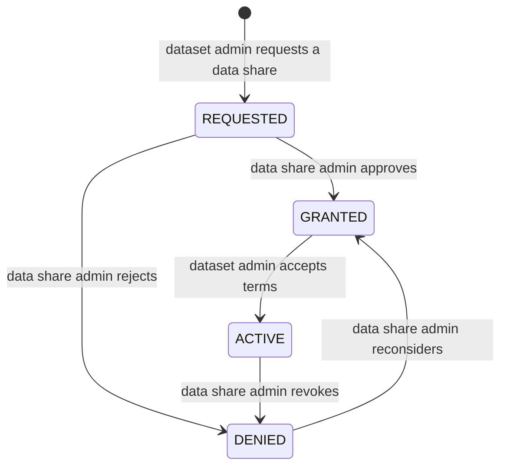
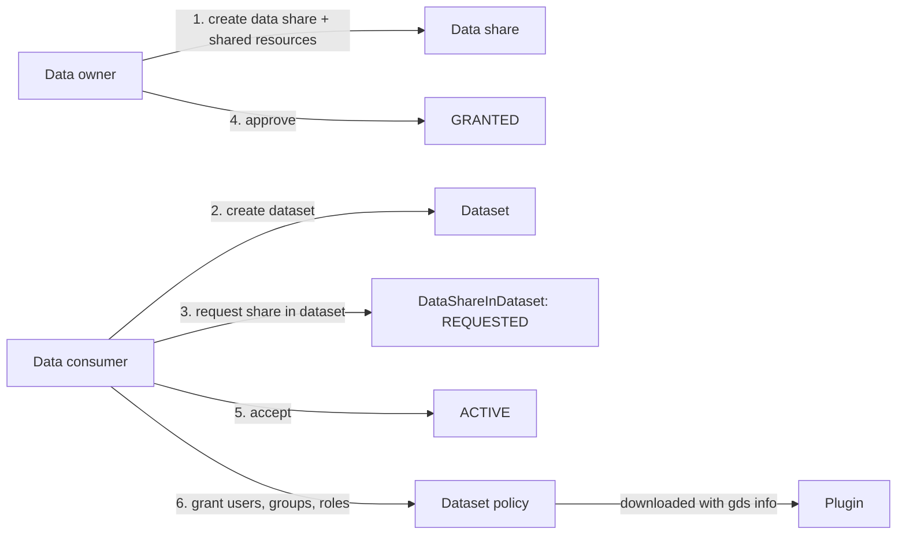
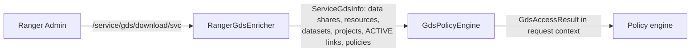

<!---
  Licensed to the Apache Software Foundation (ASF) under one or more
  contributor license agreements.  See the NOTICE file distributed with
  this work for additional information regarding copyright ownership.
  The ASF licenses this file to You under the Apache License, Version 2.0
  (the "License"); you may not use this file except in compliance with
  the License.  You may obtain a copy of the License at

      http://www.apache.org/licenses/LICENSE-2.0

  Unless required by applicable law or agreed to in writing, software
  distributed under the License is distributed on an "AS IS" BASIS,
  WITHOUT WARRANTIES OR CONDITIONS OF ANY KIND, either express or implied.
  See the License for the specific language governing permissions and
  limitations under the License.
-->

# Governed Data Sharing

Governed Data Sharing (GDS) turns access management around. Instead of a security administrator
writing a policy for every table a team needs, a **data owner** publishes the resources they are
willing to share as a *data share*, a **data consumer** collects what they need into a *dataset*, asks
for the shares to be added, and the owner approves. Ranger then enforces the result in the plugins, in
the same evaluation pass as ordinary policies, and records which dataset authorized each access.

The workflow keeps three things separate that classic policies mix together: what may be shared
(decided by the owner, once), who consumes it (decided by the dataset admin), and the terms under which
it is consumed (validity period, terms of use, extra conditions and masks). GDS objects live in Ranger
Admin under **Governed Data Sharing** and are available through `GdsREST` at `/service/gds`.

## Concepts

The model classes are nested in
[`RangerGds`](https://github.com/apache/ranger/blob/master/agents-common/src/main/java/org/apache/ranger/plugin/model/RangerGds.java).

**Data share** (`RangerDataShare`)
:   The producer side. Bound to one `service` and optionally one `zone`. Carries an `acl`,
    `defaultAccessTypes` (for example `select`) applied to every shared resource that does not set its
    own, an optional `conditionExpr`, `defaultTagMasks` (mask by tag name) and `termsOfUse`.

**Shared resource** (`RangerSharedResource`)
:   One entry of a data share: a `resource` map in the service's resource hierarchy
    (`database`/`table` for Hive, `path` for HDFS, ...), an optional `subResource` and
    `subResourceType` (for example columns of a table), `accessTypes`, a `rowFilter`,
    `subResourceMasks` and a `conditionExpr`.

**Dataset** (`RangerDataset`)
:   The consumer side. Has an `acl`, a `validitySchedule`, `termsOfUse`, `labels` and `keywords` for
    discovery. Data shares are attached to a dataset through *data-share-in-dataset* links, and users
    receive access through the dataset's *grants*.

**Project** (`RangerProject`)
:   A grouping of datasets with its own `acl`, `validitySchedule` and `termsOfUse`. Datasets are
    attached through *dataset-in-project* links; project grants give access to every dataset in it.

**Data share in dataset / dataset in project** (`RangerDataShareInDataset`, `RangerDatasetInProject`)
:   The request-and-approve link. Each has a `status`, an optional `validitySchedule`, `profiles` and,
    once decided, an `approver`.

**ACL** (`RangerGdsObjectACL`)
:   Maps of `users`, `groups` and `roles` to a `GdsPermission`: `NONE`, `LIST`, `VIEW`, `AUDIT`,
    `POLICY_ADMIN`, `ADMIN`. Each level includes the ones before it. `ADMIN` is needed to change the
    object or approve links; `POLICY_ADMIN` is enough to manage grants. Ranger administrators have
    `ADMIN` on everything.

**Grants**
:   A dataset (or project) has a policy whose items list principals (users, groups, roles), access
    types and conditions. `PUT /service/gds/dataset/{id}/grant` edits it as a list of
    `RangerGrant` objects; the policy itself is stored against the built-in `gds` service definition
    with resource `dataset-id` or `project-id`.

### Share status lifecycle



Only `ACTIVE` links contribute to authorization. `RangerGdsValidator` checks who may make each
transition: moving to `GRANTED` or `DENIED` requires `ADMIN` on the data share (or being service admin
or zone admin of the share's service/zone); moving to `REQUESTED` or accepting into `ACTIVE` requires
`ADMIN` on the dataset (for dataset-in-project links, on the project). Moving a link from
`REQUESTED` (or `DENIED`) straight to `ACTIVE` counts as implicit approval and therefore needs both
permissions, which a Ranger administrator always has.

## Workflow



### Admin UI

The **Governed Data Sharing** menu lists **My Datasets**, **My Datashares**, **My Requests**, **Datasets**
and **Datashares**. The first three are where the workflow happens:

- **My Datashares** — create a data share (service, zone, default access types, condition, tag
  masks, terms), then add shared resources with their permissions, row filter and masks.
- **My Datasets** — create a dataset (name, description, terms), attach data shares, and open
  **Access Grant** to give users, groups and roles access types with optional conditions. The dataset
  detail view also shows the share statuses.
- **My Requests** — incoming and outgoing share requests, filterable by status (`REQUESTED`, `GRANTED`,
  `ACTIVE`, `DENIED`). A data share admin grants or denies from here; a dataset admin activates a
  granted request.

### REST API

`GdsREST` is mounted at `/service/gds`; the paths below are relative to it. Datasets, projects, data shares and
shared resources share one CRUD pattern, where `<object>` is `dataset`, `project`, `datashare` or `resource`:

| Method | Path | Description |
| --- | --- | --- |
| `POST` | `/<object>` | Create. |
| `GET` | `/<object>` | Search. |
| `GET` | `/<object>/{id}` | Get by id. |
| `PUT` | `/<object>/{id}` | Update. |
| `DELETE` | `/<object>/{id}` | Delete. |

Listings and bulk operations:

| Method | Path | Description |
| --- | --- | --- |
| `GET` | `/dataset/names` | Dataset names. |
| `GET` | `/dataset/summary` | Dataset summaries. |
| `GET` | `/dataset/enhancedsummary` | Dataset summaries with additional counts. |
| `GET` | `/project/names` | Project names. |
| `GET` | `/datashare/summary` | Data share summaries. |
| `POST` | `/resources` | Add several shared resources in one call. |
| `DELETE` | `/resources` | Remove several shared resources. Query: one `id` per resource. |

Policies and grants (projects have the same `/project/{id}/policy` paths):

| Method | Path | Description |
| --- | --- | --- |
| `POST` | `/dataset/{id}/policy` | Add a policy to a dataset. |
| `GET` | `/dataset/{id}/policy` | List the policies of a dataset. |
| `GET` | `/dataset/{id}/policy/{policyId}` | Get one policy. |
| `PUT` | `/dataset/{id}/policy/{policyId}` | Update a policy. |
| `DELETE` | `/dataset/{id}/policy/{policyId}` | Delete a policy. |
| `GET` | `/dataset/{id}/grants` | Get the grants of a dataset. |
| `PUT` | `/dataset/{id}/grant` | Update the grants of a dataset. |

Share requests:

| Method | Path | Description |
| --- | --- | --- |
| `POST` | `/datashare/dataset` | Request that a data share be added to a dataset. |
| `POST` | `/dataset/{id}/datashare` | Add several data shares to a dataset in one call. |
| `GET` | `/datashare/dataset` | Search data-share-in-dataset records. |
| `GET` | `/datashare/dataset/summary` | Summaries of data-share-in-dataset records. |
| `GET` | `/datashare/dataset/{id}` | Get one record. |
| `PUT` | `/datashare/dataset/{id}` | Update the record, for example to grant, deny or activate it. |
| `DELETE` | `/datashare/dataset/{id}` | Remove a data share from a dataset. |
| `POST` | `/dataset/project` | Request that a dataset be added to a project. |
| `GET` | `/dataset/project` | Search dataset-in-project records. |
| `GET` | `/dataset/project/{id}` | Get one record. |
| `PUT` | `/dataset/project/{id}` | Update the record. |
| `DELETE` | `/dataset/project/{id}` | Remove a dataset from a project. |

Plugins download GDS information from `GET /download/{serviceName}` (query `lastKnownGdsVersion`), or from
`GET /secure/download/{serviceName}` when authentication is required.

The examples below follow the workflow diagram. Replace ids with the ones returned by each call.

```bash title="1. Owner creates a data share on the Hive service"
curl -u owner:password -H 'Content-Type: application/json' \
  -X POST http://localhost:6080/service/gds/datashare -d '{
  "name":               "sales-reporting",
  "description":        "Curated sales tables",
  "service":            "cl1_hive",
  "acl":                { "users": { "owner": "ADMIN" } },
  "defaultAccessTypes": ["select"],
  "termsOfUse":         "Internal use only"
}'
```

```bash title="1b. Owner adds shared resources (data share id 1)"
curl -u owner:password -H 'Content-Type: application/json' \
  -X POST http://localhost:6080/service/gds/resources -d '[
  { "name": "orders",   "dataShareId": 1,
    "resource": { "database": { "values": ["sales"] }, "table": { "values": ["orders"] } },
    "rowFilter": { "filterExpr": "region = '\''US'\''" } },
  { "name": "customers", "dataShareId": 1,
    "resource": { "database": { "values": ["sales"] }, "table": { "values": ["customers"] } },
    "subResource":     { "values": ["id", "name", "email"] },
    "subResourceType": "column",
    "subResourceMasks": [ { "values": ["email"], "maskInfo": { "dataMaskType": "MASK_SHOW_LAST_4" } } ] }
]'
```

```bash title="2. Consumer creates a dataset"
curl -u analyst:password -H 'Content-Type: application/json' \
  -X POST http://localhost:6080/service/gds/dataset -d '{
  "name":        "q3-sales-analysis",
  "description": "Inputs for the Q3 report",
  "acl":         { "users": { "analyst": "ADMIN" } },
  "termsOfUse":  "Delete after the report is published"
}'
```

```bash title="3. Consumer requests the data share (dataset id 5)"
curl -u analyst:password -H 'Content-Type: application/json' \
  -X POST http://localhost:6080/service/gds/datashare/dataset -d '{
  "dataShareId": 1, "datasetId": 5, "status": "REQUESTED"
}'
```

```bash title="4. and 5. Owner grants, consumer activates (link id 9)"
curl -u owner:password   -H 'Content-Type: application/json' -X PUT \
  http://localhost:6080/service/gds/datashare/dataset/9 -d '{ "dataShareId": 1, "datasetId": 5, "status": "GRANTED" }'
curl -u analyst:password -H 'Content-Type: application/json' -X PUT \
  http://localhost:6080/service/gds/datashare/dataset/9 -d '{ "dataShareId": 1, "datasetId": 5, "status": "ACTIVE" }'
```

```bash title="6. Consumer grants the dataset to a group"
curl -u analyst:password -H 'Content-Type: application/json' \
  -X PUT http://localhost:6080/service/gds/dataset/5/grant -d '[
  { "principal": { "type": "GROUP", "name": "finance-analysts" },
    "accessTypes": ["_READ"] }
]'
```

The Python client wraps all of this in `RangerGdsClient` (`pip install apache-ranger`); see
[Python client](../client-interface/python.md).

## How plugins enforce GDS



- The plugin adds
  [`RangerGdsEnricher`](https://github.com/apache/ranger/blob/master/agents-common/src/main/java/org/apache/ranger/plugin/contextenricher/RangerGdsEnricher.java)
  automatically; `ranger.plugin.<serviceType>.enable.implicit.gdsinfo.enricher` in
  `ranger-<serviceType>-security.xml` defaults to `true`. Set it to `false` to disable GDS in a plugin.
- The enricher polls `GET /service/gds/download/{serviceName}` every 60 seconds by default
  (`refresherPollingInterval` option, milliseconds) and caches the result as
  `<appId>_<serviceName>_gds.json` in the policy cache directory.
- For each request, `GdsPolicyEngine` finds the shared resources that match the resource, walks the
  `ACTIVE` links to datasets and projects, and evaluates the dataset/project policies (grants) for
  the user. The result includes the matched `datasets` and `projects`, and any row filter or mask from
  the shared resource.
- The GDS result is merged into the regular decision **only when no ordinary policy decided the
  request**: if resource or tag policies already allowed or denied, they win; row filters and masks
  from GDS apply only when no policy of that type matched. The `datasets` and `projects` are copied
  to the access result and appear in the audit record.

The `gds` service definition
(`agents-common/src/main/resources/service-defs/ranger-servicedef-gds.json`) backs the generated
dataset and project policies. Its resources are `dataset-id` and `project-id`; its access types are
`_CREATE`, `_READ`, `_UPDATE`, `_DELETE`, `_MANAGE`, `_ALL`; it offers the `expression` and
`validitySchedule` policy conditions, and deny items are disabled (`enableDenyInPolicies=false`).

## Edge cases

- **Validity schedules stack.** A dataset's `validitySchedule`, a link's `validitySchedule` and the
  grant's own conditions must all be satisfied.
- **Zones.** A data share created with a `zone` only matches resources in that zone.
- **Deleting objects.** Deleting a dataset or project removes its policies. Add `?forceDelete=true`
  to `DELETE /service/gds/dataset/{id}` or `/project/{id}` to also remove its data-share and project
  links; without it, existing links block the delete. The next plugin poll picks up the change.
- **Visibility.** Users see only the datasets and data shares on whose ACL they have at least `LIST`;
  `GET /service/gds/dataset/summary` reports `permissionForCaller` for each.

## Related features

- [Resource-based policies](../policies/resource-policies.md) — the policies that take precedence over GDS.
- [Row filtering and column masking](../policies/row-filter-column-masking.md) — mask types usable in shared resources.
- [Security zones](../sec-zone/intro.md) — zone-scoped data shares.
- [Roles](../roles.md) — roles as ACL entries and grant principals.
- [Python client](../client-interface/python.md) — `RangerGdsClient`.
