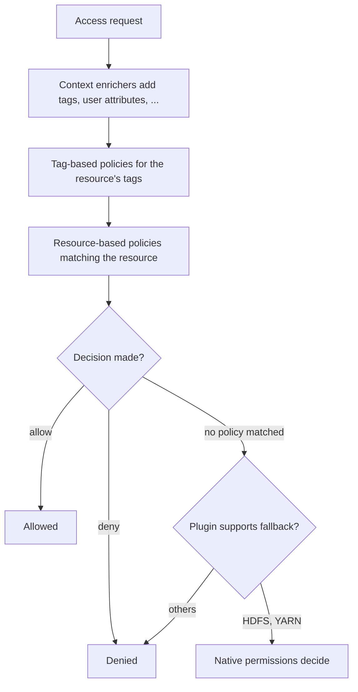

<!---
  Licensed to the Apache Software Foundation (ASF) under one or more
  contributor license agreements.  See the NOTICE file distributed with
  this work for additional information regarding copyright ownership.
  The ASF licenses this file to You under the Apache License, Version 2.0
  (the "License"); you may not use this file except in compliance with
  the License.  You may obtain a copy of the License at

      http://www.apache.org/licenses/LICENSE-2.0

  Unless required by applicable law or agreed to in writing, software
  distributed under the License is distributed on an "AS IS" BASIS,
  WITHOUT WARRANTIES OR CONDITIONS OF ANY KIND, either express or implied.
  See the License for the specific language governing permissions and
  limitations under the License.
-->

# Resource-based policies

A resource-based policy is the basic unit of authorization in Apache Ranger. It names a set of
resources in one service (an HDFS path, a Hive database/table/column, a Kafka topic, ...) and says
which users, groups and roles may perform which operations on them. Ranger plugins download the
policies of their service, cache them locally and evaluate them in-process for every access request.

This page explains the parts of a policy, how to create one in the Admin UI or through the REST API,
and how the policy engine turns a set of policies into an allow/deny decision. Tag-based policies,
data masking and row filtering, and custom conditions build on the same model and have their own pages.

## Concepts

### Anatomy of a policy

A policy is a JSON document modeled by
[`RangerPolicy`](https://github.com/apache/ranger/blob/master/agents-common/src/main/java/org/apache/ranger/plugin/model/RangerPolicy.java).
The fields you set most often:

| Field | Type | Description |
| --- | --- | --- |
| `service` | String | Name of the service instance the policy belongs to (for example `dev_hive`). |
| `name` | String | Policy name, unique within the service (and zone). |
| `policyType` | Integer | `0` access (default), `1` data mask, `2` row filter, `3` audit. |
| `policyPriority` | Integer | `0` `NORMAL` (default) or `1` `OVERRIDE`. See [Priority](#priority-and-deny-all-else). |
| `description` | String | Free text. |
| `isEnabled` | Boolean | Disabled policies are ignored by plugins. |
| `isAuditEnabled` | Boolean | Whether accesses matched by this policy produce audit records. |
| `resources` | Map | Resource name → an object with `values`, `isExcludes` and `isRecursive`. Resource names come from the service definition. |
| `policyItems` | List | Allow conditions. |
| `denyPolicyItems` | List | Deny conditions. |
| `allowExceptions` | List | Exclusions from the allow conditions. |
| `denyExceptions` | List | Exclusions from the deny conditions. |
| `dataMaskPolicyItems` | List | Used when `policyType` is `1`. See [Row filtering and column masking](row-filter-column-masking.md). |
| `rowFilterPolicyItems` | List | Used when `policyType` is `2`. |
| `conditions` | List | Policy-level conditions, each with a `type` and `values`. See [Policy conditions](policy-conditions.md). |
| `validitySchedules` | List | Time windows in which the policy is in effect. |
| `policyLabels` | List | Free-form labels used to group, search and export policies. |
| `zoneName` | String | Security zone the policy belongs to; empty for the unzoned part of the service. |
| `isDenyAllElse` | Boolean | Deny any request that matches the resources but no policy item. |
| `resourceSignature` | String | Computed by Ranger Admin from `resources`; identifies policies that cover the same resources. |
| `id` | Long | Assigned by Ranger Admin. |
| `guid` | String | Assigned by Ranger Admin. |
| `version` | Long | Incremented by Ranger Admin on every update. |

A policy item (`RangerPolicyItem`) has these fields:

| Field | Type | Description |
| --- | --- | --- |
| `accesses` | List | Access types the item grants or denies, each with a `type` and `isAllowed`. Access types come from the service definition (`select`, `read`, `publish`, ...). |
| `users` | List | Users the item applies to. |
| `groups` | List | Groups the item applies to. |
| `roles` | List | Roles the item applies to. |
| `conditions` | List | Item-level conditions. |
| `delegateAdmin` | Boolean | When `true`, the principals of this item may administer policies for these resources. |

A request matches an item if *any* of its users, groups or roles matches.

### Resources, wildcards and recursion

Each service definition declares its resource hierarchy and, for every resource, which matcher
class is used and which options it supports (`agents-common/src/main/resources/service-defs/`).

- `*` matches any sequence of characters and `?` matches one character. Use them in resource values
  such as `finance_*` or `/data/*/raw`. Wildcards can be turned off per resource with the matcher option
  `wildCard=false` (this is how masking policies force exact names).
- `isRecursive: true` applies the policy to the whole subtree below a path. Only resources whose
  definition sets `recursiveSupported: true` accept it (HDFS `path`, Hive `url`, ...).
- `isExcludes: true` inverts the match: the policy applies to every resource *except* the listed
  values. Only resources with `excludesSupported: true` accept it (Hive `database`, `table`, `column`,
  Kafka `topic`, ...).
- Matching is case-insensitive unless the resource sets `ignoreCase=false`.

Matcher options that the built-in matchers understand
([`RangerAbstractResourceMatcher`](https://github.com/apache/ranger/blob/master/agents-common/src/main/java/org/apache/ranger/plugin/resourcematcher/RangerAbstractResourceMatcher.java)):

| Option | Default | Description |
| --- | --- | --- |
| `wildCard` | `true` | Interpret `*` and `?` in policy values. |
| `ignoreCase` | `true` | Case-insensitive comparison. |
| `quotedCaseSensitive` | `false` | Compare case-sensitively when the value starts with a quote character. |
| `quoteChars` | `"` | Quote characters for `quotedCaseSensitive`. |
| `replaceTokens` | `true` | Replace `{USER}`-style tokens at evaluation time. |
| `tokenDelimiterStart` | `{` | Opening delimiter of a token. |
| `tokenDelimiterEnd` | `}` | Closing delimiter of a token. |
| `tokenDelimiterEscape` | `\` | Escape character for literal delimiters. |
| `tokenDelimiterPrefix` | (empty) | Optional prefix that must precede the token name, e.g. `%rangerToken:USER%`. |
| `replaceReqExpressions` | `true` | Evaluate `${{ ... }}` expressions in policy values. |

### Principals: users, groups, roles and special names

Policy items list `users`, `groups` and `roles` (see [Roles](../roles.md)). Three names are special
([`RangerPolicyEngine`](https://github.com/apache/ranger/blob/master/agents-common/src/main/java/org/apache/ranger/plugin/policyengine/RangerPolicyEngine.java)):

| Name | Where | Description |
| --- | --- | --- |
| `public` | `groups` | Every user, whether or not the user belongs to any group. |
| `{USER}` | `users` | The user making the request. Useful together with `{USER}` in resource values. |
| `{OWNER}` | `users` | The owner of the accessed resource, when the plugin knows it (Hive table owner, HDFS file owner, ...). |

### Allow, deny and exceptions

Every policy has four groups of policy items. The engine looks at them in this order for each
request that matches the policy's resources:

1. **Deny conditions** (`denyPolicyItems`): if one matches, and no **deny exception**
   (`denyExceptions`) matches, the request is denied.
2. **Allow conditions** (`policyItems`): if one matches, and no **allow exception**
   (`allowExceptions`) matches, the request is allowed.
3. Otherwise the policy makes no decision, unless `isDenyAllElse` is `true`.

Exceptions let you write "everyone in `finance`, except `interns`" or "deny `interns`, except
`scott`" in one policy instead of maintaining separate lists.

Deny items and exceptions are available when the service definition option
`enableDenyAndExceptionsInPolicies` is `true`. The default is `true`; the shipped `elasticsearch`,
`kylin`, `nifi`, `nifi-registry` and `sqoop` definitions set it to `false`, so their policies only
have allow items.

### Priority and deny-all-else

`policyPriority` is `0` (`NORMAL`) or `1` (`OVERRIDE`). Decisions from an `OVERRIDE` policy are
final with respect to `NORMAL` policies, whether they allow or deny. Between policies of the same
priority a deny wins over an allow. Use `OVERRIDE` sparingly, for example for a temporary
"lock down this table" policy that must beat every existing grant.

`isDenyAllElse: true` turns a policy into an allow-list: any request on its resources that is not
matched by one of its allow items is denied by that policy, so no other `NORMAL` policy can allow it.
It applies to access policies only.

### Validity schedules

`validitySchedules` limits when a policy is in effect. A policy with a schedule is ignored outside its
windows, exactly as if it were disabled. The model is
[`RangerValiditySchedule`](https://github.com/apache/ranger/blob/master/agents-common/src/main/java/org/apache/ranger/plugin/model/RangerValiditySchedule.java):

| Field | Type | Description |
| --- | --- | --- |
| `startTime` | String | Start of validity, `yyyy/MM/dd HH:mm:ss`. |
| `endTime` | String | End of validity, same format; must be later than `startTime`. |
| `timeZone` | String | Java time-zone id, e.g. `America/Los_Angeles`, `UTC`. |
| `recurrences` | List | Optional entries, each with a `schedule` and an `interval`, that restrict validity to repeating windows inside the start/end range. |

`schedule` is cron-like: `minute` (0–59, comma lists only), `hour` (0–23), `dayOfMonth` (1–31),
`dayOfWeek` (1–7, Sunday is 1), `month` (1–12), `year` (2017–2100). Values accept `*`,
comma lists and `a-b` ranges; `minute`, `hour`, `month` and `year` are required. `interval` has `days`, `hours` and `minutes` and gives the
length of each window that starts at a scheduled time. At least one of `dayOfMonth` and `dayOfWeek`
must be given when a recurrence is used.

### Policy labels

`policyLabels` is a list of free-form strings. Labels are global across services and policy types.
In the Admin UI you can search the policy list and the reports page by label, and export only the
policies carrying a label (see [Import and export](../import-export.md)). Labels have no effect on
evaluation.

### Delegated administration

Setting `delegateAdmin: true` on a policy item lets the users, groups and roles of that item manage
policies for the item's resources without being Ranger administrators: they can create, edit and
delete policies in the Admin UI or REST API as long as the resources of the new policy are covered by
a policy that delegates to them (Ranger Admin checks this with
[`RangerPolicyAdmin`](https://github.com/apache/ranger/blob/master/security-admin/src/main/java/org/apache/ranger/biz/RangerPolicyAdminImpl.java)).
The same flag authorizes `GRANT`/`REVOKE` statements issued through plugins that support them
(Hive, HBase): the plugin sends an `_admin` access request and only items with `delegateAdmin` match.

### `{USER}` and `${{ ... }}` in resource names

Large deployments often name resources after users (`/user/<name>`, `db_<name>`). Instead of one
policy per user, write the token `{USER}` in a resource value and `{USER}` in `users`; at evaluation
time the plugin substitutes the requesting user's name in both places
([`RangerAccessRequestUtil`](https://github.com/apache/ranger/blob/master/agents-common/src/main/java/org/apache/ranger/plugin/util/RangerAccessRequestUtil.java)
stores it under the token name `USER`; `{OWNER}` works the same way). The delimiters and an optional
prefix are configurable per resource with the `tokenDelimiter*` matcher options listed above.

Resource values can also contain dynamic expressions delimited by `${{` and `}}`, for example
`/home/${{REQ.user}}` or `db_${{USER.dept}}` (a user attribute from the user store). These are
evaluated by the same script engine as script conditions; see
[Policy conditions](policy-conditions.md#script-conditions-and-dynamic-expressions) and
[Attribute-based access control](../abac.md).

## Creating policies

### In the Admin UI

1. Open **Resource Based Policies**, pick the service instance and click **Add New Policy**.
2. Enter the policy name, the resource values (with the *include/exclude* and *recursive* switches
   where offered) and, optionally, labels, a description and a validity period.
3. Fill in the **Allow Conditions** section: users/groups/roles, permissions, policy conditions
   and the **Delegate Admin** checkbox. Expand **Exclude from Allow Conditions**, **Deny Conditions**
   and **Exclude from Deny Conditions** as needed.
4. Save. Plugins pick up the change on their next poll (30 seconds by default).

The [UI guide](../../services/admin/ui-guide.md) describes the policy list, search and reports;
[Your first policy](../../getting-started/first-policy.md) walks through an end-to-end example.

### With the REST API

Ranger Admin exposes policies at `/service/public/v2/api/policy`
([`PublicAPIsv2`](https://github.com/apache/ranger/blob/master/security-admin/src/main/java/org/apache/ranger/rest/PublicAPIsv2.java)).
The examples use the default port `6080` and basic authentication; see the
[REST API overview](../../dev/rest-api.md) for other options.

A Hive policy that grants `finance` read access to the `finance` database on weekdays during office
hours, denies `interns`, and lets `scott` through even though he is an intern:

```json title="finance-db.json"
{
  "service": "dev_hive",
  "name": "finance-db",
  "policyType": 0,
  "policyPriority": 0,
  "description": "Finance database: finance group reads; interns denied except scott",
  "isEnabled": true,
  "isAuditEnabled": true,
  "isDenyAllElse": false,
  "resources": {
    "database": { "values": ["finance"], "isExcludes": false, "isRecursive": false },
    "table":    { "values": ["*"],       "isExcludes": false, "isRecursive": false },
    "column":   { "values": ["*"],       "isExcludes": false, "isRecursive": false }
  },
  "policyItems": [
    {
      "accesses": [ { "type": "select", "isAllowed": true } ],
      "users": [], "groups": ["finance"], "roles": [],
      "conditions": [],
      "delegateAdmin": false
    }
  ],
  "denyPolicyItems": [
    {
      "accesses": [ { "type": "all", "isAllowed": true } ],
      "groups": ["interns"],
      "delegateAdmin": false
    }
  ],
  "allowExceptions": [],
  "denyExceptions": [
    {
      "accesses": [ { "type": "select", "isAllowed": true } ],
      "users": ["scott"],
      "delegateAdmin": false
    }
  ],
  "validitySchedules": [
    {
      "startTime": "2026/01/01 00:00:00",
      "endTime":   "2026/12/31 23:59:59",
      "timeZone":  "America/Los_Angeles",
      "recurrences": [
        {
          "schedule": { "minute": "0", "hour": "8", "dayOfWeek": "2-6", "month": "*", "year": "2026" },
          "interval": { "hours": 10 }
        }
      ]
    }
  ],
  "policyLabels": ["finance", "quarterly-review"],
  "zoneName": "",
  "conditions": []
}
```

```bash
curl -u admin:rangerR0cks! -H 'Content-Type: application/json' \
     -X POST http://localhost:6080/service/public/v2/api/policy \
     -d @finance-db.json
```

An HDFS policy that gives every user full control of their own home directory, using `{USER}`:

```json title="user-home.json"
{
  "service": "dev_hdfs",
  "name": "user-home-directories",
  "policyType": 0,
  "resources": {
    "path": { "values": ["/user/{USER}"], "isRecursive": true }
  },
  "policyItems": [
    {
      "accesses": [
        { "type": "read",    "isAllowed": true },
        { "type": "write",   "isAllowed": true },
        { "type": "execute", "isAllowed": true }
      ],
      "users": ["{USER}"],
      "delegateAdmin": true
    }
  ]
}
```

Other policy endpoints, relative to `/service/public/v2`:

| Method | Path | Description |
| --- | --- | --- |
| `GET` | `/api/policy/{id}` | Fetch by id. |
| `GET` | `/api/service/{serviceName}/policy/{policyName}` | Fetch by name. Query: `zoneName` for zoned policies. |
| `GET` | `/api/service/{serviceName}/policy` | List the policies of a service; query parameters filter, e.g. `policyLabelsPartial`. |
| `GET` | `/api/policies/{serviceDefName}/for-resource` | Policies that apply to a given resource. Query: `serviceName`. |
| `PUT` | `/api/policy/{id}` | Replace a policy, by id. |
| `PUT` | `/api/service/{serviceName}/policy/{policyName}` | Replace a policy, by name. |
| `POST` | `/api/policy/apply` | Create the policy, or merge its items into the existing policy with the same resource signature. |
| `DELETE` | `/api/policy/{id}` | Delete by id. |
| `DELETE` | `/api/policy` | Delete by name. Query: `servicename`, `policyname`. |

The complete list is in the [REST API reference](../../dev/rest-api.md#policies).

## Evaluation semantics

The engine ([`RangerPolicyEngineImpl`](https://github.com/apache/ranger/blob/master/agents-common/src/main/java/org/apache/ranger/plugin/policyengine/RangerPolicyEngineImpl.java)
and [`RangerDefaultPolicyEvaluator`](https://github.com/apache/ranger/blob/master/agents-common/src/main/java/org/apache/ranger/plugin/policyevaluator/RangerDefaultPolicyEvaluator.java))
processes each access request as follows:



### Inside one policy

1. The policy must be enabled, valid at the access time (validity schedules) and its policy-level
   `conditions` must pass. Otherwise it is skipped.
2. The requested resource must match the policy's `resources`, honoring wildcards, `isRecursive`
   and `isExcludes`.
3. Deny items are checked first, then deny exceptions, then allow items, then allow exceptions, as
   described in [Allow, deny and exceptions](#allow-deny-and-exceptions). A policy item matches when
   the requester is one of its users/groups/roles (or `public`/`{USER}`/`{OWNER}` applies), the
   requested access type is one of its `accesses` (including implied grants such as `all`), and all
   of its item-level conditions pass.
4. If no item matched and `isDenyAllElse` is `true`, the policy denies.

### Across policies

- Tag-based policies are evaluated before resource-based policies; see
  [Tag-based policies](tag-based-policies.md#evaluation-semantics) for how the two interact.
- A deny by a policy at the same or higher priority than an earlier allow replaces the allow. An
  allow replaces an earlier deny only if its policy has strictly higher priority.
- Once a request is allowed and no policies with deny items remain, evaluation stops.
- If no policy decides, the result is *undetermined*. Plugins whose service supports fallback (HDFS,
  YARN) then consult the component's native permissions; every other plugin treats undetermined as
  denied.

### Edge cases worth knowing

- Access type `all` (Hive) and other access types with `impliedGrants` match requests for any of the
  implied types.
- A policy item with no users, groups or roles never matches, and a policy without any policy items
  (and `isDenyAllElse` false) has no effect on authorization.
- Resource values are matched per resource level: a Hive policy on `database=finance, table=*` also
  matches requests for the database itself (for example `USE finance`).
- Superusers configured on the plugin (`ranger.plugin.<serviceType>.super.users` and
  `.super.groups`) bypass policy evaluation.
- Policies inside a [security zone](../sec-zone/intro.md) are evaluated only for resources that fall
  into that zone; unzoned policies never apply to zoned resources.

## Related features

- [Policy model](../../arch/policy-model.md) — background on service definitions, services and policies.
- [Tag-based policies](tag-based-policies.md) — authorize by classification instead of by resource name.
- [Row filtering and column masking](row-filter-column-masking.md) — policies of type `1` and `2`.
- [Policy conditions](policy-conditions.md) — IP ranges, time of day, scripts and custom evaluators.
- [Roles](../roles.md), [Attribute-based access control](../abac.md), [Security zones](../sec-zone/intro.md).
- [Import and export](../import-export.md) — move policies between environments, filtered by label.
- Further reading on cwiki: [Deny-conditions and excludes](https://cwiki.apache.org/confluence/pages/viewpage.action?pageId=61323469),
  [How deny policies work](https://cwiki.apache.org/confluence/pages/viewpage.action?pageId=61331213),
  [Support for `$username` variable](https://cwiki.apache.org/confluence/pages/viewpage.action?pageId=66851829),
  [Policy labels](https://cwiki.apache.org/confluence/pages/viewpage.action?pageId=75975935).
