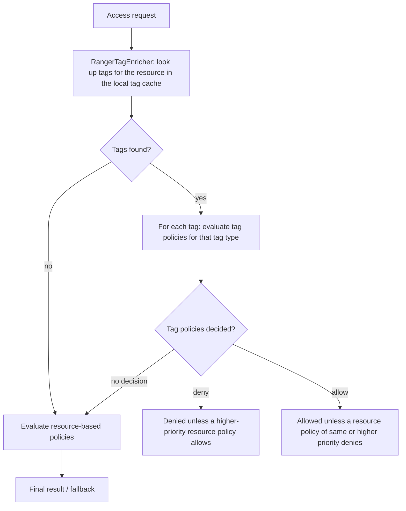

<!---
  Licensed to the Apache Software Foundation (ASF) under one or more
  contributor license agreements.  See the NOTICE file distributed with
  this work for additional information regarding copyright ownership.
  The ASF licenses this file to You under the Apache License, Version 2.0
  (the "License"); you may not use this file except in compliance with
  the License.  You may obtain a copy of the License at

      http://www.apache.org/licenses/LICENSE-2.0

  Unless required by applicable law or agreed to in writing, software
  distributed under the License is distributed on an "AS IS" BASIS,
  WITHOUT WARRANTIES OR CONDITIONS OF ANY KIND, either express or implied.
  See the License for the specific language governing permissions and
  limitations under the License.
-->

# Tag-based policies

A tag-based policy authorizes access by the *classification* of a resource instead of by its name.
Tag a column as `PII` in Apache Atlas (or through the Ranger REST API) and a single Ranger policy for
the `PII` tag controls who can read that column in Hive, in Trino, and in every other Ranger-enabled
service that sees the same tag. Tagging new data is enough; nobody has to touch policies.

This separates two jobs that are often done by different teams: data stewards classify resources,
security administrators decide what each classification allows. It also cuts the number of policies,
because one tag policy replaces one resource policy per tagged resource per service.

## Concepts

### Tags, tag definitions and tagged resources

Ranger stores tags in its own tag store (the Ranger Admin database), using three models from
`agents-common/src/main/java/org/apache/ranger/plugin/model/`:

`RangerTagDef`
:   A tag *type*, such as `PII` or `EXPIRES_ON`, and the attributes it may carry. Fields: `name`, `source` and
    `attributeDefs` (a list of attribute names and types).

`RangerTag`
:   One application of a tag type, with concrete attribute values (for example `expiry_date=2026/12/31`).
    Fields: `type`, `attributes`, `validityPeriods` and `options`. A tag can have validity periods; outside
    them it is ignored.

`RangerServiceResource`
:   The tagged resource, described with the same resource names as a policy (`database`, `table`, `column`,
    `path`, ...). Fields: `serviceName`, `resourceElements`, `ownerUser` and `additionalInfo`.

A `RangerTagResourceMap` links a tag to a resource. Tag attribute values can be used in policy
conditions, so a tag is more than a label; it can carry an expiry date, a sensitivity level or an
owner.

### The `tag` service type

Tag policies live in services of type `tag`
([`ranger-servicedef-tag.json`](https://github.com/apache/ranger/blob/master/agents-common/src/main/resources/service-defs/ranger-servicedef-tag.json)).
The definition contains:

- One resource, `tag`, matched by `RangerDefaultResourceMatcher` with `wildCard=false` and
  `ignoreCase=false`: a policy names exactly one tag type, no wildcards.
- No access types of its own. Whenever a component service definition is created or updated, Ranger
  Admin adds that component's access types to the tag definition, prefixed with the component name
  ([`AbstractServiceStore`](https://github.com/apache/ranger/blob/master/agents-common/src/main/java/org/apache/ranger/plugin/store/AbstractServiceStore.java)):
  `hive:select`, `hdfs:read`, `kafka:publish`, and so on. A tag policy item therefore lists
  permissions per component ("Component Permissions" in the UI). The component's `dataMaskDef` and
  `rowFilterDef` are merged the same way, so tag-based masking and row filtering are possible.
- Two policy conditions, `accessed-after-expiry` and `expression`, and one context enricher,
  `RangerTagEnricher`. Both are described below.

A component service definition can opt out of tag policies with the option
`enableTagBasedPolicies=false` (the shipped `atlas` definition does).

### Linking a tag service to a component service

A plugin enforces the tag policies of the tag service that its own service refers to. The link is the
`tagService` field of the component service (`RangerService.tagService`). You can create several tag
services (`tag_dev`, `tag_prod`) and point each cluster's services at the right one.

### Where tags come from

- **Ranger TagSync** listens to Apache Atlas entity/classification notifications (or polls the Atlas
  REST API) and writes tags into the Ranger tag store. See [TagSync](../../services/tagsync/service.md).
- **REST API**: any system can push tags with the `/service/tags/...` endpoints
  ([`TagREST`](https://github.com/apache/ranger/blob/master/security-admin/src/main/java/org/apache/ranger/rest/TagREST.java)).
- **Files**: for testing, a plugin can load tags from a JSON file instead of Ranger Admin (see
  [Plugin-side configuration](#plugin-side-configuration)).

## How to configure

### 1. Create a tag service

In the Admin UI open **Tag Based Policies**, click **+** next to **TAG** and enter a service name.
With the REST API:

```bash
curl -u admin:rangerR0cks! -H 'Content-Type: application/json' \
     -X POST http://localhost:6080/service/public/v2/api/service \
     -d '{ "type": "tag", "name": "tag_dev", "description": "Tag policies for dev", "isEnabled": true, "configs": {} }'
```

Creating a tag service also creates a default `EXPIRES_ON` policy (see below).

### 2. Link component services to it

In the UI, edit the component service (for example `dev_hive`) under **Resource Based Policies**
and pick the tag service in **Select Tag Service**. With the REST API, fetch the service, set
`tagService` and put it back:

```bash
curl -u admin:rangerR0cks! http://localhost:6080/service/public/v2/api/service/name/dev_hive > dev_hive.json
# edit dev_hive.json: "tagService": "tag_dev"
curl -u admin:rangerR0cks! -H 'Content-Type: application/json' \
     -X PUT http://localhost:6080/service/public/v2/api/service/name/dev_hive -d @dev_hive.json
```

Plugins of the linked service start downloading tags on their next poll.

### 3. Tag resources

Normally TagSync does this. To push tags directly, send a
[`ServiceTags`](https://github.com/apache/ranger/blob/master/agents-common/src/main/java/org/apache/ranger/plugin/util/ServiceTags.java)
document to `PUT /service/tags/importservicetags/`. The example tags column `finance.tax_2010.ssn`
as `PII` and table `finance.tax_2010` as `EXPIRES_ON` in service `dev_hive`:

```json title="dev_hive-tags.json"
{
  "op": "add_or_update",
  "serviceName": "dev_hive",
  "tagDefinitions": {
    "1": { "id": 1, "name": "PII",        "source": "manual", "attributeDefs": [] },
    "2": { "id": 2, "name": "EXPIRES_ON", "source": "manual",
           "attributeDefs": [ { "name": "expiry_date", "type": "string" } ] }
  },
  "tags": {
    "1": { "id": 1, "type": "PII" },
    "2": { "id": 2, "type": "EXPIRES_ON", "attributes": { "expiry_date": "2026/12/31" } }
  },
  "serviceResources": [
    { "id": 1, "serviceName": "dev_hive",
      "resourceElements": { "database": { "values": ["finance"] }, "table": { "values": ["tax_2010"] }, "column": { "values": ["ssn"] } } },
    { "id": 2, "serviceName": "dev_hive",
      "resourceElements": { "database": { "values": ["finance"] }, "table": { "values": ["tax_2010"] } } }
  ],
  "resourceToTagIds": { "1": [1], "2": [2] }
}
```

```bash
curl -u admin:rangerR0cks! -H 'Content-Type: application/json' \
     -X PUT http://localhost:6080/service/tags/importservicetags/ -d @dev_hive-tags.json
```

`op` is `add_or_update`, `delete` or `replace`. The ids inside the document are local to the
document; Ranger Admin matches tag definitions by name and resources by their resource signature.
Individual objects can also be managed with `/service/tags/tagdefs/`, `/service/tags/tags/`,
`/service/tags/resources/` and `/service/tags/tagresourcemaps/`; plugins download the whole set with
`/service/tags/download/{serviceName}` (`/service/tags/secure/download/{serviceName}` when Kerberos
is enabled).

### 4. Write the tag policy

In the UI open **Tag Based Policies**, select the tag service and click **Add New Policy**. Enter
the tag name in **TAG** and add allow/deny items with **Component Permissions**. The policy below
allows only the `audit` group to read `PII` data in Hive and HDFS and denies everyone else:

```json title="pii-policy.json"
{
  "service": "tag_dev",
  "name": "PII",
  "policyType": 0,
  "description": "Only the audit group may read PII data",
  "isEnabled": true,
  "isAuditEnabled": true,
  "resources": {
    "tag": { "values": ["PII"], "isExcludes": false, "isRecursive": false }
  },
  "policyItems": [
    {
      "accesses": [ { "type": "hive:select", "isAllowed": true }, { "type": "hdfs:read", "isAllowed": true } ],
      "groups": ["audit"],
      "delegateAdmin": false
    }
  ],
  "denyPolicyItems": [
    {
      "accesses": [ { "type": "hive:select", "isAllowed": true }, { "type": "hdfs:read", "isAllowed": true } ],
      "groups": ["public"],
      "delegateAdmin": false
    }
  ],
  "allowExceptions": [],
  "denyExceptions": [
    {
      "accesses": [ { "type": "hive:select", "isAllowed": true }, { "type": "hdfs:read", "isAllowed": true } ],
      "groups": ["audit"],
      "delegateAdmin": false
    }
  ]
}
```

```bash
curl -u admin:rangerR0cks! -H 'Content-Type: application/json' \
     -X POST http://localhost:6080/service/public/v2/api/policy -d @pii-policy.json
```

The JSON layout is the same as for [resource-based policies](resource-policies.md); only the
resource (`tag`) and the access type names differ. Priority, validity schedules, labels and
policy-level conditions all work the same way.

### The default `EXPIRES_ON` policy

[`RangerServiceTag`](https://github.com/apache/ranger/blob/master/agents-common/src/main/java/org/apache/ranger/services/tag/RangerServiceTag.java)
creates one policy in every new tag service. It denies all access types to `public` on resources
tagged `EXPIRES_ON`, but only when the condition `accessed-after-expiry` is `yes`, i.e. when the
access time is later than the tag's `expiry_date` attribute:

```json
{
  "service": "tag_dev",
  "name": "EXPIRES_ON",
  "description": "Policy for data with EXPIRES_ON tag",
  "resources": { "tag": { "values": ["EXPIRES_ON"] } },
  "policyItems": [],
  "denyPolicyItems": [
    {
      "accesses": [ { "type": "hive:select", "isAllowed": true }, { "type": "hdfs:read", "isAllowed": true } ],
      "groups": ["public"],
      "conditions": [ { "type": "accessed-after-expiry", "values": ["yes"] } ],
      "delegateAdmin": false
    }
  ]
}
```

(The real default lists every access type known to the tag service definition at creation time.)
To retire a data set on a date, tag it `EXPIRES_ON` with `expiry_date` set; no policy change is
needed. The attribute is parsed with the format `yyyy/MM/dd` or Atlas' ISO-8601 format by default;
extra `SimpleDateFormat` patterns can be listed, separated by `||`, in the plugin property
`ranger.plugin.tag.attr.additional.date.formats`.

## Evaluation semantics



The engine ([`RangerPolicyEngineImpl`](https://github.com/apache/ranger/blob/master/agents-common/src/main/java/org/apache/ranger/plugin/policyengine/RangerPolicyEngineImpl.java))
always evaluates tag policies first, then resource policies:

1. `RangerTagEnricher` adds the tags of the requested resource to the request context. A tag on a
   parent resource applies to its children (a tag on a table applies to all its columns). Tags whose
   validity periods do not cover the access time are ignored.
2. For every tag, the tag policies for that tag type are evaluated with the normal
   allow/deny/exception rules. The condition evaluators can read the current tag's attributes.
3. If a tag policy denied, the request is denied unless a resource policy with strictly higher
   priority allows it. If a tag policy allowed, resource policies of the same or higher priority are
   still evaluated and can deny. If tag policies made no decision, resource policies decide alone.
4. If nothing decides, the result is undetermined: HDFS and YARN fall back to native permissions,
   other plugins deny.

Consequences:

- A deny in a tag policy is the most direct way to lock down classified data across all services.
- With several tags on one resource, a deny for any of them wins over an allow for another.
- A tag allow does not require a resource policy: a user in `audit` can read `PII` columns even if no
  Hive policy mentions them.
- Tag policies use the same audit settings as resource policies; the audit record shows the tag
  policy id and the tags of the resource.

### Tag attributes in conditions

Two conditions are declared in the tag service definition:

`accessed-after-expiry`
:   Evaluated by `RangerScriptTemplateConditionEvaluator` with the `scriptTemplate` option set to
    `ctx.isAccessedAfter('expiry_date');`. The value is `yes`/`true`, or `no`/`false` to reverse the result.

`expression`
:   Evaluated by `RangerScriptConditionEvaluator` (JavaScript). The value is a boolean expression, for example
    `TAG.sensitiveLevel >= 10` or `USER.clearance >= TAG.sensitiveLevel`.

`TAG` is the tag currently being evaluated (with `_type` and its attributes), `TAGS` holds all tags
of the resource, and `ctx.isAccessedAfter(attr)` / `ctx.isAccessedBefore(attr)` compare the access time
with a date attribute. See [Policy conditions](policy-conditions.md#script-conditions-and-dynamic-expressions)
for the full list of variables and helpers, and [Attribute-based access control](../abac.md) for
combining tag attributes with user attributes.

### Plugin-side configuration

The tag service definition registers `RangerTagEnricher` with these options; a copy of the
enricher definition is delivered to every plugin that uses tag policies:

| Option | Default | Description |
| --- | --- | --- |
| `tagRetrieverClassName` | `RangerAdminTagRetriever` | Class that loads the tags, in package `org.apache.ranger.plugin.contextenricher`. |
| `tagRefresherPollingInterval` | `60000` | Milliseconds between polls of Ranger Admin for tag changes. Plugins download deltas when possible. |
| `disableTrieLookupPrefilter` | `false` | Disable the trie index used to find candidate tagged resources quickly. |

For tests, `RangerFileBasedTagRetriever` with the option `serviceTagsFileName` reads a `ServiceTags` JSON file
instead of polling Ranger Admin.

Tags are cached in the plugin's policy cache directory next to the policies, so a plugin can restart
while Ranger Admin is unreachable. **Audit → Plugin Status** in the Admin UI shows the tag version
each plugin has loaded, and `GET /service/tags/tags/cache/reset?serviceName=...` forces Ranger Admin
to rebuild its tag cache for a service.

### Limitations

- One tag type per policy and no wildcards in the tag name (`wildCard=false`).
- The Admin UI does not offer **Delegate Admin** on tag policies; tag policies are managed by Ranger
  administrators (or via REST by users with the right permissions).
- Tags are matched by their type name; attribute values only take part through conditions.

## Related features

- [Resource-based policies](resource-policies.md) — the shared policy model.
- [Row filtering and column masking](row-filter-column-masking.md) — masks and filters can also be tag-based.
- [Policy conditions](policy-conditions.md) — the `expression` and `accessed-after-expiry` conditions.
- [Attribute-based access control](../abac.md), [TagSync](../../services/tagsync/service.md),
  Atlas plugin.
- Further reading on cwiki: [Tag based policies](https://cwiki.apache.org/confluence/display/RANGER/Tag+Based+Policies),
  [Tag based policy requirements](https://cwiki.apache.org/confluence/pages/viewpage.action?pageId=61311798).
