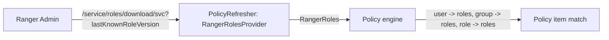

<!---
  Licensed to the Apache Software Foundation (ASF) under one or more
  contributor license agreements.  See the NOTICE file distributed with
  this work for additional information regarding copyright ownership.
  The ASF licenses this file to You under the Apache License, Version 2.0
  (the "License"); you may not use this file except in compliance with
  the License.  You may obtain a copy of the License at

      http://www.apache.org/licenses/LICENSE-2.0

  Unless required by applicable law or agreed to in writing, software
  distributed under the License is distributed on an "AS IS" BASIS,
  WITHOUT WARRANTIES OR CONDITIONS OF ANY KIND, either express or implied.
  See the License for the specific language governing permissions and
  limitations under the License.
-->

# Roles

A role is a named set of users, groups and other roles that you manage inside Ranger. Policies grant
access to a role the same way they grant access to a user or a group, so you can express "analysts may
read the sales tables" once and change who the analysts are without touching any policy. This is
role-based access control (RBAC).

Roles differ from groups in two ways: they are defined and maintained in Ranger rather than synced from
UNIX or LDAP, and they can be nested. They were introduced in Ranger 2.0.0 (RANGER-2414) together with
support for Hive SQL role statements (RANGER-2425).

!!! note
    Do not confuse these roles with the *Ranger Admin user roles* (Admin, KeyAdmin, Auditor, User)
    that control what a person can do in the Admin UI. Those are described in
    [Users, groups and roles](../services/admin/users-groups-roles.md).

## Concepts

The model is
[`RangerRole`](https://github.com/apache/ranger/blob/master/agents-common/src/main/java/org/apache/ranger/plugin/model/RangerRole.java):

| Field | Type | Description |
| --- | --- | --- |
| `name` | String | Unique role name. |
| `description` | String | Free text. |
| `users` | List | User members; each entry has a `name` and an `isAdmin` flag. |
| `groups` | List | Group members, same shape. |
| `roles` | List | Nested roles, same shape; members of a nested role are members of this role. |
| `options` | Map | Free-form key/value pairs. |
| `createdByUser` | String | Set by Ranger Admin on creation. |

**Role admin**
:   A member with `isAdmin: true` may update the role's membership (add or remove users, groups and
    roles) without being a Ranger administrator. Ranger Admin users can manage every role.

**Nested roles**
:   A role listed in `roles` contributes all of its members, recursively. Plugins expand the nesting
    with `RangerRolesUtil`, so a policy that names the outer role applies to everyone in the inner
    roles too.

**Scope**
:   Roles are global to a Ranger Admin instance; the same role can be used in policies of every
    service. The REST API accepts an optional `serviceName` so that a *service admin* of that service
    can create and manage roles for it.

## Managing roles

### Admin UI

Open **Settings → Users/Groups/Roles → Roles**. The role form takes a name, a description and three
tables (users, groups, roles) in which each entry has an **Is Role Admin** checkbox. The form refuses to
save while a user, group or role is selected in a picker but has not been added to its table.

### REST API

`RoleREST` is mounted at `/service/roles`; the create, read, update, delete, membership and
grant/revoke operations are also available under `/service/public/v2/api/roles`.

Paths are relative to `http://<admin-host>:6080/service/roles`.

| Method | Path | Description |
| --- | --- | --- |
| `POST` | `/roles` | Create a role. Query: `serviceName`, `createNonExistUserGroup=true`. |
| `PUT` | `/roles/{id}` | Replace a role. |
| `GET` | `/roles` | List roles (paged, filterable). |
| `GET` | `/roles/{id}` | Get a role by id. |
| `GET` | `/roles/name/{name}` | Get a role by name. |
| `DELETE` | `/roles/{id}` | Delete by id. |
| `DELETE` | `/roles/name/{name}` | Delete by name. |
| `GET` | `/roles/names` | Role names only. |
| `GET` | `/roles/user/{user}` | Roles of a user, including roles reached through groups and nesting. |

Membership and grants:

| Method | Path | Description |
| --- | --- | --- |
| `PUT` | `/roles/{id}/addUsersAndGroups` | Add members. Query: `users`, `groups`, `isAdmin`; or a JSON body. |
| `PUT` | `/roles/{id}/removeUsersAndGroups` | Remove members. |
| `PUT` | `/roles/{id}/removeAdminFromUsersAndGroups` | Keep members, drop their admin flag. |
| `PUT` | `/roles/grant/{serviceName}` | Grant roles to principals (`GrantRevokeRoleRequest` body). |
| `PUT` | `/roles/revoke/{serviceName}` | Revoke roles from principals. |

Export, import and plugin download:

| Method | Path | Description |
| --- | --- | --- |
| `GET` | `/roles/exportJson` | Download all roles as JSON. |
| `POST` | `/roles/importRolesFromFile` | Upload a roles JSON file (multipart `file`). Query: `updateIfExists`, `createNonExistUserGroupRole`. |
| `GET` | `/download/{serviceName}` | Used by plugins: returns roles when `lastKnownRoleVersion` is stale. |

Create a role with a nested role and a role admin:

```bash
curl -u admin:password -H 'Content-Type: application/json' \
  -X POST http://localhost:6080/service/roles/roles -d '{
  "name":        "analysts",
  "description": "People who may read reporting data",
  "users":  [ { "name": "alice", "isAdmin": true }, { "name": "bob", "isAdmin": false } ],
  "groups": [ { "name": "bi-team", "isAdmin": false } ],
  "roles":  [ { "name": "data-stewards", "isAdmin": false } ]
}'
```

Add a member later without resending the whole role:

```bash
curl -u admin:password -X PUT \
  'http://localhost:6080/service/roles/roles/12/addUsersAndGroups?users=carol&isAdmin=false'
```

Grant a role through the service-scoped API (this is what the Hive plugin calls for `GRANT ROLE`):

```bash
curl -u admin:password -H 'Content-Type: application/json' \
  -X PUT http://localhost:6080/service/roles/roles/grant/cl1_hive -d '{
  "grantor":     "admin",
  "targetRoles": ["analysts"],
  "users":       ["dave"],
  "groups":      [],
  "roles":       []
}'
```

## Using roles in policies

Every policy item has a `roles` list next to `users` and `groups`
([`RangerPolicy.RangerPolicyItem`](https://github.com/apache/ranger/blob/master/agents-common/src/main/java/org/apache/ranger/plugin/model/RangerPolicy.java)).
In the policy editor, the **Select Roles** column sits beside the user and group columns for allow,
deny and exception items.

```json title="Policy item granting select to a role"
{
  "roles":         ["analysts"],
  "accesses":      [ { "type": "select", "isAllowed": true } ],
  "delegateAdmin": false
}
```

Roles also appear in:

- **Security zones** — `adminRoles` and `auditRoles` of a zone
  ([Security zones](sec-zone/intro.md)).
- **Governed data sharing** — the `roles` map of a dataset, project or data share ACL, and the
  principals of a dataset grant ([Governed data sharing](gds/gds_intro.md)).
- **Dynamic expressions** — `IS_IN_ROLE('analysts')`, `URNAMES`, `GET_UR_NAMES()` in conditions
  ([ABAC](abac.md)), and the `role` source of the external user-store retriever, which turns roles
  named `attr.value` into user attributes.
- **Audit filtering** — `ranger.plugin.<serviceType>.audit.exclude.roles` in
  `ranger-<serviceType>-security.xml` suppresses audit records for members of the listed roles.

### Hive SQL role statements

With the Hive plugin, `CREATE ROLE`, `DROP ROLE`, `GRANT ROLE`, `REVOKE ROLE`, `SHOW ROLES`,
`SHOW ROLE GRANT` and `SET ROLE` are handled by
[`RangerHiveAuthorizer`](https://github.com/apache/ranger/blob/master/hive-agent/src/main/java/org/apache/ranger/authorization/hive/authorizer/RangerHiveAuthorizer.java),
which calls the role REST API above on behalf of the user. The executing user must be a Ranger
administrator, a service admin of the Hive service or an admin member of the role.

## How plugins evaluate roles



- Roles are downloaded by `RangerRolesProvider`, which runs inside the plugin's policy refresher on
  the same poll interval as policies (`ranger.plugin.<serviceType>.policy.pollIntervalMs`). The
  response is only sent when the role version changed.
- The last copy is cached in the policy cache directory as `<appId>_<serviceName>_roles.json`.
- Before evaluation, `RangerRolesUtil` builds user → roles, group → roles and role → roles maps
  and flattens nesting, so a policy item matches when the request user, any of the user's groups, or
  any role reachable through those, is listed in `roles`.

## Edge cases

- **Deleting a role does not edit policies.** Policy items that name the deleted role stay in place
  and simply match nobody. Check **Reports** (filter by role) before deleting.
- **Role names must be unique** across the Ranger instance; `RangerRoleValidator` rejects a blank
  name and a name that already exists.
- **Listing is permission-aware.** `GET /service/roles/roles` accepts the same paging and sort
  parameters as other list endpoints and is meant for administrators;
  `GET /service/roles/lookup/roles` returns the roles the calling user is a member of or administers.

## Related features

- [Resource-based policies](policies/resource-policies.md) — policy items and delegated administration.
- [Users, groups and roles](../services/admin/users-groups-roles.md) — Admin user roles and user sync.
- [Attribute-based access control](abac.md) — role membership in expressions.
- [Security zones](sec-zone/intro.md) — zone admin and auditor roles.
- [REST API overview](../dev/rest-api.md) — authentication and the public v2 API.
