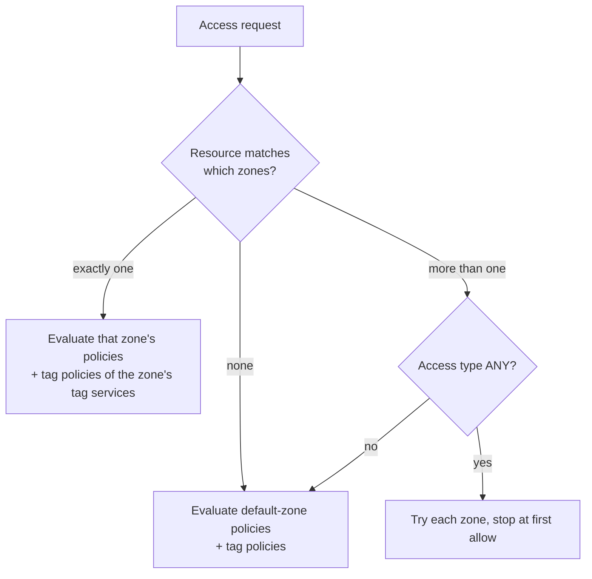

<!---
  Licensed to the Apache Software Foundation (ASF) under one or more
  contributor license agreements.  See the NOTICE file distributed with
  this work for additional information regarding copyright ownership.
  The ASF licenses this file to You under the Apache License, Version 2.0
  (the "License"); you may not use this file except in compliance with
  the License.  You may obtain a copy of the License at

      http://www.apache.org/licenses/LICENSE-2.0

  Unless required by applicable law or agreed to in writing, software
  distributed under the License is distributed on an "AS IS" BASIS,
  WITHOUT WARRANTIES OR CONDITIONS OF ANY KIND, either express or implied.
  See the License for the specific language governing permissions and
  limitations under the License.
-->

# Security zones

A security zone carves the resources of one or more services into a named partition with its own
administrators, auditors and policies. The finance team can own every policy for `/finance/*` in
HDFS, the `finance` database in Hive and the `FIN_*` topics in Kafka, while the sales team owns
`/sales/*`, `sales` and `SALES_*`, and neither can see or change the other's rules. Ranger
administrators still see everything.

Zones exist because a single Ranger Admin usually fronts services shared by many teams. Without zones,
anyone who may edit policies for a Hive service may edit *all* of its policies. With zones, policy
administration can be delegated per business area without splitting the cluster or the service.

Security zones were introduced in Ranger 2.0.0 ([RANGER-2232](https://issues.apache.org/jira/browse/RANGER-2232)). This page covers the model, the
permissions of each role, how a plugin evaluates requests once zones exist, and the REST API.

## Concepts

**Zone**
:   A named object
    ([`RangerSecurityZone`](https://github.com/apache/ranger/blob/master/agents-common/src/main/java/org/apache/ranger/plugin/model/RangerSecurityZone.java))
    holding a `services` map, `tagServices`, admin principals and auditor principals.

**Zone resources**
:   For each service in the zone, a list of resource combinations, for example
    `{ "database": ["finance"] }` or `{ "path": ["/finance/*", "/taxes/*"] }`. Resource values use the
    same matchers and wildcards as policies of that service type.

**Unzoned (default) zone**
:   Every resource that matches no zone belongs to the default zone, which has id `1`
    (`RANGER_UNZONED_SECURITY_ZONE_ID`). Policies without a `zoneName` live there.

**Zone admins and auditors**
:   `adminUsers`, `adminUserGroups`, `adminRoles` may create, edit and delete policies in the zone.
    `auditUsers`, `auditUserGroups`, `auditRoles` may view the zone's policies and access audits.

**Tag services in a zone**
:   `tagServices` lists tag services whose tag-based policies apply inside the zone. Tag policies are
    evaluated in the same zone as the accessed resource ([RANGER-2343](https://issues.apache.org/jira/browse/RANGER-2343)), so a zone without a tag service
    gets no tag-based decisions.

**Zone policies**
:   A policy carries a `zoneName`. Policies in a zone are evaluated only for resources that fall in
    that zone; policies in the default zone are evaluated only for resources that fall in no zone.

## Who can do what

| Action | Ranger Admin | Service admin | Zone admin | Zone auditor | Delegated admin | User / Auditor |
| --- | --- | --- | --- | --- | --- | --- |
| Create / delete a zone, change its name or description | Y | N | N | N | N | N |
| Add or remove services and resource combinations in a zone | Y | Y (own services) | N | N | N | N |
| Add or remove tag services in a zone | Y | Y (own tag services) | N | N | N | N |
| Change zone admin / auditor users, groups and roles | Y | N | Y | N | N | N |
| Create / update / delete policies in the zone | Y | N | Y | N | Y (own policies) | N |
| View zone policies | Y | Y | Y | Y | partial | partial |
| View access audits of the zone | Y | N | Y | Y | N | N (Auditor: Y) |

Other rules enforced by `SecurityZoneREST` and `RangerSecurityZoneValidator`:

- Zone names must be unique; every service named in the zone must exist, every resource in a resource
  combination needs at least one value, and a combination may not be listed twice for the same service
  (validation error 3052).
- A zone must name at least one admin principal (user, group or role) and at least one auditor
  principal.
- A resource combination may not consist only of wildcards, and a resource may not be claimed by two
  zones (validation error 3046, *Multiple zones match resource*).
- KMS services cannot be placed in a zone.
- A zone admin who is not a Ranger administrator can only change the admin and auditor lists; every
  other change to the zone is rejected with `403`.

## Creating a zone

### Admin UI

Open **Security Zone** from the navigation sidebar and click **Create Zone**. Fill in the name and
description, choose admin and auditor users, groups and roles, then add one or more services and,
for each, one or more resource combinations. Tag services are chosen in a separate list. After saving,
the **Service Manager** page shows a zone selector; pick a zone to list and edit only that zone's
policies. New policies created while a zone is selected are stored with that `zoneName`.

### REST API

`SecurityZoneREST` is mounted at `/service/zones`; the public API mirrors it at
`/service/public/v2/api/zones` and adds a newer `zones-v2` shape.

Paths of `SecurityZoneREST`, relative to `/service/zones`:

| Method | Path | Description |
| --- | --- | --- |
| `POST` | `/zones` | Create a zone. |
| `PUT` | `/zones/{id}` | Replace a zone. |
| `GET` | `/zones` | List zones. |
| `GET` | `/zones/{id}` | Get a zone by id. |
| `GET` | `/zones/name/{name}` | Get a zone by name. |
| `DELETE` | `/zones/{id}` | Delete by id. |
| `DELETE` | `/zones/name/{name}` | Delete by name. |
| `GET` | `/zone-names/{serviceName}/resource` | Zones that a given resource of a service falls into; the resource is passed as query parameters. |
| `GET` | `/zones/zone-headers/for-service/{serviceId}` | Zone id/name pairs for a service. Query: `isTagService` (default `false`). |
| `GET` | `/summary` | Per-zone counts of resources, admins, auditors and services. |

Additional paths of the public API, relative to `/service/public/v2`:

| Method | Path | Description |
| --- | --- | --- |
| `GET` | `/api/zones/{zoneId}/service-headers` | Services in a zone (used by the import dialog). |
| `POST` | `/api/zones-v2` | Create a zone in the v2 shape: `admins` / `auditors` as typed principals and per-resource ids. |
| `PUT` | `/api/zones-v2/{id}` | Replace a zone in the v2 shape. |
| `GET` | `/api/zones-v2/{id}` | Get a zone in the v2 shape. |
| `PUT` | `/api/zones-v2/{id}/partial` | Incremental change with a `RangerSecurityZoneChangeRequest`. |
| `GET` | `/api/zones-v2/{id}/resources/{serviceName}` | Paged list of the zone's resources for one service. |

A `RangerSecurityZoneChangeRequest` can carry `resourcesToUpdate`, `resourcesToRemove`, `tagServicesToAdd`,
`tagServicesToRemove`, `adminsToAdd`, `adminsToRemove`, `auditorsToAdd` and `auditorsToRemove`.

```bash title="Create the finance zone"
curl -u admin:password -H 'Content-Type: application/json' \
  -X POST http://localhost:6080/service/zones/zones -d '{
  "name":        "finance",
  "description": "Finance department data",
  "services": {
    "cl1_hive":   { "resources": [ { "database": ["finance"] } ] },
    "cl1_hadoop": { "resources": [ { "path": ["/finance/*", "/taxes/*"] } ] },
    "cl1_kafka":  { "resources": [ { "topic": ["FIN_*"] } ] }
  },
  "tagServices":     ["cl1_tag"],
  "adminUsers":      ["fin-admin"],
  "adminUserGroups": ["finance-admins"],
  "adminRoles":      [],
  "auditUsers":      [],
  "auditUserGroups": ["finance-auditors"],
  "auditRoles":      []
}'
```

```bash title="Create a policy inside the zone"
curl -u fin-admin:password -H 'Content-Type: application/json' \
  -X POST http://localhost:6080/service/public/v2/api/policy -d '{
  "service":  "cl1_hive",
  "zoneName": "finance",
  "name":     "finance-analysts-select",
  "resources": {
    "database": { "values": ["finance"] },
    "table":    { "values": ["*"] },
    "column":   { "values": ["*"] }
  },
  "policyItems": [ { "groups": ["finance-analysts"],
                     "accesses": [ { "type": "select", "isAllowed": true } ] } ]
}'
```

Policy list and search endpoints accept `zoneName=` to restrict results to one zone.

## How a plugin evaluates requests with zones

Zone definitions are delivered to plugins inside the policy download (`securityZones` in
`ServicePolicies`), so no plugin configuration is needed.



1. `RangerSecurityZoneMatcher` matches the request resource against the resource combinations of all
   zones, using the service definition's resource matchers.
2. If exactly one zone matches, only that zone's policies (resource, tag, row-filter, masking) are
   evaluated. The result carries the zone name.
3. If no zone matches, the default-zone policies are evaluated.
4. Ranger Admin rejects overlapping zone resources, so more than one zone normally cannot match. If
   it happens anyway (for example after an import), the request is evaluated against the default zone
   unless the access type is *any* (used by "does the user have any access" checks such as listing),
   in which case each matching zone is tried until one allows.
5. Tag-based policies are applied only when the matched zone lists the tag service; the default zone
   always uses the service's tag service.

Because a zone completely takes over authorization for its resources, a resource that belongs to a
zone with no matching policy is **denied** (or falls back to the component's native permissions where
the plugin supports that), even if a default-zone policy would have allowed it.

## Auditing

Access audit records include a `zoneName` field
([`AuthzAuditEvent`](https://github.com/apache/ranger/blob/master/agents-audit/core/src/main/java/org/apache/ranger/audit/model/AuthzAuditEvent.java))
when the decision came from a zone. In **Audit → Access** you can filter by zone name. Zone admins and
zone auditors see only the access audits of their zones. Creating, updating or deleting a zone, and
policy changes inside a zone, are recorded in **Audit → Admin**.

## Import and export with zones

Policy export and import understand zones. You can export the policies of a zone and import them into
another zone, into unzoned services, or the other way round, as long as source and destination
services have the same service type. The import dialog builds a service map and a zone map for you;
details and the REST parameters are in [Import and export](../import-export.md).

## Related features

- [Resource-based policies](../policies/resource-policies.md) — policy items, delegated admin.
- [Tag-based policies](../policies/tag-based-policies.md) — tag services referenced by zones.
- [Roles](../roles.md) — usable as zone admins and auditors.
- [Governed data sharing](../gds/gds_intro.md) — a data share can be scoped to a zone.
- Further reading: [Introduction of Security Zones in Ranger](https://cwiki.apache.org/confluence/spaces/RANGER/pages/118166648/Introduction+of+Security+Zones+in+Ranger) (cwiki).
