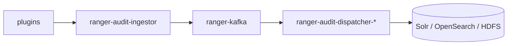

<!---
  Licensed to the Apache Software Foundation (ASF) under one or more
  contributor license agreements.  See the NOTICE file distributed with
  this work for additional information regarding copyright ownership.
  The ASF licenses this file to You under the Apache License, Version 2.0
  (the "License"); you may not use this file except in compliance with
  the License.  You may obtain a copy of the License at

      http://www.apache.org/licenses/LICENSE-2.0

  Unless required by applicable law or agreed to in writing, software
  distributed under the License is distributed on an "AS IS" BASIS,
  WITHOUT WARRANTIES OR CONDITIONS OF ANY KIND, either express or implied.
  See the License for the specific language governing permissions and
  limitations under the License.
-->

# Run Ranger with Docker

The quickest way to see Ranger working end to end is to run it in Docker. The repository ships a
Docker Compose setup in `dev-support/ranger-docker` that builds Ranger from source, starts Ranger
Admin with a database, ZooKeeper, a Kerberos KDC and the audit pipeline, and can add Trino, Ozone,
Kafka, Knox, KMS, Hadoop, Hive and HBase containers that are already configured for Ranger
authorization. Released versions are also published as images on Docker Hub.

This page covers three entry points, from least to most control:

1. `./ranger_in_docker up` — one command that builds and starts everything you ask for.
2. Docker Hub images — run a released version without building anything.
3. The compose files directly — choose the database, the audit store and the services yourself.

!!! warning

    The Docker setup is intended for development and evaluation. It uses fixed passwords, a
    self-contained KDC and 256 MB JVM heaps; it is not suitable for production deployments.

## Prerequisites

- A recent Docker with Compose v2 (`docker compose`). Give Docker at least 4 GB of memory for the
  full stack; every Ranger service defaults to a 256 MB heap (`RANGER_*_MAX_HEAP` in `.env`).
- `git` and `bash`.
- Network access to `archive.apache.org` and Maven Central: the setup downloads Hadoop, Hive, HBase,
  Kafka, Knox and Ozone archives and JDBC drivers into `dev-support/ranger-docker/downloads`.
- A local JDK and Maven are **not** required: Ranger is built inside a container from the base image
  `apache/ranger-base` (Java version suffix `-17` by default, see `RANGER_BASE_BUILD_VERSION` in `.env`).

All commands below are run from `dev-support/ranger-docker` unless noted otherwise.

## Option 1: `ranger_in_docker` { #ranger-in-docker }

`ranger_in_docker` at the repository root is a reference implementation of the steps in
[`dev-support/ranger-docker/README.md`](https://github.com/apache/ranger/blob/master/dev-support/ranger-docker/README.md).

```bash
git clone https://github.com/apache/ranger.git
cd ranger

# optional: extra services to start with the core stack
export ENABLED_RANGER_SERVICES="tagsync,hadoop,hbase,kafka,hive,knox,kms"

./ranger_in_docker up
```

What the script does:

- Downloads the component archives (`download-archives.sh`).
- Builds Ranger in the `ranger-build` container if fewer than 20 tarballs are present in
  `dev-support/ranger-docker/dist`. Set `RANGER_REBUILD=1` to force a rebuild. Set
  `DOCKER_MAVEN_BUILD=1` to build with your local Maven (`mvn clean package -DskipTests`) instead.
- Starts the core services `ranger` and `ranger-usersync` (with their dependencies) plus one
  `docker-compose.ranger-<service>.yml` file per entry in `ENABLED_RANGER_SERVICES`. Valid entries:
  `tagsync`, `hadoop`, `hbase`, `kafka`, `hive`, `knox`, `kms`. The list is remembered in
  `~/.ranger_docker_services` for later runs.
- Prints the exposed ports of every `ranger*` container.

The script does not include `docker-compose.ranger-audit-service.yml` or an audit profile, so the audit
pipeline described under [Choosing the audit store](#choosing-the-audit-store) is not started; use the
compose files directly (Option 3) when you need audits.

Ranger Admin is then available at <http://localhost:6080> (`admin` / `rangerR0cks!`). Stop everything
with:

```bash
./ranger_in_docker down
```

Other environment variables the script honours: `RANGER_DB_TYPE` (default `postgres`),
`ENABLE_DB_MOUNT=true` to keep the PostgreSQL data directory in `dev-support/ranger-docker/postgres-db-mount`
across restarts, and `RANGER_HOME` if the script is run from elsewhere.

## Option 2: Docker Hub images { #docker-hub-images }

Released versions are published as `apache/ranger`, `apache/ranger-db`, `apache/ranger-solr` and
`apache/ranger-zk` on [Docker Hub](https://hub.docker.com/r/apache/ranger). This variant runs Ranger
Admin with PostgreSQL and Solr for audits.

```bash
export RANGER_VERSION=2.7.0    # use a tag that exists on Docker Hub

docker pull apache/ranger-zk:${RANGER_VERSION}
docker pull apache/ranger-solr:${RANGER_VERSION}
docker pull apache/ranger-db:${RANGER_VERSION}
docker pull apache/ranger:${RANGER_VERSION}

docker network create rangernw

docker run -d --name ranger-zk --hostname ranger-zk.example.com --network rangernw \
  -p 2181:2181 apache/ranger-zk:${RANGER_VERSION}

docker run -d --name ranger-solr --hostname ranger-solr.example.com --network rangernw \
  -p 8983:8983 apache/ranger-solr:${RANGER_VERSION} \
  solr-precreate ranger_audits /opt/solr/server/solr/configsets/ranger_audits/

docker run -d --name ranger-db --hostname ranger-db.example.com --network rangernw \
  --health-cmd='su -c "pg_isready -q" postgres' --health-interval=10s --health-timeout=2s --health-retries=30 \
  apache/ranger-db:${RANGER_VERSION}

docker run -d --name ranger --hostname ranger.example.com --network rangernw \
  -e RANGER_VERSION=${RANGER_VERSION} -e RANGER_DB_TYPE=postgres \
  -p 6080:6080 apache/ranger:${RANGER_VERSION} /home/ranger/scripts/ranger.sh
```

Open <http://localhost:6080/login.jsp> and log in as `admin` / `rangerR0cks!`. The
[Trino with Ranger](trino-with-ranger.md) guide shows how to attach a Trino container to the same
`rangernw` network.

## Option 3: The compose files { #compose }

Use the compose files directly when you want to pick the database, the audit store, or the exact set of
services. The files are combined with repeated `-f` options; `docker-compose.ranger.yml` is always
included.

| File | Starts |
|---|---|
| `docker-compose.ranger-build.yml` | `ranger-build`: builds Ranger from source into `dist/` |
| `docker-compose.ranger.yml` | `ranger` (Admin), `ranger-kdc`, `ranger-zk`, `ranger-db` |
| `docker-compose.ranger-db.yml` | Database definitions (`postgres`, `mysql`, `oracle`, `sqlserver`) selected by `RANGER_DB_TYPE` |
| `docker-compose.ranger-db-mounted.yml` | Same as above with the PostgreSQL data directory mounted from `./postgres-db-mount` |
| `docker-compose.ranger-audit-service.yml` | Audit pipeline: `ranger-kafka`, `ranger-audit-ingestor`, and the store with its dispatcher for each selected profile (`audit-store-opensearch`, `audit-store-solr`, `audit-store-hdfs`) |
| `docker-compose.ranger-audit-destination-hdfs.yml` | Adds `ranger-hadoop` under the profile `audit-store-hdfs`, which `ranger-audit-dispatcher-hdfs` depends on |
| `docker-compose.ranger-usersync.yml` | `ranger-usersync` |
| `docker-compose.ranger-tagsync.yml` | `ranger-tagsync` |
| `docker-compose.ranger-pdp.yml` | `ranger-pdp` |
| `docker-compose.ranger-kms.yml` | `ranger-kms` |
| `docker-compose.ranger-hadoop.yml` | `ranger-hadoop`: HDFS and YARN with the HDFS and YARN plugins |
| `docker-compose.ranger-hive.yml` | `ranger-hive`: Hive Metastore and HiveServer2 with the Hive plugin (depends on `ranger-hadoop`) |
| `docker-compose.ranger-hbase.yml` | `ranger-hbase` with the HBase plugin (depends on `ranger-hadoop`) |
| `docker-compose.ranger-kafka.yml` | `ranger-kafka` with the Kafka plugin |
| `docker-compose.ranger-knox.yml` | `ranger-knox` with the Knox plugin |
| `docker-compose.ranger-ozone.yml` | `ozone-om`, `ozone-scm`, `ozone-datanode` with the Ozone plugin |
| `docker-compose.ranger-trino.yml` | `ranger-trino` configured for Ranger access control |

### Step 1: download archives and set the environment

```bash
cd dev-support/ranger-docker
chmod +x download-archives.sh scripts/**/*.sh

# download only what you need: hadoop hive hbase kafka knox ozone
./download-archives.sh hadoop hive

export RANGER_DB_TYPE=postgres          # postgres | mysql | oracle | sqlserver
export AUDIT_INDEX_STORE=opensearch     # opensearch (default) | solr
export AUDIT_DESTINATIONS=audit-store-${AUDIT_INDEX_STORE}
```

`.env` holds the versions used for every image (`RANGER_VERSION=3.0.0-SNAPSHOT`, `HADOOP_VERSION`,
`HIVE_VERSION`, `HBASE_VERSION`, `KAFKA_VERSION`, `KNOX_VERSION`, `OZONE_VERSION`, `TRINO_VERSION`,
`OPENSEARCH_VERSION`, `SOLR_VERSION`, …), the JVM heaps, `KERBEROS_ENABLED=true` and the
`JAVA_OPTS` needed on JDK 17.

### Step 2: build Ranger

=== "In a container"

    ```bash
    # optional: rebuild the build image so the right JDK is used
    docker compose -f docker-compose.ranger-build.yml build
    docker compose -f docker-compose.ranger-build.yml up
    ```

    The build container clones or mounts the source (`BUILD_HOST_SRC=true` in `.env` uses your
    checkout; `false` clones `GIT_URL` at `BRANCH`), runs Maven and copies the tarballs to `dist/`.
    The first build can take up to an hour depending on the state of `~/.m2`.

=== "With local Maven"

    ```bash
    cd ../..
    mvn clean package -DskipTests
    cp target/ranger-* dev-support/ranger-docker/dist/
    cp target/version  dev-support/ranger-docker/dist/
    cd dev-support/ranger-docker
    ```

### Step 3: start the core services

```bash
docker compose --profile ${AUDIT_DESTINATIONS} \
  -f docker-compose.ranger.yml \
  -f docker-compose.ranger-audit-service.yml \
  -f docker-compose.ranger-usersync.yml \
  -f docker-compose.ranger-tagsync.yml \
  -f docker-compose.ranger-pdp.yml \
  -f docker-compose.ranger-kms.yml up -d
```

The `ranger` container runs `scripts/admin/ranger.sh`: on first start it prepares the database schema,
starts Ranger Admin and then runs `scripts/admin/create-ranger-services.py`, which uses the Python
client to create the services `dev_hdfs`, `dev_hive`, `dev_hbase`, `dev_yarn`, `dev_kafka`,
`dev_knox`, `dev_kms`, `dev_solr`, `dev_ozone` and `dev_trino`. The plugin in each protected-service
container is configured with the matching service name (`ranger.plugin.hive.service.name=dev_hive`,
for example).

Ranger Admin is available at <http://localhost:6080> (`admin` / `rangerR0cks!`) once
`docker logs ranger` shows that the admin process has started.

### Step 4: add services protected by Ranger plugins

Add compose files for the services you want; Hive and HBase also need `ranger-hadoop`.

=== "Hive"

    ```bash
    docker compose --profile ${AUDIT_DESTINATIONS} \
      -f docker-compose.ranger.yml -f docker-compose.ranger-audit-service.yml \
      -f docker-compose.ranger-hadoop.yml -f docker-compose.ranger-hive.yml up -d
    ```

=== "HBase"

    ```bash
    docker compose --profile ${AUDIT_DESTINATIONS} \
      -f docker-compose.ranger.yml -f docker-compose.ranger-audit-service.yml \
      -f docker-compose.ranger-hadoop.yml -f docker-compose.ranger-hbase.yml up -d
    ```

=== "Kafka, Knox"

    ```bash
    docker compose --profile ${AUDIT_DESTINATIONS} \
      -f docker-compose.ranger.yml -f docker-compose.ranger-audit-service.yml \
      -f docker-compose.ranger-kafka.yml -f docker-compose.ranger-knox.yml up -d
    ```

=== "Ozone"

    ```bash
    ./scripts/ozone/ozone-plugin-docker-setup.sh   # unpacks the Ozone plugin into dist/
    docker compose --profile ${AUDIT_DESTINATIONS} \
      -f docker-compose.ranger.yml -f docker-compose.ranger-audit-service.yml \
      -f docker-compose.ranger-ozone.yml up -d
    ```

=== "Trino"

    ```bash
    docker compose --profile ${AUDIT_DESTINATIONS} \
      -f docker-compose.ranger.yml -f docker-compose.ranger-audit-service.yml \
      -f docker-compose.ranger-trino.yml up -d
    ```

=== "Everything"

    ```bash
    ./scripts/ozone/ozone-plugin-docker-setup.sh
    docker compose --profile ${AUDIT_DESTINATIONS} \
      -f docker-compose.ranger.yml -f docker-compose.ranger-audit-service.yml \
      -f docker-compose.ranger-usersync.yml -f docker-compose.ranger-tagsync.yml \
      -f docker-compose.ranger-pdp.yml -f docker-compose.ranger-kms.yml \
      -f docker-compose.ranger-hadoop.yml -f docker-compose.ranger-hbase.yml \
      -f docker-compose.ranger-hive.yml -f docker-compose.ranger-knox.yml \
      -f docker-compose.ranger-ozone.yml up -d
    ```

Each container configures its service and the Ranger plugin on first start; the configuration each
plugin needs is described on its [plugin page](../plugins/index.md). You can confirm that a plugin is talking to Ranger Admin under **Audit → Plugin Status** in the UI.

### Choosing the database

`RANGER_DB_TYPE` selects the database service from `docker-compose.ranger-db.yml` and the matching
Ranger Admin database settings:

| Value | Container | Image built from | Port |
|---|---|---|---|
| `postgres` (default) | `ranger-postgres` | `Dockerfile.ranger-postgres`, `POSTGRES_VERSION` | 5432 |
| `mysql` | `ranger-mysql` | `Dockerfile.ranger-mysql` (MariaDB, `MARIADB_VERSION`) | 3306 |
| `oracle` | `ranger-oracle` | `Dockerfile.ranger-oracle`, `ORACLE_VERSION` | 1521 |
| `sqlserver` | `ranger-sqlserver` | `Dockerfile.ranger-sqlserver`, `SQLSERVER_VERSION` | 1433 |

Whichever database is selected, the compose service is `ranger-db` and its hostname on the network is
`ranger-db.rangernw`.
To keep PostgreSQL data across `down`/`up`, add `-f docker-compose.ranger-db-mounted.yml`.

### Choosing the audit store

Plugins in Docker send audits to the Ranger audit server rather than directly to a store
(`xasecure.audit.destination.auditserver=true` and
`xasecure.audit.destination.auditserver.url=http://ranger-audit-ingestor.rangernw:7081` in each
plugin's `ranger-<service>-audit.xml`). The pipeline is:



- `AUDIT_INDEX_STORE` (`opensearch` or `solr`) sets the store that Ranger Admin reads audits from
  (`ranger.audit.source.type`), so the Admin UI shows what the dispatchers wrote.
- `AUDIT_DESTINATIONS` selects the compose profile (`audit-store-opensearch` or `audit-store-solr`);
  only that store and its dispatcher start. Pass it as `--profile ${AUDIT_DESTINATIONS}`.
- Add `--profile audit-store-hdfs` together with `-f docker-compose.ranger-audit-destination-hdfs.yml`
  to also write audits to HDFS. This starts `ranger-audit-dispatcher-hdfs` and the `ranger-hadoop`
  container it writes to.

See [Audit server](../services/audit-server/service.md) and [Audit stores](../services/audit/audit-stores.md).

### Kerberos

`KERBEROS_ENABLED=true` in `.env` starts `ranger-kdc` (realm `EXAMPLE.COM`) and provisions keytabs
into `dist/keytabs/<container>/`, mounted at `/etc/keytabs` in each container. Ranger Admin uses SPNEGO
(`ranger.spnego.kerberos.principal=HTTP/ranger.rangernw@EXAMPLE.COM`), HiveServer2 uses Kerberos authentication, and
so on. The KDC also creates test principals `testuser1`, `testuser2` and `testuser3` for every
container, which you can use to run commands as ordinary users; see [Your first policy](first-policy.md).

### Users for testing

`ranger-usersync` syncs UNIX users and groups from its own container, starting at id 500
(`ranger.usersync.unix.minUserId`, `ranger.usersync.unix.minGroupId`). Set
`ENABLE_FILE_SYNC_SOURCE=true` before starting to have it read
`scripts/usersync/ugsync-file-source.csv` instead, which defines `testuser_1` … `testuser_10` and their
groups. You can also create users by hand under **Settings → Users/Groups/Roles**.

### Rebuilding an image

To rebuild specific images after a code change and recreate only those containers:

```bash
docker compose --profile ${AUDIT_DESTINATIONS} -f docker-compose.ranger.yml \
  -f docker-compose.ranger-audit-service.yml -f docker-compose.ranger-hive.yml \
  up -d --no-deps --force-recreate --build ranger ranger-hive
```

## Services and ports

Host ports published by the compose files (container name → port):

| Container | Host port(s) | Purpose |
|---|---|---|
| `ranger` | 6080 | Ranger Admin UI and REST API |
| `ranger-kdc` | 88 (tcp/udp), 749 | Kerberos KDC and kadmin |
| `ranger-zk` | 2181 | ZooKeeper |
| Database container | 5432, 3306, 1521 or 1433 | Policy database; see [Choosing the database](#choosing-the-database) |
| `ranger-opensearch` | 9200, 9300 | Profile `audit-store-opensearch` |
| `ranger-solr` | 8983 | Profile `audit-store-solr` |
| `ranger-kafka` | 9092 | Audit transport; also the Kafka plugin container |
| `ranger-audit-ingestor` | 7081, 7182 | Receives audits from plugins |
| `ranger-audit-dispatcher-solr` | 7091 | Dispatcher to Solr (container port 7090) |
| `ranger-audit-dispatcher-hdfs` | 7092 | Dispatcher to HDFS (container port 7090) |
| `ranger-audit-dispatcher-opensearch` | 7093 | Dispatcher to OpenSearch (container port 7090) |
| `ranger-usersync` | 8280 | UserSync embedded web server |
| `ranger-tagsync` | 8180, 8185 | TagSync embedded web server and its shutdown port |
| `ranger-pdp` | 6500 | Policy decision point REST API |
| `ranger-kms` | 9292 | Ranger KMS REST API |
| `ranger-hadoop` | 9000, 8088 | NameNode RPC, ResourceManager UI |
| `ranger-hive` | 10000, 9083 | HiveServer2, Metastore |
| `ranger-hbase` | 16000, 16010, 16020, 16030 | Master, Master UI, RegionServer, RegionServer UI |
| `ranger-knox` | 8443 | Gateway |
| `ranger-trino` | 8080 | Coordinator |
| `ozone-om` | 9874, 9862 | Ozone Manager UI and RPC (SCM and datanode ports are in `docker-compose.ranger-ozone.yml`) |

All containers share the `rangernw` network. Most are reachable from each other by
`<container>.rangernw`, for example `http://ranger.rangernw:6080`; the exceptions are the database
(`ranger-db.rangernw`), Ozone (`om.rangernw`, `scm.rangernw`, `datanode.rangernw`) and Trino (`trino`).

## Upgrading Ranger in Docker

You can rehearse an upgrade by installing one release and then building a newer one on top of the
same database. The base image comes from Docker Hub, so only the build and the Ranger image need to be
rebuilt.

1. In `.env`, set `BUILD_HOST_SRC=false` and `BRANCH=ranger-2.8` (the release branch to install first).
2. Build Ranger from that branch:
   ```bash
   export RANGER_DB_TYPE=postgres
   docker compose -f docker-compose.ranger-build.yml build
   docker compose -f docker-compose.ranger-build.yml up
   ```
3. In `.env`, set `RANGER_VERSION` to the version produced by that branch (check `dist/version`).
4. Build and start Ranger with a persistent database:
   ```bash
   docker compose -f docker-compose.ranger.yml -f docker-compose.ranger-db-mounted.yml build
   docker compose -f docker-compose.ranger.yml -f docker-compose.ranger-db-mounted.yml up -d
   ```
   Watch `docker logs ranger`; installation is complete once the admin process starts.
5. To upgrade, set `BRANCH` to the newer branch (for example `ranger-2.9` or `master`), repeat step 2,
   update `RANGER_VERSION`, and repeat step 4. On start, the `ranger` container detects the existing schema and
   applies the database and Java patches; the upgrade is complete when Ranger Admin starts again.

Use `docker-compose.ranger-db-mounted.yml` (or `ENABLE_DB_MOUNT=true` with `ranger_in_docker`) so the
database survives the container rebuild.

## Stopping and cleaning up

```bash
# stop and remove the containers started with the same -f list
docker compose --profile ${AUDIT_DESTINATIONS} -f docker-compose.ranger.yml \
  -f docker-compose.ranger-audit-service.yml -f docker-compose.ranger-hive.yml down

# or, if you used the wrapper
./ranger_in_docker down
```

Images stay on disk; `dist/` keeps the built tarballs and `downloads/` keeps the archives, so the next
start is fast. Delete `dist/*.tar.gz` (or set `RANGER_REBUILD=1`) to force a rebuild.

## Troubleshooting

- **Ranger Admin does not come up.** `docker logs ranger` shows the database setup and the
  admin start; the database container must be healthy first (`docker ps` shows `(healthy)`).
- **A plugin container starts but no policies are enforced.** Check **Audit → Plugin Status** in the
  UI, and `docker exec -it ranger-hive bash` to inspect `/etc/ranger/dev_hive/policycache` and the
  component logs.
- **Kerberos errors** (`Cannot find KDC`, missing keytab). Wait for `ranger-kdc` to become healthy;
  keytabs appear under `dist/keytabs/` once provisioning finishes.
- **Build fails with a Java version error.** The build image uses the JDK suffix in
  `RANGER_BASE_BUILD_VERSION`; Ranger master requires JDK 17.

## Further reading

- [`dev-support/ranger-docker/README.md`](https://github.com/apache/ranger/blob/master/dev-support/ranger-docker/README.md)
- [Trino with Ranger](trino-with-ranger.md)
- [Your first policy](first-policy.md)
- Wiki: [Running Apache Ranger from source in minutes](https://cwiki.apache.org/confluence/pages/viewpage.action?pageId=235837576),
  [Run Ranger in Docker using DockerHub images](https://cwiki.apache.org/confluence/pages/viewpage.action?pageId=406622390),
  [How to upgrade Ranger in Docker](https://cwiki.apache.org/confluence/pages/viewpage.action?pageId=340036242)
