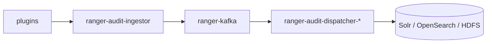

<!---
  Licensed to the Apache Software Foundation (ASF) under one or more
  contributor license agreements.  See the NOTICE file distributed with
  this work for additional information regarding copyright ownership.
  The ASF licenses this file to You under the Apache License, Version 2.0
  (the "License"); you may not use this file except in compliance with
  the License.  You may obtain a copy of the License at

      http://www.apache.org/licenses/LICENSE-2.0

  Unless required by applicable law or agreed to in writing, software
  distributed under the License is distributed on an "AS IS" BASIS,
  WITHOUT WARRANTIES OR CONDITIONS OF ANY KIND, either express or implied.
  See the License for the specific language governing permissions and
  limitations under the License.
-->

# Run Ranger with Docker

The quickest way to see Ranger working end to end is to run it in Docker. There are two setups, and
this page covers both:

Docker Hub images
:   Run a **released** version of Ranger Admin with its database and audit store from the images on
    [Docker Hub](https://hub.docker.com/r/apache/ranger). Nothing is built; you need Docker only.

Build from source (`dev-support/ranger-docker`)
:   Build the current source and run it with the Docker Compose setup in
    [`dev-support/ranger-docker`](https://github.com/apache/ranger/tree/master/dev-support/ranger-docker).
    Besides Ranger Admin this setup has compose files for the audit server, UserSync, TagSync, KMS, PDP
    and for Hadoop (HDFS and YARN), Hive, HBase, Kafka, Knox, Ozone and Trino containers that are
    already configured for Ranger authorization.

Operations that both setups support (starting Ranger Admin, checking it, reading logs, stopping) are
shown side by side in tabs; everything after [More services](#compose) exists in the development
setup only.

!!! warning

    Both setups are intended for development and evaluation. They use well-known default passwords;
    the development setup also uses trusted header authentication for the health check, a
    self-contained KDC and 256 MB JVM heaps. Neither is suitable for production deployments.

## What a minimal setup contains

A working Ranger needs Ranger Admin, a relational database for policies, and an audit store that Ranger
Admin can query. The two setups differ in how audits get to that store.

=== "Docker Hub images"

    Three containers: `apache/ranger` (Ranger Admin), `apache/ranger-db` (PostgreSQL prepared for
    Ranger) and `apache/ranger-solr` (Solr with the `ranger_audits` configuration). The official quick
    start runs Solr standalone and creates the `ranger_audits` core with `solr-precreate`, so ZooKeeper
    is not needed. `apache/ranger-zk` is the ZooKeeper image to use when Solr runs in SolrCloud mode;
    its latest tag is `2.8.0`.

    `apache/ranger`, `apache/ranger-db` and `apache/ranger-solr` are tagged `2.4.0` to `2.9.0`. No
    other Ranger service or plugin image is published, so UserSync, TagSync, KMS, PDP, the audit server
    and protected services such as Hive are only available from the development setup.

=== "Build from source (dev-support/ranger-docker)"

    On master the minimal setup is Ranger Admin (`ranger`), its database (`ranger-db`), Kafka
    (`ranger-kafka`), OpenSearch (`ranger-opensearch`, the default audit index), the audit ingestor
    (`ranger-audit-ingestor`) and an audit dispatcher (`ranger-audit-dispatcher-opensearch`). Plugins
    send audits to the ingestor, which writes them to Kafka; the dispatcher reads them from Kafka and
    indexes them in OpenSearch, where Ranger Admin reads them. Compose also starts `ranger-kdc`
    (Kerberos is enabled by default) and `ranger-zk`, which Kafka depends on. Solr can be selected
    instead of OpenSearch; see [Choosing the audit store](#choosing-the-audit-store).

    The audit server (ingestor and dispatchers) is the default on master but is not yet part of a
    release, so it cannot be pulled from Docker Hub; its images are built from your source build.

## Prerequisites

=== "Docker Hub images"

    - A recent Docker.
    - Network access to Docker Hub.

=== "Build from source (dev-support/ranger-docker)"

    - A recent Docker with Compose v2 (`docker compose`); the README was written against Engine
      v24.0.5 and Compose v2.20.2. Give Docker at least 4 GB of memory for the full stack; every
      Ranger service defaults to a 256 MB heap (`RANGER_*_MAX_HEAP` in `.env`).
    - `git` and `bash`.
    - Network access to `archive.apache.org` and Maven Central: `download-archives.sh` fetches the
      Hadoop, Hive, HBase, Kafka, Knox and Ozone archives and the JDBC drivers into
      `dev-support/ranger-docker/downloads`.
    - A local JDK and Maven are **not** required: Ranger can be built inside a container from the base
      image `apache/ranger-base` (Java version suffix `-17`, see `RANGER_BASE_BUILD_VERSION` in `.env`).

## Prepare the development setup { #build-from-source }

Skip this section when you use the Docker Hub images. All commands for the development setup are run
from `dev-support/ranger-docker`.

### Download archives and set the environment

```bash
git clone https://github.com/apache/ranger.git
cd ranger/dev-support/ranger-docker

chmod +x download-archives.sh
# use a subset of the below to download specific services
./download-archives.sh hadoop hive hbase kafka knox ozone

# valid values for RANGER_DB_TYPE: mysql/postgres/oracle
export RANGER_DB_TYPE=postgres
```

`download-archives.sh` always downloads the JDBC drivers that the Ranger Admin image needs. The `kafka`
archive is needed by every setup that includes the audit server, because `ranger-kafka` is part of
`docker-compose.ranger-audit-service.yml`.

Update the variables in `.env` if necessary. It holds the versions used for every image
(`RANGER_VERSION=3.0.0-SNAPSHOT`, `HADOOP_VERSION`, `HIVE_VERSION`, `HBASE_VERSION`, `KAFKA_VERSION`,
`KNOX_VERSION`, `OZONE_VERSION`, `TRINO_VERSION`, `OPENSEARCH_VERSION`, `SOLR_VERSION`, …), the JVM
heaps, `KERBEROS_ENABLED=true`, the `JAVA_OPTS` needed on JDK 17, the audit defaults
(`AUDIT_INDEX_STORE=opensearch`, `AUDIT_DESTINATIONS=audit-store-opensearch`) and the passwords of the
Ranger Admin database user and built-in users (`RANGER_ADMIN_DB_PASSWORD`, `RANGER_ADMIN_PASSWORD`,
`RANGER_USERSYNC_PASSWORD`, `RANGER_TAGSYNC_PASSWORD`, `RANGER_KEYADMIN_PASSWORD`).

### Build Ranger

The service images are built from the archives in `dist/`. Produce them in one of two ways:

=== "In containers using docker compose"

    ```bash
    chmod +x scripts/**/*.sh

    # optional step: a fresh build ensures that the correct jdk version is used
    docker compose -f docker-compose.ranger-build.yml build

    docker compose -f docker-compose.ranger-build.yml up
    ```

    The build container mounts your checkout (`BUILD_HOST_SRC=true` in `.env`; `false` clones
    `GIT_URL` at `BRANCH`), runs Maven and moves the archives to `dist/`. The build can take up to an
    hour depending on the state of `${HOME}/.m2`.

=== "Regular build"

    ```bash
    cd ./../../
    mvn clean package -DskipTests
    cp target/ranger-* dev-support/ranger-docker/dist/
    cp target/version dev-support/ranger-docker/dist/
    cd dev-support/ranger-docker
    ```

    This needs JDK 17 and Maven on your machine; see [Building from source](../dev/build.md).

## Start Ranger Admin with its database and audit store { #start }

=== "Docker Hub images"

    ```bash
    export RANGER_VERSION=2.9.0

    docker pull apache/ranger-solr:${RANGER_VERSION}
    docker pull apache/ranger-db:${RANGER_VERSION}
    docker pull apache/ranger:${RANGER_VERSION}

    docker network create rangernw
    ```

    Launch Solr:

    ```bash
    docker run -d --name ranger-solr --hostname ranger-solr.rangernw --network rangernw -p 8983:8983 apache/ranger-solr:${RANGER_VERSION} \
      solr-precreate ranger_audits /opt/solr/server/solr/configsets/ranger_audits/
    ```

    Launch the Ranger database:

    ```bash
    docker run -d \
      -e POSTGRES_PASSWORD=rangerR0cks! \
      -e RANGER_DB_USER=rangeradmin \
      -e RANGER_DB_PASSWORD=rangerR0cks! \
      --name ranger-db --hostname ranger-db.rangernw --network rangernw --health-cmd='su -c "pg_isready -q" postgres' --health-interval=10s --health-timeout=2s --health-retries=30 apache/ranger-db:${RANGER_VERSION}
    ```

    Launch Ranger Admin:

    ```bash
    docker run -d \
      -e POSTGRES_PASSWORD=rangerR0cks! \
      -e RANGER_DB_USER=rangeradmin \
      -e RANGER_DB_PASSWORD=rangerR0cks! \
      --name ranger-admin --hostname ranger-admin.rangernw --network rangernw -p 6080:6080 apache/ranger:${RANGER_VERSION}
    ```

    These are the commands of the quick start published with the images on
    [Docker Hub](https://hub.docker.com/r/apache/ranger).

=== "Build from source (dev-support/ranger-docker)"

    ```bash
    # valid values for RANGER_DB_TYPE: mysql/postgres/oracle
    export RANGER_DB_TYPE=postgres

    # valid values for AUDIT_INDEX_STORE: opensearch (default) | solr
    export AUDIT_INDEX_STORE=opensearch
    export AUDIT_DESTINATIONS=audit-store-${AUDIT_INDEX_STORE}

    docker compose --profile ${AUDIT_DESTINATIONS} \
      -f docker-compose.ranger.yml \
      -f docker-compose.ranger-audit-service.yml up -d
    ```

    The first `up` builds the images from `dist/` and `downloads/`. This starts `ranger`, `ranger-db`,
    `ranger-kdc`, `ranger-zk`, `ranger-kafka`, `ranger-audit-ingestor`, and the audit store with its
    dispatcher for the selected profile. To start UserSync, TagSync, PDP and KMS as well, use the
    [core services](#compose) command instead.

Open <http://localhost:6080/login.jsp> and log in as `admin` / `rangerR0cks!`.

## Check that Ranger Admin is up and view logs

=== "Docker Hub images"

    ```bash
    docker ps --filter network=rangernw     # ranger-db reports (healthy) once PostgreSQL accepts connections
    docker logs -f ranger-admin
    ```

    Ranger Admin answers on <http://localhost:6080/login.jsp> when its startup has finished. Solr is
    at <http://localhost:8983>.

=== "Build from source (dev-support/ranger-docker)"

    ```bash
    docker ps --filter network=rangernw     # ranger-postgres, ranger-kafka, ranger-audit-* report (healthy)
    docker logs -f ranger
    curl -H 'X-Forwarded-User: healthcheck' http://localhost:6080/service/actuator/health/readiness
    ```

    `docker logs ranger` consists of the logs of `dba.py` (with the progress of database and Java
    patches), `create-ranger-services.py`, `catalina.out` and the Ranger Admin log, which is also
    written to `/var/log/ranger` in the container. A log line marks the moment Ranger Admin is up and
    ready. Logs are colored when the container has a TTY; set `NO_COLOR` to disable colors. The audit
    ingestor answers on <http://localhost:7081/api/audit/health> and the OpenSearch dispatcher on
    <http://localhost:7093/api/health/ping>.

## Stop and clean up

=== "Docker Hub images"

    ```bash
    docker stop ranger-admin ranger-db ranger-solr

    # remove the containers and the network; policies and audits are lost with them
    docker rm ranger-admin ranger-db ranger-solr
    docker network rm rangernw
    ```

    `docker start ranger-solr ranger-db ranger-admin` brings stopped containers back with their data.

=== "Build from source (dev-support/ranger-docker)"

    ```bash
    # stop and remove the containers; pass the same --profile and -f list that was used for "up"
    docker compose --profile ${AUDIT_DESTINATIONS} \
      -f docker-compose.ranger.yml \
      -f docker-compose.ranger-audit-service.yml down
    ```

    Images stay on disk; `dist/` keeps the built archives and `downloads/` keeps the component
    archives, so the next start is fast. Use `stop` and `start` instead of `down` and `up -d` to keep
    the containers and their data, or see [Choosing the database](#choosing-the-database) for a
    PostgreSQL data directory that survives `down`.

## More services in the development setup { #compose }

The rest of this page applies to `dev-support/ranger-docker` only. The compose files are combined with
repeated `-f` options; `docker-compose.ranger.yml` is always included, and
`--profile ${AUDIT_DESTINATIONS}` selects the audit store.

Each service has its own compose file in
[`dev-support/ranger-docker`](https://github.com/apache/ranger/tree/master/dev-support/ranger-docker)
on GitHub; the commands below show which files to combine.

### Core services: ranger, usersync, tagsync, pdp, kms and audit

```bash
# To enable file based sync source for usersync do:
export ENABLE_FILE_SYNC_SOURCE=true

# valid values for RANGER_DB_TYPE: mysql/postgres/oracle
export RANGER_DB_TYPE=postgres

# valid values for AUDIT_INDEX_STORE: opensearch (default) | solr
# overrides ranger.audit.source.type of Ranger Admin (via ranger.sh); set matching profile for compose:
export AUDIT_INDEX_STORE=opensearch
export AUDIT_DESTINATIONS=audit-store-${AUDIT_INDEX_STORE}
docker compose --profile ${AUDIT_DESTINATIONS} -f docker-compose.ranger.yml -f docker-compose.ranger-audit-service.yml -f docker-compose.ranger-usersync.yml -f docker-compose.ranger-tagsync.yml -f docker-compose.ranger-pdp.yml -f docker-compose.ranger-kms.yml up -d

# Ranger Admin can be accessed at http://localhost:6080 (admin/rangerR0cks!)
```

### Services protected by Ranger plugins

Hive and HBase also need `docker-compose.ranger-hadoop.yml`.

=== "Hive"

    ```bash
    docker compose --profile ${AUDIT_DESTINATIONS} -f docker-compose.ranger.yml -f docker-compose.ranger-audit-service.yml -f docker-compose.ranger-hadoop.yml -f docker-compose.ranger-hive.yml up -d
    ```

=== "HBase"

    ```bash
    docker compose --profile ${AUDIT_DESTINATIONS} -f docker-compose.ranger.yml -f docker-compose.ranger-audit-service.yml -f docker-compose.ranger-hadoop.yml -f docker-compose.ranger-hbase.yml up -d
    ```

=== "Ozone"

    ```bash
    ./scripts/ozone/ozone-plugin-docker-setup.sh
    docker compose --profile ${AUDIT_DESTINATIONS} -f docker-compose.ranger.yml -f docker-compose.ranger-audit-service.yml -f docker-compose.ranger-ozone.yml up -d
    ```

=== "Trino"

    ```bash
    docker compose --profile ${AUDIT_DESTINATIONS} -f docker-compose.ranger.yml -f docker-compose.ranger-audit-service.yml -f docker-compose.ranger-trino.yml up -d
    ```

    The image is built from `trinodb/trino:${TRINO_VERSION}` with the files in `scripts/trino`. The
    `ranger-trino-audit.xml` in that directory sends audits directly to Solr at
    `ranger-solr.rangernw:8983`, so start with `AUDIT_INDEX_STORE=solr` to see Trino audits in Ranger
    Admin. See [Trino with Ranger](trino-with-ranger.md).

=== "All containers"

    ```bash
    ./scripts/ozone/ozone-plugin-docker-setup.sh
    docker compose --profile ${AUDIT_DESTINATIONS} -f docker-compose.ranger.yml -f docker-compose.ranger-audit-service.yml -f docker-compose.ranger-usersync.yml -f docker-compose.ranger-tagsync.yml -f docker-compose.ranger-pdp.yml -f docker-compose.ranger-kms.yml -f docker-compose.ranger-hadoop.yml -f docker-compose.ranger-hbase.yml -f docker-compose.ranger-hive.yml -f docker-compose.ranger-knox.yml -f docker-compose.ranger-ozone.yml up -d
    ```

Each container configures its service and the Ranger plugin on first start; the configuration each
plugin needs is described on its [plugin page](../plugins/index.md). You can confirm that a plugin is
talking to Ranger Admin under **Audit → Plugin Status** in the UI.

### Rebuilding specific images

To rebuild specific images and start containers with the new image:

```bash
docker compose --profile ${AUDIT_DESTINATIONS} -f docker-compose.ranger.yml -f docker-compose.ranger-audit-service.yml -f docker-compose.ranger-usersync.yml -f docker-compose.ranger-tagsync.yml -f docker-compose.ranger-kms.yml -f docker-compose.ranger-hadoop.yml -f docker-compose.ranger-hbase.yml -f docker-compose.ranger-hive.yml -f docker-compose.ranger-trino.yml -f docker-compose.ranger-knox.yml up -d --no-deps --force-recreate --build <service-1> <service-2>
```

`<service-n>` is a compose service name such as `ranger` or `ranger-hive`.

### Also send audits to HDFS

Audits fan out to `AUDIT_INDEX_STORE` **and** HDFS when the `audit-store-hdfs` profile is enabled:

```bash
export AUDIT_DESTINATIONS=audit-store-${AUDIT_INDEX_STORE}
docker compose --profile ${AUDIT_DESTINATIONS} --profile audit-store-hdfs \
  -f docker-compose.ranger.yml \
  -f docker-compose.ranger-audit-service.yml \
  -f docker-compose.ranger-audit-destination-hdfs.yml up -d
```

This starts `ranger-audit-dispatcher-hdfs` and the `ranger-hadoop` container it writes to.

### What happens when the `ranger` container starts

The `ranger` container runs `scripts/admin/ranger.sh` on every start:

1. It rebuilds the Ranger Admin `conf` directory from the defaults shipped in the distribution plus the
   files mounted at `/opt/ranger/admin/configs` (see [Configuring Ranger Admin](#configuring-ranger-admin)).
2. `scripts/admin/dba.py` writes `ranger-admin-site.xml`, stores the database password in the credential
   store, waits for the database, imports the core schema if the database is empty, applies pending SQL
   and Java patches, and sets the passwords of the built-in users from the `RANGER_*_PASSWORD` variables.
3. Ranger Admin is started with `ranger-admin-services.sh start`.
4. `scripts/admin/create-ranger-services.py` waits until the readiness endpoint
   `/service/actuator/health/readiness` reports `UP`, then uses the Python client to create the
   services `dev_hdfs`, `dev_hive`, `dev_hbase`, `dev_yarn`, `dev_kafka`, `dev_knox`, `dev_kms`,
   `dev_solr`, `dev_ozone` and `dev_trino`. The plugin in each protected-service container is
   configured with the matching service name (`ranger.plugin.hive.service.name=dev_hive`, for example).

`docker logs ranger` shows each of these steps, including the progress of database patches, followed by
the Ranger Admin log. Ranger Admin is available at <http://localhost:6080> (`admin` / `rangerR0cks!`)
once the log reports that Ranger Admin is up and ready.

### Configuring Ranger Admin

The Ranger Admin image contains the JDBC drivers of all supported databases and no environment-specific
configuration; it is configured at runtime from `scripts/admin/configs`, mounted read-only at
`/opt/ranger/admin/configs`:

- `ranger-admin-site-<RANGER_DB_TYPE>.yaml` (`postgres`, `mysql`, `oracle`) is the complete Ranger Admin
  site configuration as a flat map of property name to value. `dba.py` renders
  `conf/ranger-admin-site.xml` from it on every start. To change or add a `ranger-admin-site.xml`
  property, edit this file and recreate the container:

    ```yaml title="scripts/admin/configs/ranger-admin-site-postgres.yaml"
    ranger.authentication.method: PAM
    ranger.audit.source.type: opensearch
    ```

- A `ranger-admin-site.xml` placed in this directory is used as it is; no YAML file is rendered and
  `AUDIT_INDEX_STORE` is ignored.
- Any other file in the directory, for example `logback.xml`, is copied to `conf/` and replaces the
  default from the distribution.
- Passwords are not kept in these files. The database password comes from `RANGER_ADMIN_DB_PASSWORD`, and
  the built-in users `admin`, `rangerusersync`, `rangertagsync` and `keyadmin` get their passwords from
  `RANGER_ADMIN_PASSWORD`, `RANGER_USERSYNC_PASSWORD`, `RANGER_TAGSYNC_PASSWORD` and
  `RANGER_KEYADMIN_PASSWORD`. All default to `rangerR0cks!` in `.env`. The built-in user passwords are
  applied once, while the users still have their initial passwords; later changes to these variables do
  not alter existing users.
- `AUDIT_INDEX_STORE`, when set, overrides `ranger.audit.source.type` from the YAML file.
- `DEBUG_ADMIN=true` switches the Ranger Admin root logger to debug level, and
  `RANGER_DB_WAIT_TIMEOUT` (default 300 seconds) bounds the wait for the database.

!!! warning

    The shipped YAML files enable trusted header authentication
    (`ranger.admin.authn.header.enabled=true`, header `X-Forwarded-User`) so that the readiness endpoint
    can be queried as the `healthcheck` user. Any client that can reach Ranger Admin can set this header;
    outside of this development setup enable it only behind a trusted proxy. See
    [Authentication](../services/admin/authentication.md).

### Choosing the database

`RANGER_DB_TYPE` selects the database service from `docker-compose.ranger-db.yml` and the matching
Ranger Admin configuration file `scripts/admin/configs/ranger-admin-site-<RANGER_DB_TYPE>.yaml`, which holds
the JDBC URL, driver and connector jar. It is read when the container starts, so one `ranger` image works
with every database:

| Value | Container | Image built from |
|---|---|---|
| `postgres` (default) | `ranger-postgres` | `Dockerfile.ranger-postgres`, `POSTGRES_VERSION` |
| `mysql` | `ranger-mysql` | `Dockerfile.ranger-mysql` (MariaDB, `MARIADB_VERSION`) |
| `oracle` | `ranger-oracle` | `Dockerfile.ranger-oracle`, `ORACLE_VERSION` |

Whichever database is selected, the compose service is `ranger-db` and its hostname on the network is
`ranger-db.rangernw`.
To keep PostgreSQL data across `down`/`up`, add `-f docker-compose.ranger-db-mounted.yml`.

### Choosing the audit store

Plugins in the development setup send audits to the Ranger audit server (on master; not yet part of a
release) rather than directly to a store
(`xasecure.audit.destination.auditserver=true` and
`xasecure.audit.destination.auditserver.url=http://ranger-audit-ingestor.rangernw:7081` in each
plugin's `ranger-<service>-audit.xml`). The pipeline is:



- `AUDIT_INDEX_STORE` (`opensearch` or `solr`) sets the store that Ranger Admin reads audits from
  (`ranger.audit.source.type`), so the Admin UI shows what the dispatchers wrote.
- `AUDIT_DESTINATIONS` selects the compose profile (`audit-store-opensearch` or `audit-store-solr`);
  only that store and its dispatcher start. Pass it as `--profile ${AUDIT_DESTINATIONS}`.
- Add `--profile audit-store-hdfs` together with `-f docker-compose.ranger-audit-destination-hdfs.yml`
  to also write audits to HDFS. This starts `ranger-audit-dispatcher-hdfs` and the `ranger-hadoop`
  container it writes to.

See [Audit server](../services/audit-server/service.md) and [Audit stores](../services/audit/audit-stores.md).

### Kerberos

`KERBEROS_ENABLED=true` in `.env` starts `ranger-kdc` (realm `EXAMPLE.COM`) and provisions keytabs
into `dist/keytabs/<container>/`, mounted at `/etc/keytabs` in each container. Ranger Admin uses SPNEGO
(`ranger.spnego.kerberos.principal=HTTP/ranger.rangernw@EXAMPLE.COM`), HiveServer2 uses Kerberos authentication, and
so on. The KDC also creates test principals `testuser1`, `testuser2` and `testuser3` for every
container, which you can use to run commands as ordinary users; see [Your first policy](first-policy.md).

### Users for testing

`ranger-usersync` syncs UNIX users and groups from its own container, starting at id 500
(`ranger.usersync.unix.minUserId`, `ranger.usersync.unix.minGroupId`). Set
`ENABLE_FILE_SYNC_SOURCE=true` before starting to have it read
`scripts/usersync/ugsync-file-source.csv` instead, which defines `testuser_1` … `testuser_10` and their
groups. You can also create users by hand under **Settings → Users/Groups/Roles**.

## Container network

All containers share the `rangernw` network. Most are reachable from each other by
`<container>.rangernw`, for example `http://ranger.rangernw:6080`; the exceptions are the database
(`ranger-db.rangernw`), Ozone (`om.rangernw`, `scm.rangernw`, `datanode.rangernw`) and Trino (`trino`).

## Upgrading Ranger in Docker

An upgrade can be rehearsed in the development setup by installing one release and then building a
newer one on top of the same database. The base image comes from Docker Hub, so only the build and the
Ranger image need to be rebuilt. (No upgrade procedure is published for the Docker Hub quick start,
whose database lives inside the `ranger-db` container.)

1. In `.env`, set `BUILD_HOST_SRC=false` and `BRANCH=ranger-2.8` (the release branch to install first).
2. Build Ranger from that branch:
   ```bash
   export RANGER_DB_TYPE=postgres
   docker compose -f docker-compose.ranger-build.yml build
   docker compose -f docker-compose.ranger-build.yml up
   ```
3. In `.env`, set `RANGER_VERSION` to the version produced by that branch (check `dist/version`).
4. Build and start Ranger with a persistent database:
   ```bash
   docker compose -f docker-compose.ranger.yml -f docker-compose.ranger-db-mounted.yml build
   docker compose -f docker-compose.ranger.yml -f docker-compose.ranger-db-mounted.yml up -d
   ```
   Watch `docker logs ranger`; installation is complete once Ranger Admin reports that it is ready.
5. To upgrade, set `BRANCH` to the newer branch (for example `ranger-2.9` or `master`), repeat step 2,
   update `RANGER_VERSION`, and repeat step 4. On start, `dba.py` in the `ranger` container reads the
   `x_db_version_h` table, skips the core schema import and applies only the pending SQL and Java patches,
   logging each one; the upgrade is complete when Ranger Admin is ready again.

Use `docker-compose.ranger-db-mounted.yml` so the database survives the container rebuild.

## Troubleshooting

- **Ranger Admin does not come up (development setup).** `docker logs ranger` shows the configuration
  and database bootstrap (`dba.py`), the service creation and the Ranger Admin log; a failed patch is
  reported with its output. The same logs are in `/var/log/ranger` inside the container (`dba.log`,
  `create-ranger-services.log`, `catalina.out`). The database container must be healthy first
  (`docker ps` shows `(healthy)`).
- **Ranger Admin does not come up (Docker Hub images).** Check `docker logs ranger-admin`, and that
  `ranger-db` is `(healthy)` and was started with the same `RANGER_DB_USER` and `RANGER_DB_PASSWORD`
  values as `ranger-admin`.
- **The audit ingestor or dispatcher stays in `Created`.** Both wait for `ranger-kafka` to be healthy,
  which in turn requires Ranger Admin to have created the `dev_kafka` service and the Kafka plugin to
  have downloaded its policies; this takes a couple of minutes after Ranger Admin is ready.
- **An image build fails with a missing file under `dist/` or `downloads/`.** Build Ranger and run
  `download-archives.sh` for that service first; see
  [Prepare the development setup](#build-from-source).
- **A plugin container starts but no policies are enforced.** Check **Audit → Plugin Status** in the
  UI, and `docker exec -it ranger-hive bash` to inspect `/etc/ranger/dev_hive/policycache` and the
  component logs.
- **Kerberos errors** (`Cannot find KDC`, missing keytab). Wait for `ranger-kdc` to become healthy;
  keytabs appear under `dist/keytabs/` once provisioning finishes.
- **Build fails with a Java version error.** The build image uses the JDK suffix in
  `RANGER_BASE_BUILD_VERSION`; Ranger master requires JDK 17.

## Further reading

- [`dev-support/ranger-docker/README.md`](https://github.com/apache/ranger/blob/master/dev-support/ranger-docker/README.md)
- [apache/ranger on Docker Hub](https://hub.docker.com/r/apache/ranger)
- [Trino with Ranger](trino-with-ranger.md)
- [Your first policy](first-policy.md)
- Wiki: [Running Apache Ranger from source in minutes](https://cwiki.apache.org/confluence/pages/viewpage.action?pageId=235837576),
  [How to upgrade Ranger in Docker](https://cwiki.apache.org/confluence/pages/viewpage.action?pageId=340036242)
