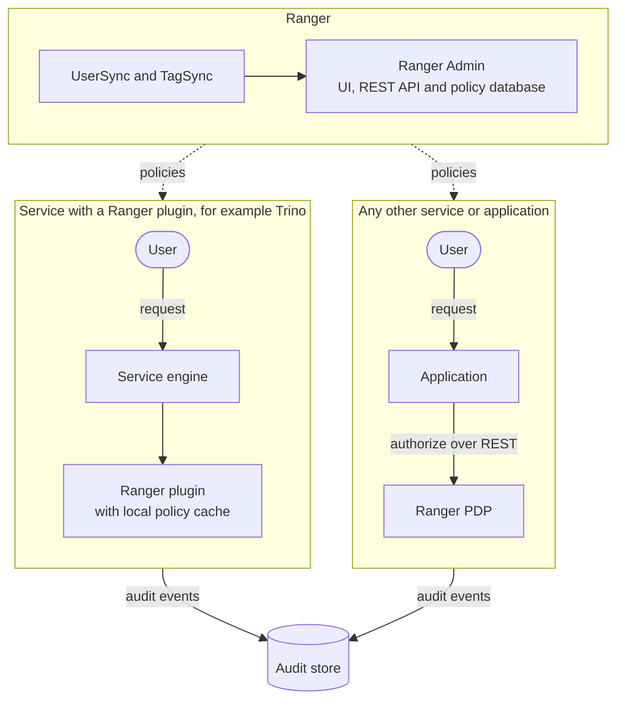

<!---
  Licensed to the Apache Software Foundation (ASF) under one or more
  contributor license agreements.  See the NOTICE file distributed with
  this work for additional information regarding copyright ownership.
  The ASF licenses this file to You under the Apache License, Version 2.0
  (the "License"); you may not use this file except in compliance with
  the License.  You may obtain a copy of the License at

      http://www.apache.org/licenses/LICENSE-2.0

  Unless required by applicable law or agreed to in writing, software
  distributed under the License is distributed on an "AS IS" BASIS,
  WITHOUT WARRANTIES OR CONDITIONS OF ANY KIND, either express or implied.
  See the License for the specific language governing permissions and
  limitations under the License.
-->

# Introduction

Apache Ranger is an authorization and audit framework for data and AI platforms. You define *who* may
do *what* on *which* data in one place, Ranger Admin, and Ranger enforces those decisions inside the
systems that hold or serve the data: open table format catalogs such as Apache Polaris, SQL engines
such as Trino, object stores such as Apache Ozone, streaming platforms such as Apache Kafka, the
Apache Hadoop ecosystem where Ranger started, and any application of your own through the
authorization API or the Ranger PDP server. Every access decision, allowed or denied, is recorded as
an audit event.

Data platforms are shared: analysts, pipelines, services and AI agents reach the same data through
different engines and protocols. Ranger gives all of them one policy model, one evaluation engine and
one audit trail, so a rule such as "only the finance role may read columns tagged `PII`" is written
once and holds wherever the data is accessed. Policies can be resource-based, tag-based, role-based
or attribute-based, and can mask columns and filter rows as well as allow or deny.

This page explains what Ranger does, the vocabulary used throughout this site, and how enforcement
works. If you want to try it immediately, jump to [Installation](install.md) or the
[first policy tutorial](first-policy.md).

## Goals

- **Centralized security administration.** Manage all authorization policies in one web UI or through
  REST APIs, instead of per-system configuration files and grant commands.
- **Fine-grained authorization.** Grant a specific action (for example `select` on a Trino column,
  `consume` on a Kafka topic, `write` on an Ozone key) to specific users, groups or roles.
- **A standard authorization model across systems.** The same policy structure, the same evaluation
  rules and the same UI for every supported service.
- **Multiple authorization methods.** Resource-based policies, tag-based (classification) policies,
  role-based access control, attribute-based access control, row filters and column masking.
- **Centralized auditing.** Access audits from every enforcement point and administrative audits from
  Ranger Admin in a single searchable store.
- **Open to any application.** Embed the policy engine as a library, or call the
  Ranger PDP over REST;

## What Ranger protects

Each supported service has a *service definition* that describes its resources and access types, and
a *plugin* that enforces policies inside the service process. The table lists the integrations, most
recent first; the service name links to its page.

| Service | Policies are enforced in | Typical resources |
|---|---|---|
| Polaris | Apache Polaris catalog service | catalog, namespace, table, policy, principal |
| [Trino](../plugins/trino.md) | Trino coordinator (access control shipped with Trino) | catalog, schema, table, column, function, procedure |
| Ozone | Ozone Manager | volume, bucket, key |
| Nested structure | Any application that embeds the plugin | schema, field |
| Kudu | Kudu master | database, table, column |
| Schema Registry | Schema Registry server | schema group, schema metadata, branch, version, serde |
| Presto | Presto coordinator | catalog, schema, table, column |
| Elasticsearch | Elasticsearch node | index |
| Kylin | Kylin server | project |
| Sqoop | Sqoop 2 server | connector, link, job |
| NiFi Registry | NiFi Registry | registry resource |
| NiFi | NiFi | NiFi resource |
| Atlas | Atlas server | type, entity, classification, relationship |
| Kafka | Broker (authorizer) | topic, consumer group, cluster, transactional id |
| Solr | Solr node | collection, schema, config, admin |
| KMS | Ranger KMS | encryption key |
| YARN | ResourceManager | queue |
| Knox | Knox gateway | topology, service |
| Storm | Nimbus | topology |
| HBase | Master and RegionServers (coprocessor) | table, column family, column |
| Hive | HiveServer2, optionally the Metastore | database, table, column, UDF, URL |
| HDFS | NameNode | path |

Service definitions for `abfs`, `wasb`, `tag` and `gds` are also shipped; The complete list is in
[`agents-common/src/main/resources/service-defs`](https://github.com/apache/ranger/blob/master/agents-common/src/main/resources/service-defs).
Anything not on the list can be protected too: define your own service type and enforce it with an
embedded plugin or through the PDP;

## Key concepts

**Service definition (service type)**
:   A JSON document that describes a kind of service: its resource hierarchy (for Hive:
    database → table → column), the access types it supports (`select`, `update`, `create`, …), the
    configuration a service instance needs, and optional features such as data masking, row filtering,
    policy conditions and context enrichers. Ranger ships one per supported service.

**Service (service instance)**
:   A named instance of a service definition, for example `dev_trino` or `prod_kafka`. A service holds
    connection details that Ranger Admin uses to look up resource names in the UI and to test
    connectivity, and it is the unit that a plugin subscribes to for policy downloads.

**Policy**
:   A rule attached to a service. A *resource-based* policy names resources (a path, a table, a topic)
    and lists policy items: which users, groups or roles get which access types. A policy can contain
    allow items, deny items and exceptions to each. *Tag-based* policies name a tag instead of a resource
    and apply to every resource that carries that tag, across services. Row-filter and masking policies
    are policy types available for services whose definition supports them.

**Plugin**
:   A Java library that runs inside the process of the protected service (Trino coordinator, Kafka
    broker, Ozone Manager, HiveServer2, ...). It downloads the policies of its service, evaluates every access request locally and
    emits audit events. Enforcement never requires a round trip to Ranger Admin.

**Audit**
:   Every plugin decision produces an access audit event (who, what resource, which access type, the
    result, the policy that decided it, client IP and more). Ranger Admin stores its own administrative
    audits (policy changes, logins). Audit events are shipped asynchronously to a store such as Solr,
    OpenSearch, Elasticsearch, HDFS or the Ranger audit server.

**Users, groups and roles**
:   Policies grant access to users, groups and roles. Ranger UserSync imports users and groups from
    LDAP, Active Directory or UNIX. Roles are defined in Ranger and can contain users, groups and other
    roles.

**Tags**
:   Classifications such as `PII` or `CONFIDENTIAL` attached to resources, usually synchronized from
    Apache Atlas by Ranger TagSync. Tag-based policies let you write one rule for all `PII` columns
    regardless of which table or service they live in.

**Security zones**
:   A partition of a service's resources with its own administrators and policies, so that different
    teams can manage the policies of different parts of the same service. See
    [Security zones](../features/sec-zone/intro.md).

**Governed data sharing (GDS)**
:   Datasets, data shares and projects that let data owners share resources with consumers through a
    request-and-approve workflow; Ranger generates the policies. See
    [Governed data sharing](../features/gds/gds_intro.md).

## How enforcement works

1. Administrators create policies in Ranger Admin. Policies are stored in a relational database
   (MySQL, PostgreSQL, Oracle, SQL Server or SQL Anywhere).
2. A plugin embedded in the protected service polls Ranger Admin for its service's policies. The default poll
   interval is 30 seconds (`ranger.plugin.<service>.policy.pollIntervalMs`). Downloaded policies are
   cached on local disk (`ranger.plugin.<service>.policy.cache.dir`).
3. When a user issues a request, the service calls the plugin. The plugin evaluates the request
   against the cached policies in memory and returns allow or deny. Deny rules are evaluated before
   allow rules; see [Policy model](../arch/policy-model.md) for the full evaluation order.
4. The plugin queues an audit event and sends it asynchronously to the configured audit destinations.

Because enforcement happens in-process against a local cache, **Ranger Admin is not a single point of
failure**: if Admin or its database is unavailable, plugins keep enforcing the last policies they
downloaded, and audit events are spooled to local files until the audit store is reachable again.
No additional process runs next to the protected service.

Applications that do not embed a Java plugin use the Ranger PDP (policy decision point) server, which
exposes the same policy engine over REST;

## Components

[Ranger Admin](../services/admin/service.md)
:   Web UI and REST server for policies, users, audits and reports. Listens on port 6080 by default.

Policy database
:   Stores service definitions, services, policies, users, groups, roles and administrative audits.

Plugins
:   Enforce policies inside each protected service.

PDP
:   Policy decision point that exposes authorization over a REST API for applications that do not
    embed a plugin.

[UserSync](../services/usersync/service.md)
:   Synchronizes users and groups from LDAP, Active Directory, UNIX or files into Ranger.

[TagSync](../services/tagsync/service.md)
:   Synchronizes tags from Apache Atlas (Kafka notifications or REST) or from files.

[KMS](../services/kms/service.md)
:   Key management service whose key operations are authorized by Ranger policies.

Audit server and audit stores
:   Ingest, dispatch and store access audits (Solr, OpenSearch, Elasticsearch, HDFS, …). The audit
    server is on master and not yet part of a release.

The [Architecture overview](../arch/architecture.md) describes how these pieces are deployed and how
data flows between them.

## Where to go next

- [Installation](install.md) — the ways to run Ranger.
- [Run Ranger with Docker](docker.md) — a released Ranger Admin from Docker Hub, or the current source
  with protected services from `dev-support/ranger-docker`.
- [Your first policy](first-policy.md) — create a policy, run a query, read the audit.
- [FAQ](faq.md) — short answers to common questions.

## Further reading

- [Ranger wiki](https://cwiki.apache.org/confluence/display/RANGER/Index)
- [Apache Ranger features (wiki)](https://cwiki.apache.org/confluence/pages/viewpage.action?pageId=217390214)
