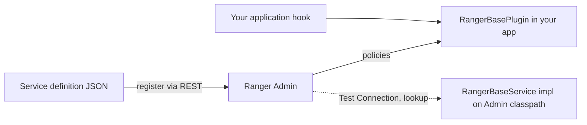

<!---
  Licensed to the Apache Software Foundation (ASF) under one or more
  contributor license agreements.  See the NOTICE file distributed with
  this work for additional information regarding copyright ownership.
  The ASF licenses this file to You under the Apache License, Version 2.0
  (the "License"); you may not use this file except in compliance with
  the License.  You may obtain a copy of the License at

      http://www.apache.org/licenses/LICENSE-2.0

  Unless required by applicable law or agreed to in writing, software
  distributed under the License is distributed on an "AS IS" BASIS,
  WITHOUT WARRANTIES OR CONDITIONS OF ANY KIND, either express or implied.
  See the License for the specific language governing permissions and
  limitations under the License.
-->

# Writing a custom plugin

Ranger's *stack model* lets you protect a new application without changing Ranger itself. You describe the
application's resources and permissions in a JSON service definition, register it with Ranger Admin, and
embed the Ranger plugin runtime in the application to authorize requests. Ranger Admin then offers the
usual UI, REST API, auditing, tags, roles and security zones for the new service type.

This page walks through the four pieces, using the `sampleapp` example in `ranger-examples` as the running
example.



## 1. Define the service type

A service definition declares:

- **resources** — the hierarchy of things you protect (`database` › `table` › `column`, or a single `path`),
  with matcher options (`wildCard`, `ignoreCase`), `recursiveSupported`, `excludesSupported`,
  `lookupSupported`, `isValidLeaf` and optional `accessTypeRestrictions`;
- **accessTypes** — permissions such as `read`, `write`, `submit-app`, optionally with `impliedGrants` and a
  `category` (`READ`, `UPDATE`, `CREATE`, `DELETE`, `MANAGE`);
- **configs** — what Ranger Admin needs to connect to the application (URL, user, password, ...);
- optionally **policyConditions**, **contextEnrichers**, **dataMaskDef**, **rowFilterDef**, **enums**
  and **options** (`enableDenyAndExceptionsInPolicies`, `enableTagBasedPolicies`, ...).

The YARN definition is a compact real-world example:

```json title="ranger-servicedef-yarn.json (abridged)"
{
  "name":        "yarn",
  "implClass":   "org.apache.ranger.services.yarn.RangerServiceYarn",
  "label":       "YARN",
  "description": "YARN",
  "resources": [
    {
      "itemId": 1, "name": "queue", "type": "string", "level": 10,
      "mandatory": true, "lookupSupported": true, "recursiveSupported": true,
      "matcher": "org.apache.ranger.plugin.resourcematcher.RangerPathResourceMatcher",
      "matcherOptions": { "wildCard": true, "ignoreCase": false, "pathSeparatorChar": "." },
      "label": "Queue", "description": "Queue"
    }
  ],
  "accessTypes": [
    { "itemId": 1, "name": "submit-app",  "label": "submit-app",  "category": "UPDATE" },
    { "itemId": 2, "name": "admin-queue", "label": "admin-queue", "category": "MANAGE", "impliedGrants": ["submit-app"] }
  ],
  "configs": [
    { "itemId": 1, "name": "username", "type": "string",   "mandatory": true, "label": "Username" },
    { "itemId": 2, "name": "password", "type": "password", "mandatory": true, "label": "Password" },
    { "itemId": 3, "name": "yarn.url", "type": "string",   "mandatory": true, "label": "YARN REST URL" }
  ]
}
```

Start from the definition closest to your model in
[`agents-common/src/main/resources/service-defs`](https://github.com/apache/ranger/blob/master/agents-common/src/main/resources/service-defs),
give every element a unique `itemId`, and pick a `name` that is a valid identifier — it becomes the property
prefix `ranger.plugin.<name>.*` and the audit service type. The full model is described in
[Plugin architecture](../arch/plugin-architecture.md).

## 2. Register the definition with Ranger Admin

Ranger Admin exposes the service-definition API under `/service` (the public v2 API in
`PublicAPIsv2` delegates to `ServiceREST`, which also serves the internal path; the public v2 API is the stable one):

```bash
# Public v2 API (recommended)
curl -u admin:password -X POST -H "Content-Type: application/json" \
  -d @ranger-servicedef-myapp.json \
  http://ranger-admin:6080/service/public/v2/api/servicedef/

# Internal path used in older documentation
curl -u admin:password -X POST -H "Content-Type: application/json" \
  -d @ranger-servicedef-myapp.json \
  http://ranger-admin:6080/service/plugins/definitions
```

Useful related endpoints: `GET /service/public/v2/api/servicedef/name/{name}`,
`PUT /service/public/v2/api/servicedef/name/{name}` to update, and
`DELETE /service/public/v2/api/servicedef/name/{name}`. Creating a definition requires the Admin role.
See [REST API](../dev/rest-api.md).

Once registered, **Service Manager** shows the new type; create a service instance (for example `myapp_dev`)
and write policies as for any other plugin.

!!! tip
    The definition of `sampleapp` in the example is deliberately omitted: the sample reuses an **HDFS**
    service (`path` resource with `read`, `write`, `execute`) so that it runs against a stock Ranger Admin.
    For your own application, register a definition whose resource names match what your authorizer sets in
    step 3.

## 3. Embed the plugin in your application

The runtime is `org.apache.ranger.plugin.service.RangerBasePlugin` from `ranger-plugins-common`. The pattern
used by every plugin in the repository, and by `ranger-examples/plugin-sampleapp/RangerAuthorizer.java`, is:

```java title="RangerAuthorizer.java (ranger-examples/plugin-sampleapp)"
public class RangerAuthorizer implements IAuthorizer {
    private static volatile RangerBasePlugin plugin;

    public void init() {
        if (plugin == null) {
            synchronized (RangerAuthorizer.class) {
                if (plugin == null) {
                    plugin = new RangerBasePlugin("sampleapp", "sampleapp"); // serviceType, appId
                    plugin.setResultProcessor(new RangerDefaultAuditHandler(plugin.getConfig()));
                    plugin.init(); // loads policies, starts the refresher thread
                }
            }
        }
    }

    public boolean authorize(String fileName, String accessType, String user, Set<String> userGroups) {
        RangerAccessResourceImpl resource = new RangerAccessResourceImpl();
        resource.setValue("path", fileName); // must be a resource name from the servicedef

        RangerAccessRequest request = new RangerAccessRequestImpl(resource, accessType, user, userGroups, null);
        RangerAccessResult  result  = plugin.isAccessAllowed(request);

        return result != null && result.getIsAllowed();
    }
}
```

Key points:

- Create **one** `RangerBasePlugin(serviceType, appId)` per process and keep it for the lifetime of the
  application. `init()` reads `ranger-<serviceType>-security.xml`, `ranger-<serviceType>-audit.xml` and
  `ranger-<serviceType>-policymgr-ssl.xml` from the classpath (plus the TLS file named by
  `ranger.plugin.<serviceType>.policy.rest.ssl.config.file`), loads the cached policies if present, and starts the
  `PolicyRefresher` that polls Ranger Admin every `ranger.plugin.<serviceType>.policy.pollIntervalMs`.
- Set an audit handler with `setResultProcessor(new RangerDefaultAuditHandler(...))`, or pass a handler
  to `isAccessAllowed(request, handler)` when you need to batch or post-process audit events.
- Build a `RangerAccessRequestImpl` with the resource values, access type, user, groups and (optionally)
  client IP, action name, access time and request data; `isAccessAllowed()` returns a
  `RangerAccessResult` with `getIsAllowed()`, `getIsAccessDetermined()` and `getPolicyId()`.
- For masking and filtering call `evalDataMaskPolicies()` / `evalRowFilterPolicies()` and apply the
  returned mask type or filter expression yourself (see the [nested structure plugin](nestedstructure.md)
  for a complete example).
- `getResourceACLs(request)` returns the effective permissions for a resource, useful for UIs that show
  what a user may do.
- `plugin.cleanup()` stops the refresher on shutdown.

Configuration files for the example are in `ranger-examples/plugin-sampleapp/conf`.

### `ranger-sampleapp-security.xml`

`RangerBasePlugin` reads this file from the classpath; replace `sampleapp` with your service type. It names
the Ranger Admin to contact and the service whose policies are enforced — these two properties are mandatory.
The values for the URL, service name, TLS file and cache directory are those of the example; every other
property is understood by every plugin and is shown with its default.

```xml title="ranger-sampleapp-security.xml"
<configuration>
  <!-- Connection to Ranger Admin -->
  <property>
    <name>ranger.plugin.sampleapp.policy.rest.url</name>
    <value>http://localhost:6080</value>
    <description>MANDATORY: URL of Ranger Admin. Separate several URLs with commas for Ranger Admin
      high availability.</description>
  </property>
  <property>
    <name>ranger.plugin.sampleapp.service.name</name>
    <value>cl1_hadoop</value>
    <description>MANDATORY: Name of the Ranger service whose policies are enforced.</description>
  </property>
  <property>
    <name>ranger.plugin.sampleapp.policy.source.impl</name>
    <value>org.apache.ranger.admin.client.RangerAdminRESTClient</value>
    <description>Class that retrieves policies. The default downloads them from Ranger Admin over
      REST.</description>
  </property>
  <property>
    <name>ranger.plugin.sampleapp.policy.rest.ssl.config.file</name>
    <value>ranger-policymgr-ssl.xml</value>
    <description>Path of the TLS client configuration file (ranger-policymgr-ssl.xml). Needed only
      when Ranger Admin uses HTTPS. Default: not set.</description>
  </property>
  <property>
    <name>ranger.plugin.sampleapp.policy.rest.client.connection.timeoutMs</name>
    <value>120000</value>
    <description>Connect timeout for calls to Ranger Admin. Unit: milliseconds.</description>
  </property>
  <property>
    <name>ranger.plugin.sampleapp.policy.rest.client.read.timeoutMs</name>
    <value>30000</value>
    <description>Read timeout for calls to Ranger Admin. Unit: milliseconds.</description>
  </property>
  <property>
    <name>ranger.plugin.sampleapp.policy.rest.client.max.retry.attempts</name>
    <value>3</value>
    <description>Number of retries for a failed call to Ranger Admin.</description>
  </property>

  <!-- Policy refresh and cache -->
  <property>
    <name>ranger.plugin.sampleapp.policy.pollIntervalMs</name>
    <value>30000</value>
    <description>Interval between policy refreshes. Unit: milliseconds.</description>
  </property>
  <property>
    <name>ranger.plugin.sampleapp.policy.cache.dir</name>
    <value>/tmp</value>
    <description>Directory for the on-disk policy cache. It must be writable by the process that
      hosts the plugin. Default: not set.</description>
  </property>

  <!-- Authorization behavior -->
  <property>
    <name>ranger.plugin.sampleapp.service.admins</name>
    <value></value>
    <description>Comma-separated list of users treated as administrators of the service by the
      policy engine. Default: not set.</description>
  </property>
  <property>
    <name>ranger.plugin.sampleapp.is.fallback.supported</name>
    <value>false</value>
    <description>Tells the authorizer that it may fall back to the application's native
      authorization when no Ranger policy decides the access.</description>
  </property>

  <!-- Users, groups and roles -->
  <property>
    <name>ranger.plugin.sampleapp.use.rangerGroups</name>
    <value>false</value>
    <description>Add the groups Ranger knows for the user (from UserSync) to the groups supplied
      with the request.</description>
  </property>
  <property>
    <name>ranger.plugin.sampleapp.use.only.rangerGroups</name>
    <value>false</value>
    <description>Ignore the groups supplied with the request and use only the groups Ranger knows
      for the user.</description>
  </property>
  <property>
    <name>ranger.plugin.sampleapp.super.users</name>
    <value></value>
    <description>Comma-separated list of users that are authorized for every access without a
      policy. Default: not set.</description>
  </property>
  <property>
    <name>ranger.plugin.sampleapp.super.groups</name>
    <value></value>
    <description>Comma-separated list of groups whose members are authorized for every access
      without a policy. Default: not set.</description>
  </property>
  <property>
    <name>ranger.plugin.sampleapp.audit.exclude.users</name>
    <value></value>
    <description>Comma-separated list of users whose accesses are not audited.
      ranger.plugin.sampleapp.audit.exclude.groups and ranger.plugin.sampleapp.audit.exclude.roles
      work the same way for groups and roles. Default: not set.</description>
  </property>
</configuration>
```

### `ranger-sampleapp-audit.xml`

In the example this file writes audits through log4j (`xasecure.audit.destination.log4j=true`,
`xasecure.audit.destination.log4j.logger=ranger_audit_logger`); switch on `xasecure.audit.destination.solr`,
`xasecure.audit.destination.elasticsearch`, `xasecure.audit.destination.hdfs` or
`xasecure.audit.destination.auditserver` for production. The properties are the same for every plugin; see
the annotated file on any plugin page, for example [Hive](hive.md#ranger-hive-auditxml), and the
[Audit framework](../services/audit/index.md).

### Running the sample

```bash
cd ranger-examples
mvn clean package assembly:assembly
mkdir /tmp/sampleapp && cd /tmp/sampleapp
tar xvfz .../target/ranger-examples-<version>-sampleapp.tar.gz
tar xvfz .../target/ranger-examples-<version>-sampleapp-plugin.tar.gz
# edit conf/ranger-sampleapp-security.xml, conf/ranger-sampleapp-audit.xml
./run-sampleapp.sh              # default authorizer: allows everything
./run-sampleapp.sh ranger-authz # Ranger authorizer
command> read /tmp/somefile user1 group1 group2
```

`run-sampleapp.sh ranger-authz` adds `lib/ranger-sampleapp-plugin-impl/*.jar` to the classpath and sets
`-Dsampleapp.authorizer=org.apache.ranger.examples.sampleapp.RangerAuthorizer`; `SampleApp` instantiates
that class by name, which is the usual way an application makes its authorizer pluggable.

## 4. Support Test Connection and autocomplete (optional)

To let Ranger Admin validate the service configuration and autocomplete resource names, extend
`org.apache.ranger.plugin.service.RangerBaseService`:

```java
public class RangerServiceMyApp extends RangerBaseService {
    @Override
    public Map<String, Object> validateConfig() throws Exception {
        // connect using getConfigs(); throw on failure
    }

    @Override
    public List<String> lookupResource(ResourceLookupContext context) throws Exception {
        // context.getResourceName(), context.getUserInput(), context.getResources()
    }
}
```

`RangerBaseService` also gives you `getDefaultRangerPolicies()`, which you can override to add extra
policy items to the default *all* policies created with each new service (the Trino service adds `select`
for the lookup user this way).

Set the class in the definition's `implClass`, and put the jar and its dependencies in Ranger Admin's
classpath under `ews/webapp/WEB-INF/classes/ranger-plugins/<serviceType>/` (that is how the built-in
`ranger-plugins/kudu`, `ranger-plugins/nifi`, ... directories are populated by the admin assembly).
Restart Ranger Admin.

## 5. Package and isolate

- **Plain library** — add `ranger-plugins-common`, `ranger-audit-core`, `ranger-plugins-cred` and the
  audit destination modules you use (`ranger-audit-dest-solr`, `ranger-audit-dest-auditserver`, ... from
  `agents-audit`) to the application classpath. This is what `plugin-sampleapp` and the nested structure
  plugin do.
- **Shim + classloader** — if the host application's dependencies clash with Ranger's, split the plugin into
  a shim that the host loads and an implementation directory loaded through
  `ranger-plugin-classloader` (`RangerPluginClassLoader`). The Presto plugin (`ranger-presto-plugin-shim`
  with `lib/ranger-presto-plugin-impl`) and the Hive/HBase/HDFS shims are examples.
- **Configuration** — document for your users what must be set in the application's own configuration to
  activate the authorizer, and where the `ranger-<serviceType>-*.xml` files must be placed, the way the
  pages in this section do (see [Trino](trino.md) for the shape).

Custom [policy conditions and context enrichers](../dev/custom-conditions-enrichers.md) can be referenced
from the definition the same way built-in ones are.

## Alternatives to `RangerBasePlugin`

- New Java integrations can use the [authorization API](../dev/authz-api.md) (`RangerEmbeddedAuthorizer`)
  instead of `RangerBasePlugin`; the [Apache Polaris](polaris.md) authorizer is built this way.
- If you cannot run Java in the application, call the [Ranger PDP](../services/pdp/service.md) over REST with
  the same API. The service definition and policies are the same in every case.

## Further reading

- [Plugin architecture](../arch/plugin-architecture.md)
- [`ranger-examples/README.txt`](https://github.com/apache/ranger/blob/master/ranger-examples/README.txt)
- cwiki: [Ranger — How to add a custom plugin](https://cwiki.apache.org/confluence/display/RANGER/Ranger+-+How+to+add+a+custom+plugin)
