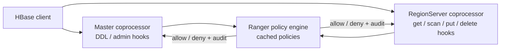

<!---
  Licensed to the Apache Software Foundation (ASF) under one or more
  contributor license agreements.  See the NOTICE file distributed with
  this work for additional information regarding copyright ownership.
  The ASF licenses this file to You under the Apache License, Version 2.0
  (the "License"); you may not use this file except in compliance with
  the License.  You may obtain a copy of the License at

      http://www.apache.org/licenses/LICENSE-2.0

  Unless required by applicable law or agreed to in writing, software
  distributed under the License is distributed on an "AS IS" BASIS,
  WITHOUT WARRANTIES OR CONDITIONS OF ANY KIND, either express or implied.
  See the License for the specific language governing permissions and
  limitations under the License.
-->

# Apache HBase

The Ranger HBase plugin authorizes access to HBase tables, column families and columns. It replaces
HBase's built-in `AccessController` so that permissions are managed centrally in Ranger Admin instead
of in the `hbase:acl` table, and it audits every authorized operation.

The plugin is an HBase **coprocessor** (`RangerAuthorizationCoprocessor`) that implements the master,
region and region-server observer interfaces. It must be loaded on the HBase Master and on every
RegionServer: the master hooks authorize DDL and administrative operations (create/drop table,
snapshots, balancing), the region hooks authorize data access (get, scan, put, delete, bulk load).
Policies are cached in each process and refreshed from Ranger Admin by polling.

HBase shell `grant`/`revoke` commands are intercepted by the coprocessor and translated into Ranger
policy updates, so existing scripts keep working.

## Requirements

- A Ranger Admin instance that the HBase Master and every RegionServer can reach over HTTP or HTTPS,
  with a service of type `hbase` defined in it.
- An audit destination reachable from the Master and the RegionServers, if auditing is enabled.
- Apache HBase. Ranger master builds the plugin against HBase **2.6.0** (`hbase.version` in the root
  `pom.xml`); the Docker environment runs the same version.
- The plugin jars. The Ranger build produces `ranger-<version>-hbase-plugin.tar.gz` (see
  [Build from source](../dev/build.md)); its `lib/` directory holds the plugin shim jars and the
  `ranger-hbase-plugin-impl` directory with the implementation and its dependencies.

## Configuration

Activating the plugin takes three things on the HBase Master and on **every RegionServer**: the
plugin jars on the HBase classpath, the coprocessor registered in `hbase-site.xml`, and the Ranger
configuration files in the HBase configuration directory. Restart the Master and all RegionServers
afterwards.

Copy the content of the archive's `lib/` directory, including the `ranger-hbase-plugin-impl`
sub-directory, to `$HBASE_HOME/lib`. Then set the following in `hbase-site.xml`:

```xml title="hbase-site.xml"
<property>
  <name>hbase.security.authorization</name>
  <value>true</value>
</property>
<property>
  <name>hbase.coprocessor.master.classes</name>
  <value>org.apache.ranger.authorization.hbase.RangerAuthorizationCoprocessor</value>
</property>
<property>
  <name>hbase.coprocessor.region.classes</name>
  <value>org.apache.ranger.authorization.hbase.RangerAuthorizationCoprocessor</value>
</property>
```

Both coprocessor properties are comma-separated lists. Keep the other coprocessors your cluster needs,
but remove `org.apache.hadoop.hbase.security.access.AccessController` from both lists.

!!! warning
    Do not run `AccessController` and the Ranger coprocessor together. When you add RegionServers
    later, configure the plugin on the new hosts before they join the cluster.

The plugin reads `ranger-hbase-security.xml` and `ranger-hbase-audit.xml` from the classpath, and
`ranger-policymgr-ssl.xml` from the path set in `ranger.plugin.hbase.policy.rest.ssl.config.file`. Place
them in the HBase configuration directory (`$HBASE_CONF_DIR`, usually `$HBASE_HOME/conf`), readable by the user that runs HBase and by users of the HBase shell on that
host.

### ranger-hbase-security.xml

This file tells the plugin which Ranger service it enforces, how to reach Ranger Admin and where to cache
policies. Place it in `$HBASE_CONF_DIR` on the Master and every RegionServer.
`ranger.plugin.hbase.service.name` and `ranger.plugin.hbase.policy.rest.url` are mandatory; the policy cache
directory lets this HBase process start and keep enforcing policies when Ranger Admin is unreachable.

```xml title="ranger-hbase-security.xml"
<configuration>
  <!-- Connection to Ranger Admin -->
  <property>
    <name>ranger.plugin.hbase.service.name</name>
    <value>dev_hbase</value>
    <description>MANDATORY: Name of the Ranger service whose policies this HBase process
      enforces.</description>
  </property>
  <property>
    <name>ranger.plugin.hbase.policy.rest.url</name>
    <value>http://ranger-admin:6080</value>
    <description>MANDATORY: URL of Ranger Admin. Separate several URLs with commas for Ranger Admin
      high availability.</description>
  </property>
  <property>
    <name>ranger.plugin.hbase.policy.rest.ssl.config.file</name>
    <value>/etc/hbase/conf/ranger-policymgr-ssl.xml</value>
    <description>Path of ranger-policymgr-ssl.xml. Read when the Ranger Admin URL uses https.
      Default: not set.</description>
  </property>
  <property>
    <name>ranger.plugin.hbase.policy.rest.client.username</name>
    <value></value>
    <description>User name sent with HTTP basic authentication when the plugin downloads policies.
      Default: not set.</description>
  </property>
  <property>
    <name>ranger.plugin.hbase.policy.rest.client.password</name>
    <value></value>
    <description>Password for policy.rest.client.username. Basic authentication is used only when
      both are set. Default: not set.</description>
  </property>
  <property>
    <name>ranger.plugin.hbase.policy.rest.client.connection.timeoutMs</name>
    <value>120000</value>
    <description>Connection timeout for calls to Ranger Admin. Unit: milliseconds.</description>
  </property>
  <property>
    <name>ranger.plugin.hbase.policy.rest.client.read.timeoutMs</name>
    <value>30000</value>
    <description>Read timeout for calls to Ranger Admin. Unit: milliseconds.</description>
  </property>
  <property>
    <name>ranger.plugin.hbase.policy.rest.client.max.retry.attempts</name>
    <value>3</value>
    <description>Number of retries for a failed call to Ranger Admin.</description>
  </property>
  <property>
    <name>ranger.plugin.hbase.policy.rest.client.retry.interval.ms</name>
    <value>1000</value>
    <description>Wait time between retries. Unit: milliseconds.</description>
  </property>

  <!-- Policy refresh and cache -->
  <property>
    <name>ranger.plugin.hbase.policy.cache.dir</name>
    <value>/etc/ranger/dev_hbase/policycache</value>
    <description>Directory for the policy cache file. It must be writable by the user that runs the
      process. Default: not set.</description>
  </property>
  <property>
    <name>ranger.plugin.hbase.policy.pollIntervalMs</name>
    <value>30000</value>
    <description>How often the plugin asks Ranger Admin for policy changes. Unit:
      milliseconds.</description>
  </property>
  <property>
    <name>ranger.plugin.hbase.policy.source.impl</name>
    <value>org.apache.ranger.admin.client.RangerAdminRESTClient</value>
    <description>Class that retrieves policies.</description>
  </property>

  <!-- Authorization behavior -->
  <property>
    <name>xasecure.hbase.update.xapolicies.on.grant.revoke</name>
    <value>true</value>
    <description>Let grant and revoke from the HBase shell create or update Ranger policies. When
      false these commands do not change any policy.</description>
  </property>
</configuration>
```

A related switch lives in the service configuration in Ranger Admin, not in this file: see
`ranger.plugin.hbase.column.auth.optimized` under
[Service definition in Ranger Admin](#service-definition-in-ranger-admin).

### ranger-hbase-audit.xml

This file selects where the plugin sends audit events; place it next to `ranger-hbase-security.xml`. Each
destination is switched on with `xasecure.audit.destination.<name>=true` and configured with properties
under the same prefix. No property is mandatory: without an enabled destination, no audit events are
stored. The example sends audits to Solr.

```xml title="ranger-hbase-audit.xml"
<configuration>
  <!-- General -->
  <property>
    <name>xasecure.audit.is.enabled</name>
    <value>true</value>
    <description>Master switch for auditing in this plugin.</description>
  </property>
  <property>
    <name>xasecure.audit.provider.summary.enabled</name>
    <value>false</value>
    <description>Collapse events that differ only in time into one event with a count.</description>
  </property>

  <!-- Audit Server destination -->
  <property>
    <name>xasecure.audit.destination.auditserver</name>
    <value>false</value>
    <description>Send audits to the Ranger Audit Server.</description>
  </property>
  <property>
    <name>xasecure.audit.destination.auditserver.url</name>
    <value></value>
    <description>Audit Server URL. Default: not set.</description>
  </property>

  <!-- Solr destination -->
  <property>
    <name>xasecure.audit.destination.solr</name>
    <value>true</value>
    <description>Send audits to Apache Solr. Default: false.</description>
  </property>
  <property>
    <name>xasecure.audit.destination.solr.urls</name>
    <value>http://solr:8983/solr/ranger_audits</value>
    <description>Solr collection URLs, separated by commas. Ignored when
      xasecure.audit.destination.solr.zookeepers is set. Default: not set.</description>
  </property>
  <property>
    <name>xasecure.audit.destination.solr.zookeepers</name>
    <value></value>
    <description>ZooKeeper connect string of a SolrCloud cluster. Default: not set.</description>
  </property>
  <property>
    <name>xasecure.audit.destination.solr.batch.filespool.dir</name>
    <value>/var/log/hbase/audit/solr/spool</value>
    <description>Local directory where events are spooled while Solr is unreachable. Every enabled
      destination has the same property under its own prefix. Default: not set.</description>
  </property>
  <property>
    <name>xasecure.audit.destination.solr.collection</name>
    <value>ranger_audits</value>
    <description>Collection name when ZooKeeper is used.</description>
  </property>

  <!-- Elasticsearch destination -->
  <property>
    <name>xasecure.audit.destination.elasticsearch</name>
    <value>false</value>
    <description>Send audits to Elasticsearch.</description>
  </property>
  <property>
    <name>xasecure.audit.destination.elasticsearch.urls</name>
    <value></value>
    <description>Elasticsearch host names, separated by commas. Default: not set.</description>
  </property>
  <property>
    <name>xasecure.audit.destination.elasticsearch.port</name>
    <value>9200</value>
    <description>REST port of the Elasticsearch cluster.</description>
  </property>
  <property>
    <name>xasecure.audit.destination.elasticsearch.protocol</name>
    <value>http</value>
    <description>One of: http, https.</description>
  </property>
  <property>
    <name>xasecure.audit.destination.elasticsearch.index</name>
    <value>ranger_audits</value>
    <description>Index that receives the events.</description>
  </property>

  <!-- HDFS destination -->
  <property>
    <name>xasecure.audit.destination.hdfs</name>
    <value>false</value>
    <description>Write audits as files to HDFS or a Hadoop-compatible object store.</description>
  </property>
  <property>
    <name>xasecure.audit.destination.hdfs.dir</name>
    <value></value>
    <description>Base directory, for example hdfs://namenode:8020/ranger/audit. Default: not
      set.</description>
  </property>

  <!-- Log4j destination -->
  <property>
    <name>xasecure.audit.destination.log4j</name>
    <value>false</value>
    <description>Write audits as JSON to a logger of the host process.</description>
  </property>
  <property>
    <name>xasecure.audit.destination.log4j.logger</name>
    <value>ranger.audit.log4j</value>
    <description>Logger name used by the log4j destination.</description>
  </property>
</configuration>
```

Give every enabled destination a spool directory (`xasecure.audit.destination.<name>.batch.filespool.dir`)
so that events survive an outage of the audit store. The queue, spool, Kerberos and TLS options of each
destination, and the [Audit Server](../services/audit-server/service.md) client settings, are in the
[Audit framework](../services/audit/index.md) reference.

### ranger-policymgr-ssl.xml

This file is needed only when Ranger Admin is reached over `https`. The plugin loads it from the path set in
`ranger.plugin.hbase.policy.rest.ssl.config.file`; a file named `ranger-hbase-policymgr-ssl.xml` on the
classpath is picked up automatically. No property is mandatory: without a truststore the plugin relies on
the default truststore of the JVM, and the keystore is needed only for two-way TLS. Passwords are not
stored in the file: they are read from a Hadoop credential store (JCEKS) under fixed aliases.

```xml title="ranger-policymgr-ssl.xml"
<configuration>
  <!-- Keystore (client certificate, two-way TLS) -->
  <property>
    <name>xasecure.policymgr.clientssl.keystore</name>
    <value></value>
    <description>Keystore with the plugin's client certificate. Needed only when Ranger Admin
      requires client certificates. Default: not set.</description>
  </property>
  <property>
    <name>xasecure.policymgr.clientssl.keystore.credential.file</name>
    <value></value>
    <description>Hadoop credential store (JCEKS) that holds the keystore password under the alias
      sslKeyStore. Default: not set.</description>
  </property>
  <property>
    <name>xasecure.policymgr.clientssl.keystore.type</name>
    <value>jks</value>
    <description>Keystore type.</description>
  </property>

  <!-- Truststore -->
  <property>
    <name>xasecure.policymgr.clientssl.truststore</name>
    <value>/etc/hbase/conf/ranger-plugin-truststore.jks</value>
    <description>Truststore that contains the Ranger Admin certificate or its CA. When no truststore
      is configured, the default truststore of the JVM is used. Default: not set.</description>
  </property>
  <property>
    <name>xasecure.policymgr.clientssl.truststore.credential.file</name>
    <value>jceks://file/etc/ranger/dev_hbase/cred.jceks</value>
    <description>Hadoop credential store (JCEKS) that holds the truststore password under the alias
      sslTrustStore. Default: not set.</description>
  </property>
  <property>
    <name>xasecure.policymgr.clientssl.truststore.type</name>
    <value>jks</value>
    <description>Truststore type.</description>
  </property>
</configuration>
```

When Ranger Admin validates client certificates, set `commonNameForCertificate` in the service configuration
to the CN of the plugin's certificate. See [Security hardening](../services/admin/security-hardening.md).

## Service definition in Ranger Admin

Choose **HBase** in Service Manager and create a service. Its name must match
`ranger.plugin.hbase.service.name`.

| Field | Required | Description |
|-------|----------|-------------|
| `username` | yes | User that Ranger Admin connects as for Test Connection and resource lookup. |
| `password` | yes | Password of that user. |
| `hbase.zookeeper.quorum` | yes | ZooKeeper hosts used by HBase. |
| `hbase.zookeeper.property.clientPort` | yes | ZooKeeper client port. Default: `2181`. |
| `zookeeper.znode.parent` | yes | HBase root znode. Default: `/hbase`. |
| `hadoop.security.authentication` | yes | One of `simple`, `kerberos`. Default: `simple`. |
| `hbase.security.authentication` | yes | One of `simple`, `kerberos`. Default: `simple`. |
| `hbase.master.kerberos.principal` | no | Master principal of a Kerberized cluster. |
| `commonNameForCertificate` | no | Expected CN of the plugin's client certificate when Ranger Admin runs with two-way TLS. |
| `ranger.plugin.audit.filters` | no | Default audit filters, downloaded by the plugin together with the policies. Default: see [Auditing](#auditing). |

One more key is not part of the service definition but is read by the plugin from the service
configuration when you add it as a custom property:

`ranger.plugin.hbase.column.auth.optimized`
:   Boolean, off unless set to `true`. The coprocessor evaluates column-family level access first and
    skips per-column checks when the whole family is authorized, which speeds up wide scans.

**Test Connection** connects to HBase through ZooKeeper and lists tables. **Resource lookup**
suggests table names and column families (columns cannot be listed).

## Resources and permissions

Source:
[`ranger-servicedef-hbase.json`](https://github.com/apache/ranger/blob/master/agents-common/src/main/resources/service-defs/ranger-servicedef-hbase.json).
All three resources are case-sensitive, accept wildcards and support *exclude*.

| Resource | Parent | Lookup | Description |
|----------|--------|--------|-------------|
| `table` | — | yes | Fully qualified table name, `namespace:table`. Tables in the default namespace have no prefix. Use `ns:*` to cover a namespace. |
| `column-family` | `table` | yes | Column family of the table. |
| `column` | `column-family` | no | Column qualifier. |

| Access type | Category | Operations |
|-------------|----------|------------|
| `read` | READ | `get`, `scan`, `exists`, the read part of `checkAndPut`/`checkAndDelete` |
| `write` | UPDATE | `put`, `delete`, `append`, `increment`, bulk load |
| `create` | CREATE | `createTable`, `deleteTable`, `modifyTable`, `enableTable`, `disableTable`, `flush`, `compact` |
| `admin` | MANAGE | Cluster, region and namespace administration. Implies `read`, `write` and `create`. |
| `execute` | READ | Invoke coprocessor endpoints |

`admin` covers `move`, `assign`, `unassign`, `balance`, `balanceSwitch`, `shutdown`, `stopMaster`,
stopping a RegionServer, closing a region, snapshots, quotas and namespace create/modify/delete.
`execute` is checked only when `hbase.security.exec.permission.checks=true` in `hbase-site.xml`.

The HBase service definition has no data-masking, row-filter, policy-condition or context-enricher
definitions. Row-level (row-key based) authorization is not supported.

!!! note "Namespace operations"
    `createNamespace`, `deleteNamespace`, `modifyNamespace` and namespace quotas are authorized as
    `admin` on the table resource `<namespace>:*`. Grant `admin` on `ns:*` to let a team manage its
    own namespace.

## Default policies

When the service is created Ranger Admin generates the `all - table, column-family, column` policy and
adds the lookup user (`username` of the service configuration) to it with `read` and `create`, so that
Test Connection and resource lookup keep working. There is no fallback to HBase's own ACLs, so create
policies for the `hbase` service user and for every application before you restart HBase with the
coprocessor.

Apache Phoenix needs full access to its system tables for every user. Create a policy with table
`SYSTEM.*`, column family `*`, column `*`, group `public` and permissions `read`, `write`, `create`,
`admin`.

## Behavior notes

### How a request is authorized



- For `get` and `scan` the coprocessor authorizes each column family and column in the request. If
  the user is allowed on some but not all requested columns, the request is not rejected outright;
  a filter is attached that removes the unauthorized cells from the result. A request whose columns
  are all denied fails with an access-denied error.
- Opening a region of a system table (`hbase:meta`, `-ROOT-`, `.META.`, `hbase:acl`, `hbase:namespace`)
  is restricted to the HBase system user and superusers; opening any other region, and `close`, require
  `admin`.
- Users listed in `hbase.superuser` are evaluated against the policies like everyone else, but a
  deny result is overridden and the request is allowed; the audit event then records the access as
  allowed with policy ID `-1`.
- There is **no fallback** to HBase's own ACLs: once the coprocessor replaces `AccessController`,
  Ranger policies are the only source of permissions.

### Grant and revoke from the HBase shell

With `xasecure.hbase.update.xapolicies.on.grant.revoke=true`, `grant 'user1', 'RW', 'tab1'` creates
(or updates) the Ranger policy whose resource is exactly `tab1`, and `revoke` removes the
corresponding policy item. Keep the following in mind:

- The caller must be a Ranger admin or have *delegated admin* on the resource.
- Ranger matches the policy by **exact** resource. If `user1` already has `read` on `tab1` through a
  policy that also covers `tab2`, a `revoke 'user1', 'tab1'` only removes the policy created by the
  `grant`; the original policy still grants `read`.
- Mixing policy authoring in the Admin UI with shell `grant`/`revoke` makes the policy set hard to
  reason about. Pick one mechanism, or set the property to `false` so that `grant`/`revoke` no
  longer change Ranger policies.

## Auditing

Each hook produces an audit event with:

- `resource`: `table/column-family/column`.
- `accessType`: the HBase operation (`get`, `scannerOpen`, `put`, `createTable`, `balance`, ...).
- `action`: the permission that was checked: `read`, `write`, `create`, `admin` or `execute`.

The default audit filter in the service configuration audits all denials, ignores the `hbase` user
on system tables (`hbase:meta`, `hbase:acl`, `-ROOT-`, `.META.`), ignores the `atlas` and `hbase`
users on the Atlas tables (`atlas_janus`, `ATLAS_ENTITY_AUDIT_EVENTS`) and ignores `balance` calls by
`hbase`. Set `xasecure.audit.provider.summary.enabled=true` in `ranger-hbase-audit.xml` to collapse
repeated identical events.

## Try it with Docker

`dev-support/ranger-docker/docker-compose.ranger-hbase.yml` starts a `ranger-hbase` container
(Master on 16000/16010, RegionServer on 16020/16030) on top of the `ranger-hadoop` and `ranger-zk`
containers. HBase enforces the Ranger service `dev_hbase`.

```bash
cd dev-support/ranger-docker
./download-archives.sh hadoop hbase
export RANGER_DB_TYPE=postgres
export AUDIT_INDEX_STORE=opensearch
export AUDIT_DESTINATIONS=audit-store-${AUDIT_INDEX_STORE}

docker compose --profile ${AUDIT_DESTINATIONS} \
  -f docker-compose.ranger.yml \
  -f docker-compose.ranger-audit-service.yml \
  -f docker-compose.ranger-hadoop.yml \
  -f docker-compose.ranger-hbase.yml up -d
```

See [Running Ranger with Docker](../getting-started/docker.md) for the full environment.

## Further reading

- [Policy model](../arch/policy-model.md): include/exclude flags, delegated admin
- [Resource-based policies](../features/policies/resource-policies.md)
- [Audit filters](../services/audit/audit-filters.md)
- Source: [`hbase-agent`](https://github.com/apache/ranger/tree/master/hbase-agent),
  [`ranger-hbase-plugin-shim`](https://github.com/apache/ranger/tree/master/ranger-hbase-plugin-shim)
- cwiki: [HBase plugin](https://cwiki.apache.org/confluence/pages/viewpage.action?pageId=62688801)
