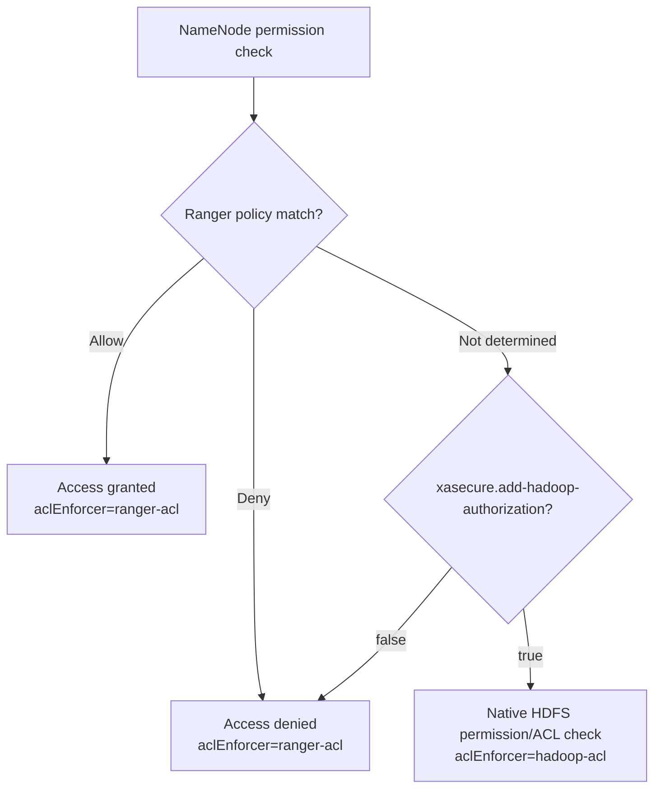

<!---
  Licensed to the Apache Software Foundation (ASF) under one or more
  contributor license agreements.  See the NOTICE file distributed with
  this work for additional information regarding copyright ownership.
  The ASF licenses this file to You under the Apache License, Version 2.0
  (the "License"); you may not use this file except in compliance with
  the License.  You may obtain a copy of the License at

      http://www.apache.org/licenses/LICENSE-2.0

  Unless required by applicable law or agreed to in writing, software
  distributed under the License is distributed on an "AS IS" BASIS,
  WITHOUT WARRANTIES OR CONDITIONS OF ANY KIND, either express or implied.
  See the License for the specific language governing permissions and
  limitations under the License.
-->

# HDFS

The Ranger HDFS plugin controls who can read, write and execute (traverse) files and directories in
HDFS. Instead of relying only on POSIX-style permissions and HDFS ACLs that live on each inode, you
define path-based policies for users and groups in Ranger Admin, and the plugin enforces them inside
the NameNode.

The plugin runs in the NameNode process as an *INode attribute provider*. Every permission check the
NameNode performs (for example `open`, `create`, `delete`, `rename`, `listStatus`) is routed through
the plugin, which evaluates the request against the policies it has cached locally. Policies are
pulled from Ranger Admin over REST at a fixed interval, so the NameNode keeps enforcing the last known
policy set even if Ranger Admin is unavailable. DataNodes do not need the plugin.

If no Ranger policy decides the request, the plugin can fall back to the native HDFS permission check
(see [Behavior notes](#behavior-notes)). Every decision can be audited.

## Requirements

- A Ranger Admin instance that every NameNode can reach over HTTP or HTTPS, with a service of type
  `hdfs` defined in it.
- An audit destination (Ranger Audit Server, Solr, Elasticsearch/OpenSearch, HDFS, ...) reachable from
  the NameNode, if auditing is enabled.
- Apache Hadoop. Ranger master builds the plugin against Hadoop **3.4.2** (`hadoop.version` in the root
  `pom.xml`); the Docker environment runs the same version.
- The plugin jars. The Ranger build produces `ranger-<version>-hdfs-plugin.tar.gz` (see
  [Build from source](../dev/build.md)); its `lib/` directory holds the plugin shim jars and the
  `ranger-hdfs-plugin-impl` directory with the implementation and its dependencies.

## Configuration

Activating the plugin on a NameNode takes three things: the plugin jars on the NameNode classpath,
the authorizer switched on in `hdfs-site.xml`, and the Ranger configuration files in the Hadoop
configuration directory. Repeat this on every NameNode (active, standby and observer), then restart
them.

Copy the content of the archive's `lib/` directory, including the `ranger-hdfs-plugin-impl`
sub-directory, to `$HADOOP_HOME/share/hadoop/hdfs/lib`. Then set the following in `hdfs-site.xml`:

```xml title="hdfs-site.xml"
<property>
  <name>dfs.namenode.inode.attributes.provider.class</name>
  <value>org.apache.ranger.authorization.hadoop.RangerHdfsAuthorizer</value>
</property>
<property>
  <name>dfs.permissions.enabled</name>
  <value>true</value>
</property>
<property>
  <name>dfs.permissions.ContentSummary.subAccess</name>
  <value>true</value>
</property>
```

`dfs.namenode.inode.attributes.provider.class` loads the plugin. `dfs.permissions.enabled` must be
`true`, otherwise the NameNode skips permission checks and never calls the plugin (`dfs.permissions` is
the older name of the same switch). `dfs.permissions.ContentSummary.subAccess` makes
`getContentSummary` (`hdfs dfs -du`, `-count`) authorize the sub-tree through the plugin.

The plugin reads `ranger-hdfs-security.xml` and `ranger-hdfs-audit.xml` from the classpath, and
`ranger-policymgr-ssl.xml` from the path set in `ranger.plugin.hdfs.policy.rest.ssl.config.file`. Place
them in the Hadoop configuration directory (`$HADOOP_CONF_DIR`, usually `$HADOOP_HOME/etc/hadoop`),
readable by the user that runs the NameNode.

### ranger-hdfs-security.xml

This file tells the plugin which Ranger service it enforces, how to reach Ranger Admin and where to cache
policies. Place it in `$HADOOP_CONF_DIR`. `ranger.plugin.hdfs.service.name` and
`ranger.plugin.hdfs.policy.rest.url` are mandatory; the policy cache directory lets this NameNode start and
keep enforcing policies when Ranger Admin is unreachable. The last two groups change how the plugin combines
Ranger policies with native HDFS permissions, how it authorizes operations that touch many inodes, and how
decisions are labelled in audits.

```xml title="ranger-hdfs-security.xml"
<configuration>
  <!-- Connection to Ranger Admin -->
  <property>
    <name>ranger.plugin.hdfs.service.name</name>
    <value>dev_hdfs</value>
    <description>MANDATORY: Name of the Ranger service whose policies this NameNode
      enforces.</description>
  </property>
  <property>
    <name>ranger.plugin.hdfs.policy.rest.url</name>
    <value>http://ranger-admin:6080</value>
    <description>MANDATORY: URL of Ranger Admin. Separate several URLs with commas for Ranger Admin
      high availability.</description>
  </property>
  <property>
    <name>ranger.plugin.hdfs.policy.rest.ssl.config.file</name>
    <value>/etc/hadoop/conf/ranger-policymgr-ssl.xml</value>
    <description>Path of ranger-policymgr-ssl.xml. Read when the Ranger Admin URL uses https.
      Default: not set.</description>
  </property>
  <property>
    <name>ranger.plugin.hdfs.policy.rest.client.username</name>
    <value></value>
    <description>User name sent with HTTP basic authentication when the plugin downloads policies.
      Default: not set.</description>
  </property>
  <property>
    <name>ranger.plugin.hdfs.policy.rest.client.password</name>
    <value></value>
    <description>Password for policy.rest.client.username. Basic authentication is used only when
      both are set. Default: not set.</description>
  </property>
  <property>
    <name>ranger.plugin.hdfs.policy.rest.client.connection.timeoutMs</name>
    <value>120000</value>
    <description>Connection timeout for calls to Ranger Admin. Unit: milliseconds.</description>
  </property>
  <property>
    <name>ranger.plugin.hdfs.policy.rest.client.read.timeoutMs</name>
    <value>30000</value>
    <description>Read timeout for calls to Ranger Admin. Unit: milliseconds.</description>
  </property>
  <property>
    <name>ranger.plugin.hdfs.policy.rest.client.max.retry.attempts</name>
    <value>3</value>
    <description>Number of retries for a failed call to Ranger Admin.</description>
  </property>
  <property>
    <name>ranger.plugin.hdfs.policy.rest.client.retry.interval.ms</name>
    <value>1000</value>
    <description>Wait time between retries. Unit: milliseconds.</description>
  </property>

  <!-- Policy refresh and cache -->
  <property>
    <name>ranger.plugin.hdfs.policy.cache.dir</name>
    <value>/etc/ranger/dev_hdfs/policycache</value>
    <description>Directory for the policy cache file. It must be writable by the user that runs the
      process. Default: not set.</description>
  </property>
  <property>
    <name>ranger.plugin.hdfs.policy.pollIntervalMs</name>
    <value>30000</value>
    <description>How often the plugin asks Ranger Admin for policy changes. Unit:
      milliseconds.</description>
  </property>
  <property>
    <name>ranger.plugin.hdfs.policy.source.impl</name>
    <value>org.apache.ranger.admin.client.RangerAdminRESTClient</value>
    <description>Class that retrieves policies.</description>
  </property>

  <!-- Authorization behavior -->
  <property>
    <name>xasecure.add-hadoop-authorization</name>
    <value>true</value>
    <description>Fall back to native HDFS permissions and ACLs when no Ranger policy decides a
      request. Most deployments set this to true. Default: false.</description>
  </property>
  <property>
    <name>ranger.plugin.hdfs.use.legacy.subaccess.authorization</name>
    <value>true</value>
    <description>Keep the original behavior for sub-tree checks. Set to false to let native
      permissions be consulted for each sub-directory.</description>
  </property>
  <property>
    <name>ranger.optimize-subaccess-authorization</name>
    <value>false</value>
    <description>For recursive checks such as deleting a directory tree, evaluate the hierarchy in
      one pass instead of visiting every descendant.</description>
  </property>
  <property>
    <name>ranger.hdfs.authz.enable.optimization</name>
    <value>false</value>
    <description>Skip redundant policy evaluations for operations that check several inodes at once
      (create, delete, rename, listStatus, mkdirs, getEZForPath).</description>
  </property>
  <property>
    <name>ranger.plugin.hdfs.filename.extension.separator</name>
    <value>.</value>
    <description>Separator used to split a file name into base name and extension. The plugin adds
      the tokens FILENAME and BASE_FILENAME to the request context of file accesses.</description>
  </property>

  <!-- Audit labels -->
  <property>
    <name>xasecure.auditlog.hadoopAcl.name</name>
    <value>hadoop-acl</value>
    <description>Value of the audit field aclEnforcer when native HDFS permissions decided the
      request. When a Ranger policy decided, the value is ranger-acl.</description>
  </property>
  <property>
    <name>xasecure.auditlog.hdfs.excludeusers</name>
    <value></value>
    <description>Comma-separated users whose accesses the plugin does not audit. Default: not
      set.</description>
  </property>
</configuration>
```

### ranger-hdfs-audit.xml

This file selects where the plugin sends audit events; place it next to `ranger-hdfs-security.xml`. Each
destination is switched on with `xasecure.audit.destination.<name>=true` and configured with properties
under the same prefix. No property is mandatory: without an enabled destination, no audit events are
stored. The example sends audits to Solr.

```xml title="ranger-hdfs-audit.xml"
<configuration>
  <!-- General -->
  <property>
    <name>xasecure.audit.is.enabled</name>
    <value>true</value>
    <description>Master switch for auditing in this plugin.</description>
  </property>
  <property>
    <name>xasecure.audit.provider.summary.enabled</name>
    <value>false</value>
    <description>Collapse events that differ only in time into one event with a count.</description>
  </property>

  <!-- Audit Server destination -->
  <property>
    <name>xasecure.audit.destination.auditserver</name>
    <value>false</value>
    <description>Send audits to the Ranger Audit Server.</description>
  </property>
  <property>
    <name>xasecure.audit.destination.auditserver.url</name>
    <value></value>
    <description>Audit Server URL. Default: not set.</description>
  </property>

  <!-- Solr destination -->
  <property>
    <name>xasecure.audit.destination.solr</name>
    <value>true</value>
    <description>Send audits to Apache Solr. Default: false.</description>
  </property>
  <property>
    <name>xasecure.audit.destination.solr.urls</name>
    <value>http://solr:8983/solr/ranger_audits</value>
    <description>Solr collection URLs, separated by commas. Ignored when
      xasecure.audit.destination.solr.zookeepers is set. Default: not set.</description>
  </property>
  <property>
    <name>xasecure.audit.destination.solr.zookeepers</name>
    <value></value>
    <description>ZooKeeper connect string of a SolrCloud cluster. Default: not set.</description>
  </property>
  <property>
    <name>xasecure.audit.destination.solr.batch.filespool.dir</name>
    <value>/var/log/hadoop/hdfs/audit/solr/spool</value>
    <description>Local directory where events are spooled while Solr is unreachable. Every enabled
      destination has the same property under its own prefix. Default: not set.</description>
  </property>
  <property>
    <name>xasecure.audit.destination.solr.collection</name>
    <value>ranger_audits</value>
    <description>Collection name when ZooKeeper is used.</description>
  </property>

  <!-- Elasticsearch destination -->
  <property>
    <name>xasecure.audit.destination.elasticsearch</name>
    <value>false</value>
    <description>Send audits to Elasticsearch.</description>
  </property>
  <property>
    <name>xasecure.audit.destination.elasticsearch.urls</name>
    <value></value>
    <description>Elasticsearch host names, separated by commas. Default: not set.</description>
  </property>
  <property>
    <name>xasecure.audit.destination.elasticsearch.port</name>
    <value>9200</value>
    <description>REST port of the Elasticsearch cluster.</description>
  </property>
  <property>
    <name>xasecure.audit.destination.elasticsearch.protocol</name>
    <value>http</value>
    <description>One of: http, https.</description>
  </property>
  <property>
    <name>xasecure.audit.destination.elasticsearch.index</name>
    <value>ranger_audits</value>
    <description>Index that receives the events.</description>
  </property>

  <!-- HDFS destination -->
  <property>
    <name>xasecure.audit.destination.hdfs</name>
    <value>false</value>
    <description>Write audits as files to HDFS or a Hadoop-compatible object store.</description>
  </property>
  <property>
    <name>xasecure.audit.destination.hdfs.dir</name>
    <value></value>
    <description>Base directory, for example hdfs://namenode:8020/ranger/audit. Default: not
      set.</description>
  </property>

  <!-- Log4j destination -->
  <property>
    <name>xasecure.audit.destination.log4j</name>
    <value>false</value>
    <description>Write audits as JSON to a logger of the host process.</description>
  </property>
  <property>
    <name>xasecure.audit.destination.log4j.logger</name>
    <value>ranger.audit.log4j</value>
    <description>Logger name used by the log4j destination.</description>
  </property>
</configuration>
```

Give every enabled destination a spool directory (`xasecure.audit.destination.<name>.batch.filespool.dir`)
so that events survive an outage of the audit store. The queue, spool, Kerberos and TLS options of each
destination, and the [Audit Server](../services/audit-server/service.md) client settings, are in the
[Audit framework](../services/audit/index.md) reference.

### ranger-policymgr-ssl.xml

This file is needed only when Ranger Admin is reached over `https`. The plugin loads it from the path set in
`ranger.plugin.hdfs.policy.rest.ssl.config.file`; a file named `ranger-hdfs-policymgr-ssl.xml` on the
classpath is picked up automatically. No property is mandatory: without a truststore the plugin relies on
the default truststore of the JVM, and the keystore is needed only for two-way TLS. Passwords are not
stored in the file: they are read from a Hadoop credential store (JCEKS) under fixed aliases.

```xml title="ranger-policymgr-ssl.xml"
<configuration>
  <!-- Keystore (client certificate, two-way TLS) -->
  <property>
    <name>xasecure.policymgr.clientssl.keystore</name>
    <value></value>
    <description>Keystore with the plugin's client certificate. Needed only when Ranger Admin
      requires client certificates. Default: not set.</description>
  </property>
  <property>
    <name>xasecure.policymgr.clientssl.keystore.credential.file</name>
    <value></value>
    <description>Hadoop credential store (JCEKS) that holds the keystore password under the alias
      sslKeyStore. Default: not set.</description>
  </property>
  <property>
    <name>xasecure.policymgr.clientssl.keystore.type</name>
    <value>jks</value>
    <description>Keystore type.</description>
  </property>

  <!-- Truststore -->
  <property>
    <name>xasecure.policymgr.clientssl.truststore</name>
    <value>/etc/hadoop/conf/ranger-plugin-truststore.jks</value>
    <description>Truststore that contains the Ranger Admin certificate or its CA. When no truststore
      is configured, the default truststore of the JVM is used. Default: not set.</description>
  </property>
  <property>
    <name>xasecure.policymgr.clientssl.truststore.credential.file</name>
    <value>jceks://file/etc/ranger/dev_hdfs/cred.jceks</value>
    <description>Hadoop credential store (JCEKS) that holds the truststore password under the alias
      sslTrustStore. Default: not set.</description>
  </property>
  <property>
    <name>xasecure.policymgr.clientssl.truststore.type</name>
    <value>jks</value>
    <description>Truststore type.</description>
  </property>
</configuration>
```

When Ranger Admin validates client certificates, set `commonNameForCertificate` in the service configuration
to the CN of the plugin's certificate. See [Security hardening](../services/admin/security-hardening.md).

## Service definition in Ranger Admin

In **Service Manager** choose **HDFS** and create a service. Its name must match
`ranger.plugin.hdfs.service.name` on the NameNode. The service configuration is used by Ranger Admin
itself, for *Test Connection* and resource lookup; the NameNode does not read it, except for the audit
filters.

| Field | Required | Description |
|-------|----------|-------------|
| `username` | yes | User that Ranger Admin connects as for Test Connection and resource lookup. |
| `password` | yes | Password of that user. |
| `fs.default.name` | yes | NameNode URL: `hdfs://<host>:<port>`. When several comma-separated values are given, Ranger Admin builds an HA client configuration from them. |
| `hadoop.security.authorization` | yes | Whether Hadoop service-level authorization is enabled on the cluster. Default: `false`. |
| `hadoop.security.authentication` | yes | One of `simple`, `kerberos`. Default: `simple`. |
| `hadoop.rpc.protection` | no | One of `authentication`, `integrity`, `privacy`. Default: `authentication`. |
| `hadoop.security.auth_to_local` | no | Kerberos principal-to-user mapping rules. |
| `dfs.namenode.kerberos.principal` | no | NameNode principal of a Kerberized cluster. |
| `dfs.datanode.kerberos.principal` | no | DataNode principal. |
| `dfs.secondary.namenode.kerberos.principal` | no | Secondary NameNode principal. |
| `commonNameForCertificate` | no | Expected CN of the plugin's client certificate when Ranger Admin runs with two-way TLS. |
| `ranger.plugin.audit.filters` | no | Default audit filters, downloaded by the plugin together with the policies. Default: see [Auditing](#auditing). |

**Test Connection** lists the root directory through the NameNode with the configured credentials.
**Resource lookup** (auto-completion of the path field in the policy editor) uses the same client.

## Resources and permissions

The service definition is
[`ranger-servicedef-hdfs.json`](https://github.com/apache/ranger/blob/master/agents-common/src/main/resources/service-defs/ranger-servicedef-hdfs.json).
It has a single resource:

`path`
:   An HDFS file or directory path. Matching is case-sensitive, `*` wildcards are allowed, the
    *recursive* flag is supported and resource lookup is available. Paths are matched by
    `RangerPathResourceMatcher`.

| Access type | Category | Meaning |
|-------------|----------|---------|
| `read`      | READ     | Read a file, list a directory |
| `write`     | UPDATE   | Create, modify, delete, rename |
| `execute`   | READ     | Traverse a directory (needed on every ancestor of a path) |

The HDFS service definition has no data-masking or row-filter support, no policy conditions and no
context enrichers. Tag-based policies apply as for any other service.

!!! tip "Recursive policies"
    A policy on `/data/finance` with *recursive* enabled covers `/data/finance` and everything below
    it. Without the recursive flag the policy applies only to that exact path. For the traversal
    (`execute`) check that HDFS makes on the parent of an accessed path, the plugin allows the request
    unless a Ranger policy explicitly denies `execute`, so no `execute` grant is needed on parent
    directories.

## Default policies

When the service is created Ranger Admin generates three policies:

- `all - path`: recursive on `/*`; the lookup user (`username` of the service configuration) gets `read`.
- `kms-audit-path`: grants the `keyadmin` user access to `/ranger/audit/kms`, so Ranger KMS can write
  its audits to HDFS.
- `hbase-archive`: grants the `hbase` user access to `/hbase/archive`.

The HDFS superuser and the users that run cluster services keep working through native permissions
as long as `xasecure.add-hadoop-authorization` is `true`. If you turn the fallback off, create policies
for them first.

## Behavior notes

### Evaluation order and fallback to native permissions

`RangerAccessControlEnforcer` wraps the NameNode's default `AccessControlEnforcer`. For every
permission check it walks the path components and evaluates the Ranger policies for the ancestor,
parent, the inode itself and (for recursive operations) the sub-tree.



- A **deny** policy always wins; the native check is not consulted.
- If no policy matches the path and access type at all, the result is *not determined*. With
  `xasecure.add-hadoop-authorization=true` the NameNode's own POSIX permissions and HDFS ACLs decide;
  with `false` (the default when the property is absent) the request is denied.
- The HDFS superuser and members of the supergroup are handled by the native check, not by Ranger.
  Keep the fallback enabled unless every path in the cluster is covered by Ranger policies.
- Ranger does not modify or emulate the permission bits stored in HDFS; the two mechanisms are
  independent.

### Traversal and ownership

- Traverse-only checks (no `access`, `parentAccess`, `ancestorAccess` or `subAccess` requested) are
  evaluated once, on the directory itself or, for a file or a path that does not exist yet, on its parent
  (or closest ancestor). Traversal is denied only when a Ranger policy explicitly denies `execute`
  there; otherwise it is allowed, and it is audited only when denied.
- Operations that require ownership in HDFS (for example `setPermission`, `setOwner` when
  `doCheckOwner` is set) still require the caller to own the inode; a Ranger `write` grant does not
  bypass this. The same applies to the sticky-bit check on the parent directory.
- For recursive operations (`delete`, `rename`, `getContentSummary` when
  `dfs.permissions.ContentSummary.subAccess=true`) each directory in the sub-tree is authorized;
  `ranger.optimize-subaccess-authorization` reduces the cost for large trees.

### Operations and access types

The plugin maps the NameNode's operation to the `read`/`write`/`execute` access types based on the
`FsAction` requested by HDFS. The operation name (`listStatus`, `getfileinfo`, `open`, `create`,
`delete`, `rename`, `mkdirs`, ...) is the *action* of the access request: it is recorded in the audit
field `accessType` and can be matched with `actions` in
[audit filters](../services/audit/audit-filters.md). `monitorHealth` requests are never audited.

## Auditing

Each authorized request produces one audit event. The HDFS-specific fields are:

- `resource`: the path that was checked.
- `accessType` and `action`: the NameNode operation (for example `open`, `delete`) and the requested
  permission (`read`, `write`, `execute`).
- `aclEnforcer`: `ranger-acl` if a Ranger policy decided, `hadoop-acl` if native permissions decided.
- `policyId`: the matching policy, or `-1` when native permissions were used.
- `requestData`: `<operation>/<callerContext>` when a Hadoop caller context is present.

The NameNode performs a very large number of permission checks, so the service definition ships a
default audit filter (`ranger.plugin.audit.filters` in the service configuration) that audits all
denials and all `delete`/`rename` actions, but suppresses `getfileinfo` and routine operations of the
`hdfs`, `oozie`, `spark`, `hue`, `hbase` and `mapred` users on their own directories. Adjust the filter
in the service configuration rather than disabling auditing.

## Try it with Docker

Ranger does not publish a Docker image for this service, so the environment is built from source with the compose
files in `dev-support/ranger-docker`, following the
[README](https://github.com/apache/ranger/blob/master/dev-support/ranger-docker/README.md) in that directory.

`docker-compose.ranger-hadoop.yml` starts a `ranger-hadoop` container (NameNode, DataNode, ResourceManager,
NodeManager) with the HDFS and YARN plugins active. The NameNode pulls policies from
`http://ranger.rangernw:6080`; the NameNode RPC port 9000 and the ResourceManager UI port 8088 are published
on the host.

Prerequisites: Docker with Compose v2, and a Ranger build in `dev-support/ranger-docker/dist/` (see
[Run Ranger with Docker](../getting-started/docker.md)). Then, from `dev-support/ranger-docker`:

```bash
chmod +x download-archives.sh
./download-archives.sh hadoop

# valid values for RANGER_DB_TYPE: mysql/postgres/oracle
export RANGER_DB_TYPE=postgres

# valid values for AUDIT_INDEX_STORE: opensearch (default) | solr
export AUDIT_INDEX_STORE=opensearch
export AUDIT_DESTINATIONS=audit-store-${AUDIT_INDEX_STORE}

docker compose --profile ${AUDIT_DESTINATIONS} -f docker-compose.ranger.yml -f docker-compose.ranger-audit-service.yml -f docker-compose.ranger-hadoop.yml up -d
```

When Ranger Admin becomes ready, its bootstrap script `scripts/admin/create-ranger-services.py` creates the
Ranger service `dev_hdfs`, which the plugin in the container enforces.

To verify:

- `docker logs ranger` shows `dev_hdfs service created` (or `dev_hdfs service already exists` on a restart).
- In Ranger Admin at `http://localhost:6080` (`admin` / `rangerR0cks!`), the service appears in the
  service manager and **Audit → Plugin Status** lists `dev_hdfs` once the plugin has downloaded its policies.
- Run an HDFS command inside the container (`docker exec -it ranger-hadoop bash`) and look for the access
  event under **Audit → Access**.

[Run Ranger with Docker](../getting-started/docker.md) describes the full environment: building Ranger, the
audit services, Kerberos, test users and cleanup.

## Further reading

- [Plugin architecture](../arch/plugin-architecture.md): policy refresh, cache and audit pipeline
- [Policy model](../arch/policy-model.md): allow/deny evaluation order
- [Resource-based policies](../features/policies/resource-policies.md)
- [FAQ](../getting-started/faq.md): HDFS-related questions
- Source: [`hdfs-agent`](https://github.com/apache/ranger/tree/master/hdfs-agent),
  [`ranger-hdfs-plugin-shim`](https://github.com/apache/ranger/tree/master/ranger-hdfs-plugin-shim)
