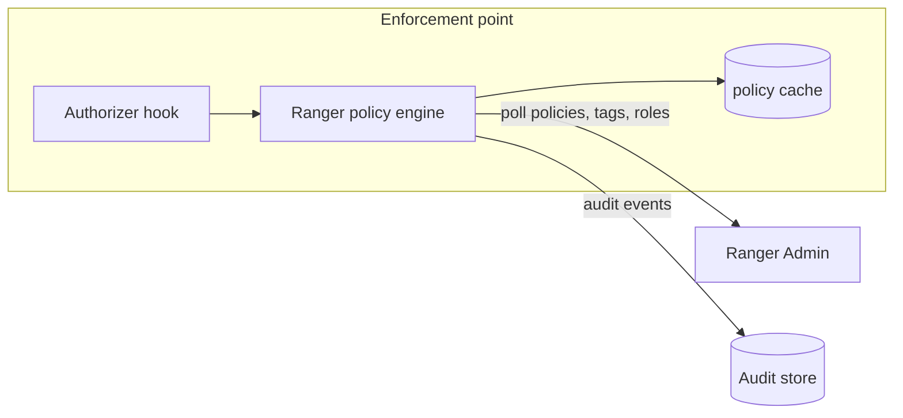

<!---
  Licensed to the Apache Software Foundation (ASF) under one or more
  contributor license agreements.  See the NOTICE file distributed with
  this work for additional information regarding copyright ownership.
  The ASF licenses this file to You under the Apache License, Version 2.0
  (the "License"); you may not use this file except in compliance with
  the License.  You may obtain a copy of the License at

      http://www.apache.org/licenses/LICENSE-2.0

  Unless required by applicable law or agreed to in writing, software
  distributed under the License is distributed on an "AS IS" BASIS,
  WITHOUT WARRANTIES OR CONDITIONS OF ANY KIND, either express or implied.
  See the License for the specific language governing permissions and
  limitations under the License.
-->

# Integrations

Apache Ranger is an authorization and audit framework for data and AI platforms. The same policy model, the
same audit trail and the same administration UI cover open table format catalogs such as Apache Polaris, SQL
engines such as Trino, object stores such as Apache Ozone, streaming platforms such as Apache Kafka, and the
Hadoop ecosystem where Ranger started. Any other application can join through the
authorization API, either embedded in the application or served remotely by the
Ranger PDP.

An integration — traditionally called a Ranger *plugin* — is the piece that runs at the enforcement point:
inside the process that owns the data, or in a policy decision service next to it. Some authorizers are
developed and released by the component's own project (Apache Polaris, Trino and Apache Impala, among
others); the rest are implemented in the `apache/ranger` repository. The [catalog](#catalog) says which is
which. It downloads the policies
of its service from Ranger Admin, caches them locally, authorizes every access request without a network
call, and sends audit records to the configured audit store. Ranger Admin is never on the request path, so
enforcement continues with the last known policies even when Ranger Admin is unavailable.

Every integration is described by a *service definition*, a JSON file in
[`agents-common/src/main/resources/service-defs`](https://github.com/apache/ranger/blob/master/agents-common/src/main/resources/service-defs)
that declares the resources you can protect, the access types you can grant, the configuration Ranger Admin
needs to connect to the component, and optional extras such as data masking, row filtering and policy
conditions. Ranger Admin loads these definitions at startup; the list is controlled by
`ranger.supportedcomponents`, whose default (from `EmbeddedServiceDefsUtil`) contains every integration in
the catalog below plus the internal `tag` and `gds` types.

## Catalog

Newest integrations first. *Where the authorizer ships* tells you which project develops and releases the
enforcement code. Apache Polaris, Trino and Apache Impala ship their Ranger authorizer in their own projects,
and so do Apache Kudu, Apache NiFi, NiFi Registry and Schema Registry; for these, the `apache/ranger`
repository supplies the service definition and the Ranger Admin side (*Test Connection*, resource lookup).
Every other authorizer in the catalog is implemented in the
[`apache/ranger`](https://github.com/apache/ranger) repository and is released as a plugin archive by Ranger.

| Integration | Enforcement point | Resources | Where the authorizer ships |
|---|---|---|---|
| [Apache Polaris](polaris.md) | Polaris server | `root` › `catalog` › `namespace` › `table`, `policy`; `root` › `principal` | Apache Polaris |
| [Trino](trino.md) | Trino coordinator | `catalog` › `schema` › `table` › `column`; functions, procedures, session properties, users, queries, roles | Trino |
| [Apache Impala](hive.md#apache-impala) | `impalad` and `catalogd` daemons | Same as Hive: Impala is authorized through a Ranger service of type `hive`; see [Impala's authorization documentation](https://impala.apache.org/docs/build/html/topics/impala_authorization.html) | Apache Impala |
| [Ozone](ozone.md) | Ozone Manager | `volume` › `bucket` › `key`; `role` | `apache/ranger` |
| [Nested structure](nestedstructure.md) | Any Java application that calls the library | `schema` › `field` | `apache/ranger` (library) |
| [Kudu](kudu.md) | Kudu master and tablet servers | `database` › `table` › `column` | Apache Kudu |
| [Schema Registry](schema-registry.md) | Schema Registry server | `schema-group` › `schema-metadata` › `schema-branch` › `schema-version`; `registry-service`; `serde` | Schema Registry project |
| [Presto](presto.md) | Presto coordinator (PrestoSQL 333) | `catalog` › `schema` › `table` › `column`; functions, procedures, session properties, users | `apache/ranger` |
| [Elasticsearch](elasticsearch.md) | Elasticsearch nodes | `index` | `apache/ranger` |
| [Kylin](kylin.md) | Kylin server | `project` | `apache/ranger` |
| [Sqoop](sqoop.md) | Sqoop 2 server | `connector`, `link`, `job` | `apache/ranger` |
| [NiFi Registry](nifi-registry.md) | NiFi Registry server | `nifi-registry-resource` | Apache NiFi |
| [NiFi](nifi.md) | NiFi nodes | `nifi-resource` | Apache NiFi |
| [Atlas](atlas.md) | Atlas server | types, entities, classifications, labels, business metadata, relationships, `atlas-service` | `apache/ranger` |
| [Kafka](kafka.md) | Kafka brokers | `topic`, `consumergroup`, `transactionalid`, `cluster`, `delegationtoken` | `apache/ranger` |
| [Solr](solr.md) | Solr nodes | `collection`, `config`, `schema`, `admin` | `apache/ranger` |
| [KMS](kms.md) | Ranger KMS server | `keyname` | `apache/ranger` |
| [YARN](yarn.md) | ResourceManager | `queue` | `apache/ranger` |
| [Knox](knox.md) | Knox gateway | `topology` › `service` | `apache/ranger` |
| [Storm](storm.md) | Nimbus | `topology` | `apache/ranger` |
| [HBase](hbase.md) | HBase Master and RegionServers | `table` › `column-family` › `column` | `apache/ranger` |
| [Hive](hive.md) | HiveServer2 | `database` › `table` › `column`; `udf`; `url`; `hiveservice`; `global` | `apache/ranger` |
| [HDFS](hdfs.md) | NameNode | `path` | `apache/ranger` |

Access types are listed on each integration's page. The service definitions for ABFS and WASB storage
paths, and the internal `tag` and `gds` types, are described in
[Other service definitions](other-service-definitions.md).

Column masking and row filtering are available where the definition includes a `dataMaskDef` /
`rowFilterDef` (Hive, Trino, Presto, nested structure). Policy conditions available out of the box vary by
definition: `ip-range` (`RangerIpMatcher`) is declared for Kafka, Knox, Solr, Schema Registry, Ozone and
ABFS; Ozone also has `action-matches`; the tag definition adds `accessed-after-expiry` and a JavaScript
`expression` condition.

## Two ways to embed Ranger

Authorizers are built on one of two Ranger libraries:

- **`RangerBasePlugin`** (`ranger-plugins-common`) — the API used by most integrations in the catalog. It
  reads the XML configuration files described below.
- **Authorization API** (`ranger-authz-api`, `authz-embedded`, `authz-remote`) — the newer, engine-neutral
  API used by the Apache Polaris authorizer and by the Ranger PDP. It is configured with flat properties and
  lets an application switch between in-process and remote evaluation.

## Common configuration files

Integrations built on `RangerBasePlugin` share the same configuration conventions. `<type>` is the service
type, for example `hive` or `trino`.

`ranger-<type>-security.xml`
:   Which Ranger Admin to contact (`ranger.plugin.<type>.policy.rest.url`), which service's policies to
    enforce (`ranger.plugin.<type>.service.name`), the polling interval
    (`ranger.plugin.<type>.policy.pollIntervalMs`, default 30000) and the policy cache directory
    (`ranger.plugin.<type>.policy.cache.dir`).

`ranger-<type>-audit.xml`
:   Audit switch and destinations (`xasecure.audit.is.enabled`, `xasecure.audit.destination.solr`,
    `xasecure.audit.destination.elasticsearch`, `xasecure.audit.destination.hdfs`,
    `xasecure.audit.destination.log4j`, `xasecure.audit.destination.auditserver`, ...).

`ranger-<type>-policymgr-ssl.xml` or `ranger-policymgr-ssl.xml`
:   Truststore and keystore for TLS between the integration and Ranger Admin
    (`xasecure.policymgr.clientssl.*`). The file name is the one given in
    `ranger.plugin.<type>.policy.rest.ssl.config.file`.

Each page states where the component expects these files and what must be set in the component's own
configuration to activate Ranger.

To try integrations locally, use the compose files in `dev-support/ranger-docker`, which cover HDFS and
YARN, HBase, Hive, Kafka, Knox, Ozone, Trino and KMS; each of those pages has a *Try it with Docker* section,
and Run Ranger with Docker describes the full environment.

## Adding your own

If your application is not in the catalog, define a new service type and embed Ranger in it; see
[Writing a custom plugin](custom-plugin.md) and the Authorization API. Applications
that cannot embed a Java library can call the Ranger PDP over REST.
