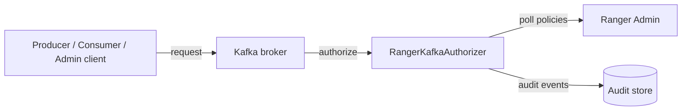

<!---
  Licensed to the Apache Software Foundation (ASF) under one or more
  contributor license agreements.  See the NOTICE file distributed with
  this work for additional information regarding copyright ownership.
  The ASF licenses this file to You under the Apache License, Version 2.0
  (the "License"); you may not use this file except in compliance with
  the License.  You may obtain a copy of the License at

      http://www.apache.org/licenses/LICENSE-2.0

  Unless required by applicable law or agreed to in writing, software
  distributed under the License is distributed on an "AS IS" BASIS,
  WITHOUT WARRANTIES OR CONDITIONS OF ANY KIND, either express or implied.
  See the License for the specific language governing permissions and
  limitations under the License.
-->

# Apache Kafka

The Ranger Kafka plugin controls who can publish to, consume from, create, delete and configure Kafka
topics, consumer groups, transactional ids, delegation tokens and the cluster itself. It runs inside every
Kafka broker as the broker's `Authorizer` implementation, so there is no extra process to deploy: the
broker asks the plugin for a decision on each request, and the plugin answers from policies it keeps in
memory.

Policies are written centrally in Ranger Admin. Each broker downloads them on a schedule (pull model),
caches them on local disk, and keeps enforcing the last known policies even if Ranger Admin is unavailable.
Every decision can be sent to the audit store you configure.



## Requirements

- A Ranger Admin instance that every broker can reach over HTTP or HTTPS.
- An audit store (Ranger audit server, Solr, Elasticsearch/OpenSearch, HDFS, ...) if auditing is enabled.
- A Kafka release that offers the `org.apache.kafka.server.authorizer.Authorizer` interface. Ranger master
  builds the plugin against Kafka **3.9.1** (`kafka.version` in the root
  [`pom.xml`](https://github.com/apache/ranger/blob/master/pom.xml)).
- The plugin jars from the `ranger-<version>-kafka-plugin` archive built by Ranger. Copy the contents of its
  `lib/` directory (the shim jars and the `ranger-kafka-plugin-impl/` directory) into the broker's `libs/`
  directory on every broker host.
- Authenticated listeners (SASL or TLS client authentication) if policies are to be written for named
  users; see [Behavior notes](#behavior-notes) for unauthenticated listeners.

## Configuration

Activate the plugin in each broker's `server.properties`:

```properties title="server.properties"
# MANDATORY: makes the Ranger plugin the broker's authorizer.
authorizer.class.name=org.apache.ranger.authorization.kafka.authorizer.RangerKafkaAuthorizer

# Principals that bypass authorization, typically the brokers themselves. Every User:<name> entry
# (entries are separated by ;) is added to the plugin's super-user list and is allowed without
# evaluating policies. Principal types other than User are ignored. Default: not set.
super.users=User:kafka

# Name of the listener whose JAAS context the plugin uses to log in for Kerberized policy download
# and auditing. SASL_PLAINTEXT resolves to the sasl_plaintext.KafkaServer JAAS section and falls
# back to KafkaServer.
ranger.jaas.context=SASL_PLAINTEXT
```

The Ranger configuration files described below must be on the broker classpath. A common arrangement is
to place them in the broker's `config/` directory and start the broker with that directory in `CLASSPATH`.
Restart every broker after changing any of these files.

### ranger-kafka-security.xml

This file names the Ranger service whose policies are enforced, tells the plugin where Ranger Admin is, and
controls how policies are downloaded and cached. The plugin loads it from the classpath, so place it in
a directory on the broker classpath, for example the broker's `config/` directory. `ranger.plugin.kafka.service.name` and
`ranger.plugin.kafka.policy.rest.url` are mandatory; every other property has a working default.

```xml title="ranger-kafka-security.xml"
<configuration>
  <!-- Connection to Ranger Admin -->
  <property>
    <name>ranger.plugin.kafka.service.name</name>
    <value>dev_kafka</value>
    <description>MANDATORY: Name of the service in Ranger Admin whose policies this plugin
      enforces.</description>
  </property>
  <property>
    <name>ranger.plugin.kafka.policy.rest.url</name>
    <value>http://ranger-admin:6080</value>
    <description>MANDATORY: URL of Ranger Admin. Separate several URLs with commas for Ranger Admin
      high availability.</description>
  </property>
  <property>
    <name>ranger.plugin.kafka.policy.rest.ssl.config.file</name>
    <value>/opt/kafka/config/ranger-policymgr-ssl.xml</value>
    <description>Path to ranger-policymgr-ssl.xml. Needed only when the Ranger Admin URL uses https.
      Default: not set.</description>
  </property>
  <property>
    <name>ranger.plugin.kafka.policy.rest.client.username</name>
    <value></value>
    <description>User for HTTP Basic authentication to Ranger Admin when Kerberos is not used.
      Default: not set.</description>
  </property>
  <property>
    <name>ranger.plugin.kafka.policy.rest.client.password</name>
    <value></value>
    <description>Password for that user. Default: not set.</description>
  </property>
  <property>
    <name>ranger.plugin.kafka.policy.rest.client.connection.timeoutMs</name>
    <value>120000</value>
    <description>Connection timeout for calls to Ranger Admin. Unit: milliseconds.</description>
  </property>
  <property>
    <name>ranger.plugin.kafka.policy.rest.client.read.timeoutMs</name>
    <value>30000</value>
    <description>Read timeout for calls to Ranger Admin. Unit: milliseconds.</description>
  </property>
  <property>
    <name>ranger.plugin.kafka.policy.rest.client.max.retry.attempts</name>
    <value>3</value>
    <description>Number of retries for a failed call to Ranger Admin.</description>
  </property>
  <property>
    <name>ranger.plugin.kafka.policy.rest.client.retry.interval.ms</name>
    <value>1000</value>
    <description>Wait between retries. Unit: milliseconds.</description>
  </property>

  <!-- Policy refresh and cache -->
  <property>
    <name>ranger.plugin.kafka.policy.cache.dir</name>
    <value>/etc/ranger/dev_kafka/policycache</value>
    <description>Directory for the local policy cache (kafka_&lt;service&gt;.json), writable by the
      process user. Lets the plugin start with the last known policies when Ranger Admin is
      unreachable. Default: not set.</description>
  </property>
  <property>
    <name>ranger.plugin.kafka.policy.pollIntervalMs</name>
    <value>30000</value>
    <description>How often the plugin asks Ranger Admin for policy changes. Unit:
      milliseconds.</description>
  </property>
  <property>
    <name>ranger.plugin.kafka.policy.source.impl</name>
    <value>org.apache.ranger.admin.client.RangerAdminRESTClient</value>
    <description>Class that retrieves policies from Ranger Admin.</description>
  </property>

  <!-- Authorization behavior -->
  <property>
    <name>ranger.plugin.kafka.super.users</name>
    <value></value>
    <description>Comma-separated users that are allowed without policy evaluation. Default: not
      set.</description>
  </property>
  <property>
    <name>ranger.plugin.kafka.super.groups</name>
    <value></value>
    <description>Comma-separated groups whose members are allowed without policy evaluation.
      Default: not set.</description>
  </property>
  <property>
    <name>ranger.plugin.kafka.audit.exclude.users</name>
    <value></value>
    <description>Comma-separated users whose accesses are not audited. Default: not
      set.</description>
  </property>
  <property>
    <name>ranger.plugin.kafka.audit.exclude.groups</name>
    <value></value>
    <description>Comma-separated groups whose members' accesses are not audited. Default: not
      set.</description>
  </property>
  <property>
    <name>ranger.plugin.kafka.audit.exclude.roles</name>
    <value></value>
    <description>Comma-separated roles whose members' accesses are not audited. Default: not
      set.</description>
  </property>

  <!-- Users, groups and roles -->
  <property>
    <name>ranger.plugin.kafka.use.rangerGroups</name>
    <value>false</value>
    <description>Add the groups Ranger knows for the user (from UserSync) to each
      request.</description>
  </property>
  <property>
    <name>ranger.plugin.kafka.use.only.rangerGroups</name>
    <value>false</value>
    <description>Ignore the groups supplied by the component and use only the groups Ranger knows
      for the user.</description>
  </property>
</configuration>
```

### ranger-kafka-audit.xml

This file selects where the plugin sends audit events; place it next to `ranger-kafka-security.xml`. Each
destination is switched on with `xasecure.audit.destination.<name>=true` and configured with properties
under the same prefix. No property is mandatory: without an enabled destination, no audit events are
stored. The example sends audits to Solr.

```xml title="ranger-kafka-audit.xml"
<configuration>
  <!-- General -->
  <property>
    <name>xasecure.audit.is.enabled</name>
    <value>true</value>
    <description>Master switch for auditing in this plugin.</description>
  </property>
  <property>
    <name>xasecure.audit.provider.summary.enabled</name>
    <value>false</value>
    <description>Collapse events that differ only in time into one event with a count.</description>
  </property>

  <!-- Audit Server destination -->
  <property>
    <name>xasecure.audit.destination.auditserver</name>
    <value>false</value>
    <description>Send audits to the Ranger Audit Server.</description>
  </property>
  <property>
    <name>xasecure.audit.destination.auditserver.url</name>
    <value></value>
    <description>Audit Server URL. Default: not set.</description>
  </property>

  <!-- Solr destination -->
  <property>
    <name>xasecure.audit.destination.solr</name>
    <value>true</value>
    <description>Send audits to Apache Solr. Default: false.</description>
  </property>
  <property>
    <name>xasecure.audit.destination.solr.urls</name>
    <value>http://solr:8983/solr/ranger_audits</value>
    <description>Solr collection URLs, separated by commas. Ignored when
      xasecure.audit.destination.solr.zookeepers is set. Default: not set.</description>
  </property>
  <property>
    <name>xasecure.audit.destination.solr.zookeepers</name>
    <value></value>
    <description>ZooKeeper connect string of a SolrCloud cluster. Default: not set.</description>
  </property>
  <property>
    <name>xasecure.audit.destination.solr.batch.filespool.dir</name>
    <value>/var/log/kafka/audit/solr/spool</value>
    <description>Local directory where events are spooled while Solr is unreachable. Every enabled
      destination has the same property under its own prefix. Default: not set.</description>
  </property>
  <property>
    <name>xasecure.audit.destination.solr.collection</name>
    <value>ranger_audits</value>
    <description>Collection name when ZooKeeper is used.</description>
  </property>

  <!-- Elasticsearch destination -->
  <property>
    <name>xasecure.audit.destination.elasticsearch</name>
    <value>false</value>
    <description>Send audits to Elasticsearch.</description>
  </property>
  <property>
    <name>xasecure.audit.destination.elasticsearch.urls</name>
    <value></value>
    <description>Elasticsearch host names, separated by commas. Default: not set.</description>
  </property>
  <property>
    <name>xasecure.audit.destination.elasticsearch.port</name>
    <value>9200</value>
    <description>REST port of the Elasticsearch cluster.</description>
  </property>
  <property>
    <name>xasecure.audit.destination.elasticsearch.protocol</name>
    <value>http</value>
    <description>One of: http, https.</description>
  </property>
  <property>
    <name>xasecure.audit.destination.elasticsearch.index</name>
    <value>ranger_audits</value>
    <description>Index that receives the events.</description>
  </property>

  <!-- HDFS destination -->
  <property>
    <name>xasecure.audit.destination.hdfs</name>
    <value>false</value>
    <description>Write audits as files to HDFS or a Hadoop-compatible object store.</description>
  </property>
  <property>
    <name>xasecure.audit.destination.hdfs.dir</name>
    <value></value>
    <description>Base directory, for example hdfs://namenode:8020/ranger/audit. Default: not
      set.</description>
  </property>

  <!-- Log4j destination -->
  <property>
    <name>xasecure.audit.destination.log4j</name>
    <value>false</value>
    <description>Write audits as JSON to a logger of the host process.</description>
  </property>
  <property>
    <name>xasecure.audit.destination.log4j.logger</name>
    <value>ranger.audit.log4j</value>
    <description>Logger name used by the log4j destination.</description>
  </property>
</configuration>
```

Give every enabled destination a spool directory (`xasecure.audit.destination.<name>.batch.filespool.dir`)
so that events survive an outage of the audit store. The queue, spool, Kerberos and TLS options of each
destination, and the [Audit Server](../services/audit-server/service.md) client settings, are in the
[Audit framework](../services/audit/index.md) reference.

### ranger-policymgr-ssl.xml

This file is needed only when Ranger Admin is reached over `https`. The plugin loads it from the path set in
`ranger.plugin.kafka.policy.rest.ssl.config.file`; a file named
`ranger-kafka-policymgr-ssl.xml` on the classpath is picked up automatically. No property is mandatory:
without a truststore the plugin relies on the default truststore of the JVM, and the keystore is needed only
for two-way TLS. Passwords are not stored in the file: they are read from a Hadoop credential store (JCEKS)
under fixed aliases.

```xml title="ranger-policymgr-ssl.xml"
<configuration>
  <!-- Keystore (client certificate, two-way TLS) -->
  <property>
    <name>xasecure.policymgr.clientssl.keystore</name>
    <value></value>
    <description>Keystore with the plugin's client certificate. Needed only when Ranger Admin
      requires client certificates. Default: not set.</description>
  </property>
  <property>
    <name>xasecure.policymgr.clientssl.keystore.credential.file</name>
    <value></value>
    <description>Hadoop credential store (JCEKS) that holds the keystore password under the alias
      sslKeyStore. Default: not set.</description>
  </property>
  <property>
    <name>xasecure.policymgr.clientssl.keystore.type</name>
    <value>jks</value>
    <description>Keystore type.</description>
  </property>

  <!-- Truststore -->
  <property>
    <name>xasecure.policymgr.clientssl.truststore</name>
    <value>/opt/kafka/config/ranger-plugin-truststore.jks</value>
    <description>Truststore that contains the Ranger Admin certificate or its CA. When no truststore
      is configured, the default truststore of the JVM is used. Default: not set.</description>
  </property>
  <property>
    <name>xasecure.policymgr.clientssl.truststore.credential.file</name>
    <value>jceks://file/etc/ranger/dev_kafka/cred.jceks</value>
    <description>Hadoop credential store (JCEKS) that holds the truststore password under the alias
      sslTrustStore. Default: not set.</description>
  </property>
  <property>
    <name>xasecure.policymgr.clientssl.truststore.type</name>
    <value>jks</value>
    <description>Truststore type.</description>
  </property>
</configuration>
```

When Ranger Admin validates client certificates, set `commonNameForCertificate` in the service configuration
to the CN of the plugin's certificate. See [Security hardening](../services/admin/security-hardening.md).

## Service definition in Ranger Admin

Create a service of type **kafka** in Ranger Admin. Its name must equal
`ranger.plugin.kafka.service.name` on the brokers. The service configuration is used by Ranger Admin only,
for **Test Connection** and topic-name lookup while you edit policies.

| Field | Required | Description |
|---|---|---|
| `username` | Yes | User Ranger Admin connects as for the connection test and lookup. |
| `password` | Yes | Password for that user. |
| `zookeeper.connect` | Yes | Kept for compatibility; the lookup client does not use it. Default: `localhost:2181`. |
| `commonNameForCertificate` | No | Expected CN of the plugin's client certificate when Ranger Admin verifies plugin certificates. |
| `ranger.plugin.audit.filters` | No | Default audit filters delivered to the plugin. The default value comes from the service definition. |

Test Connection and lookup use a Kafka `AdminClient` (`ServiceKafkaClient`) to list topics. The client reads
these additional service configs, which you add under *Add New Configurations*: `bootstrap.servers`,
`security.protocol`, `sasl.mechanism`, `kafka.keytab` and `kafka.principal` (the last two are used to build a
Kerberos `sasl.jaas.config`). All five must be set, otherwise Test Connection and lookup fail with a
"JAAS configuration missing" error. Only topic names are looked up; values for the other resources are typed in.

On the authenticated policy download endpoint, Ranger Admin serves the policies of the service only to
admin users and to the users listed in the service configs `policy.download.auth.users` or
`policy.grantrevoke.auth.users`.

## Resources and permissions

The service definition is
[`ranger-servicedef-kafka.json`](https://github.com/apache/ranger/blob/master/agents-common/src/main/resources/service-defs/ranger-servicedef-kafka.json).
It defines five independent, single-level resources; a policy targets exactly one of them. All resources
accept the wildcards `*` and `?`, are matched case-insensitively, and support the *exclude* flag, so a policy
can apply to "every topic except these".

| Resource | Label | Lookup | Access types |
|---|---|---|---|
| `topic` | Topic | Yes | create, delete, configure, alter, alter_configs, describe, describe_configs, consume, publish |
| `consumergroup` | Consumer Group | No | consume, describe, delete |
| `transactionalid` | Transactional Id | No | publish, describe |
| `cluster` | Cluster | No | create, configure, alter, alter_configs, describe, describe_configs, kafka_admin, idempotent_write, cluster_action |
| `delegationtoken` | Delegation Token | No | describe |

### Access types

| Access type | Label | Implied grants |
|---|---|---|
| `publish` | Publish | describe |
| `consume` | Consume | describe |
| `configure` | Configure | describe |
| `describe` | Describe | (none) |
| `create` | Create | (none) |
| `delete` | Delete | describe |
| `alter` | Alter | (none) |
| `alter_configs` | Alter Configs | describe_configs |
| `describe_configs` | Describe Configs | (none) |
| `idempotent_write` | Idempotent Write | (none) |
| `cluster_action` | Cluster Action | (none) |
| `kafka_admin` | Kafka Admin | every other access type |

### How Kafka operations map to access types

The authorizer translates the `AclOperation` of each Kafka action into a Ranger access type
(`RangerKafkaAuthorizer.mapToRangerAccessType`):

| Kafka operation | Ranger access type |
|---|---|
| `READ` | `consume` |
| `WRITE` | `publish` |
| `CREATE` | `create` |
| `DELETE` | `delete` |
| `ALTER` | `configure` |
| `DESCRIBE` | `describe` |
| `DESCRIBE_CONFIGS` | `describe_configs` |
| `ALTER_CONFIGS` | `alter_configs` |
| `CLUSTER_ACTION` | `cluster_action` |
| `IDEMPOTENT_WRITE` | `idempotent_write` |

and the Kafka `ResourceType` into a Ranger resource (`mapToResourceType`):

| Kafka resource type | Ranger resource |
|---|---|
| `TOPIC` | `topic` |
| `GROUP` | `consumergroup` |
| `CLUSTER` | `cluster` |
| `TRANSACTIONAL_ID` | `transactionalid` |
| `DELEGATION_TOKEN` | `delegationtoken` |

Operations `ANY`, `ALL` and `UNKNOWN`, and resource types `ANY` and `UNKNOWN`, are not supported and are
denied. The `authorizeByResourceType` call that newer Kafka versions use for a quick "does this principal
have this operation on any resource" check is not implemented and always returns `DENIED`. Kafka 3.9
uses it only as the fallback for an idempotent producer without a transactional id that lacks
`IDEMPOTENT_WRITE` on the cluster, so such producers must be granted `idempotent_write` on `cluster`.

### Policy conditions

The service definition registers one policy condition, `ip-range` (evaluator `RangerIpMatcher`, multiple
values). Add one or more IP addresses or ranges to a policy item so that it only applies to clients
connecting from those addresses. This is the only way to restrict clients on a non-authenticated
(`PLAINTEXT`) listener, where every client is the `ANONYMOUS` user. See
[policy conditions](../features/policies/policy-conditions.md).

No data masking, row filtering or context enrichers apply to Kafka.

## Default and required policies

When the service is created, Ranger Admin generates one "all" policy per resource (`all - topic`,
`all - consumergroup`, ...). `RangerServiceKafka` adjusts them:

- If `hadoop.security.authentication` in the Ranger Admin configuration is not `kerberos`, the `public` group is added
  to every item of the "all" policies so that a cluster without authentication keeps working. Review and
  tighten these policies.
- When Ranger Admin runs with Kerberos and a lookup principal and keytab (`ranger.lookup.kerberos.principal`,
  `ranger.lookup.kerberos.keytab`), the short name of that principal receives `describe` in each "all" policy
  so that topic lookup keeps working.

What the brokers and clients need:

- **Brokers.** Inter-broker traffic is authorized like any other client. Grant `kafka_admin` (or at least
  `cluster_action` on `cluster`) to the broker principal, or list the broker principals in `super.users`.
- **Producers** need `publish` on the topic. Transactional producers also need `publish` on the
  `transactionalid`; idempotent producers without a transactional id need `idempotent_write` on `cluster`.
- **Consumers** need `consume` on the topic *and* `consume` on the `consumergroup`.

## Behavior notes

- **No fallback.** When the plugin is active there are no native Kafka ACLs to fall back to: a request is
  allowed only if a Ranger policy allows it (or the principal is in `super.users`). Kafka's own ACL
  management calls are routed to the plugin, which does not manage ACLs: `createAcls` and `deleteAcls`
  return a failure for every binding, and `acls` throws `UnsupportedOperationException`. Manage
  everything in Ranger.
- **Topic creation** is checked first as `create` on `cluster`; if that is denied Kafka retries as
  `create` on the specific `topic`, so you can allow creation of, for example, `finance_*` topics only.
  Auto-created topics from producers or consumers need `create` plus the `publish`/`consume` permission on
  the topic.
- **Unauthenticated listeners.** On a `PLAINTEXT` listener every client is `ANONYMOUS`. Policies for
  such clients must grant the `public` group and should be narrowed with the `ip-range` condition, since
  user or group identity cannot be trusted. Do not run producers or consumers you want to restrict on
  broker hosts whose IPs have been granted broad access.
- **Command-line tools.** Tools that use `--bootstrap-server` go through the broker and are authorized by
  the plugin. Older tools that talked to ZooKeeper directly bypassed Ranger; Ranger has no ZooKeeper
  plugin, so protect ZooKeeper with its own ACLs.
- **Group lookup.** The plugin resolves the user's groups with the Hadoop group mapping configured on
  the broker (`MiscUtil.getGroupsForRequestUser`).

## Auditing

Each `authorize` call produces one audit event per action after the batch is evaluated
(`RangerKafkaAuditHandler`). The event carries the user, client IP, resource (`topic`, `consumergroup`,
...), access type, the matching policy id and the result. For topic creation the audit handler skips the
first (cluster-level) denial so that a single record is written for the final decision.

The default audit filter shipped with the service definition (`ranger.plugin.audit.filters`) always records
denied requests, excludes every access of the `kafka` user, and excludes the frequent traffic of the
`atlas`, `rangertagsync`, `hive`, `hbase`, `impala`, `nifi` and `cc_metric_reporter` users on the `ATLAS_*`
and `__CruiseControlMetrics` topics and of `atlas` and `rangertagsync` on consumer groups. See [audit filters](../services/audit/audit-filters.md).

## Try it with Docker

`dev-support/ranger-docker` contains
[`docker-compose.ranger-kafka.yml`](https://github.com/apache/ranger/blob/master/dev-support/ranger-docker/docker-compose.ranger-kafka.yml),
which adds a `ranger-kafka` container (hostname `ranger-kafka.rangernw`, port `9092`) to the Ranger
environment. It depends on the `ranger` and `ranger-zk` containers.

```bash
cd dev-support/ranger-docker
./download-archives.sh kafka
export AUDIT_INDEX_STORE=opensearch
export AUDIT_DESTINATIONS=audit-store-${AUDIT_INDEX_STORE}
docker compose --profile ${AUDIT_DESTINATIONS} \
  -f docker-compose.ranger.yml -f docker-compose.ranger-audit-service.yml \
  -f docker-compose.ranger-kafka.yml up -d
```

The broker enforces the `dev_kafka` service, which the environment creates in Ranger Admin together with a
few starter policies (for example `rangertagsync` on topic `ATLAS_ENTITIES`), and sends audits to the Ranger
audit server. With `KERBEROS_ENABLED=true` (the default in `.env`) the broker uses a `SASL_PLAINTEXT`
listener with GSSAPI, `super.users=User:kafka`, and the service restricts policy download to the `kafka`
user. With Kerberos disabled the environment leaves `authorizer.class.name` commented out, because every
client would be `ANONYMOUS`.

See [Running Ranger with Docker](../getting-started/docker.md) for the rest of the environment.

## Further reading

- [Plugin architecture](../arch/plugin-architecture.md) and [policy model](../arch/policy-model.md)
- [Resource-based policies](../features/policies/resource-policies.md)
- [Audit framework](../services/audit/index.md)
- [FAQ](../getting-started/faq.md), which includes the Kafka questions from the original wiki
- Kafka plugin FAQ on the Ranger wiki: <https://cwiki.apache.org/confluence/display/RANGER/Kafka+Plugin>
- Plugin sources: [`plugin-kafka`](https://github.com/apache/ranger/tree/master/plugin-kafka),
  [`ranger-kafka-plugin-shim`](https://github.com/apache/ranger/tree/master/ranger-kafka-plugin-shim)
