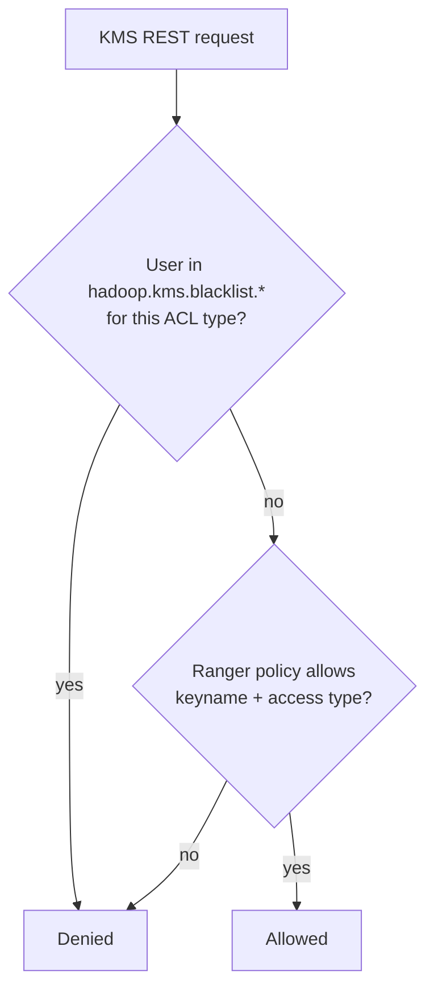

<!---
  Licensed to the Apache Software Foundation (ASF) under one or more
  contributor license agreements.  See the NOTICE file distributed with
  this work for additional information regarding copyright ownership.
  The ASF licenses this file to You under the Apache License, Version 2.0
  (the "License"); you may not use this file except in compliance with
  the License.  You may obtain a copy of the License at

      http://www.apache.org/licenses/LICENSE-2.0

  Unless required by applicable law or agreed to in writing, software
  distributed under the License is distributed on an "AS IS" BASIS,
  WITHOUT WARRANTIES OR CONDITIONS OF ANY KIND, either express or implied.
  See the License for the specific language governing permissions and
  limitations under the License.
-->

# Ranger KMS

[Ranger KMS](../services/kms/service.md) is Ranger's implementation of the Hadoop Key Management
Server, used for HDFS transparent encryption and by other services that need encryption keys. The
Ranger KMS plugin decides **who may do what with which key**: create or delete keys, roll them over,
read key material or metadata, and generate or decrypt the *encrypted encryption keys* (EEK) that HDFS
clients use to read and write encrypted files.

Unlike the other plugins, the KMS plugin does not run inside a third-party product. It is part of
the Ranger KMS distribution and is wired in as the KMS *authorization manager*. Every KMS REST call is
checked by `RangerKmsAuthorizer`, which evaluates the request against the policies of a Ranger service
of type `kms`. Policies are refreshed from Ranger Admin by polling.

Because keys protect data at rest, the `kms` service type is separated from ordinary data services in
Ranger Admin: only users with the **KeyAdmin** role can create KMS services and policies, and the
service appears under the *Encryption* pages of the UI rather than the *Resource* pages.

## Requirements

- A running [Ranger KMS](../services/kms/service.md). The plugin ships with it and always has the same
  version; Ranger KMS is built against Hadoop **3.4.2** (`hadoop.version` in the root `pom.xml`).
- A Ranger Admin instance that Ranger KMS can reach over HTTP or HTTPS, with a service of type `kms`
  defined in it by a KeyAdmin user.
- An audit destination reachable from Ranger KMS, if auditing is enabled.
- No separate jars. The Ranger KMS archive (`ranger-<version>-kms.tar.gz`) already contains the plugin
  under `ews/webapp/WEB-INF/lib`, including the `ranger-kms-plugin-impl` directory.

## Configuration

Two things activate the plugin: the authorization manager in `kms-site.xml`, and the Ranger
configuration files in the KMS configuration directory. Restart Ranger KMS (`ranger-kms stop`, then
`ranger-kms start`) after changing them.

The `kms-site.xml` shipped with Ranger KMS already selects the Ranger authorizer and lets Ranger Admin
act as a proxy user, so that it can list keys on behalf of the KeyAdmin user:

```xml title="kms-site.xml"
<property>
  <name>hadoop.kms.security.authorization.manager</name>
  <value>org.apache.ranger.authorization.kms.authorizer.RangerKmsAuthorizer</value>
</property>
<property>
  <name>hadoop.kms.proxyuser.ranger.groups</name>
  <value>*</value>
</property>
<property>
  <name>hadoop.kms.proxyuser.ranger.hosts</name>
  <value>*</value>
</property>
<property>
  <name>hadoop.kms.proxyuser.ranger.users</name>
  <value>*</value>
</property>
```

The plugin reads `ranger-kms-security.xml` and `ranger-kms-audit.xml` from the classpath, and
`ranger-policymgr-ssl.xml` from the path set in `ranger.plugin.kms.policy.rest.ssl.config.file`. Place
them next to `kms-site.xml` in the KMS configuration directory,
`<kms-home>/ews/webapp/WEB-INF/classes/conf`, readable by the user that runs Ranger KMS.

### ranger-kms-security.xml

This file tells the plugin which Ranger service it enforces, how to reach Ranger Admin and where to cache
policies. Place it in the KMS configuration directory, next to `kms-site.xml`.
`ranger.plugin.kms.service.name` and `ranger.plugin.kms.policy.rest.url` are mandatory; the policy cache
directory lets this Ranger KMS start and keep enforcing policies when Ranger Admin is unreachable.

```xml title="ranger-kms-security.xml"
<configuration>
  <!-- Connection to Ranger Admin -->
  <property>
    <name>ranger.plugin.kms.service.name</name>
    <value>dev_kms</value>
    <description>MANDATORY: Name of the Ranger service whose policies this Ranger KMS
      enforces.</description>
  </property>
  <property>
    <name>ranger.plugin.kms.policy.rest.url</name>
    <value>http://ranger-admin:6080</value>
    <description>MANDATORY: URL of Ranger Admin. Separate several URLs with commas for Ranger Admin
      high availability.</description>
  </property>
  <property>
    <name>ranger.plugin.kms.policy.rest.ssl.config.file</name>
    <value>/etc/ranger/kms/conf/ranger-policymgr-ssl.xml</value>
    <description>Path of ranger-policymgr-ssl.xml. Read when the Ranger Admin URL uses https.
      Default: not set.</description>
  </property>
  <property>
    <name>ranger.plugin.kms.policy.rest.client.username</name>
    <value></value>
    <description>User name sent with HTTP basic authentication when the plugin downloads policies.
      Default: not set.</description>
  </property>
  <property>
    <name>ranger.plugin.kms.policy.rest.client.password</name>
    <value></value>
    <description>Password for policy.rest.client.username. Basic authentication is used only when
      both are set. Default: not set.</description>
  </property>
  <property>
    <name>ranger.plugin.kms.policy.rest.client.connection.timeoutMs</name>
    <value>120000</value>
    <description>Connection timeout for calls to Ranger Admin. Unit: milliseconds.</description>
  </property>
  <property>
    <name>ranger.plugin.kms.policy.rest.client.read.timeoutMs</name>
    <value>30000</value>
    <description>Read timeout for calls to Ranger Admin. Unit: milliseconds.</description>
  </property>
  <property>
    <name>ranger.plugin.kms.policy.rest.client.max.retry.attempts</name>
    <value>3</value>
    <description>Number of retries for a failed call to Ranger Admin.</description>
  </property>
  <property>
    <name>ranger.plugin.kms.policy.rest.client.retry.interval.ms</name>
    <value>1000</value>
    <description>Wait time between retries. Unit: milliseconds.</description>
  </property>

  <!-- Policy refresh and cache -->
  <property>
    <name>ranger.plugin.kms.policy.cache.dir</name>
    <value>/etc/ranger/dev_kms/policycache</value>
    <description>Directory for the policy cache file. It must be writable by the user that runs the
      process. Default: not set.</description>
  </property>
  <property>
    <name>ranger.plugin.kms.policy.pollIntervalMs</name>
    <value>30000</value>
    <description>How often the plugin asks Ranger Admin for policy changes. Unit:
      milliseconds.</description>
  </property>
  <property>
    <name>ranger.plugin.kms.policy.source.impl</name>
    <value>org.apache.ranger.admin.client.RangerAdminRESTClient</value>
    <description>Class that retrieves policies.</description>
  </property>
</configuration>
```

In a Kerberized KMS the authorizer logs in with `ranger.ks.kerberos.principal` and
`ranger.ks.kerberos.keytab` from `dbks-site.xml` before it contacts Ranger Admin; see
[Ranger KMS](../services/kms/service.md).

### ranger-kms-audit.xml

This file selects where the plugin sends audit events; place it next to `ranger-kms-security.xml`. Each
destination is switched on with `xasecure.audit.destination.<name>=true` and configured with properties
under the same prefix. No property is mandatory: without an enabled destination, no audit events are
stored. The example sends audits to Solr.

```xml title="ranger-kms-audit.xml"
<configuration>
  <!-- General -->
  <property>
    <name>xasecure.audit.is.enabled</name>
    <value>true</value>
    <description>Master switch for auditing in this plugin.</description>
  </property>
  <property>
    <name>xasecure.audit.provider.summary.enabled</name>
    <value>false</value>
    <description>Collapse events that differ only in time into one event with a count.</description>
  </property>

  <!-- Audit Server destination -->
  <property>
    <name>xasecure.audit.destination.auditserver</name>
    <value>false</value>
    <description>Send audits to the Ranger Audit Server.</description>
  </property>
  <property>
    <name>xasecure.audit.destination.auditserver.url</name>
    <value></value>
    <description>Audit Server URL. Default: not set.</description>
  </property>

  <!-- Solr destination -->
  <property>
    <name>xasecure.audit.destination.solr</name>
    <value>true</value>
    <description>Send audits to Apache Solr. Default: false.</description>
  </property>
  <property>
    <name>xasecure.audit.destination.solr.urls</name>
    <value>http://solr:8983/solr/ranger_audits</value>
    <description>Solr collection URLs, separated by commas. Ignored when
      xasecure.audit.destination.solr.zookeepers is set. Default: not set.</description>
  </property>
  <property>
    <name>xasecure.audit.destination.solr.zookeepers</name>
    <value></value>
    <description>ZooKeeper connect string of a SolrCloud cluster. Default: not set.</description>
  </property>
  <property>
    <name>xasecure.audit.destination.solr.batch.filespool.dir</name>
    <value>/var/log/ranger/kms/audit/solr/spool</value>
    <description>Local directory where events are spooled while Solr is unreachable. Every enabled
      destination has the same property under its own prefix. Default: not set.</description>
  </property>
  <property>
    <name>xasecure.audit.destination.solr.collection</name>
    <value>ranger_audits</value>
    <description>Collection name when ZooKeeper is used.</description>
  </property>

  <!-- Elasticsearch destination -->
  <property>
    <name>xasecure.audit.destination.elasticsearch</name>
    <value>false</value>
    <description>Send audits to Elasticsearch.</description>
  </property>
  <property>
    <name>xasecure.audit.destination.elasticsearch.urls</name>
    <value></value>
    <description>Elasticsearch host names, separated by commas. Default: not set.</description>
  </property>
  <property>
    <name>xasecure.audit.destination.elasticsearch.port</name>
    <value>9200</value>
    <description>REST port of the Elasticsearch cluster.</description>
  </property>
  <property>
    <name>xasecure.audit.destination.elasticsearch.protocol</name>
    <value>http</value>
    <description>One of: http, https.</description>
  </property>
  <property>
    <name>xasecure.audit.destination.elasticsearch.index</name>
    <value>ranger_audits</value>
    <description>Index that receives the events.</description>
  </property>

  <!-- HDFS destination -->
  <property>
    <name>xasecure.audit.destination.hdfs</name>
    <value>false</value>
    <description>Write audits as files to HDFS or a Hadoop-compatible object store.</description>
  </property>
  <property>
    <name>xasecure.audit.destination.hdfs.dir</name>
    <value></value>
    <description>Base directory, for example hdfs://namenode:8020/ranger/audit. Default: not
      set.</description>
  </property>

  <!-- Log4j destination -->
  <property>
    <name>xasecure.audit.destination.log4j</name>
    <value>false</value>
    <description>Write audits as JSON to a logger of the host process.</description>
  </property>
  <property>
    <name>xasecure.audit.destination.log4j.logger</name>
    <value>ranger.audit.log4j</value>
    <description>Logger name used by the log4j destination.</description>
  </property>
</configuration>
```

Give every enabled destination a spool directory (`xasecure.audit.destination.<name>.batch.filespool.dir`)
so that events survive an outage of the audit store. The queue, spool, Kerberos and TLS options of each
destination, and the Audit Server client settings, are in the
Audit framework reference.

### ranger-policymgr-ssl.xml

This file is needed only when Ranger Admin is reached over `https`. The plugin loads it from the path set in
`ranger.plugin.kms.policy.rest.ssl.config.file`; a file named `ranger-kms-policymgr-ssl.xml` on the
classpath is picked up automatically. No property is mandatory: without a truststore the plugin relies on
the default truststore of the JVM, and the keystore is needed only for two-way TLS. Passwords are not
stored in the file: they are read from a Hadoop credential store (JCEKS) under fixed aliases.

```xml title="ranger-policymgr-ssl.xml"
<configuration>
  <!-- Keystore (client certificate, two-way TLS) -->
  <property>
    <name>xasecure.policymgr.clientssl.keystore</name>
    <value></value>
    <description>Keystore with the plugin's client certificate. Needed only when Ranger Admin
      requires client certificates. Default: not set.</description>
  </property>
  <property>
    <name>xasecure.policymgr.clientssl.keystore.credential.file</name>
    <value></value>
    <description>Hadoop credential store (JCEKS) that holds the keystore password under the alias
      sslKeyStore. Default: not set.</description>
  </property>
  <property>
    <name>xasecure.policymgr.clientssl.keystore.type</name>
    <value>jks</value>
    <description>Keystore type.</description>
  </property>

  <!-- Truststore -->
  <property>
    <name>xasecure.policymgr.clientssl.truststore</name>
    <value>/etc/ranger/kms/conf/ranger-plugin-truststore.jks</value>
    <description>Truststore that contains the Ranger Admin certificate or its CA. When no truststore
      is configured, the default truststore of the JVM is used. Default: not set.</description>
  </property>
  <property>
    <name>xasecure.policymgr.clientssl.truststore.credential.file</name>
    <value>jceks://file/etc/ranger/dev_kms/cred.jceks</value>
    <description>Hadoop credential store (JCEKS) that holds the truststore password under the alias
      sslTrustStore. Default: not set.</description>
  </property>
  <property>
    <name>xasecure.policymgr.clientssl.truststore.type</name>
    <value>jks</value>
    <description>Truststore type.</description>
  </property>
</configuration>
```

When Ranger Admin validates client certificates, set `commonNameForCertificate` in the service configuration
to the CN of the plugin's certificate.

## Service definition in Ranger Admin

Log in as a user with the **KeyAdmin** role, open the **Encryption** section and create a **KMS**
service. Its name must match `ranger.plugin.kms.service.name`.

| Field | Required | Description |
|-------|----------|-------------|
| `provider` | yes | KMS URL, for example `kms://http@<kms-host>:9292/kms`. |
| `username` | yes | User that Ranger Admin connects as for Test Connection and resource lookup. |
| `password` | yes | Password of that user. |
| `ranger.plugin.audit.filters` | no | Default audit filters, downloaded by the plugin together with the policies. Default: see [Auditing](#auditing). |

**Test Connection** and **resource lookup** call the KMS REST API `v1/keys/names` (as the `ranger`
proxy user in Kerberized setups) to list key names for the policy editor. The **Key Manager** page of
the Encryption section lets KeyAdmin users create, roll over and delete keys through the same KMS.

## Resources and permissions

Source:
[`ranger-servicedef-kms.json`](https://github.com/apache/ranger/blob/master/agents-common/src/main/resources/service-defs/ranger-servicedef-kms.json).
It has a single resource:

`keyname`
:   Name of the key. Matching is case-sensitive, wildcards are allowed and resource lookup is
    available. Operations that are not about a specific key (for example listing key names) are
    evaluated with an empty key name, so grant them on `*`.

The access types mirror the Hadoop KMS ACL types (`KMSACLsType.Type`):

| Access type | Category | KMS ACL type | KMS operation |
|-------------|----------|--------------|---------------|
| `create` | CREATE | `CREATE` | Create a key |
| `delete` | DELETE | `DELETE` | Delete a key |
| `rollover` | UPDATE | `ROLLOVER` | Roll a key to a new version |
| `setkeymaterial` | UPDATE | `SET_KEY_MATERIAL` | Supply key material on create/rollover |
| `get` | READ | `GET` | Get key versions and current key material |
| `getkeys` | READ | `GET_KEYS` | List key names |
| `getmetadata` | READ | `GET_METADATA` | Read key metadata |
| `generateeek` | UPDATE | `GENERATE_EEK` | Generate an encrypted encryption key; the NameNode needs it to create files in an encryption zone |
| `decrypteek` | UPDATE | `DECRYPT_EEK` | Decrypt an encrypted encryption key; HDFS clients need it to read or write encrypted files |

Service-definition options: `ui.pages=encryption` (the service is managed from the Encryption
pages) and `security.allowed.roles=keyadmin` (only KeyAdmin users may manage it). There are no
data-masking, row-filter, policy-condition or context-enricher definitions.

## Default policies

When a KMS service is created, Ranger Admin generates the `all - keyname` policy, adds the lookup user
(`username` of the service configuration) to it with `get`, and adds one policy item for each of these
service users on all keys:

| User | `getmetadata` | `generateeek` | `decrypteek` |
|------|---------------|---------------|--------------|
| `hdfs` | yes | yes | no |
| `om` | yes | yes | no |
| `hive` | yes | no | yes |
| `hbase` | no | no | yes |

The user names can be overridden with `ranger.kms.service.user.hdfs`, `ranger.kms.service.user.om`,
`ranger.kms.service.user.hive` and `ranger.kms.service.user.hbase` in the Ranger Admin configuration.

Beyond the defaults, a typical deployment needs:

- `decrypteek` on the zone keys for every user and service that reads or writes encrypted data.
- `create`, `delete`, `rollover`, `get`, `getkeys`, `getmetadata` and `setkeymaterial` on `*` for
  `keyadmin`, for key lifecycle management from the Ranger UI or the `hadoop key` CLI.

!!! danger
    Never grant `decrypteek` on `*` to `public`. It lets any authenticated user decrypt every file in
    every encryption zone, which defeats the purpose of encryption.

## Behavior notes



- The Hadoop KMS **blacklist ACLs** (`hadoop.kms.blacklist.CREATE`, `hadoop.kms.blacklist.DECRYPT_EEK`,
  ...) are still honored and take precedence. Ranger KMS reads them from `dbks-site.xml` (the shipped
  file blacklists the `hdfs` user for `DECRYPT_EEK`), and the plugin reloads them when that file
  changes. The regular `hadoop.kms.acl.*` allow lists are **not** used; Ranger policies replace
  them.
- There is no fallback: a request that matches no Ranger policy is denied. A denied request is
  counted in the KMS *unauthorized calls* meter and logged by the KMS audit log as well as by Ranger.
- Per-key operations are evaluated on the key name; operations without a key (such as `GET_KEYS`)
  are evaluated with an empty key name, which only a policy on `*` matches.

## Auditing

Each KMS request produces an audit event with:

- `resource`: the key name (empty for key-less operations).
- `accessType`: the Ranger access type (`decrypteek`, `create`, ...).
- `clientIP`: the address of the KMS client.

The default audit filter in the service configuration audits all denials and skips operations by the
`keyadmin` user. KMS additionally writes its own audit log
(`kms-audit-<hostname>-<user>.log` in the KMS log directory, appender `kms-audit` in
`kms-logback.xml`) for every authorized and unauthorized call.

## Try it with Docker

Ranger does not publish a Docker image for this service, so the environment is built from source with the compose
files in `dev-support/ranger-docker`, following the
[README](https://github.com/apache/ranger/blob/master/dev-support/ranger-docker/README.md) in that directory.

`docker-compose.ranger-kms.yml` starts a `ranger-kms` container (port 9292). Its plugin pulls policies from
`http://ranger.rangernw:6080`.

Prerequisites: Docker with Compose v2, and a Ranger build in `dev-support/ranger-docker/dist/` (see
Run Ranger with Docker). Then, from `dev-support/ranger-docker`:

```bash
# valid values for RANGER_DB_TYPE: mysql/postgres/oracle
export RANGER_DB_TYPE=postgres

# valid values for AUDIT_INDEX_STORE: opensearch (default) | solr
export AUDIT_INDEX_STORE=opensearch
export AUDIT_DESTINATIONS=audit-store-${AUDIT_INDEX_STORE}

docker compose --profile ${AUDIT_DESTINATIONS} -f docker-compose.ranger.yml -f docker-compose.ranger-audit-service.yml -f docker-compose.ranger-kms.yml up -d
```

The README starts Ranger KMS as part of its *ranger-core services* command, together with UserSync, TagSync
and PDP; the line above is the subset of that command needed for KMS.

When Ranger Admin becomes ready, its bootstrap script `scripts/admin/create-ranger-services.py` creates the
Ranger service `dev_kms`, which the plugin in the container enforces.

To verify:

- `docker logs ranger` shows `dev_kms service created` (or `dev_kms service already exists` on a restart).
- In Ranger Admin at `http://localhost:6080` (`admin` / `rangerR0cks!`), the service appears in the
  service manager and **Audit → Plugin Status** lists `dev_kms` once the plugin has downloaded its policies.
- `docker logs ranger-kms` shows Ranger KMS starting, and port 9292 is published on the host.

Run Ranger with Docker describes the full environment: building Ranger, the
audit services, Kerberos, test users and cleanup.

## Further reading

- [Ranger KMS](../services/kms/service.md): configuration, database, Kerberos, REST API
- Source: [`plugin-kms`](https://github.com/apache/ranger/tree/master/plugin-kms),
  [`kms`](https://github.com/apache/ranger/tree/master/kms)
