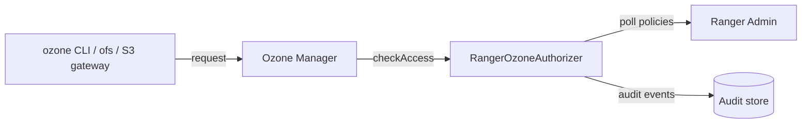

<!---
  Licensed to the Apache Software Foundation (ASF) under one or more
  contributor license agreements.  See the NOTICE file distributed with
  this work for additional information regarding copyright ownership.
  The ASF licenses this file to You under the Apache License, Version 2.0
  (the "License"); you may not use this file except in compliance with
  the License.  You may obtain a copy of the License at

      http://www.apache.org/licenses/LICENSE-2.0

  Unless required by applicable law or agreed to in writing, software
  distributed under the License is distributed on an "AS IS" BASIS,
  WITHOUT WARRANTIES OR CONDITIONS OF ANY KIND, either express or implied.
  See the License for the specific language governing permissions and
  limitations under the License.
-->

# Apache Ozone

Apache Ozone is a distributed object store organized as **volumes**, which contain **buckets**, which
contain **keys** (objects). The Ranger Ozone plugin controls who may read, write, create, list and delete
at each of these levels, who may read or change their ACLs, and, when Ozone's S3 gateway is used, which S3
operations a policy covers.

The plugin runs inside the **Ozone Manager (OM)** as its `IAccessAuthorizer` implementation
(`org.apache.ranger.authorization.ozone.authorizer.RangerOzoneAuthorizer`, configured in
`ozone-site.xml`). Every OM access check becomes a Ranger request. Policies are downloaded from Ranger
Admin on a schedule, cached on the OM host and enforced even when Ranger Admin is down.



## Requirements

- A Ranger Admin instance that every Ozone Manager can reach over HTTP or HTTPS.
- An audit store if auditing is enabled.
- Apache Ozone. Ranger master builds the plugin against Ozone **2.1.1** (`ozone.version` in the root
  [`pom.xml`](https://github.com/apache/ranger/blob/master/pom.xml)); the Docker environment runs the same
  version.
- The plugin jars from the `ranger-<version>-ozone-plugin` archive built by Ranger. Its `lib/libext/`
  directory holds the shim, `ranger-plugin-classloader` and a `ranger-ozone-plugin-impl/` directory with the
  implementation jars. Keep that directory together on every OM host, for example under
  `$OZONE_HOME/ranger-ozone-plugin`.

## Configuration

Activate the plugin by turning on ACLs and naming the Ranger class as the authorizer in the OM's
`ozone-site.xml`:

```xml title="ozone-site.xml"
<property>
  <name>ozone.acl.enabled</name>
  <value>true</value>
</property>
<property>
  <name>ozone.acl.authorizer.class</name>
  <value>org.apache.ranger.authorization.ozone.authorizer.RangerOzoneAuthorizer</value>
</property>
```

Put the plugin jars and the directory holding the Ranger configuration files on the OM classpath:

```bash title="ozone-env.sh"
export OZONE_MANAGER_CLASSPATH="${OZONE_HOME}/ranger-ozone-plugin/lib/libext/*:${OZONE_HOME}/ranger-ozone-plugin/conf:${OZONE_HOME}/share/ozone/lib/javax.annotation-api-*.jar"
```

The `javax.annotation-api` jar ships with Ozone but is not on the default OM classpath; the plugin's Jersey
client needs it for Kerberized policy download. Place the Ranger configuration files described below in the
`conf` directory named in that classpath, and restart the OM.

### ranger-ozone-security.xml

This file names the Ranger service whose policies are enforced, tells the plugin where Ranger Admin is, and
controls how policies are downloaded and cached. The plugin loads it from the classpath, so place it in
the `conf` directory on the Ozone Manager's classpath. `ranger.plugin.ozone.service.name` and
`ranger.plugin.ozone.policy.rest.url` are mandatory; every other property has a working default.

```xml title="ranger-ozone-security.xml"
<configuration>
  <!-- Connection to Ranger Admin -->
  <property>
    <name>ranger.plugin.ozone.service.name</name>
    <value>dev_ozone</value>
    <description>MANDATORY: Name of the service in Ranger Admin whose policies this plugin
      enforces.</description>
  </property>
  <property>
    <name>ranger.plugin.ozone.policy.rest.url</name>
    <value>http://ranger-admin:6080</value>
    <description>MANDATORY: URL of Ranger Admin. Separate several URLs with commas for Ranger Admin
      high availability.</description>
  </property>
  <property>
    <name>ranger.plugin.ozone.policy.rest.ssl.config.file</name>
    <value>/opt/hadoop/ranger-ozone-plugin/conf/ranger-policymgr-ssl.xml</value>
    <description>Path to ranger-policymgr-ssl.xml. Needed only when the Ranger Admin URL uses https.
      Default: not set.</description>
  </property>
  <property>
    <name>ranger.plugin.ozone.policy.rest.client.username</name>
    <value></value>
    <description>User for HTTP Basic authentication to Ranger Admin when Kerberos is not used.
      Default: not set.</description>
  </property>
  <property>
    <name>ranger.plugin.ozone.policy.rest.client.password</name>
    <value></value>
    <description>Password for that user. Default: not set.</description>
  </property>
  <property>
    <name>ranger.plugin.ozone.policy.rest.client.connection.timeoutMs</name>
    <value>120000</value>
    <description>Connection timeout for calls to Ranger Admin. Unit: milliseconds.</description>
  </property>
  <property>
    <name>ranger.plugin.ozone.policy.rest.client.read.timeoutMs</name>
    <value>30000</value>
    <description>Read timeout for calls to Ranger Admin. Unit: milliseconds.</description>
  </property>
  <property>
    <name>ranger.plugin.ozone.policy.rest.client.max.retry.attempts</name>
    <value>3</value>
    <description>Number of retries for a failed call to Ranger Admin.</description>
  </property>
  <property>
    <name>ranger.plugin.ozone.policy.rest.client.retry.interval.ms</name>
    <value>1000</value>
    <description>Wait between retries. Unit: milliseconds.</description>
  </property>

  <!-- Policy refresh and cache -->
  <property>
    <name>ranger.plugin.ozone.policy.cache.dir</name>
    <value>/etc/ranger/dev_ozone/policycache</value>
    <description>Directory for the local policy cache (ozone_&lt;service&gt;.json), writable by the
      process user. Lets the plugin start with the last known policies when Ranger Admin is
      unreachable. Default: not set.</description>
  </property>
  <property>
    <name>ranger.plugin.ozone.policy.pollIntervalMs</name>
    <value>30000</value>
    <description>How often the plugin asks Ranger Admin for policy changes. Unit:
      milliseconds.</description>
  </property>
  <property>
    <name>ranger.plugin.ozone.policy.source.impl</name>
    <value>org.apache.ranger.admin.client.RangerAdminRESTClient</value>
    <description>Class that retrieves policies from Ranger Admin.</description>
  </property>

  <!-- Authorization behavior -->
  <property>
    <name>ranger.plugin.ozone.super.users</name>
    <value></value>
    <description>Comma-separated users that are allowed without policy evaluation. Default: not
      set.</description>
  </property>
  <property>
    <name>ranger.plugin.ozone.super.groups</name>
    <value></value>
    <description>Comma-separated groups whose members are allowed without policy evaluation.
      Default: not set.</description>
  </property>
  <property>
    <name>ranger.plugin.ozone.audit.exclude.users</name>
    <value></value>
    <description>Comma-separated users whose accesses are not audited. Default: not
      set.</description>
  </property>
  <property>
    <name>ranger.plugin.ozone.audit.exclude.groups</name>
    <value></value>
    <description>Comma-separated groups whose members' accesses are not audited. Default: not
      set.</description>
  </property>
  <property>
    <name>ranger.plugin.ozone.audit.exclude.roles</name>
    <value></value>
    <description>Comma-separated roles whose members' accesses are not audited. Default: not
      set.</description>
  </property>

  <!-- Users, groups and roles -->
  <property>
    <name>ranger.plugin.ozone.use.rangerGroups</name>
    <value>false</value>
    <description>Add the groups Ranger knows for the user (from UserSync) to each
      request.</description>
  </property>
  <property>
    <name>ranger.plugin.ozone.use.only.rangerGroups</name>
    <value>false</value>
    <description>Ignore the groups supplied by the component and use only the groups Ranger knows
      for the user.</description>
  </property>
</configuration>
```

### ranger-ozone-audit.xml

This file selects where the plugin sends audit events; place it next to `ranger-ozone-security.xml`. Each
destination is switched on with `xasecure.audit.destination.<name>=true` and configured with properties
under the same prefix. No property is mandatory: without an enabled destination, no audit events are
stored. The example sends audits to Solr.

```xml title="ranger-ozone-audit.xml"
<configuration>
  <!-- General -->
  <property>
    <name>xasecure.audit.is.enabled</name>
    <value>true</value>
    <description>Master switch for auditing in this plugin.</description>
  </property>
  <property>
    <name>xasecure.audit.provider.summary.enabled</name>
    <value>false</value>
    <description>Collapse events that differ only in time into one event with a count.</description>
  </property>

  <!-- Audit Server destination -->
  <property>
    <name>xasecure.audit.destination.auditserver</name>
    <value>false</value>
    <description>Send audits to the Ranger Audit Server.</description>
  </property>
  <property>
    <name>xasecure.audit.destination.auditserver.url</name>
    <value></value>
    <description>Audit Server URL. Default: not set.</description>
  </property>

  <!-- Solr destination -->
  <property>
    <name>xasecure.audit.destination.solr</name>
    <value>true</value>
    <description>Send audits to Apache Solr. Default: false.</description>
  </property>
  <property>
    <name>xasecure.audit.destination.solr.urls</name>
    <value>http://solr:8983/solr/ranger_audits</value>
    <description>Solr collection URLs, separated by commas. Ignored when
      xasecure.audit.destination.solr.zookeepers is set. Default: not set.</description>
  </property>
  <property>
    <name>xasecure.audit.destination.solr.zookeepers</name>
    <value></value>
    <description>ZooKeeper connect string of a SolrCloud cluster. Default: not set.</description>
  </property>
  <property>
    <name>xasecure.audit.destination.solr.batch.filespool.dir</name>
    <value>/var/log/ozone/audit/solr/spool</value>
    <description>Local directory where events are spooled while Solr is unreachable. Every enabled
      destination has the same property under its own prefix. Default: not set.</description>
  </property>
  <property>
    <name>xasecure.audit.destination.solr.collection</name>
    <value>ranger_audits</value>
    <description>Collection name when ZooKeeper is used.</description>
  </property>

  <!-- Elasticsearch destination -->
  <property>
    <name>xasecure.audit.destination.elasticsearch</name>
    <value>false</value>
    <description>Send audits to Elasticsearch.</description>
  </property>
  <property>
    <name>xasecure.audit.destination.elasticsearch.urls</name>
    <value></value>
    <description>Elasticsearch host names, separated by commas. Default: not set.</description>
  </property>
  <property>
    <name>xasecure.audit.destination.elasticsearch.port</name>
    <value>9200</value>
    <description>REST port of the Elasticsearch cluster.</description>
  </property>
  <property>
    <name>xasecure.audit.destination.elasticsearch.protocol</name>
    <value>http</value>
    <description>One of: http, https.</description>
  </property>
  <property>
    <name>xasecure.audit.destination.elasticsearch.index</name>
    <value>ranger_audits</value>
    <description>Index that receives the events.</description>
  </property>

  <!-- HDFS destination -->
  <property>
    <name>xasecure.audit.destination.hdfs</name>
    <value>false</value>
    <description>Write audits as files to HDFS or a Hadoop-compatible object store.</description>
  </property>
  <property>
    <name>xasecure.audit.destination.hdfs.dir</name>
    <value></value>
    <description>Base directory, for example hdfs://namenode:8020/ranger/audit. Default: not
      set.</description>
  </property>

  <!-- Log4j destination -->
  <property>
    <name>xasecure.audit.destination.log4j</name>
    <value>false</value>
    <description>Write audits as JSON to a logger of the host process.</description>
  </property>
  <property>
    <name>xasecure.audit.destination.log4j.logger</name>
    <value>ranger.audit.log4j</value>
    <description>Logger name used by the log4j destination.</description>
  </property>
</configuration>
```

Give every enabled destination a spool directory (`xasecure.audit.destination.<name>.batch.filespool.dir`)
so that events survive an outage of the audit store. The queue, spool, Kerberos and TLS options of each
destination, and the Audit Server client settings, are in the
Audit framework reference.

### ranger-policymgr-ssl.xml

This file is needed only when Ranger Admin is reached over `https`. The plugin loads it from the path set in
`ranger.plugin.ozone.policy.rest.ssl.config.file`; a file named
`ranger-ozone-policymgr-ssl.xml` on the classpath is picked up automatically. No property is mandatory:
without a truststore the plugin relies on the default truststore of the JVM, and the keystore is needed only
for two-way TLS. Passwords are not stored in the file: they are read from a Hadoop credential store (JCEKS)
under fixed aliases.

```xml title="ranger-policymgr-ssl.xml"
<configuration>
  <!-- Keystore (client certificate, two-way TLS) -->
  <property>
    <name>xasecure.policymgr.clientssl.keystore</name>
    <value></value>
    <description>Keystore with the plugin's client certificate. Needed only when Ranger Admin
      requires client certificates. Default: not set.</description>
  </property>
  <property>
    <name>xasecure.policymgr.clientssl.keystore.credential.file</name>
    <value></value>
    <description>Hadoop credential store (JCEKS) that holds the keystore password under the alias
      sslKeyStore. Default: not set.</description>
  </property>
  <property>
    <name>xasecure.policymgr.clientssl.keystore.type</name>
    <value>jks</value>
    <description>Keystore type.</description>
  </property>

  <!-- Truststore -->
  <property>
    <name>xasecure.policymgr.clientssl.truststore</name>
    <value>/opt/hadoop/ranger-ozone-plugin/conf/ranger-plugin-truststore.jks</value>
    <description>Truststore that contains the Ranger Admin certificate or its CA. When no truststore
      is configured, the default truststore of the JVM is used. Default: not set.</description>
  </property>
  <property>
    <name>xasecure.policymgr.clientssl.truststore.credential.file</name>
    <value>jceks://file/etc/ranger/dev_ozone/cred.jceks</value>
    <description>Hadoop credential store (JCEKS) that holds the truststore password under the alias
      sslTrustStore. Default: not set.</description>
  </property>
  <property>
    <name>xasecure.policymgr.clientssl.truststore.type</name>
    <value>jks</value>
    <description>Truststore type.</description>
  </property>
</configuration>
```

When Ranger Admin validates client certificates, set `commonNameForCertificate` in the service configuration
to the CN of the plugin's certificate.

## Service definition in Ranger Admin

Create a service of type **ozone** in Ranger Admin. Its name must equal `ranger.plugin.ozone.service.name`
on the Ozone Manager.

| Field | Required | Description |
|---|---|---|
| `username` | Yes | User for the connection test and resource lookup. |
| `password` | Yes | Password for that user. |
| `ozone.om.http-address` | Yes | OM HTTP address (label *Ozone URL*), for example `om-host:9874`. |
| `hadoop.security.authentication` | Yes | One of `simple`, `kerberos`. Default: `simple`. |
| `hadoop.security.authorization` | No | Whether the cluster has authorization enabled. Default: `false`. |
| `hadoop.security.auth_to_local` | No | Rules that map Kerberos principals to user names. |
| `ranger.plugin.audit.filters` | No | Default audit filters delivered to the plugin. The default value comes from the service definition and audits denied requests only. |

**Test Connection** and **lookup** (`OzoneClient`) copy every non-Ranger config of the service into an
`OzoneConfiguration` and open an Ozone RPC client for the first entry of `ozone.om.service.ids`
(default `ozone1`). Test Connection lists volumes, and lookup autocompletes volumes, buckets and keys.
Add the Ozone client properties your cluster needs (for example `ozone.om.address`, or
`ozone.om.service.ids` and the matching `ozone.om.nodes.*`/`ozone.om.address.*` entries for OM HA) as
extra service configs so that the client can connect.

On the authenticated policy download endpoint, Ranger Admin serves the policies of the service only to
admin users and to the users listed in the service configs `policy.download.auth.users` or
`policy.grantrevoke.auth.users`.

## Resources and permissions

The service definition is
[`ranger-servicedef-ozone.json`](https://github.com/apache/ranger/blob/master/agents-common/src/main/resources/service-defs/ranger-servicedef-ozone.json).
All resources accept wildcards and offer lookup.

| Resource | Parent | Case sensitive | Recursive | Description |
|---|---|---|---|---|
| `volume` | (none) | Yes | No | Ozone volume. |
| `bucket` | `volume` | No | No | Bucket inside the volume. |
| `key` | `bucket` | No | Yes | Key (object) inside the bucket; the value is the full key name. |
| `role` | (none) | Yes | No | Role that S3 clients may assume. Separate from the storage hierarchy. |

Every level of the storage hierarchy is a valid leaf, so a policy can stop at a volume, a bucket or a key.
`volume`, `bucket` and `key` support the *exclude* flag; `role` does not.

| Access type | Label |
|---|---|
| `read` | Read |
| `write` | Write |
| `create` | Create |
| `list` | List |
| `delete` | Delete |
| `read_acl` | Read_ACL |
| `write_acl` | Write_ACL |
| `all` | All |
| `assume_role` | Assume_Role |

`assume_role` applies to `role` only; the other access types apply to `volume`, `bucket` and `key`. `all`
implies the seven storage access types; no other access type has implied grants. Ozone's `ACLType`
values map one-to-one onto these names (`READ` to `read`, `WRITE_ACL` to `write_acl`, ...). A request with
any other ACL type is denied.

### Policy conditions

`ip-range`
:   Evaluator `RangerIpMatcher`. Client IP addresses or ranges; the OM passes the caller's IP.

`action-matches`
:   Evaluator `RangerActionMatcher`. S3 action names. Only offered when the action matcher feature is
    enabled, as described below.

No masking, row filters or context enrichers are defined. The `owner` of the volume, bucket or key is passed
as the resource owner, so the `{OWNER}` macro works in policies.

### The Ozone action matcher

Ozone's S3 gateway translates each S3 call (`GetObject`, `PutObject`, `ListBucket`, ...) into one or more
OM access checks with a generic ACL type such as `read`. The **action matcher** lets a policy be limited
to specific S3 actions on top of the access type. It has three parts:

1. **Ranger Admin.** The Boolean property
   `ranger.servicedef.ozone.enableActionMatcherInPoliciesCondition` in `ranger-admin-site.xml` (default
   `false`) turns the feature on; restart Ranger Admin after changing it. When serving the `ozone` service
   definition, `RangerServiceDefService` sets the option `enableActionMatcherInPoliciesCondition` to that
   value and adds or removes the `action-matches` policy condition accordingly. The policy UI then shows an
   *Action* condition with a pick list of S3 actions and prefixes such as `Get*`, `List*`, `Put*`,
   `Delete*` and `Create*`.
2. **Plugin.** `RangerOzoneAuthorizer` reads the same option from the downloaded service definition. If
   it is on, the request's *action* is set to the S3 action reported by the OM (`context.getS3Action()`);
   otherwise the action is the access type.
3. **Evaluator.** `RangerActionMatcher` compares the request action with the condition values,
   case-insensitively: exact names match exactly, a trailing `*` matches a prefix, and `*` (or an empty
   list) matches everything. When the condition lists actions but the request carries none, it does not
   match.

Each S3 action still needs the right access types. The UI reads
[`actionRequirements/ozone.json`](https://github.com/apache/ranger/blob/master/security-admin/src/main/webapp/react-webapp/src/utils/actionRequirements/ozone.json)
to show what a policy item must grant per resource level, for example:

| S3 action | On `volume` | On `bucket` | On `key` |
|---|---|---|---|
| `ListAllMyBuckets` | read, list | (none) | (none) |
| `ListBucket` | read | read, list | read |
| `CreateBucket` | read | create | (none) |
| `DeleteBucket` | read | delete | (none) |
| `GetBucketAcl` | read | read, read_acl | (none) |
| `PutBucketAcl` | read | read, read_acl, write_acl | (none) |
| `GetObject` | read | read | read |
| `PutObject` | read | read | create, write |
| `DeleteObject` | read | read | delete |

### Assume role and session policies

Ozone can call `generateAssumeRoleSessionPolicy(AssumeRoleRequest)` when an S3 client assumes a role.
The plugin checks `assume_role` on `role=<target role>` for the calling user. If allowed, it turns the
grants in the request (objects, permissions and, when the action matcher is on, S3 actions) into
a `RangerInlinePolicy` (mode `INLINE`, grantor `r:<role>`) and returns it as JSON. Ozone attaches that
session policy to later requests; `checkAccess` then passes it to the policy engine, and in `INLINE` mode the
access is allowed only when the regular Ranger policies allow it for the grantor role and one of the grants
of the session policy covers it. Session policies cannot grant `assume_role`.

## Default and required policies

When the service is created, Ranger Admin generates the default `all - volume, bucket, key` and
`all - role` policies. `RangerServiceOzone` adds two items to each of them:

- `{OWNER}` receives `all` with delegated admin, so the owner of a volume, bucket or key can always use
  and share it.
- When Ranger Admin runs with Kerberos and a lookup principal and keytab (`ranger.lookup.kerberos.principal`,
  `ranger.lookup.kerberos.keytab`), the short name of that principal receives the storage access types so
  that resource lookup keeps working.

## Behavior notes

- **No fallback to native ACLs.** With `ozone.acl.authorizer.class` set to the Ranger class, the OM's
  built-in ACL authorizer is replaced; access is allowed only when a Ranger policy (or session policy)
  allows it. Until the plugin has initialized, all requests are denied.
- **Request shape.** Volume requests set `volume`; bucket requests set `volume` and `bucket`; key requests
  set all three. The key value is the full key name, so use `recursive` or a trailing `*` on `key` for
  directory-like prefixes.
- **S3 gateway.** For requests coming through the S3 store type, volume-level checks are allowed
  without consulting policies, and bucket/key checks are evaluated with the fixed volume name `s3Vol`.
- **Client IP** is taken from the OM request context, so `ip-range` conditions work.
- **Deny policies** and exceptions are supported.
- **Groups** come from the OM's `UserGroupInformation` for the caller, that is, the Hadoop group mapping.

## Auditing

One event is written per `checkAccess` with user, client IP, the resource path (as request data),
the `volume`/`bucket`/`key` values, access type, action (the S3 action when the action matcher is on), policy
id and result. The default filter in the service definition audits denied requests only; add
allowed-request filters in the service configuration if you need them.

## Try it with Docker

Ranger does not publish a Docker image for this service, so the environment is built from source with the compose
files in `dev-support/ranger-docker`, following the
[README](https://github.com/apache/ranger/blob/master/dev-support/ranger-docker/README.md) in that directory.

[`docker-compose.ranger-ozone.yml`](https://github.com/apache/ranger/blob/master/dev-support/ranger-docker/docker-compose.ranger-ozone.yml)
starts three containers: `ozone-scm` and `ozone-datanode` on the `apache/ozone-runner` image, and `ozone-om`
on the `ranger-ozone` image built from it (`Dockerfile.ranger-ozone`). The OM image sets
`OZONE_MANAGER_CLASSPATH` to the plugin directory mounted from `dist/`, and the environment's Ozone
configuration turns on Kerberos, `ozone.acl.enabled=true` and the Ranger authorizer class.

Prerequisites: Docker with Compose v2, and a Ranger build in `dev-support/ranger-docker/dist/` (see
Run Ranger with Docker). Then, from `dev-support/ranger-docker`:

```bash
chmod +x download-archives.sh
./download-archives.sh ozone

# valid values for RANGER_DB_TYPE: mysql/postgres/oracle
export RANGER_DB_TYPE=postgres

# valid values for AUDIT_INDEX_STORE: opensearch (default) | solr
export AUDIT_INDEX_STORE=opensearch
export AUDIT_DESTINATIONS=audit-store-${AUDIT_INDEX_STORE}

./scripts/ozone/ozone-plugin-docker-setup.sh
docker compose --profile ${AUDIT_DESTINATIONS} -f docker-compose.ranger.yml -f docker-compose.ranger-audit-service.yml -f docker-compose.ranger-ozone.yml up -d
```

When Ranger Admin becomes ready, its bootstrap script `scripts/admin/create-ranger-services.py` creates the
Ranger service `dev_ozone`, which the plugin in the container enforces.

To verify:

- `docker logs ranger` shows `dev_ozone service created` (or `dev_ozone service already exists` on a restart).
- In Ranger Admin at `http://localhost:6080` (`admin` / `rangerR0cks!`), the service appears in the
  service manager and **Audit → Plugin Status** lists `dev_ozone` once the plugin has downloaded its policies.
- The OM web UI answers at `http://localhost:9874`. Ports published on the host: OM HTTP `9874`, OM RPC
  `9862`, SCM HTTP `9876`, SCM RPC `9860`.

The `dev_ozone` service is created with `ozone.om.http-address=http://om:9874` and
`policy.download.auth.users=om`, and the OM sends audits to the Ranger audit server.
[`ozone-action-matcher.md`](https://github.com/apache/ranger/blob/master/dev-support/ranger-docker/ozone-action-matcher.md)
in the same directory explains how to try the action matcher in this environment.

Run Ranger with Docker describes the full environment: building Ranger, the
audit services, Kerberos, test users and cleanup.

## Further reading

- Plugin sources: [`plugin-ozone`](https://github.com/apache/ranger/tree/master/plugin-ozone),
  [`ranger-ozone-plugin-shim`](https://github.com/apache/ranger/tree/master/ranger-ozone-plugin-shim),
  [`dev-support/ranger-docker/scripts/ozone`](https://github.com/apache/ranger/tree/master/dev-support/ranger-docker/scripts/ozone)
