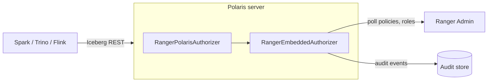

<!---
  Licensed to the Apache Software Foundation (ASF) under one or more
  contributor license agreements.  See the NOTICE file distributed with
  this work for additional information regarding copyright ownership.
  The ASF licenses this file to You under the Apache License, Version 2.0
  (the "License"); you may not use this file except in compliance with
  the License.  You may obtain a copy of the License at

      http://www.apache.org/licenses/LICENSE-2.0

  Unless required by applicable law or agreed to in writing, software
  distributed under the License is distributed on an "AS IS" BASIS,
  WITHOUT WARRANTIES OR CONDITIONS OF ANY KIND, either express or implied.
  See the License for the specific language governing permissions and
  limitations under the License.
-->

# Apache Polaris

[Apache Polaris](https://polaris.apache.org/) is a catalog for open table formats that implements the Apache
Iceberg REST catalog API. Query engines such as Spark, Trino and Flink ask Polaris to list namespaces, load
tables and hand out storage credentials. With the Ranger authorizer enabled, Polaris asks Ranger before it
serves each of those requests, so access to realms, catalogs, namespaces, tables, views, Polaris policies and
principals is governed by Ranger policies and every decision is recorded in Ranger's audit store.

The authorizer is developed and released by the Apache Polaris project, not in the `apache/ranger`
repository, and runs inside the Polaris server. It embeds the Ranger policy engine through the
Ranger authorization API (`RangerEmbeddedAuthorizer`), downloads the policies of one
Ranger service, keeps them in memory, and refreshes them by polling Ranger Admin. Ranger Admin is never on
the request path.

!!! note "Where the code lives"
    The authorizer ships with **Apache Polaris**, not with Ranger: module
    [`extensions/auth/ranger`](https://github.com/apache/polaris/tree/main/extensions/auth/ranger)
    (`org.apache.polaris.extension.auth.ranger.RangerPolarisAuthorizer`). Polaris 1.5.0 is the first release
    that contains it, and the Polaris changelog labels it *Beta*. Ranger contributes the `polaris` service
    definition and the `authz-embedded` library that the authorizer links against. There is no
    `plugin-polaris` module and no plugin archive in the Ranger build.



## Requirements

- A Polaris release that contains the Ranger authorizer (1.5.0 or later).
- Apache Ranger **2.8.0 or later**, as stated in the Polaris extension's README. Polaris 1.5.0 to 1.7.0 are
  built against the Ranger 2.8.0 libraries; the Polaris main branch builds against Ranger 2.9.0.
- Network access from the Polaris server to Ranger Admin, and credentials Ranger Admin accepts for policy
  download.
- An audit store reachable from Polaris if you enable auditing. The Polaris build bundles the Solr audit
  destination and excludes the HDFS destination;
- The `polaris` service definition in Ranger Admin. Ranger Admin creates it at startup because `polaris` is
  in the default list of `ranger.supportedcomponents` (`EmbeddedServiceDefsUtil`). Ranger 2.9.0 carries the
  current resource labels ([RANGER-4910](https://issues.apache.org/jira/browse/RANGER-4910),
  [RANGER-5546](https://issues.apache.org/jira/browse/RANGER-5546)).

## Configuration

Everything is configured in Polaris's `application.properties` (or the equivalent environment variables of
the Polaris runtime). There are no `ranger-polaris-*.xml` files.

### `application.properties`

The keys below select the Ranger authorizer, tell it where Ranger Admin is and how often to look for policy
changes, and configure audit destinations. `polaris.authorization.type` and
`polaris.authorization.ranger.service-name` are mandatory; Polaris fails to start the authorizer without a
service name. The service name, Ranger Admin URL, policy source and Solr values follow the example in the
Polaris extension's README. Restart Polaris after changing these properties.

```properties title="application.properties"
# MANDATORY: selects the Ranger authorizer.
polaris.authorization.type=ranger

# MANDATORY: name of the Ranger service of type polaris whose policies are enforced.
polaris.authorization.ranger.service-name=dev_polaris

# --- Connection to Ranger Admin ---

# Ranger Admin URL. Separate several URLs with commas for Ranger Admin high availability.
polaris.authorization.ranger.authz.default.policy.rest.url=http://ranger-admin:6080

# Policy source implementation.
polaris.authorization.ranger.authz.default.policy.source.impl=org.apache.ranger.admin.client.RangerAdminRESTClient

# User and password for basic authentication to Ranger Admin. Default: not set.
#polaris.authorization.ranger.authz.default.policy.rest.client.username=polaris
#polaris.authorization.ranger.authz.default.policy.rest.client.password=

# TLS client configuration file (xasecure.policymgr.clientssl.* properties), needed when
# Ranger Admin uses HTTPS. Default: not set.
#polaris.authorization.ranger.authz.default.policy.rest.ssl.config.file=/etc/polaris/ranger-policymgr-ssl.xml

# Connect and read timeouts for calls to Ranger Admin. Unit: milliseconds.
polaris.authorization.ranger.authz.default.policy.rest.client.connection.timeoutMs=120000
polaris.authorization.ranger.authz.default.policy.rest.client.read.timeoutMs=30000

# --- Policy refresh and cache ---

# Interval between policy refreshes. Unit: milliseconds.
polaris.authorization.ranger.authz.default.policy.pollIntervalMs=30000

# Directory where downloaded policies are cached, so Polaris can start while Ranger Admin is
# unreachable. Default: not set.
polaris.authorization.ranger.authz.default.policy.cache.dir=/var/lib/polaris/ranger/policycache

# --- Audit: Solr destination ---

# Send audit events to Solr. A destination is switched on with "enabled" or "true". Default: false.
polaris.authorization.ranger.authz.audit.destination.solr=enabled

# Solr URL(s), including the collection path. Default: not set.
polaris.authorization.ranger.authz.audit.destination.solr.urls=http://solr-service:8983/solr/ranger_audits

# ZooKeeper connect string for SolrCloud, used instead of urls. Default: not set.
#polaris.authorization.ranger.authz.audit.destination.solr.zookeepers=zk1:2181,zk2:2181/solr

# Solr collection.
polaris.authorization.ranger.authz.audit.destination.solr.collection=ranger_audits

# --- Audit: log4j destination ---

# Write audit events to a logger.
polaris.authorization.ranger.authz.audit.destination.log4j=false

# Logger name for the log4j destination. Default: ranger.audit.<destination name>.
#polaris.authorization.ranger.authz.audit.destination.log4j.logger=ranger.audit
```

Audit destinations use the audit framework properties with the
`authz.audit.` prefix;

### How properties reach Ranger

Every key under `polaris.authorization.ranger.` other than `service-name` is handed to the embedded Ranger
authorizer (`RangerPolarisAuthorizerConfig`):

- a key that starts with `xasecure.` is passed through unchanged;
- any other key is prefixed with `ranger.`, so `polaris.authorization.ranger.authz.default.policy.rest.url`
  becomes `ranger.authz.default.policy.rest.url`.

The `ranger.authz.*` keys are those of the embedded authorizer described in
Authorization API: `ranger.authz.default.<suffix>`
maps to the plugin property `ranger.plugin.polaris.<suffix>` and `ranger.authz.audit.<suffix>` maps to
`xasecure.audit.<suffix>`.

## Service definition in Ranger Admin

The service definition is
[`ranger-servicedef-polaris.json`](https://github.com/apache/ranger/blob/master/agents-common/src/main/resources/service-defs/ranger-servicedef-polaris.json).
Its display name in Service Manager is **Polaris (draft)**: the resource model may still change.

Create one service of this type and give it the name you configured as `service-name`. The definition
declares no connection properties (`configs`) and no `implClass`, so there is no *Test Connection* and no
resource autocomplete; type resource names by hand. If Ranger Admin requires Kerberos for policy download,
add the Polaris server's user to `policy.download.auth.users` in the service configuration.

## Resources and permissions

| Resource | Parent | Description |
|---|---|---|
| `root` | — | Polaris realm identifier (label *Realm Identifier*). |
| `catalog` | `root` | Catalog. |
| `principal` | `root` | Polaris principal. |
| `namespace` | `catalog` | Namespace. |
| `table` | `namespace` | Table or view. |
| `policy` | `namespace` | Polaris policy object. |

Every level is a valid leaf, so a policy can stop at the realm, a catalog, a namespace or an individual
object. The authorizer names resources `<type>:<realm>/<catalog>/<namespace>/<object>`, for example
`table:POLARIS/sales/customers/accounts`.

The definition has 69 access types, named `<object>-<action>`. Each resource level accepts only the access
types that make sense for it (`accessTypeRestrictions`):

`root`
:   `service-access-manage`, `catalog-create`, `catalog-list`, `principal-create`, `principal-list`

`catalog`
:   `catalog-drop`, `catalog-properties-read`, `catalog-properties-write`, `catalog-metadata-full`,
    `catalog-metadata-manage`, `catalog-content-manage`, `catalog-policy-attach`, `catalog-policy-detach`

`principal`
:   `principal-drop`, `principal-properties-read`, `principal-properties-write`, `principal-metadata-full`,
    `principal-credentials-rotate`, `principal-credentials-reset`

`namespace`
:   `namespace-create`, `namespace-drop`, `namespace-list`, `namespace-properties-read`,
    `namespace-properties-write`, `namespace-metadata-full`, `namespace-policy-attach`,
    `namespace-policy-detach`, `table-create`, `table-list`, `view-create`, `view-list`, `policy-create`,
    `policy-list`

`table`
:   `table-drop`, `table-data-read`, `table-data-write`, `table-properties-read`, `table-properties-write`,
    `table-metadata-full`, `table-policy-attach`, `table-policy-detach`, the fine-grained table update types
    listed below, and `view-drop`, `view-properties-read`, `view-properties-write`, `view-metadata-full`

`policy`
:   `policy-read`, `policy-drop`, `policy-write`, `policy-metadata-full`, `policy-attach`, `policy-detach`

The fine-grained table update types are `table-properties-set`, `table-properties-remove`,
`table-uuid-assign`, `table-format-version-upgrade`, `table-schema-add`, `table-schema-set-current`,
`table-partition-spec-add`, `table-partition-specs-remove`, `table-sort-order-add`,
`table-sort-order-set-default`, `table-snapshot-add`, `table-snapshots-remove`, `table-snapshot-ref-set`,
`table-snapshot-ref-remove`, `table-location-set`, `table-statistics-set`, `table-statistics-remove` and
`table-structure-manage`.

Broad access types imply the narrower ones (`impliedGrants`), so most policies need only a few of them:

| Access type | Label | Implied grants |
|---|---|---|
| `service-access-manage` | Service Manage Access | `catalog-create`, `-drop`, `-list`, `-properties-read`, `-properties-write`, `catalog-metadata-full`; all `principal-*` types except `principal-credentials-rotate`. |
| `catalog-content-manage` | Catalog Manage Content | `catalog-metadata-manage` and everything it implies, plus `table-data-read` and `table-data-write`. |
| `catalog-metadata-manage` | Catalog Metadata Manage | Catalog list, properties and policy attach/detach; every `namespace-*`, `table-*` metadata, `view-*` and `policy-*` type. No table data access. |
| `table-data-write` | Table Data Write | `table-data-read`, `table-list`, `table-properties-read` and all fine-grained table update types. |
| `table-data-read` | Table Data Read | `table-list`, `table-properties-read`. |
| `table-metadata-full` | Table Metadata Full | `table-create`, `table-drop`, `table-list`, `table-properties-*` and all fine-grained table update types. |
| `*-metadata-full` (catalog, principal, namespace, view, policy) | … Metadata Full | Create, drop, list, properties read and properties write (read and write for `policy`) of the same object. |
| `*-properties-write` | … Properties Write | `*-list` and `*-properties-read` of the same object; `table-properties-write` also implies all fine-grained table update types. |
| `*-create`, `*-properties-read` | … | `*-list` of the same object. |

The definition declares no data masking, row filtering, policy conditions or context enrichers.

## Required policies

Once `polaris.authorization.type=ranger` is set, Ranger policies are the only source of authorization
decisions made by this authorizer: a request without an allowing policy is denied. Before you switch a
Polaris deployment over, create policies for at least:

- the Polaris administrators — for example `service-access-manage` on realm `*`, and
  `catalog-content-manage` on catalog `*`;
- the principals used by query engines — typically `catalog-list` on the realm, `namespace-list` and
  `table-list` on the namespaces they browse, and `table-data-read` or `table-data-write` on the tables they
  query.

These are suggestions derived from the access-type model above. Ranger Admin does not generate default
policies for a `polaris` service: default *all* policies are created only for resource hierarchies whose
resources are all marked mandatory, and the Polaris definition marks none.

## Behavior notes

- Each Polaris operation is translated into one or more Ranger access types on the target resource (and,
  for some operations, on a secondary resource). All of them must be allowed. For example, `LIST_CATALOGS`
  needs `catalog-list`, `LOAD_TABLE` needs `table-properties-read`, and loading a table with read or write
  credential delegation needs `table-data-read` or `table-data-write`.
- Operations that the authorizer has no mapping for are denied. The service definition has no
  principal-role or catalog-role resources (an early draft had them; they were removed under [RANGER-4910](https://issues.apache.org/jira/browse/RANGER-4910)).
- The request carries the Polaris principal name as the Ranger user, and the principal's activated Polaris
  roles as Ranger **roles**. Groups are not supplied by Polaris. Policies can therefore grant to users or to
  roles; to grant to groups known to Ranger, enable `authz.default.use.rangerGroups`.
- Properties of the Polaris entities on the resource path are sent as resource attributes and the
  principal's properties as user attributes, which makes them available to
  attribute-based policies.
- Polaris still enforces its own credential-rotation precondition before consulting Ranger.
- Deny items, exceptions, validity schedules, [security zones](../features/sec-zone/intro.md) and
  tag-based policies follow the general
  policy model.

## Auditing

Audit events carry service type `polaris`, the service name, the resource name, the Polaris operation name
as the action (for example `LOAD_TABLE`), the requested access types and the result. Configure destinations
with the `authz.audit.*` keys shown above and view the events under **Audit → Access** in Ranger Admin.

## Polaris and the PDP server

The authorizer that ships in Polaris evaluates policies in-process. An application that prefers remote
evaluation can send the same requests to the Ranger PDP. The PDP configuration
used by Ranger's Docker environment already lists `polaris` as a delegation user for a service named
`dev_polaris` (`ranger.pdp.service.dev_polaris.delegation.users` in
`dev-support/ranger-docker/scripts/pdp/ranger-pdp-site.xml`).

## Further reading

- [Polaris Ranger extension README](https://github.com/apache/polaris/blob/main/extensions/auth/ranger/README.md)
- [`RangerPolarisAuthorizer.java`](https://github.com/apache/polaris/blob/main/extensions/auth/ranger/src/main/java/org/apache/polaris/extension/auth/ranger/RangerPolarisAuthorizer.java)
- [Integrating applications with Ranger](../blog/integrating-applications.md)
- [Ranger 2.9.0 release notes](../release-notes/2.9.0.md)
