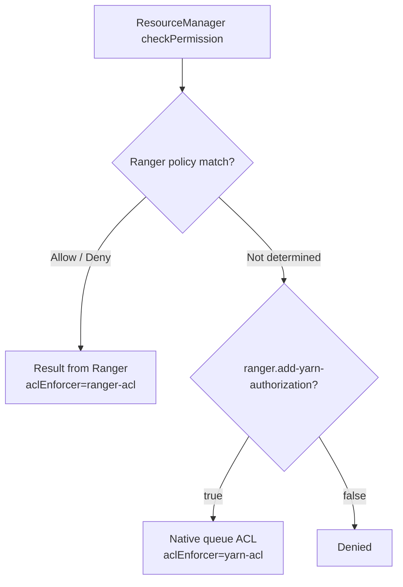

<!---
  Licensed to the Apache Software Foundation (ASF) under one or more
  contributor license agreements.  See the NOTICE file distributed with
  this work for additional information regarding copyright ownership.
  The ASF licenses this file to You under the Apache License, Version 2.0
  (the "License"); you may not use this file except in compliance with
  the License.  You may obtain a copy of the License at

      http://www.apache.org/licenses/LICENSE-2.0

  Unless required by applicable law or agreed to in writing, software
  distributed under the License is distributed on an "AS IS" BASIS,
  WITHOUT WARRANTIES OR CONDITIONS OF ANY KIND, either express or implied.
  See the License for the specific language governing permissions and
  limitations under the License.
-->

# YARN

The Ranger YARN plugin controls who can submit applications to, and administer, YARN scheduler
queues. Natively, YARN keeps these permissions as ACL strings inside `capacity-scheduler.xml` (or the
fair scheduler allocation file). With the plugin you manage them as Ranger policies on queue names,
with users, groups, wildcards and full auditing.

The plugin is a YARN *authorization provider* (`RangerYarnAuthorizer`) that the ResourceManager
loads through `yarn.authorization-provider`. Whenever the scheduler checks whether a user may submit
to a queue or administer it, the ResourceManager calls the plugin, which evaluates the request
against the policies cached in the ResourceManager process. Policies are refreshed from Ranger Admin
by polling. If no Ranger policy determines the result, the plugin falls back to the native YARN queue
ACLs by default.

## Requirements

- A Ranger Admin instance that every ResourceManager can reach over HTTP or HTTPS, with a service of
  type `yarn` defined in it.
- An audit destination reachable from the ResourceManager, if auditing is enabled.
- Apache Hadoop YARN. Ranger master builds the plugin against Hadoop **3.4.2** (`hadoop.version` in the
  root `pom.xml`); the Docker environment runs the same version.
- The plugin jars. The Ranger build produces `ranger-<version>-yarn-plugin.tar.gz` (see
  [Build from source](../dev/build.md)); its `lib/` directory holds the plugin shim jars and the
  `ranger-yarn-plugin-impl` directory with the implementation and its dependencies.

## Configuration

Activating the plugin on a ResourceManager takes three things: the plugin jars on the ResourceManager
classpath, the authorization provider set in `yarn-site.xml`, and the Ranger configuration files in
the Hadoop configuration directory. Repeat this on every ResourceManager, then restart them.
NodeManagers do not need the plugin.

Copy the content of the archive's `lib/` directory, including the `ranger-yarn-plugin-impl`
sub-directory, to `$HADOOP_HOME/share/hadoop/yarn/lib`. Then set the following in `yarn-site.xml`:

```xml title="yarn-site.xml"
<property>
  <name>yarn.acl.enable</name>
  <value>true</value>
</property>
<property>
  <name>yarn.authorization-provider</name>
  <value>org.apache.ranger.authorization.yarn.authorizer.RangerYarnAuthorizer</value>
</property>
```

`yarn.acl.enable` must be `true`, otherwise the ResourceManager does not check queue permissions at
all and never calls the plugin.

The plugin reads `ranger-yarn-security.xml`, `ranger-yarn-audit.xml` and `ranger-policymgr-ssl.xml`
from the classpath. Place them in the Hadoop configuration directory (`$HADOOP_CONF_DIR`, usually
`$HADOOP_HOME/etc/hadoop`), readable by the user that runs the ResourceManager.

!!! note
    When the HDFS and YARN plugins run on the same host they share the Hadoop configuration directory.
    Give each plugin its own `policy.cache.dir`, or at least distinct service names, so the cache files
    do not collide.

### ranger-yarn-security.xml

This file tells the plugin which Ranger service it enforces, how to reach Ranger Admin and where to cache
policies. Place it in `$HADOOP_CONF_DIR`. `ranger.plugin.yarn.service.name` and
`ranger.plugin.yarn.policy.rest.url` are mandatory; the policy cache directory lets this ResourceManager
start and keep enforcing policies when Ranger Admin is unreachable.

```xml title="ranger-yarn-security.xml"
<configuration>
  <!-- Connection to Ranger Admin -->
  <property>
    <name>ranger.plugin.yarn.service.name</name>
    <value>dev_yarn</value>
    <description>MANDATORY: Name of the Ranger service whose policies this ResourceManager
      enforces.</description>
  </property>
  <property>
    <name>ranger.plugin.yarn.policy.rest.url</name>
    <value>http://ranger-admin:6080</value>
    <description>MANDATORY: URL of Ranger Admin. Separate several URLs with commas for Ranger Admin
      high availability.</description>
  </property>
  <property>
    <name>ranger.plugin.yarn.policy.rest.ssl.config.file</name>
    <value>/etc/hadoop/conf/ranger-policymgr-ssl.xml</value>
    <description>Path of ranger-policymgr-ssl.xml. Read when the Ranger Admin URL uses https.
      Default: not set.</description>
  </property>
  <property>
    <name>ranger.plugin.yarn.policy.rest.client.username</name>
    <value></value>
    <description>User name sent with HTTP basic authentication when the plugin downloads policies.
      Default: not set.</description>
  </property>
  <property>
    <name>ranger.plugin.yarn.policy.rest.client.password</name>
    <value></value>
    <description>Password for policy.rest.client.username. Basic authentication is used only when
      both are set. Default: not set.</description>
  </property>
  <property>
    <name>ranger.plugin.yarn.policy.rest.client.connection.timeoutMs</name>
    <value>120000</value>
    <description>Connection timeout for calls to Ranger Admin. Unit: milliseconds.</description>
  </property>
  <property>
    <name>ranger.plugin.yarn.policy.rest.client.read.timeoutMs</name>
    <value>30000</value>
    <description>Read timeout for calls to Ranger Admin. Unit: milliseconds.</description>
  </property>
  <property>
    <name>ranger.plugin.yarn.policy.rest.client.max.retry.attempts</name>
    <value>3</value>
    <description>Number of retries for a failed call to Ranger Admin.</description>
  </property>
  <property>
    <name>ranger.plugin.yarn.policy.rest.client.retry.interval.ms</name>
    <value>1000</value>
    <description>Wait time between retries. Unit: milliseconds.</description>
  </property>

  <!-- Policy refresh and cache -->
  <property>
    <name>ranger.plugin.yarn.policy.cache.dir</name>
    <value>/etc/ranger/dev_yarn/policycache</value>
    <description>Directory for the policy cache file. It must be writable by the user that runs the
      process. Default: not set.</description>
  </property>
  <property>
    <name>ranger.plugin.yarn.policy.pollIntervalMs</name>
    <value>30000</value>
    <description>How often the plugin asks Ranger Admin for policy changes. Unit:
      milliseconds.</description>
  </property>
  <property>
    <name>ranger.plugin.yarn.policy.source.impl</name>
    <value>org.apache.ranger.admin.client.RangerAdminRESTClient</value>
    <description>Class that retrieves policies.</description>
  </property>

  <!-- Authorization behavior -->
  <property>
    <name>ranger.add-yarn-authorization</name>
    <value>true</value>
    <description>Fall back to the native YARN queue ACLs when no Ranger policy decides a request.
      Set to false to make Ranger policies the only source of permissions.</description>
  </property>
  <property>
    <name>ranger.auditlog.yarnAcl.name</name>
    <value>yarn-acl</value>
    <description>Value of the audit field aclEnforcer when the native ACLs decided the
      request.</description>
  </property>
</configuration>
```

### ranger-yarn-audit.xml

This file selects where the plugin sends audit events; place it next to `ranger-yarn-security.xml`. Each
destination is switched on with `xasecure.audit.destination.<name>=true` and configured with properties
under the same prefix. No property is mandatory: without an enabled destination, no audit events are
stored. The example sends audits to Solr.

```xml title="ranger-yarn-audit.xml"
<configuration>
  <!-- General -->
  <property>
    <name>xasecure.audit.is.enabled</name>
    <value>true</value>
    <description>Master switch for auditing in this plugin.</description>
  </property>
  <property>
    <name>xasecure.audit.provider.summary.enabled</name>
    <value>false</value>
    <description>Collapse events that differ only in time into one event with a count.</description>
  </property>

  <!-- Audit Server destination -->
  <property>
    <name>xasecure.audit.destination.auditserver</name>
    <value>false</value>
    <description>Send audits to the Ranger Audit Server.</description>
  </property>
  <property>
    <name>xasecure.audit.destination.auditserver.url</name>
    <value></value>
    <description>Audit Server URL. Default: not set.</description>
  </property>

  <!-- Solr destination -->
  <property>
    <name>xasecure.audit.destination.solr</name>
    <value>true</value>
    <description>Send audits to Apache Solr. Default: false.</description>
  </property>
  <property>
    <name>xasecure.audit.destination.solr.urls</name>
    <value>http://solr:8983/solr/ranger_audits</value>
    <description>Solr collection URLs, separated by commas. Ignored when
      xasecure.audit.destination.solr.zookeepers is set. Default: not set.</description>
  </property>
  <property>
    <name>xasecure.audit.destination.solr.zookeepers</name>
    <value></value>
    <description>ZooKeeper connect string of a SolrCloud cluster. Default: not set.</description>
  </property>
  <property>
    <name>xasecure.audit.destination.solr.batch.filespool.dir</name>
    <value>/var/log/hadoop/yarn/audit/solr/spool</value>
    <description>Local directory where events are spooled while Solr is unreachable. Every enabled
      destination has the same property under its own prefix. Default: not set.</description>
  </property>
  <property>
    <name>xasecure.audit.destination.solr.collection</name>
    <value>ranger_audits</value>
    <description>Collection name when ZooKeeper is used.</description>
  </property>

  <!-- Elasticsearch destination -->
  <property>
    <name>xasecure.audit.destination.elasticsearch</name>
    <value>false</value>
    <description>Send audits to Elasticsearch.</description>
  </property>
  <property>
    <name>xasecure.audit.destination.elasticsearch.urls</name>
    <value></value>
    <description>Elasticsearch host names, separated by commas. Default: not set.</description>
  </property>
  <property>
    <name>xasecure.audit.destination.elasticsearch.port</name>
    <value>9200</value>
    <description>REST port of the Elasticsearch cluster.</description>
  </property>
  <property>
    <name>xasecure.audit.destination.elasticsearch.protocol</name>
    <value>http</value>
    <description>One of: http, https.</description>
  </property>
  <property>
    <name>xasecure.audit.destination.elasticsearch.index</name>
    <value>ranger_audits</value>
    <description>Index that receives the events.</description>
  </property>

  <!-- HDFS destination -->
  <property>
    <name>xasecure.audit.destination.hdfs</name>
    <value>false</value>
    <description>Write audits as files to HDFS or a Hadoop-compatible object store.</description>
  </property>
  <property>
    <name>xasecure.audit.destination.hdfs.dir</name>
    <value></value>
    <description>Base directory, for example hdfs://namenode:8020/ranger/audit. Default: not
      set.</description>
  </property>

  <!-- Log4j destination -->
  <property>
    <name>xasecure.audit.destination.log4j</name>
    <value>false</value>
    <description>Write audits as JSON to a logger of the host process.</description>
  </property>
  <property>
    <name>xasecure.audit.destination.log4j.logger</name>
    <value>ranger.audit.log4j</value>
    <description>Logger name used by the log4j destination.</description>
  </property>
</configuration>
```

Give every enabled destination a spool directory (`xasecure.audit.destination.<name>.batch.filespool.dir`)
so that events survive an outage of the audit store. The queue, spool, Kerberos and TLS options of each
destination, and the [Audit Server](../services/audit-server/service.md) client settings, are in the
[Audit framework](../services/audit/index.md) reference.

### ranger-policymgr-ssl.xml

This file is needed only when Ranger Admin is reached over `https`. The plugin loads it from the path set in
`ranger.plugin.yarn.policy.rest.ssl.config.file`; a file named `ranger-yarn-policymgr-ssl.xml` on the
classpath is picked up automatically. No property is mandatory: without a truststore the plugin relies on
the default truststore of the JVM, and the keystore is needed only for two-way TLS. Passwords are not
stored in the file: they are read from a Hadoop credential store (JCEKS) under fixed aliases.

```xml title="ranger-policymgr-ssl.xml"
<configuration>
  <!-- Keystore (client certificate, two-way TLS) -->
  <property>
    <name>xasecure.policymgr.clientssl.keystore</name>
    <value></value>
    <description>Keystore with the plugin's client certificate. Needed only when Ranger Admin
      requires client certificates. Default: not set.</description>
  </property>
  <property>
    <name>xasecure.policymgr.clientssl.keystore.credential.file</name>
    <value></value>
    <description>Hadoop credential store (JCEKS) that holds the keystore password under the alias
      sslKeyStore. Default: not set.</description>
  </property>
  <property>
    <name>xasecure.policymgr.clientssl.keystore.type</name>
    <value>jks</value>
    <description>Keystore type.</description>
  </property>

  <!-- Truststore -->
  <property>
    <name>xasecure.policymgr.clientssl.truststore</name>
    <value>/etc/hadoop/conf/ranger-plugin-truststore.jks</value>
    <description>Truststore that contains the Ranger Admin certificate or its CA. When no truststore
      is configured, the default truststore of the JVM is used. Default: not set.</description>
  </property>
  <property>
    <name>xasecure.policymgr.clientssl.truststore.credential.file</name>
    <value>jceks://file/etc/ranger/dev_yarn/cred.jceks</value>
    <description>Hadoop credential store (JCEKS) that holds the truststore password under the alias
      sslTrustStore. Default: not set.</description>
  </property>
  <property>
    <name>xasecure.policymgr.clientssl.truststore.type</name>
    <value>jks</value>
    <description>Truststore type.</description>
  </property>
</configuration>
```

When Ranger Admin validates client certificates, set `commonNameForCertificate` in the service configuration
to the CN of the plugin's certificate. See [Security hardening](../services/admin/security-hardening.md).

## Service definition in Ranger Admin

Choose **YARN** in Service Manager and create a service. Its name must match
`ranger.plugin.yarn.service.name`.

| Field | Required | Description |
|-------|----------|-------------|
| `username` | yes | User that Ranger Admin connects as for Test Connection and resource lookup. |
| `password` | yes | Password of that user. |
| `yarn.url` | yes | ResourceManager REST URL, for example `http://<rm-host>:8088`. For HA list several URLs separated by `,` or `;`. |
| `hadoop.security.authentication` | no | One of `simple`, `kerberos`. Default: `simple`. |
| `commonNameForCertificate` | no | Expected CN of the plugin's client certificate when Ranger Admin runs with two-way TLS. |
| `ranger.plugin.audit.filters` | no | Default audit filters, downloaded by the plugin together with the policies. Default: `[]`. |

**Test Connection** and **resource lookup** call the ResourceManager REST API
`/ws/v1/cluster/scheduler` and walk the queue tree from `root` to the leaves, so the policy editor
can suggest fully qualified queue names.

## Resources and permissions

Source:
[`ranger-servicedef-yarn.json`](https://github.com/apache/ranger/blob/master/agents-common/src/main/resources/service-defs/ranger-servicedef-yarn.json).
It has a single resource:

`queue`
:   Fully qualified queue name, for example `root.prod.etl`. The name is matched as a path with `.` as
    the separator: matching is case-sensitive, wildcards are allowed, and with the *recursive* flag a
    policy on `root.prod` covers all queues below it. `root.prod.*` matches the direct and indirect
    children. Resource lookup is available.

| Access type | Category | Meaning |
|-------------|----------|---------|
| `submit-app` | UPDATE | Submit an application to the queue (also lets the user kill their own applications in that queue) |
| `admin-queue` | MANAGE | Administer the queue (kill any application, move applications, ...). Implies `submit-app`. |

The YARN service definition has no data-masking, row-filter, policy-condition or context-enricher
definitions.

## Default policies

When the service is created Ranger Admin generates the `all - queue` policy and adds the lookup user
(`username` of the service configuration) to it with `submit-app`. With the fallback to native queue
ACLs enabled, existing users keep the permissions they have in the scheduler configuration until you
replace them with Ranger policies.

## Behavior notes

### Evaluation and fallback



- YARN's `SUBMIT_APP` access type maps to `submit-app`, `ADMINISTER_QUEUE` maps to `admin-queue`.
- A Ranger deny policy is final. When no policy matches the queue, the ResourceManager's own ACL
  check (`yarn.acl.enable`, the scheduler's `acl_submit_applications` / `acl_administer_queue`
  settings and `yarn.admin.acl`) is consulted if `ranger.add-yarn-authorization=true`.
- YARN evaluates queue permissions hierarchically: a user allowed on a parent queue is allowed on
  its children. Model this in Ranger with a recursive policy on the parent queue.
- Queues themselves are still defined in the scheduler configuration; Ranger only controls who may
  use them.

### Policy examples

| Queue | Recursive | Grant | Effect |
|-------|-----------|-------|--------|
| `root.prod.etl` | yes | `submit-app` to group `etl-jobs` | Submit to `root.prod.etl` and any sub-queue |
| `root.prod.*` | yes | `admin-queue` to group `prod-ops` | Administer all queues under `root.prod` |
| `root` | yes | `admin-queue` to user `yarn` | Cluster-wide queue administration |
| `root.test.adhoc` | no | `submit-app` to user `analyst1` | Submit only to that leaf queue |

## Auditing

Each queue permission check produces an audit event:

- `resource`: the queue name.
- `accessType`: `submit-app` or `admin-queue`.
- `action`: YARN's access type name (`SUBMIT_APP`, `ADMINISTER_QUEUE`).
- `aclEnforcer`: `ranger-acl` or `yarn-acl`.
- `clientIP`: address of the submitting client, including `X-Forwarded-For` addresses when the request
  went through a proxy.

The YARN service definition ships an empty default audit filter (`[]`), so every check is audited
until you configure one.

## Try it with Docker

`dev-support/ranger-docker/docker-compose.ranger-hadoop.yml` starts a `ranger-hadoop` container
(NameNode, DataNode, ResourceManager, NodeManager) with the HDFS and YARN plugins active. The
ResourceManager enforces the Ranger service `dev_yarn`.

```bash
cd dev-support/ranger-docker
./download-archives.sh hadoop
export RANGER_DB_TYPE=postgres
export AUDIT_INDEX_STORE=opensearch
export AUDIT_DESTINATIONS=audit-store-${AUDIT_INDEX_STORE}

docker compose --profile ${AUDIT_DESTINATIONS} \
  -f docker-compose.ranger.yml \
  -f docker-compose.ranger-audit-service.yml \
  -f docker-compose.ranger-hadoop.yml up -d
```

The ResourceManager web UI is published on port 8088. The environment creates the `dev_yarn` service in
Ranger Admin with `yarn.url=http://ranger-hadoop.rangernw:8088`. See
[Running Ranger with Docker](../getting-started/docker.md) for the full environment.

## Further reading

- [Policy model](../arch/policy-model.md)
- [Resource-based policies](../features/policies/resource-policies.md)
- [HDFS plugin](hdfs.md): runs alongside on Hadoop clusters
- Source: [`plugin-yarn`](https://github.com/apache/ranger/tree/master/plugin-yarn),
  [`ranger-yarn-plugin-shim`](https://github.com/apache/ranger/tree/master/ranger-yarn-plugin-shim)
- cwiki: [Ranger authorization and auditing for YARN](https://cwiki.apache.org/confluence/pages/viewpage.action?pageId=56067021)
