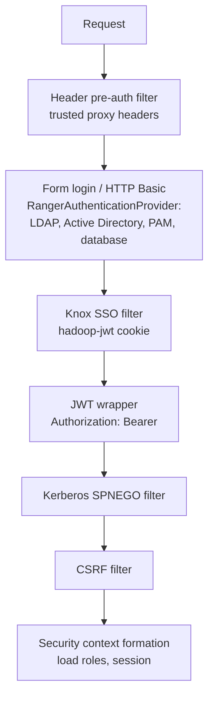

<!---
  Licensed to the Apache Software Foundation (ASF) under one or more
  contributor license agreements.  See the NOTICE file distributed with
  this work for additional information regarding copyright ownership.
  The ASF licenses this file to You under the Apache License, Version 2.0
  (the "License"); you may not use this file except in compliance with
  the License.  You may obtain a copy of the License at

      http://www.apache.org/licenses/LICENSE-2.0

  Unless required by applicable law or agreed to in writing, software
  distributed under the License is distributed on an "AS IS" BASIS,
  WITHOUT WARRANTIES OR CONDITIONS OF ANY KIND, either express or implied.
  See the License for the specific language governing permissions and
  limitations under the License.
-->

# Authentication

Ranger Admin has to know who is calling it before it can decide what they may see or change. This page
covers every way a person or a program can prove its identity to the Admin UI and REST API: the local
user database, PAM, LDAP and Active Directory, Kerberos (SPNEGO), Knox SSO, JWT bearer tokens and
trusted proxy headers.

Authentication is separate from *authorization inside Ranger Admin*. After login, what a user can do is
governed by the user's Ranger role (Admin, KeyAdmin, Auditor, KMS Auditor or User) and the permissions
module; see [Users, groups and roles](users-groups-roles.md).

## How a request is authenticated

Admin is a Spring Security application. The filter chain is defined in
[`security-applicationContext.xml`](https://github.com/apache/ranger/blob/master/security-admin/src/main/resources/conf.dist/security-applicationContext.xml)
and processes each request in this order:



Each filter only acts when its mechanism is enabled and the request is not yet authenticated. Form login
and HTTP Basic end up in `RangerAuthenticationProvider`, which dispatches on `ranger.authentication.method`
and finally falls back to the local database (`x_portal_user`). A user that authenticates externally but
has no portal record is created on the fly with the role from `ranger.ldap.default.role` (default
`ROLE_USER`).

Some paths are excluded from the filter chain entirely: static UI assets, `/service/actuator/health`,
`/service/actuator/health/liveness`, `/service/metrics/**`, the plugin download endpoints
(`/service/plugins/policies/download/**`, `/service/tags/download/**`, `/service/roles/download/**`,
`/service/xusers/download/**`, `/service/gds/download/**`) and the plugin grant/revoke endpoints
(`/service/plugins/services/grant/*`, `/service/plugins/services/revoke/*`). The download and grant/revoke
handlers reject these session-less calls unless the properties under
[Anonymous and download-only access](#anonymous-and-download-only-access) allow them. The `secure` variants of the download
endpoints (for example `/service/plugins/secure/policies/download/{serviceName}`) do require
authentication and are what plugins use in kerberized clusters.

## Choosing a method

`ranger.authentication.method` in `ranger-admin-site.xml` selects where passwords from the login form and
HTTP Basic are checked.

| Value | Users authenticate against | Typical use |
| --- | --- | --- |
| `NONE` | Ranger database only | Evaluation environments, service accounts |
| `PAM` | Local PAM stack on the Admin host | SSSD-joined hosts |
| `LDAP` | LDAP directory | OpenLDAP and similar |
| `ACTIVE_DIRECTORY` | Active Directory | Windows domains |

Whatever the method, the four built-in accounts (`admin`, `keyadmin`, `rangerusersync`, `rangertagsync`)
and any user created in the UI always authenticate against the database. Kerberos, Knox SSO, JWT and header
authentication are enabled with their own properties and work in addition to the chosen method.

To switch methods, set `ranger.authentication.method` and the properties of the new method in
`ranger-admin-site.xml`, then restart Admin.

## Local database users

Passwords of portal users are stored hashed in `x_portal_user`. Related settings in
`ranger-admin-default-site.xml`:

| Key | Default | Type | Description |
| --- | --- | --- | --- |
| `ranger.admin.login.autolock.enabled` | `true` | Boolean | Lock an account after repeated failures. |
| `ranger.admin.login.autolock.maxfailure` | `5` | Integer | Failures allowed within the window. |
| `ranger.admin.login.autolock.window.seconds` | `300` | Integer | Sliding window for counting failures, in seconds. |
| `ranger.password.history.count` | `4` | Integer | Number of previous passwords a user may not reuse. |
| `ranger.sha256Password.update.disable` | `false` | Boolean | When `false`, older MD5 hashes are upgraded to SHA-256 on the next successful login. |
| `ranger.admin.cookie.name` | `RANGERADMINSESSIONID` | String | Session cookie name. |

The password policy for users created or changed through Admin is at least 8 characters with one digit,
one lower-case and one upper-case letter (`StringUtil.VALIDATION_CRED`), and the password may not equal
the user's first name, last name or login id.

## PAM

`ranger.authentication.method=PAM` authenticates through the Admin host's PAM stack using a JAAS PAM
login module. The PAM service name is `ranger.pam.service` (`login` in `ranger-admin-default-site.xml`;
`ranger-admin` when the key is not set at all). Create `/etc/pam.d/<service>` on the Admin host, and make
sure the OS user running Admin may read the files that the PAM modules need (for example `/etc/shadow`
for `pam_unix`).

## LDAP

Admin tries two strategies in turn: first a direct bind using `ranger.ldap.user.dnpattern`, then a
search-then-bind using the bind account and `ranger.ldap.user.searchfilter`. Group membership found
through the group search is mapped to Ranger roles by `ranger.ldap.group.roleattribute`; users without a
matching role receive `ranger.ldap.default.role`.

| Key | Default | Type | Description |
| --- | --- | --- | --- |
| `ranger.ldap.url` | `ldap://` | URL | Server URL. Use `ldaps://` or `ranger.ldap.starttls=true` for encryption. |
| `ranger.ldap.user.dnpattern` | `uid={0},ou=users,dc=xasecure,dc=net` | String | DN pattern for direct bind; `{0}` is the login name. |
| `ranger.ldap.base.dn` | (none) | String | Search base for search-then-bind. |
| `ranger.ldap.bind.dn` | (none) | String | Bind account for the user search. |
| `ranger.ldap.bind.password` | (none) | Password | Password of the bind account. Read from the credential store when the alias exists. |
| `ranger.ldap.binddn.credential.alias` | `ranger.ldap.binddn.password` | String | Credential-store alias of the bind password. |
| `ranger.ldap.user.searchfilter` | `(uid={0})` | String | User search filter. |
| `ranger.ldap.group.searchbase` | `ou=groups,dc=xasecure,dc=net` | String | Where to look for groups. |
| `ranger.ldap.group.searchfilter` | `(member=uid={0},ou=users,dc=xasecure,dc=net)` | String | Group filter; `{0}` is the user DN. |
| `ranger.ldap.group.roleattribute` | `cn` | String | Attribute whose value becomes the granted authority. |
| `ranger.ldap.referral` | `follow` | Enum | `follow` or `ignore`. |
| `ranger.ldap.default.role` | `ROLE_USER` | String | Role for externally authenticated users without a mapped role. |
| `ranger.ldap.starttls` | `false` | Boolean | Upgrade the connection with STARTTLS. Also applies to Active Directory. |

!!! tip
    LDAP authentication only checks credentials. Users and groups still have to be *synced* into Ranger
    by UserSync so they can be selected in policies; see [LDAP and Active Directory sync](../usersync/ldap-ad.md).

## Active Directory

Active Directory uses the same provider with AD-specific properties. Admin first tries a search-then-bind
with the bind account, then falls back to Spring's `ActiveDirectoryLdapAuthenticationProvider` using
`ranger.ldap.ad.domain`.

| Key | Default | Type | Description |
| --- | --- | --- | --- |
| `ranger.ldap.ad.url` | (none) | URL | Server URL, for example `ldap://ad.example.com:389`. |
| `ranger.ldap.ad.domain` | `example.com` | String | AD domain used to build `user@domain` for the fallback bind. |
| `ranger.ldap.ad.base.dn` | `dc=example,dc=com` | String | Search base. |
| `ranger.ldap.ad.bind.dn` | `cn=administrator,ou=users,dc=example,dc=com` | String | Bind account. |
| `ranger.ldap.ad.bind.password` | (none) | Password | Password of the bind account. Read from the credential store when the alias exists. |
| `ranger.ldap.ad.binddn.credential.alias` | `ranger.ad.binddn.password` | String | Credential-store alias of the bind password. |
| `ranger.ldap.ad.user.searchfilter` | `(sAMAccountName={0})` | String | User filter. |
| `ranger.ldap.ad.referral` | `follow` | Enum | `follow` or `ignore`. |

## Kerberos (SPNEGO)

Kerberos is turned on by `hadoop.security.authentication=kerberos` in a `core-site.xml` placed in the
Admin configuration directory. Browsers and clients such as `curl --negotiate`
then authenticate with a Kerberos ticket, and Admin issues a `hadoop.auth` cookie for subsequent requests.
Principal names are mapped to user names with the `hadoop.security.auth_to_local` rules from the same file.

| Key | Default | Type | Description |
| --- | --- | --- | --- |
| `ranger.spnego.kerberos.principal` | `HTTP/_HOST@REALM` | String | Service principal for SPNEGO. `_HOST` is replaced with `ranger.service.host`. |
| `ranger.spnego.kerberos.keytab` | (none) | Path | Keytab for the SPNEGO principal. |
| `ranger.admin.kerberos.principal` | `rangeradmin/_HOST@REALM` | String | Identity Admin logs in with for its own outbound calls (audit store, HDFS). |
| `ranger.admin.kerberos.keytab` | (none) | Path | Keytab for the Admin principal. |
| `ranger.lookup.kerberos.principal` | `rangerlookup/_HOST@REALM` | String | Identity used for *Test Connection* and resource lookup. |
| `ranger.lookup.kerberos.keytab` | (none) | Path | Keytab for the lookup principal. |
| `ranger.admin.kerberos.token.valid.seconds` | `30` | Integer | Lifetime of the `hadoop.auth` cookie, in seconds. |
| `ranger.admin.kerberos.cookie.domain` | (none) | String | Domain of the cookie. |
| `ranger.admin.kerberos.cookie.path` | `/` | String | Path of the cookie. |
| `ranger.allow.kerberos.auth.login.browser` | `false` | Boolean | Let browsers use SPNEGO for the UI. Otherwise browsers get the login form and only REST clients use SPNEGO. |
| `ranger.krb.browser-useragents-regex` | `Mozilla,Opera,Chrome` | List | User-agent prefixes treated as browsers. |
| `ranger.authentication.allow.trustedproxy` | `false` | Boolean | Accept `doAs=<user>` from trusted proxies such as Knox. |

Trusted proxies are declared with `ranger.proxyuser.<proxy>.users`, `ranger.proxyuser.<proxy>.groups` and
`ranger.proxyuser.<proxy>.hosts`, which follow the Hadoop proxy-user semantics.

Example REST call with a ticket:

```bash
kinit alice@EXAMPLE.COM
curl --negotiate -u : https://ranger.example.com:6182/service/public/v2/api/service
```

## Knox SSO

With `ranger.sso.enabled=true`, unauthenticated browser requests are redirected to the Knox SSO provider.
Knox returns a JWT in the `hadoop-jwt` cookie, which Admin verifies with the provider's public key and
turns into a session for the user named in the token's subject. Non-browser clients (REST) are not
redirected and continue to use Basic, Kerberos or bearer authentication.

| Key | Default | Type | Description |
| --- | --- | --- | --- |
| `ranger.sso.enabled` | `false` | Boolean | Enable the redirect. |
| `ranger.sso.providerurl` | `https://127.0.0.1:8443/gateway/knoxsso/api/v1/websso` | URL | Knox SSO endpoint. |
| `ranger.sso.publicKey` | (none) | String | Knox signing certificate in PEM (Base64) form, without the `-----BEGIN CERTIFICATE-----` and `-----END CERTIFICATE-----` lines. |
| `ranger.sso.cookiename` | `hadoop-jwt` | String | Cookie carrying the token. |
| `ranger.sso.query.param.originalurl` | `originalUrl` | String | Query parameter used to return to the requested page. |
| `ranger.sso.browser.useragent` | `Mozilla,chrome` | List | User agents that are redirected. |
| `ranger.sso.audiences` | (none) | List | Expected `aud` claim values. |
| `ranger.sso.issuer` | (none) | String | Expected `iss` claim. Checked for [JWT bearer tokens](#jwt-bearer-tokens) only, not for the Knox SSO cookie. |
| `ranger.sso.expected.sigalg` | `RS256` | String | JWS algorithm the token must be signed with. |

The UI exposes a `/locallogin` route so that a local account such as `admin` can still sign in with the
form while SSO is enabled. Users arriving through Knox who do not exist in Ranger are created with
`ranger.ldap.default.role`.

## JWT bearer tokens

When SSO is *not* enabled but `ranger.sso.providerurl` or `ranger.sso.publicKey` is configured, the
`RangerJwtAuthWrapper` filter verifies `Authorization: Bearer <token>` headers using the `ranger-authn`
module (`RangerJwtAuthHandler`). The provider URL is treated as a JWKS endpoint, so tokens issued by an
OIDC provider can be verified either by JWKS lookup or by the static public key. Audience and issuer
checks use `ranger.sso.audiences` and `ranger.sso.issuer`. The token subject becomes the Ranger user, with
roles taken from the database record when it exists and `ROLE_USER` otherwise. The trusted-proxy `doAs`
mechanism described under Kerberos applies here as well.

```bash
curl -H "Authorization: Bearer $TOKEN" https://ranger.example.com:6182/service/public/v2/api/policy
```

The same handler is used by the Ranger PDP and the Java client library to accept and send tokens; see the
[client interface](../../features/client-interface/intro.md).

## Header-based authentication (trusted proxy)

Introduced by [RANGER-5499](https://issues.apache.org/jira/browse/RANGER-5499), header-based authentication lets an authenticating reverse proxy or service
mesh sidecar pass the already-verified identity to Admin in HTTP headers. `RangerHeaderPreAuthFilter`
runs first in the chain and creates an authenticated session for the value it finds.

| Key | Default | Type | Description |
| --- | --- | --- | --- |
| `ranger.admin.authn.header.enabled` | `false` | Boolean | Enable the filter. It disables itself if neither a user name nor a SPIFFE header name is configured. |
| `ranger.admin.authn.header.username` | (none) | String | Header carrying the user name, for example `X-Forwarded-User`. Takes precedence. |
| `ranger.admin.authn.header.spiffe` | (none) | List | Header names carrying a SPIFFE ID (`spiffe://trust-domain/path`). The full ID becomes the user name. |
| `ranger.admin.authn.header.roles` | (none) | String | Header with a comma-separated role list. When absent or empty, roles come from the Ranger database. |
| `ranger.admin.authn.header.requestid` | (none) | String | Header whose value is logged as the request id for correlation. |
| `ranger.admin.spiffe.as.username.enabled` | `false` | Boolean | Accept `:` in login names so that SPIFFE IDs can be stored as Ranger user names. |

Accepted values in the roles header are `RANGER_ROLE_ADMIN`, `RANGER_ROLE_AUDITOR`, `RANGER_ROLE_USER`,
`RANGER_ROLE_KEY_ADMIN` and `RANGER_ROLE_KEY_ADMIN_AUDITOR`; the internal `ROLE_*` names also work.

!!! danger
    Only enable header authentication when Admin is reachable exclusively through the proxy, and make sure
    the proxy strips these headers from incoming client requests. Anyone who can send a request with the
    header directly to Admin is authenticated as that user.

## Concurrent UI sessions

By default a user may hold any number of UI sessions. `ranger.session.limit.concurrency` caps the number
of concurrent browser sessions per user, whichever authentication method created them. When a login
would exceed the limit, the login succeeds and the user's oldest UI sessions are expired instead.

| Key | Default | Type | Description |
| --- | --- | --- | --- |
| `ranger.session.limit.concurrency` | `0` | Integer | Maximum concurrent UI sessions per user. `0` or a negative value means no limit. |

- Only browser sessions count. A request is treated as coming from a browser when its `User-Agent` starts
  with one of the prefixes in `ranger.krb.browser-useragents-regex` (default `Mozilla,Opera,Chrome`).
  Sessions of REST clients such as `curl`, the Java and Python clients, and sessions created by plugin
  policy, tag, role, user-store and GDS downloads are not counted and are never expired by this limit.
- The next request on an expired session is redirected to the login page (`ranger.logout.success.page`,
  default `/login.jsp`); AJAX requests from the UI receive HTTP status `419` with the login URL in the
  `X-Rngr-Redirect-Url` header. Sessions created through Knox SSO or SPNEGO are sent through the SSO
  login flow instead.
- The limit is enforced by each Admin process against its own in-memory session list. With several Admin
  instances behind a load balancer, a user can hold up to this many UI sessions on each instance; see
  [High availability](high-availability.md).

## Anonymous and download-only access

| Key | Default | Type | Description |
| --- | --- | --- | --- |
| `ranger.admin.allow.unauthenticated.access` | `false` | Boolean | Accept plugin grant/revoke calls (`/service/plugins/services/grant/*`, `/service/plugins/services/revoke/*`) that carry no authenticated session. |
| `ranger.admin.allow.unauthenticated.download.access` | `false` | Boolean | Accept calls without an authenticated session on the non-`secure` download endpoints (policies, tags, roles, users, GDS). |

## Super users from configuration

`ranger.admin.super.users` and `ranger.admin.super.groups` (comma-separated, in `ranger-admin-site.xml`)
grant full Admin and KeyAdmin capabilities at login to the listed users or members of the listed groups,
regardless of the roles stored in the database. Leave them empty unless you need a break-glass account
that is managed outside Ranger.

## Troubleshooting

LDAP users cannot log in, but `admin` can
:   Check `ranger.authentication.method`, the bind DN and password, and the user filter. Set the
    `org.springframework.security` logger to `debug` in `logback.xml` to see the LDAP exchange.

The browser loops between Knox and Ranger
:   `ranger.sso.publicKey` does not match the Knox signing key, or the JWT audience check fails.
    Use `/locallogin` to get in.

`curl --negotiate` returns 401
:   The SPNEGO keytab or principal is wrong, or `hadoop.security.authentication` is not `kerberos` in
    `conf/core-site.xml`.

An account is locked after failed attempts
:   Wait `ranger.admin.login.autolock.window.seconds` or reset the password as an Admin.

## Further reading

- [`RangerAuthenticationProvider.java`](https://github.com/apache/ranger/blob/master/security-admin/src/main/java/org/apache/ranger/security/handler/RangerAuthenticationProvider.java)
- [`security-admin/src/main/java/org/apache/ranger/security/web/filter`](https://github.com/apache/ranger/blob/master/security-admin/src/main/java/org/apache/ranger/security/web/filter)
- [`ranger-authn`](https://github.com/apache/ranger/blob/master/ranger-authn) module (JWT handler)
- [Security hardening](security-hardening.md)
