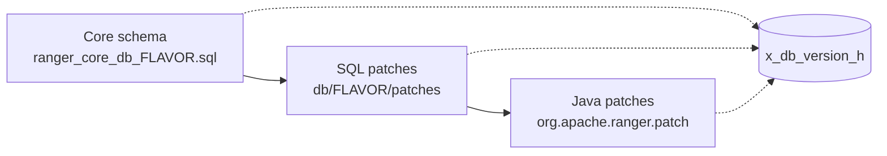

<!---
  Licensed to the Apache Software Foundation (ASF) under one or more
  contributor license agreements.  See the NOTICE file distributed with
  this work for additional information regarding copyright ownership.
  The ASF licenses this file to You under the Apache License, Version 2.0
  (the "License"); you may not use this file except in compliance with
  the License.  You may obtain a copy of the License at

      http://www.apache.org/licenses/LICENSE-2.0

  Unless required by applicable law or agreed to in writing, software
  distributed under the License is distributed on an "AS IS" BASIS,
  WITHOUT WARRANTIES OR CONDITIONS OF ANY KIND, either express or implied.
  See the License for the specific language governing permissions and
  limitations under the License.
-->

# Database

Ranger Admin stores everything it manages, from service definitions and policies to users, roles, zones
and its own change history, in a relational database. The database is the only stateful part of Admin;
if you back it up together with the configuration directory you can rebuild an Admin host from scratch.
Audit *events* are not in this database; they live in Solr, Elasticsearch, OpenSearch or CloudWatch.

This page describes the supported databases, how the schema is created and upgraded, the connection
settings, and what to consider for backup, restore and maintenance.

## Supported databases

The dialect classes are in the package `org.eclipse.persistence.platform.database`.

| Database | Schema directory | JDBC driver class | Dialect |
| --- | --- | --- | --- |
| MySQL / MariaDB | `db/mysql` | `net.sf.log4jdbc.DriverSpy` | `MySQLPlatform` |
| PostgreSQL | `db/postgres` | `org.postgresql.Driver` | `PostgreSQLPlatform` |
| Oracle | `db/oracle` | `oracle.jdbc.OracleDriver` | `OraclePlatform` |
| Microsoft SQL Server | `db/sqlserver` | `com.microsoft.sqlserver.jdbc.SQLServerDriver` | `SQLServerPlatform` |
| SAP SQL Anywhere | `db/sqlanywhere` | `sap.jdbc4.sqlanywhere.IDriver` | `SQLAnywherePlatform` |

Schema files for each flavor are under
[`security-admin/db/<flavor>/`](https://github.com/apache/ranger/blob/master/security-admin/db). The
JDBC driver jar is not part of Ranger; place it in `ews/webapp/WEB-INF/lib`. The Docker environment
provides database containers for PostgreSQL, MySQL (MariaDB), Oracle and SQL Server
(`docker-compose.ranger-db.yml`).

Ranger accesses the database through JPA (EclipseLink) with a HikariCP connection pool; queries are
written to be portable, and every DDL change is delivered for all five flavors.

## How the schema is created

Ranger Admin expects an existing database and a database user that owns it. The schema is then built in
three stages, each recorded in the version-history table `x_db_version_h`:



1. **Core schema.** On an empty database, `db/<flavor>/optimized/current/ranger_core_db_<flavor>.sql`
   creates all tables, indexes and seed rows (built-in users, UI modules), and marks the SQL patches it
   already includes as applied.
2. **SQL patches.** Every file in `db/<flavor>/patches/` that is not yet recorded in `x_db_version_h` is
   executed in numeric order.
3. **Java patches.** Classes named `Patch..._J100NN` in `org.apache.ranger.patch` extend `BaseLoader`
   and have a `main` method; each one runs once with the Admin classpath and configuration, for changes
   that need application logic. Their output goes to `ranger_db_patch.log`.

The Ranger distribution ships the tooling that performs these stages before Admin starts, and the Docker
environment runs it on the first start of the `ranger` container. Admin itself does not create or alter
tables while serving requests.

## Schema patches and upgrades

Ranger never ships a second full schema for upgrades. A fresh install imports the current optimized schema
and then records all known patches as applied; an upgrade applies only the missing patches. Progress is
tracked in `x_db_version_h`:

| Column | Meaning |
| --- | --- |
| `version` | Patch identifier, e.g. `078` for `078-add-x_audit_config.sql`, `J10066` for a Java patch, or the markers `DB_PATCHES`/`JAVA_PATCHES` |
| `inst_at`, `inst_by` | When and by whom (`user@host`) the patch was applied |
| `active` | `Y` once applied; `N` while in progress |

Several Admin instances may upgrade at the same time (for example a rolling upgrade behind a load
balancer). A patch entry with `active='N'` created by another host makes the local run wait and re-check
periodically (every 120 seconds by default); an entry that is still not active after 10 minutes is
treated as abandoned and taken over.

SQL patches are numbered `001` to `078` on the master branch (some numbers are skipped or belong to the
retired audit database). Java patches (`J10001` to `J10066`) are used when a change needs application
logic, for example updating service definitions (`PatchForHiveServiceDefUpdate_J10030`), migrating policy
JSON (`PatchForUpdatingPolicyJson_J10019`) or assigning module permissions
(`PatchAssignSecurityZonePersmissionToAdmin_J10026`).

To upgrade, follow the steps in [Deployment and configuration](installation.md#upgrade); the database
part is the SQL patch stage followed by the Java patch stage described above.

### Transaction log migration

Change history used to be stored in `x_trx_log`; current versions write a compact JSON form to
`x_trx_log_v2` (patch `073`). Existing rows are migrated in the background by
`ranger-admin-transaction-log-migrate.sh`, which runs `org.apache.ranger.patch.cliutil.TrxLogV2MigrationUtil`
and needs `RANGER_ADMIN_HOME`, `RANGER_ADMIN_CONF` and `RANGER_ADMIN_LOG_DIR` in the environment. Run it
once after upgrading an installation that still has rows in `x_trx_log`; progress is written to
`trxlog_v1_migration.out` in the log directory.

### Purging history at start-up

Login sessions and change logs grow indefinitely. Admin can purge old rows during start-up:

| Key | Default | Type | Description |
| --- | --- | --- | --- |
| `ranger.admin.init.purge.login_records` | `false` | Boolean | Purge `x_auth_sess` rows older than the retention. |
| `ranger.admin.init.purge.login_records.retention.days` | `0` | Integer | Retention of login records, in days. |
| `ranger.admin.init.purge.transaction_records` | `false` | Boolean | Purge transaction log rows older than the retention. |
| `ranger.admin.init.purge.transaction_records.retention.days` | `0` | Integer | Retention of transaction records, in days. |

## Schema overview

The core schema (`ranger_core_db_mysql.sql`) creates 86 tables. The most important groups:

Portal users and sessions
:   `x_portal_user`, `x_portal_user_role`, `x_auth_sess`, `x_user_module_perm`, `x_group_module_perm`,
    `x_modules_master`

Users and groups for policies
:   `x_user`, `x_group`, `x_group_users`, `x_group_groups`, `x_ugsync_audit_info`

Service definitions
:   `x_service_def`, `x_resource_def`, `x_access_type_def`, `x_access_type_def_grants`,
    `x_policy_condition_def`, `x_context_enricher_def`, `x_enum_def`, `x_enum_element_def`,
    `x_datamask_type_def`, `x_service_config_def`

Services
:   `x_service`, `x_service_config_map`, `x_service_version_info`, `x_service_resource`

Policies
:   `x_policy`, `x_policy_resource`, `x_policy_resource_map`, `x_policy_item`, `x_policy_item_access`,
    `x_policy_item_condition`, `x_policy_item_user_perm`, `x_policy_item_group_perm`,
    `x_policy_item_datamask`, `x_policy_item_rowfilter`, `x_policy_ref_*`, `x_policy_change_log`,
    `x_policy_export_audit`

Tags
:   `x_tag_def`, `x_tag`, `x_tag_resource_map`, `x_tag_change_log`

Roles, zones and Governed Data Sharing
:   `x_role`, `x_role_ref_*`, `x_security_zone`, `x_security_zone_ref_*`, `x_gds_dataset`,
    `x_gds_data_share`, `x_gds_shared_resource`, `x_gds_project`, `x_gds_*_policy_map`

Resource mapping service
:   `x_rms_service_resource`, `x_rms_resource_mapping`, `x_rms_notification`, `x_rms_mapping_provider`

Operations
:   `x_db_version_h`, `x_ranger_global_state`, `x_plugin_info`, `x_trx_log_v2`, `x_data_hist`,
    `x_audit_config`, `x_cred_store`

Policies are stored both normalized (the `x_policy_item*` tables) and as JSON in `x_policy.policy_text`;
the JSON form is what plugins download. The older `x_asset`, `x_resource`, `x_perm_map` and `x_audit_map`
tables remain for compatibility with the older `assets` API. A field-by-field description of the schema
as of 2.2.0 is on the [wiki](https://cwiki.apache.org/confluence/pages/viewpage.action?pageId=195727601).

## Connection settings

The connection is configured in `ranger-admin-site.xml`. Set the URL, driver and dialect for your
database, and keep the password in the credential store.

=== "PostgreSQL"

    ```xml
    <property><name>ranger.jpa.jdbc.url</name><value>jdbc:postgresql://db.example.com:5432/ranger</value></property>
    <property><name>ranger.jpa.jdbc.driver</name><value>org.postgresql.Driver</value></property>
    <property><name>ranger.jpa.jdbc.dialect</name><value>org.eclipse.persistence.platform.database.PostgreSQLPlatform</value></property>
    ```

=== "MySQL / MariaDB"

    ```xml
    <property><name>ranger.jpa.jdbc.url</name><value>jdbc:log4jdbc:mysql://db.example.com:3306/ranger</value></property>
    <property><name>ranger.jpa.jdbc.driver</name><value>net.sf.log4jdbc.DriverSpy</value></property>
    <property><name>ranger.jpa.jdbc.dialect</name><value>org.eclipse.persistence.platform.database.MySQLPlatform</value></property>
    ```

=== "Oracle"

    ```xml
    <!-- SID form: jdbc:oracle:thin:@host:1521:SID -->
    <property><name>ranger.jpa.jdbc.url</name><value>jdbc:oracle:thin:@//db.example.com:1521/RANGERPDB</value></property>
    <property><name>ranger.jpa.jdbc.driver</name><value>oracle.jdbc.OracleDriver</value></property>
    <property><name>ranger.jpa.jdbc.dialect</name><value>org.eclipse.persistence.platform.database.OraclePlatform</value></property>
    ```

=== "SQL Server"

    ```xml
    <property><name>ranger.jpa.jdbc.url</name><value>jdbc:sqlserver://db.example.com:1433;databaseName=ranger</value></property>
    <property><name>ranger.jpa.jdbc.driver</name><value>com.microsoft.sqlserver.jdbc.SQLServerDriver</value></property>
    <property><name>ranger.jpa.jdbc.dialect</name><value>org.eclipse.persistence.platform.database.SQLServerPlatform</value></property>
    ```

=== "SQL Anywhere"

    ```xml
    <property><name>ranger.jpa.jdbc.url</name><value>jdbc:sqlanywhere:database=ranger;host=db.example.com</value></property>
    <property><name>ranger.jpa.jdbc.driver</name><value>sap.jdbc4.sqlanywhere.IDriver</value></property>
    <property><name>ranger.jpa.jdbc.dialect</name><value>org.eclipse.persistence.platform.database.SQLAnywherePlatform</value></property>
    ```

The user, password, credential-store and connection-pool keys (`ranger.jpa.jdbc.user`,
`ranger.jpa.jdbc.credential.alias`, `ranger.jpa.jdbc.maxpoolsize`, ...) are listed in the
[configuration reference](installation.md#database). At start-up Admin reads the password from the
credential store named by `ranger.credential.provider.path`, under the alias
`ranger.jpa.jdbc.credential.alias` (default `ranger.db.password`); `ranger.jpa.jdbc.password` is used only
when no such entry exists.

The `ranger.jpa.audit.jdbc.*` properties describe the retired audit database. They are still present in
the shipped defaults, but the Admin UI reads audit events only from the store named by
`ranger.audit.source.type`.

## TLS to the database

For MySQL and PostgreSQL, Admin appends the TLS parameters to `ranger.jpa.jdbc.url` at start-up when the
URL has no query string of its own. For the other databases, put the driver-specific TLS options into the
JDBC URL yourself.

| Key | Default | Type | Description |
| --- | --- | --- | --- |
| `ranger.db.ssl.enabled` | `false` | Boolean | Encrypt the JDBC connection. |
| `ranger.db.ssl.required` | `false` | Boolean | Fail when the server does not offer TLS. |
| `ranger.db.ssl.verifyServerCertificate` | `false` | Boolean | Verify the server certificate against the truststore. |
| `ranger.db.ssl.auth.type` | `2-way` | Enum | `1-way` (server authentication) or `2-way` (mutual TLS). |
| `ranger.db.ssl.certificateFile` | (none) | Path | PostgreSQL only: server or CA certificate file, used as `sslrootcert` with `sslmode=verify-full`. |
| `ranger.truststore.file` | (none) | Path | Truststore holding the database server CA. |
| `ranger.truststore.alias` | `trustStoreAlias` | String | Credential-store alias of the truststore password. |
| `ranger.keystore.file` | (none) | Path | Client keystore for `2-way`. |
| `ranger.keystore.alias` | `keyStoreAlias` | String | Credential-store alias of the keystore password. |

```xml title="ranger-admin-site.xml"
<property><name>ranger.db.ssl.enabled</name><value>true</value></property>
<property><name>ranger.db.ssl.required</name><value>true</value></property>
<property><name>ranger.db.ssl.verifyServerCertificate</name><value>true</value></property>
<property><name>ranger.db.ssl.auth.type</name><value>1-way</value></property>
<property><name>ranger.truststore.file</name><value>/etc/ranger/admin/truststore.jks</value></property>
```

Admin exports the truststore and keystore as the JVM-wide `javax.net.ssl.*` system properties, so the
same stores are used for its other outbound TLS connections. Use `1-way` when the server does not require
client certificates. See also [Security hardening](security-hardening.md#tls-to-the-database).

## Backup and restore

- Back up the database with the vendor tool (`mysqldump`, `pg_dump`, RMAN, …), the `conf` directory
  (it contains `ranger-admin-site.xml`) and the credential store named by
  `ranger.credential.provider.path`, without which stored passwords cannot be read.
- Stop Admin before restoring a dump, then restart it. Plugins keep enforcing from their local policy
  cache during the outage.
- Restore into the same Ranger version, then upgrade if needed; the patch history in `x_db_version_h`
  travels with the dump.
- Policies alone can also be exported and imported as JSON from the UI or REST; see
  [Import and export](../../features/import-export.md). That is a logical backup of policies, not of
  users, zones or history.

!!! warning
    `db/mysql/reset_core_mysql.sh`, `resetdb_dev_mysql.sh` and the `reset_*` SQL files drop the schema.
    They exist for developers and must never be run against a production database.

## Troubleshooting

Admin starts but every page reports an error
:   The password in the credential store does not match the database user. Update the alias with
    `ranger_credential_helper.py` (see [Security hardening](security-hardening.md#credential-store-and-file-permissions))
    and restart.

An upgrade waits with `... is being applied by some other Host`
:   Another instance is applying the same patch. If that instance died, wait for the 10-minute stale
    timeout or delete the `active='N'` row from `x_db_version_h`.

Slow policy pages with many policies
:   Increase `ranger.jpa.jdbc.maxpoolsize` moderately, make sure the indexes created by the patches
    exist, and enable purging of old transaction logs.

Schema creation failed half-way
:   A partial import of the core schema cannot be resumed. Drop and recreate the database, then create the
    schema again.

## Further reading

- [`security-admin/db`](https://github.com/apache/ranger/blob/master/security-admin/db)
- [`org.apache.ranger.patch`](https://github.com/apache/ranger/blob/master/security-admin/src/main/java/org/apache/ranger/patch)
