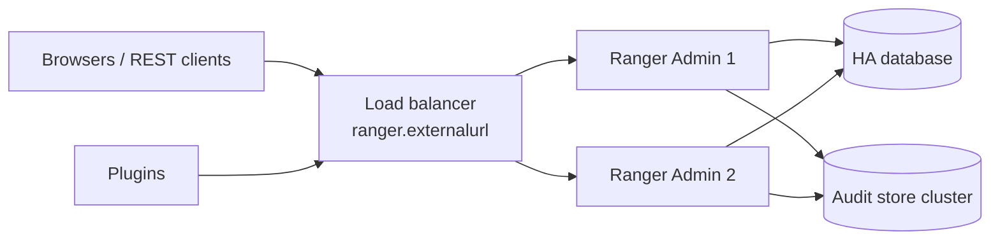

<!---
  Licensed to the Apache Software Foundation (ASF) under one or more
  contributor license agreements.  See the NOTICE file distributed with
  this work for additional information regarding copyright ownership.
  The ASF licenses this file to You under the Apache License, Version 2.0
  (the "License"); you may not use this file except in compliance with
  the License.  You may obtain a copy of the License at

      http://www.apache.org/licenses/LICENSE-2.0

  Unless required by applicable law or agreed to in writing, software
  distributed under the License is distributed on an "AS IS" BASIS,
  WITHOUT WARRANTIES OR CONDITIONS OF ANY KIND, either express or implied.
  See the License for the specific language governing permissions and
  limitations under the License.
-->

# High availability

Ranger is designed so that an outage of Ranger Admin does not stop the services it protects. Plugins keep
a local copy of their policies and continue to enforce them; only *changes* to policies and the ability to
view audits are unavailable while Admin is down. For deployments that also need the administrative
functions to stay up, run several Admin instances behind a load balancer sharing one database.

This page describes that setup, the behavior of plugins during an outage, and where UserSync and TagSync
differ (they use leader election through ZooKeeper instead of a load balancer).

## Admin is stateless (almost)

All persistent state is in the database, so any number of Admin instances can serve the same data. The
two things that are *not* shared are:

- **HTTP sessions.** Logged-in UI users have a server-side session identified by the
  `RANGERADMINSESSIONID` cookie. Configure the load balancer with session affinity (sticky sessions) so a
  browser keeps hitting the same instance. Stateless REST calls with Basic, Kerberos or bearer
  authentication work on any instance.
- **Local files.** Configuration, the credential store, keystores and logs are per host. Keep them
  identical across instances (or manage them with your configuration tooling).

## Setting up multiple Admin instances

1. Provision an HA database (replicated MySQL/PostgreSQL, Oracle RAC, …). Ranger has no database
   failover logic of its own; put the cluster endpoint, or a driver-specific failover URL, into
   `ranger.jpa.jdbc.url`.
2. Deploy Admin on each host (or as several containers) with the same `ranger-admin-site.xml`, credential
   store and keystores, except for host-specific values such as `ranger.service.host`. Set
   `ranger.externalurl` to the load-balancer URL, for example `https://ranger.example.com:6182`.
3. Create or upgrade the schema once, before starting the instances. If several instances apply patches
   at the same time, they coordinate through `x_db_version_h`
   (see [Database](database.md#schema-patches-and-upgrades)), so concurrent runs are safe.
4. For HTTPS, either terminate TLS at the load balancer or give every instance a certificate that is valid
   for the load-balancer name (or a wildcard/SAN certificate). For Kerberos, the SPNEGO principal on each
   host must be `HTTP/<load-balancer-hostname>@REALM`, because that is the name browsers and clients
   resolve; set `ranger.spnego.kerberos.principal` explicitly rather than relying on `_HOST`.
5. Point the load balancer's health check at an unauthenticated endpoint:

    | Method | Path | Description |
    | --- | --- | --- |
    | `GET` | `/service/actuator/health` | Overall status, including database connectivity. No authentication. |
    | `GET` | `/service/actuator/health/liveness` | Process is up. No authentication. |
    | `GET` | `/service/actuator/health/readiness` | Ready to serve requests. Requires authentication. |

    The readiness probe answers only when called as the user named by `ranger.admin.healthcheck.username`
    (default `healthcheck`); create that user in Admin and let the load balancer authenticate with it.

6. Enable sticky sessions for the UI and configure the same audit store on all instances. With SolrCloud,
   list the ZooKeeper ensemble in `ranger.audit.solr.zookeepers`; with Elasticsearch or OpenSearch, list
   several hosts in `ranger.audit.elasticsearch.urls` / `ranger.audit.opensearch.urls`.

Rolling upgrades work instance by instance: stop one, deploy the new version, let it apply the pending
patches, start it, then continue. Schema patches are backward compatible across one release boundary in
practice, but read the release notes for exceptions.

## How plugins cope with an outage

Plugins are read-only clients of Admin and are built to survive it:

- **Multiple URLs.** `ranger.plugin.<serviceType>.policy.rest.url` accepts a comma-separated list of Admin
  URLs. `RangerRESTClient` starts at a random index and tries every URL before giving up, and remembers the
  last URL that worked. A load balancer is therefore optional for plugins; listing the instances directly
  also works.
- **Local cache.** Downloaded policies, tags, roles and the user store are written to
  `ranger.plugin.<serviceType>.policy.cache.dir`. On restart, a plugin loads the cache before it can reach
  Admin, so authorization never falls back to "deny everything" just because Admin is unavailable.
- **Polling.** The policy refresher asks Admin for changes every
  `ranger.plugin.<serviceType>.policy.pollIntervalMs` (default 30 000 ms) with connection and read timeouts
  of `policy.rest.client.connection.timeoutMs` (120 s) and `policy.rest.client.read.timeoutMs` (30 s). A
  failed poll is logged and retried at the next interval.
- **Audit spooling.** Audit events are queued locally and spooled to disk if the audit store is
  unreachable; they do not go through Admin at all.

See [Plugin architecture](../../arch/plugin-architecture.md) for the full property list.

While Admin is down, the **Audit > Plugin Status** tab is of course unavailable, but once Admin returns it
shows for each plugin when policies were last downloaded and activated, which is the quickest way to
verify that every plugin has caught up.

## UserSync and TagSync: active/passive with ZooKeeper

UserSync and TagSync are *writers*: two instances syncing at the same time would race each other. They
therefore use the `ranger-common-ha` module for leader election instead of running active/active. The
module wraps Apache Curator; the elected instance becomes *active*, the others stay *passive* and take
over when the leader's ZooKeeper session expires.

The property names are prefixed with the value of `ranger.service.name` (for example `ranger-tagsync`):

| Key | Default | Type | Description |
| --- | --- | --- | --- |
| `<name>.server.ha.enabled` | (none) | Boolean | Enable HA. When absent, HA is on if more than one id is listed. |
| `<name>.server.ha.ids` | (none) | List | Instance ids, for example `id1,id2`. |
| `<name>.server.ha.address.<id>` | (none) | String | `host:port` of the instance with that id. |
| `<name>.server.ha.zookeeper.connect` | (none) | String | ZooKeeper ensemble. |
| `<name>.server.ha.zookeeper.zkroot` | `/apacheranger.service.name_zkroot` | String | Election path. The default is this literal string for every service, so set a distinct path per service when they share a ZooKeeper ensemble. |
| `<name>.server.ha.zookeeper.retry.sleeptime.ms` | `1000` | Duration (ms) | Wait between ZooKeeper connection retries. |
| `<name>.server.ha.zookeeper.num.retries` | `3` | Integer | Connection retries. |
| `<name>.server.ha.zookeeper.session.timeout.ms` | `20000` | Duration (ms) | ZooKeeper session timeout. |
| `<name>.server.ha.zookeeper.acl` | (none) | String | ACL for a secured ZooKeeper. |
| `<name>.server.ha.zookeeper.auth` | (none) | String | Authentication string for a secured ZooKeeper. |

Ranger Admin does **not** use this module; it does not need a leader because all instances serve the same
database. Details for each service are in [UserSync](../usersync/service.md), [TagSync](../tagsync/service.md)
and [KMS high availability](../kms/high-availability.md).

## Checklist

- [ ] HA database endpoint in `ranger.jpa.jdbc.url`
- [ ] Same `ranger-admin-site.xml`, keystores and `.jceks` on every host
- [ ] `ranger.externalurl` = load-balancer URL
- [ ] Sticky sessions on the load balancer, health check on `/service/actuator/health`
- [ ] SPNEGO principal uses the load-balancer hostname
- [ ] Plugins list all instances or the load balancer in `policy.rest.url`, and have a writable `policy.cache.dir`
- [ ] Audit store is itself clustered

## Further reading

- [`RangerRESTClient.java`](https://github.com/apache/ranger/blob/master/agents-common/src/main/java/org/apache/ranger/plugin/util/RangerRESTClient.java) (URL failover)
- [`ranger-common-ha`](https://github.com/apache/ranger/blob/master/ranger-common-ha) module
- [Architecture](../../arch/architecture.md)
