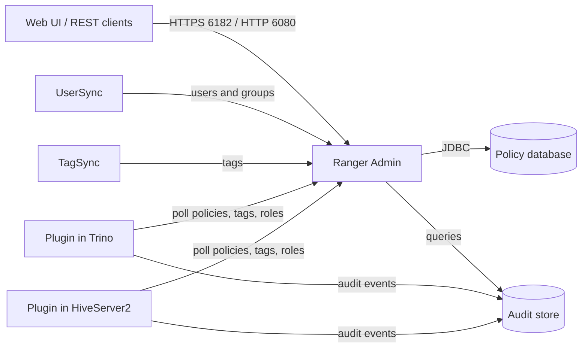

<!---
  Licensed to the Apache Software Foundation (ASF) under one or more
  contributor license agreements.  See the NOTICE file distributed with
  this work for additional information regarding copyright ownership.
  The ASF licenses this file to You under the Apache License, Version 2.0
  (the "License"); you may not use this file except in compliance with
  the License.  You may obtain a copy of the License at

      http://www.apache.org/licenses/LICENSE-2.0

  Unless required by applicable law or agreed to in writing, software
  distributed under the License is distributed on an "AS IS" BASIS,
  WITHOUT WARRANTIES OR CONDITIONS OF ANY KIND, either express or implied.
  See the License for the specific language governing permissions and
  limitations under the License.
-->

# Ranger Admin

Ranger Admin is the central service of Apache Ranger. It is the place where security administrators define
*who* may do *what* on *which* data, and where auditors go to see what actually happened. Everything else in
Ranger either feeds Admin (UserSync, TagSync) or takes instructions from it: the
plugins that run inside protected services such as Apache Polaris, Trino, Ozone,
Kafka, Hive and HDFS, and the [PDP server](../pdp/service.md) that answers authorization requests for any other application.

Admin is a single Java web application. It embeds its own Tomcat server, exposes a React-based web UI and a
REST API, and keeps all of its state in a relational database. Plugins never talk to the database; they
download policies from Admin over HTTP(S) and keep a local copy, so a temporary Admin outage does not stop
authorization in the protected services.

## What Ranger Admin does

Policy administration
:   Create and manage service definitions, services, resource-based and tag-based policies, row-filter and
    masking policies, security zones and Governed Data Sharing objects.

Policy distribution
:   Serves versioned policy, tag, role and user-store downloads to plugins
    (`/service/plugins/policies/download/...`, `/service/tags/download/...`,
    `/service/roles/download/...`).

Identity store
:   Holds portal users and their roles, plus the users and groups synced by UserSync and referenced in
    policies.

Audit viewer
:   Queries the configured audit store (Solr, Elasticsearch, OpenSearch or CloudWatch) and shows access
    audits, admin changes, login sessions, plugin downloads and plugin status.

Key administration
:   Hosts the Key Manager UI for Ranger KMS (users with the KeyAdmin role).

Operational surface
:   Health endpoints, Prometheus and JSON metrics, REST API for automation.

## How it works

Inside the process:

- **Embedded web server** (`embeddedwebserver` module, `org.apache.ranger.server.tomcat.EmbeddedServer`) starts
  Tomcat, opens the HTTP/HTTPS connectors and, on start-up, bootstraps the Solr collection, Elasticsearch or
  OpenSearch index used for audits.
- **Spring Security filter chain** (`security-applicationContext.xml`) authenticates requests using the
  configured method: local database, PAM, LDAP, Active Directory, Kerberos/SPNEGO, Knox SSO, JWT
  bearer tokens or trusted headers. See [Authentication](authentication.md).
- **REST layer** (`org.apache.ranger.rest.*`) implements the API under `/service/...`; the UI is only a
  client of that API.
- **Persistence** uses JPA (EclipseLink) over MySQL, PostgreSQL, Oracle, SQL Server or SQL Anywhere. Schema
  creation and upgrades are handled by numbered SQL and Java patches. See [Database](database.md).
- **Metrics** are exported through the `ranger-metrics` module in Prometheus and JSON formats. See
  [Metrics](metrics.md).

## Default ports

| Port | Property | Purpose |
| --- | --- | --- |
| 6080 | `ranger.service.http.port` | HTTP UI and REST API |
| 6182 | `ranger.service.https.port` | HTTPS UI and REST API, replaces the HTTP port when `ranger.service.https.attrib.ssl.enabled=true` |
| 6085 | `ranger.service.shutdown.port` | Tomcat shutdown port, local use only |

## Default accounts

The database schema creates four portal users. In the `dev-support/ranger-docker` setup their passwords are
set from the `RANGER_*_PASSWORD` variables in `.env` when the database is first prepared; all default to
`rangerR0cks!`. Change the passwords before the deployment is exposed to users; see
[Security hardening](security-hardening.md#change-the-default-passwords).

| Login | Role | Used by |
| --- | --- | --- |
| `admin` | Admin | Human administrators, first login |
| `rangerusersync` | Admin | UserSync when it pushes users and groups |
| `rangertagsync` | Admin | TagSync when it pushes tags |
| `keyadmin` | KeyAdmin | Ranger KMS key administration |

## Pages in this section

- [Deployment and configuration](installation.md): running Admin with Docker and `ranger-admin-services.sh`, `ranger-admin-site.xml` reference, logs, upgrade
- [Authentication](authentication.md): every login method for the UI and REST API, with the properties that control each
- [Users, groups and roles](users-groups-roles.md): internal and external users, admin roles, read-only auditors, permissions module, deleting users
- [Database](database.md): supported databases, schema and patch mechanism, connection pool, SSL to the database, backup and restore
- [High availability](high-availability.md): running several Admin instances behind a load balancer and how plugins cope with outages
- [Security hardening](security-hardening.md): lock-down checklist, HTTPS, plugin-to-Admin SSL, credential store, CSRF and password policy
- [Admin UI guide](ui-guide.md): a tour of Service Manager, policies, audits, settings, zones, reports and Governed Data Sharing
- [Metrics](metrics.md): Prometheus and JSON metrics, JVM and container metrics, audit metrics, CLI metric collection

## Where to start

- To try Ranger quickly, run it with Docker. Both ways are described step by step in
  [Run with Docker](installation.md#run-with-docker):

    === "Docker Hub images"

        Released images `apache/ranger`, `apache/ranger-db` and `apache/ranger-solr` (tags up to `2.9.0`):
        Ranger Admin with a PostgreSQL database and a standalone Solr audit store.

    === "Build from source (dev-support/ranger-docker)"

        Images built from the source tree with `docker-compose.ranger.yml` and
        `docker-compose.ranger-audit-service.yml`: Ranger Admin, the database selected with
        `RANGER_DB_TYPE`, Kafka, OpenSearch, the audit ingestor and an audit dispatcher. The audit server
        is not yet part of a release.

- For a real deployment, follow [Deployment and configuration](installation.md) and then walk through the
  first policy tutorial.
- If you are integrating an application, read the [architecture overview](../../arch/architecture.md) and
  the plugin architecture pages first.

## Further reading

- Source: [`security-admin`](https://github.com/apache/ranger/blob/master/security-admin) and
  [`embeddedwebserver`](https://github.com/apache/ranger/blob/master/embeddedwebserver) modules
- [Ranger UserSync](../usersync/service.md), [Ranger TagSync](../tagsync/service.md), [Ranger KMS](../kms/service.md)
- [Audit framework](../audit/index.md)
