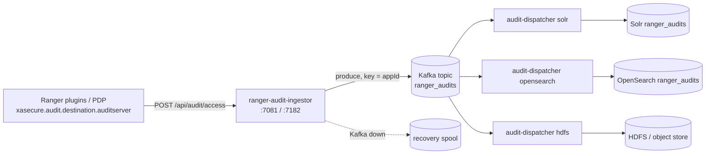

<!---
  Licensed to the Apache Software Foundation (ASF) under one or more
  contributor license agreements.  See the NOTICE file distributed with
  this work for additional information regarding copyright ownership.
  The ASF licenses this file to You under the Apache License, Version 2.0
  (the "License"); you may not use this file except in compliance with
  the License.  You may obtain a copy of the License at

      http://www.apache.org/licenses/LICENSE-2.0

  Unless required by applicable law or agreed to in writing, software
  distributed under the License is distributed on an "AS IS" BASIS,
  WITHOUT WARRANTIES OR CONDITIONS OF ANY KIND, either express or implied.
  See the License for the specific language governing permissions and
  limitations under the License.
-->

# Ranger Audit Server

The Ranger Audit Server is an optional, centralized pipeline for access audit records. Instead of every
plugin holding its own Solr, OpenSearch or HDFS client and credentials, plugins send their audit batches over
HTTP to an **audit ingestor**, which publishes them to a Kafka topic. One or more **audit dispatchers**
consume the topic and write the records to the final stores. Plugins keep their local file spool, so nothing
is lost if the ingestor is briefly unavailable.

This gives you one place to manage store credentials, lets you scale writers independently of the
protected services, and lets audits fan out to several stores (for example OpenSearch for the Admin UI and
HDFS for long-term retention) without touching plugin configuration.

The Audit Server lives in the `audit-server/` module on the master branch (version `3.0.0-SNAPSHOT`). Plugins
that write directly to an audit store continue to work exactly as before; see
[Audit framework](../audit/index.md).

!!! note "Not yet part of a release"
    The audit server (audit ingestor and audit dispatchers) is not yet part of a release. On master it is the
    default audit path of the `dev-support/ranger-docker` setup, whose minimal stack is `ranger`, `ranger-db`,
    Kafka, OpenSearch (the default audit index), the audit ingestor and an audit dispatcher. The released
    Docker Hub images (`apache/ranger`, `apache/ranger-db`, `apache/ranger-solr`) do not include it; with them,
    plugins write audits directly to Solr.

## How it works



The Audit Server consists of two services, both embedded-Tomcat applications configured with a site XML file:

| Service | Module | Configuration file | Port |
| --- | --- | --- | --- |
| Audit ingestor | `audit-server/audit-ingestor` | `ranger-audit-ingestor-site.xml` | `7081` (HTTP), `7182` (HTTPS) |
| Audit dispatcher | `audit-server/audit-dispatcher` | `ranger-audit-dispatcher-<type>-site.xml` | `7090` |

The dispatcher runs once per destination type: `solr`, `opensearch` or `hdfs`.

### Ingestor

The ingestor (`org.apache.ranger.audit.server.AuditServerApplication`) exposes:

| Method | Path | Description |
| --- | --- | --- |
| `POST` | `/api/audit/access` | Accepts a JSON array of audit events. |
| `GET` | `/api/audit/health` | Liveness; HTTP 503 when the service is down. |
| `GET` | `/api/audit/status` | `READY` or `NOT_READY` with a timestamp. |

`POST /api/audit/access` takes the query parameters `serviceName` (required) and `appId` (optional); the
body is a list of `AuthzAuditEvent` objects, see [Audit schema](../audit/audit-schema.md). A healthy ingestor
answers `/api/audit/health` with:

```json
{"status":"UP","service":"ranger-audit-server"}
```

For each batch the ingestor:

1. Authenticates the request (Kerberos SPNEGO or JWT) and maps the principal to a short name using
   `ranger.audit.ingestor.auth.to.local` rules.
2. Checks that the user is allowed to report audits for `serviceName`
   (`ranger.audit.ingestor.service.<serviceName>.allowed.users`). Unknown users get `401`, unauthorized ones `403`.
3. Produces the events to Kafka with `appId` as the record key. `AuditPartitioner` reserves a range of
   partitions for each plugin type listed in `kafka.configured.plugins` and sends unknown app ids to the
   remaining "buffer" partitions, so a noisy plugin cannot starve the others.
4. Returns `200` on success. If Kafka is unavailable, events are written to the local recovery spool and the
   response is `202 Accepted`; a recovery thread retries them later.

### Dispatchers

A dispatcher (`org.apache.ranger.audit.dispatcher.AuditDispatcherLauncher`) is one application started with a
type argument. The launcher loads `lib/dispatchers/<type>/*.jar` into an isolated class loader, reads
`ranger-audit-dispatcher-<type>-site.xml`, and starts `ranger.audit.dispatcher.thread.count` Kafka consumer
workers in the consumer group `ranger.audit.dispatcher.kafka.group.id`. Each worker subscribes to the topic,
lets Kafka assign partitions (`CooperativeStickyAssignor` by default), and hands every polled batch to the
destination:

| Type | Writer (from `agents-audit`) | Destination properties |
| --- | --- | --- |
| `solr` | `SolrAuditDestination` | `xasecure.audit.destination.solr.*` |
| `hdfs` | `HDFSAuditDestination`, one writer per `appId` | `xasecure.audit.destination.hdfs.*` |
| `opensearch` | `OpenSearchAuditDestination` | `ranger.audit.dispatcher.*` |

Offsets are committed manually, either after every batch (`offset.commit.strategy=batch`, the default) or
on a timer (`manual` with `offset.commit.interval.ms`). Auto-commit is always disabled, so a crashed worker
replays from the last commit rather than losing records.

Health endpoints: `GET /api/health/ping` and `GET /api/health/status` (503 when the dispatcher of the
configured type is not active).

## Plugin-side configuration

Point a plugin at the ingestor by enabling the `auditserver` destination in the plugin's audit configuration
file, `ranger-<component>-audit.xml`, on the component's classpath.

```xml title="ranger-hive-audit.xml"
<property>
  <name>xasecure.audit.destination.auditserver</name>
  <value>true</value>
</property>
<property>
  <name>xasecure.audit.destination.auditserver.url</name>
  <value>http://ranger-audit-ingestor.example.com:7081</value>
</property>
<property>
  <name>xasecure.audit.destination.auditserver.batch.filespool.dir</name>
  <value>/var/log/hive/audit/http/spool</value>
</property>
```

All keys below carry the prefix `xasecure.audit.destination.auditserver.`; the destination is enabled with
`xasecure.audit.destination.auditserver=true`.

| Key | Default | Type | Description |
| --- | --- | --- | --- |
| `url` | (none) | URL | Required. Base URL of the ingestor; the client posts to `/api/audit/access`. |
| `batch.filespool.dir` | (none) | Path | Local spool used when the ingestor is unreachable. |
| `authn.type` | (none) | Enum | `kerberos` (SPNEGO with the plugin's login user), `basic` or `jwt`. |
| `authn.basic.username` | (none) | String | User for `basic`. |
| `authn.basic.password` | (none) | Password | Password for `basic`. |
| `authn.jwt.env` | (none) | String | Environment variable holding the bearer token for `jwt`. |
| `authn.jwt.file` | (none) | Path | File holding the bearer token for `jwt`. |
| `ssl.config.file` | (none) | Path | XML file with `xasecure.policymgr.clientssl.*` keystore and truststore settings for HTTPS. |
| `connection.timeout.ms` | `120000` | Duration (ms) | HTTP connect timeout. |
| `read.timeout.ms` | `30000` | Duration (ms) | HTTP read timeout. |
| `max.retry.attempts` | `3` | Integer | Retries per batch before the batch is spooled. |
| `retry.interval.ms` | `1000` | Duration (ms) | Delay between retries. |

Spooling follows the standard batch-queue behavior described in [Audit framework](../audit/index.md).

The plugin sends `serviceName` from the events' `repo` field and `appId` from the plugin's application
type (for example `hiveServer2`), which the ingestor uses for authorization and partitioning.

## Requirements

- A running Apache Kafka cluster reachable from the ingestor and the dispatchers. The ingestor creates the
  topic at startup if it does not exist.
- The target stores: Solr, OpenSearch and/or HDFS, prepared as described in [Audit stores](../audit/audit-stores.md).
- A JDK on every ingestor and dispatcher host.
- With Kerberos: an `HTTP/` keytab for the ingestor's SPNEGO endpoint and a service keytab for the Kafka,
  Solr and HDFS clients.
- The distributions `ranger-<version>-audit-ingestor.tar.gz` and `ranger-<version>-audit-dispatcher.tar.gz`
  produced by the Ranger build, or the images built from them by the compose files in
  `dev-support/ranger-docker`. There are no audit server images on Docker Hub.

## Running the Audit Server

=== "Docker (dev-support/ranger-docker)"

    The images are built from the source tree; prepare the directory (`./download-archives.sh kafka` and a
    Ranger build in `dist/`) as described under *Build from source* in
    [Run with Docker](../admin/installation.md#run-with-docker).
    `dev-support/ranger-docker/docker-compose.ranger-audit-service.yml` brings up the whole pipeline:
    Kafka, the ingestor, the index store selected by the compose profile, and its dispatcher. Ranger Admin
    is configured for the same store through `AUDIT_INDEX_STORE`.

    ```bash
    cd dev-support/ranger-docker
    export RANGER_DB_TYPE=postgres               # mysql | postgres | oracle
    export AUDIT_INDEX_STORE=opensearch          # or solr
    export AUDIT_DESTINATIONS=audit-store-${AUDIT_INDEX_STORE}
    docker compose --profile ${AUDIT_DESTINATIONS} \
      -f docker-compose.ranger.yml \
      -f docker-compose.ranger-audit-service.yml up -d

    # additionally fan out to HDFS (needs the hadoop container)
    docker compose --profile ${AUDIT_DESTINATIONS} --profile audit-store-hdfs \
      -f docker-compose.ranger.yml \
      -f docker-compose.ranger-audit-service.yml \
      -f docker-compose.ranger-audit-destination-hdfs.yml up -d
    ```

    | Container | Dockerfile | Host port |
    | --- | --- | --- |
    | `ranger-audit-ingestor` | `Dockerfile.ranger-audit-ingestor` | `7081`, `7182` |
    | `ranger-audit-dispatcher-solr` | `Dockerfile.ranger-audit-dispatcher` | `7091` |
    | `ranger-audit-dispatcher-opensearch` | `Dockerfile.ranger-audit-dispatcher` | `7093` |
    | `ranger-audit-dispatcher-hdfs` | `Dockerfile.ranger-audit-dispatcher` | `7092` |

    The three dispatcher containers share one image; the container command (`solr`, `opensearch` or `hdfs`)
    selects the type, and each maps its host port to the dispatcher port `7090`. The store for the selected
    profile runs as `ranger-solr` (port `8983`) or `ranger-opensearch` (port `9200`).

    Site files are mounted from `scripts/audit-dispatcher/`; the ingestor uses the site file shipped in its
    distribution. The plugin containers in the docker stack are already configured with
    `xasecure.audit.destination.auditserver=true`.

=== "Service scripts"

    **Ingestor.** The distribution contains `bin/` (`start-audit-ingestor.sh`, `stop-audit-ingestor.sh`),
    `conf/` (`ranger-audit-ingestor-site.xml`, `logback.xml`), `webapp/` (`ranger-audit-ingestor.war`,
    extracted on first start), `libext/` for extra jars, and `logs/`.

    ```bash
    export AUDIT_SERVER_HOME_DIR=/opt/ranger/audit-ingestor
    export AUDIT_SERVER_CONF_DIR=$AUDIT_SERVER_HOME_DIR/conf
    export AUDIT_SERVER_LOG_DIR=/var/log/ranger/audit-ingestor
    $AUDIT_SERVER_HOME_DIR/bin/start-audit-ingestor.sh
    curl -s http://localhost:7081/api/audit/health
    ```

    **Dispatcher.** The distribution contains `scripts/` (`start-audit-dispatcher.sh`,
    `stop-audit-dispatcher.sh`), `conf/` (one `ranger-audit-dispatcher-<type>-site.xml` per type,
    `logback.xml`, plus `core-site.xml` and `hdfs-site.xml` for HDFS), `webapp/ranger-audit-dispatcher.war`,
    `lib/dispatchers/{solr,hdfs,opensearch}/`, `libext/`, and `logs/`.

    ```bash
    export AUDIT_DISPATCHER_HOME_DIR=/opt/ranger/audit-dispatcher
    export AUDIT_DISPATCHER_CONF_DIR=$AUDIT_DISPATCHER_HOME_DIR/conf
    $AUDIT_DISPATCHER_HOME_DIR/scripts/start-audit-dispatcher.sh solr        # or hdfs | opensearch
    curl -s http://localhost:7090/api/health/ping
    ```

    Run one dispatcher process per destination type. To run two types on the same host, give each its own
    `AUDIT_DISPATCHER_LOG_DIR` and change `ranger.audit.dispatcher.http.port` in one of the site files.

    Script environment variables (both services): `*_HOME_DIR`, `*_CONF_DIR`, `*_LOG_DIR`, `*_HEAP`
    (default `-Xms512m -Xmx2g`; or `RANGER_AUDIT_INGESTOR_MAX_HEAP` / `RANGER_AUDIT_DISPATCHER_MAX_HEAP`),
    `*_OPTS` for extra JVM options, `KERBEROS_ENABLED=true` to add `-Djava.security.krb5.conf=/etc/krb5.conf`.
    In the source tree, `audit-server/scripts/start-all-services.sh` and `stop-all-services.sh` start and
    stop the ingestor, the Solr dispatcher and the HDFS dispatcher from the Maven `target/` directories.

## Configuration reference

### Ingestor

The ingestor reads `conf/ranger-audit-ingestor-site.xml`. The defaults below are the values in the file
shipped with the distribution; host names and Kafka brokers in that file point at the docker network and must
be set for your environment.

#### Server

| Key | Default | Type | Description |
| --- | --- | --- | --- |
| `ranger.audit.ingestor.host` | (none) | String | Host name of this ingestor; used for `_HOST` substitution in principals. |
| `ranger.audit.ingestor.http.port` | `7081` | Integer | HTTP listen port. |
| `ranger.audit.ingestor.contextName` | `/` | String | Servlet context path. |
| `ranger.audit.ingestor.webapp.dir` | `webapp/audit-ingestor` | Path | Directory the WAR is extracted to. |

#### TLS

| Key | Default | Type | Description |
| --- | --- | --- | --- |
| `ranger.audit.ingestor.https.attrib.ssl.enabled` | `false` | Boolean | Serve HTTPS. |
| `ranger.audit.ingestor.https.port` | `7182` | Integer | HTTPS listen port. |
| `ranger.audit.ingestor.https.attrib.keystore.file` | `/etc/ranger/ranger-audit-ingestor/keys/server.jks` | Path | Server keystore. |
| `ranger.audit.ingestor.https.attrib.keystore.keyalias` | `myKey` | String | Alias of the server key. |
| `ranger.audit.ingestor.https.attrib.keystore.pass` | (none) | Password | Keystore password. |
| `ranger.audit.ingestor.https.attrib.keystore.credential.alias` | `keyStoreCredentialAlias` | String | Alias of the keystore password in a credential store. |
| `ranger.audit.ingestor.tomcat.ciphers` | (none) | List | Restrict the TLS cipher suites. |

#### Inbound authentication

Plugins authenticate with Kerberos (SPNEGO) or a JWT bearer token.

| Key | Default | Type | Description |
| --- | --- | --- | --- |
| `ranger.audit.ingestor.kerberos.type` | `kerberos` | Enum | Inbound HTTP authentication handler: `kerberos` (SPNEGO) or `simple`. |
| `hadoop.security.authentication` | `kerberos` | Enum | `kerberos` or `simple`. With `kerberos` the ingestor logs in at startup with `ranger.audit.ingestor.service.kerberos.principal` and its keytab. |
| `ranger.audit.ingestor.kerberos.principal` | `HTTP/_HOST@EXAMPLE.COM` | String | SPNEGO service principal. |
| `ranger.audit.ingestor.kerberos.keytab` | `/etc/keytabs/HTTP.keytab` | Path | Keytab of the SPNEGO principal. |
| `ranger.audit.ingestor.kerberos.name.rules` | `DEFAULT` | String | Principal to short-name rules. |
| `ranger.audit.ingestor.bind.address` | (none) | String | Host name substituted for `_HOST` in the SPNEGO principal. |
| `ranger.audit.jwt.auth.enabled` | `false` | Boolean | Accept JWT bearer tokens. |
| `ranger.audit.jwt.auth.provider-url` | `http://localhost:9180/rest/jwks` | URL | JWKS endpoint used to fetch signing keys. |
| `ranger.audit.jwt.auth.public-key` | (none) | String | PEM-encoded public key for signature verification. |
| `ranger.audit.jwt.auth.cookie.name` | `hadoop-jwt` | String | Cookie that may carry the token. |
| `ranger.audit.jwt.auth.audiences` | (none) | List | Accepted `aud` values. |

#### Authorization of callers

After authentication the caller's principal is mapped to a short name and checked against the users allowed
to report audits for the requested service.

| Key | Default | Type | Description |
| --- | --- | --- | --- |
| `ranger.audit.ingestor.service.<serviceName>.allowed.users` | (none) | List | Users allowed to post audits for `<serviceName>`; one property per Ranger service. |
| `ranger.audit.ingestor.auth.to.local` | (none) | String | `auth_to_local` rules applied to the caller principal before the allowed-users check. |

```xml title="ranger-audit-ingestor-site.xml"
<property>
  <name>ranger.audit.ingestor.service.dev_hive.allowed.users</name>
  <value>hive</value>
</property>
```

#### Kafka connection

| Key | Default | Type | Description |
| --- | --- | --- | --- |
| `xasecure.audit.destination.kafka` | `true` | Boolean | Must be `true`; otherwise the producer is not created. |
| `ranger.audit.ingestor.kafka.bootstrap.servers` | (none) | List | Required. Kafka brokers. |
| `ranger.audit.ingestor.kafka.security.protocol` | `SASL_PLAINTEXT` | Enum | Kafka security protocol; `PLAINTEXT` when the property is absent. |
| `ranger.audit.ingestor.kafka.sasl.mechanism` | `GSSAPI` | String | SASL mechanism for `SASL_*` protocols; `PLAIN` when the property is absent. |
| `ranger.audit.ingestor.service.kerberos.principal` | `rangerauditserver/_HOST@EXAMPLE.COM` | String | Identity of the ingestor's Kafka client; the JAAS configuration is built in memory. |
| `ranger.audit.ingestor.service.kerberos.keytab` | `/etc/keytabs/rangerauditserver.keytab` | Path | Keytab of that principal. |
| `ranger.audit.ingestor.kafka.request.timeout.ms` | `60000` | Duration (ms) | Producer request timeout. |
| `ranger.audit.ingestor.kafka.connections.max.idle.ms` | `90000` | Duration (ms) | Idle connection timeout. |

#### Topic and partitioning

Replication and the topic-level settings apply only when the ingestor creates the topic. If the topic already
exists with fewer partitions than calculated, the ingestor increases its partition count.

| Key | Default | Type | Description |
| --- | --- | --- | --- |
| `ranger.audit.ingestor.kafka.topic.name` | `ranger_audits` | String | Topic; created at startup if missing. |
| `ranger.audit.ingestor.kafka.topic.partitions` | `10` | Integer | Partition count when `kafka.configured.plugins` is empty. Otherwise: per-plugin partitions plus buffer partitions (48 with the defaults). |
| `ranger.audit.ingestor.kafka.replication.factor` | `1` | Integer | Replication factor for a new topic; `3` when the property is absent. |
| `ranger.audit.ingestor.kafka.topic.retention.ms` | (none) | Duration (ms) | Topic `retention.ms`, for example `604800000` (7 days). Applied only when set; otherwise the broker default is used. |
| `ranger.audit.ingestor.kafka.topic.compression.type` | (none) | String | Topic `compression.type`, for example `lz4`. Applied only when set. |
| `ranger.audit.ingestor.kafka.topic.min.insync.replicas` | (none) | Integer | Topic `min.insync.replicas`. Applied only when set; must not exceed the replication factor. |
| `ranger.audit.ingestor.kafka.partitioner.class` | `org.apache.ranger.audit.producer.kafka.AuditPartitioner` | Class | Producer partitioner. |
| `ranger.audit.ingestor.kafka.configured.plugins` | see below | List | App ids that get dedicated partition ranges. |
| `ranger.audit.ingestor.kafka.topic.partitions.per.configured.plugin` | `3` | Integer | Partitions per listed plugin. |
| `ranger.audit.ingestor.kafka.plugin.partition.overrides.<appId>` | (none) | Integer | Per-plugin partition count, for example `...overrides.kafka=5`. |
| `ranger.audit.ingestor.kafka.topic.partitions.buffer` | `9` | Integer | Partitions for app ids not in the list. |

The default value of `kafka.configured.plugins` is:

```text
hdfs,yarn,knox,hiveServer2,hiveMetastore,kafka,hbaseRegional,hbaseMaster,solr,trino,ozone,kudu,nifi
```

#### Producer tuning

Each key maps to the Kafka producer setting of the same name.

| Key | Default | Type | Description |
| --- | --- | --- | --- |
| `ranger.audit.ingestor.kafka.producer.batch.size` | `131072` | Integer | Producer `batch.size`, in bytes. |
| `ranger.audit.ingestor.kafka.producer.linger.ms` | `20` | Duration (ms) | Producer `linger.ms`. |
| `ranger.audit.ingestor.kafka.producer.buffer.memory` | `134217728` | Long | Producer `buffer.memory`, in bytes. |
| `ranger.audit.ingestor.kafka.producer.compression.type` | `lz4` | String | Producer compression. |
| `ranger.audit.ingestor.kafka.producer.delivery.timeout.ms` | `120000` | Duration (ms) | Producer `delivery.timeout.ms`. |
| `ranger.audit.ingestor.kafka.producer.max.request.size` | `1048576` | Integer | Producer `max.request.size`, in bytes. |
| `ranger.audit.ingestor.kafka.producer.max.block.ms` | `60000` | Duration (ms) | Producer `max.block.ms`. |
| `ranger.audit.ingestor.kafka.producer.batch.send.timeout.ms` | `30000` | Duration (ms) | Wait for acknowledgements of a batch. |

#### Recovery spool

When Kafka is unavailable the ingestor writes batches to disk and retries them.

| Key | Default | Type | Description |
| --- | --- | --- | --- |
| `ranger.audit.ingestor.recovery.enabled` | `true` | Boolean | Spool to disk when Kafka is unavailable. |
| `ranger.audit.ingestor.recovery.spool.dir` | `/var/log/ranger/ranger-audit-ingestor/audit/spool` | Path | Spool directory. |
| `ranger.audit.ingestor.recovery.archive.dir` | `/var/log/ranger/ranger-audit-ingestor/audit/archive` | Path | Archive of replayed spool files. |
| `ranger.audit.ingestor.recovery.file.rotation.interval.sec` | `300` | Integer | Spool file rotation interval, in seconds. |
| `ranger.audit.ingestor.recovery.max.messages.per.file` | `10000` | Integer | Messages per spool file. |
| `ranger.audit.ingestor.recovery.retry.interval.sec` | `60` | Integer | Retry interval, in seconds. |
| `ranger.audit.ingestor.recovery.retry.max.attempts` | `3` | Integer | Retries per spooled file. |
| `ranger.audit.ingestor.recovery.archive.max.processed.files` | `100` | Integer | Archived files to keep. |

### Dispatcher

Each dispatcher type reads `conf/ranger-audit-dispatcher-<type>-site.xml`. The defaults below are the values
in the shipped files.

#### Dispatcher process

| Key | Default | Type | Description |
| --- | --- | --- | --- |
| `ranger.audit.dispatcher.type` | per file | Enum | `solr`, `hdfs` or `opensearch`; the start script also passes it as a system property. |
| `ranger.audit.dispatcher.class` | per file | Class | Kafka dispatcher class for the type, see below. |
| `ranger.audit.dispatcher.host` | (none) | String | Host name for `_HOST` substitution. |
| `ranger.audit.dispatcher.http.port` | `7090` | Integer | Health endpoint port. |
| `ranger.audit.dispatcher.thread.count` | `5` | Integer | Consumer workers per process; `3` in the HDFS file, `1` when the property is absent. |

The dispatcher classes are `AuditSolrDispatcher`, `AuditHDFSDispatcher` and `AuditOpenSearchDispatcher` in the
package `org.apache.ranger.audit.dispatcher.kafka`. The files also set `ranger.audit.dispatcher.war.file`,
`.launcher.class` and `.main.class`, which wire the startup and should be left unchanged.

#### Kafka consumer

| Key | Default | Type | Description |
| --- | --- | --- | --- |
| `ranger.audit.dispatcher.kafka.bootstrap.servers` | (none) | List | Required. Kafka brokers. |
| `ranger.audit.dispatcher.kafka.topic.name` | `ranger_audits` | String | Topic to consume. |
| `ranger.audit.dispatcher.kafka.group.id` | `ranger_audit_<type>_dispatcher_group` | String | Consumer group; all instances of one type share it. |
| `ranger.audit.dispatcher.kafka.security.protocol` | `SASL_PLAINTEXT` | Enum | Kafka security protocol; `PLAINTEXT` when the property is absent. |
| `ranger.audit.dispatcher.kafka.sasl.mechanism` | `GSSAPI` | String | SASL mechanism; `PLAIN` when the property is absent. |
| `ranger.audit.dispatcher.service.kerberos.principal` | `rangerauditserver/_HOST@EXAMPLE.COM` | String | Identity for the Kafka, Solr and HDFS clients. |
| `ranger.audit.dispatcher.service.kerberos.keytab` | `/etc/keytabs/rangerauditserver.keytab` | Path | Keytab of that principal. |
| `ranger.audit.dispatcher.offset.commit.strategy` | `batch` | Enum | `batch` (commit after every batch) or `manual` (commit on a timer). |
| `ranger.audit.dispatcher.offset.commit.interval.ms` | `30000` | Duration (ms) | Commit interval for `manual`. |
| `ranger.audit.dispatcher.max.poll.records` | `500` | Integer | Records per poll. |
| `ranger.audit.dispatcher.session.timeout.ms` | `60000` | Duration (ms) | Consumer session timeout. |
| `ranger.audit.dispatcher.heartbeat.interval.ms` | `10000` | Duration (ms) | Consumer heartbeat interval. |
| `ranger.audit.dispatcher.max.poll.interval.ms` | `300000` | Duration (ms) | Maximum time to process one poll. |
| `ranger.audit.dispatcher.partition.assignment.strategy` | `org.apache.kafka.clients.consumer.CooperativeStickyAssignor` | Class | Rebalance strategy. |

#### Solr destination

The Solr dispatcher uses the standard destination properties, with the same semantics as in
[Audit framework](../audit/index.md#solr): `xasecure.audit.destination.solr.urls` or `.zookeepers`,
`.collection`, `.batch.filespool.dir`, and for a Kerberized Solr `.force.use.inmemory.jaas.config` together
with `xasecure.audit.jaas.Client.*`.

#### HDFS destination

The HDFS dispatcher uses `xasecure.audit.destination.hdfs.dir`, `.subdir`, `.filename.format`,
`.batch.filespool.dir`, `.batch.filequeue.filetype` (`json` or `orc`), `.file.rollover.sec` and the
`xasecure.audit.destination.hdfs.config.<hadoop-property>` pass-through described in
[Audit framework](../audit/index.md#hdfs-and-object-stores), plus `core-site.xml` and `hdfs-site.xml` in `conf/`.
The dispatcher keeps one writer per `appId`. By default files land in:

```text
<dir>/<serviceType>/<appId>/<yyyyMMdd>/<appId>_ranger_audit_<agentHost>_<instance>.log
```

The file name carries the host name of the originating plugin.

#### OpenSearch destination

The OpenSearch dispatcher requires `xasecure.audit.destination.opensearch=true` and
`ranger.audit.dispatcher.opensearch.class=org.apache.ranger.audit.dispatcher.OpenSearchDispatcherManager`
(both set in the shipped file).

| Key | Default | Type | Description |
| --- | --- | --- | --- |
| `ranger.audit.dispatcher.urls` | `localhost` | List | OpenSearch host names (`ranger-opensearch` in the shipped file). |
| `ranger.audit.dispatcher.port` | `9200` | Integer | Port. |
| `ranger.audit.dispatcher.protocol` | `http` | Enum | `http` or `https`. |
| `ranger.audit.dispatcher.index` | `ranger_audits` | String | Index name. |
| `ranger.audit.dispatcher.authentication.type` | (none) | Enum | `basic` or `kerberos`. |
| `ranger.audit.dispatcher.user` | (none) | String | User for `basic`. |
| `ranger.audit.dispatcher.password` | (none) | Password | Password for `basic`. |
| `ranger.audit.dispatcher.kerberos.principal` | (none) | String | Principal for `kerberos`. |
| `ranger.audit.dispatcher.kerberos.keytab` | (none) | Path | Keytab for `kerberos`. |

## Operations

- **Scaling:** start more dispatcher processes of the same type with the same `kafka.group.id`; Kafka
  rebalances partitions across them. Throughput is bounded by the topic's partition count, so size
  `kafka.topic.partitions` for the plugins you run. Run several ingestors behind a load balancer; they are
  stateless apart from their recovery spool.
- **Logs:** `logs/ranger-audit-ingestor.log`, `logs/ranger-audit-dispatcher.log` and `logs/catalina.out`
  in the respective log directory (`/var/log/ranger/audit-ingestor` and `/var/log/ranger/audit-dispatcher/<type>`
  in docker). Raise the level in `conf/logback.xml` (`org.apache.ranger.audit` to `DEBUG`) and restart.
- **Kerberos:** the ingestor needs an `HTTP/` keytab for SPNEGO and a service keytab for Kafka; the
  dispatchers need the service keytab for Kafka and HDFS. Set `KERBEROS_ENABLED=true` so the scripts pass
  `java.security.krb5.conf`.
- **Ranger Admin:** configure the Admin UI to read from the same store the dispatchers write to
  (`ranger.audit.source.type` = `solr` or `opensearch`), see [Audit stores](../audit/audit-stores.md).

## Troubleshooting

Plugin logs `Failed to send audit batch`
:   The ingestor is unreachable or returning errors. Check the plugin spool directory and
    `curl /api/audit/health`.

Ingestor returns `403`
:   The authenticated short name is not in `ranger.audit.ingestor.service.<serviceName>.allowed.users`, or the
    `auth.to.local` rules do not produce the expected name.

Ingestor returns `401`
:   SPNEGO or JWT is not configured on the plugin side (`authn.type`), or the ingestor's keytab is wrong.

Ingestor returns `202`
:   Kafka is down; events are in `recovery.spool.dir` and will be retried.

Dispatcher `/api/health/status` is `DOWN`
:   The `ranger.audit.dispatcher.class` failed to initialize; check the store connection settings in the
    site file.

Records reach Kafka but not the store
:   Look for spool files in the dispatcher's `batch.filespool.dir`; the destination is down and records are
    queued.

Port already in use
:   Another dispatcher type is running with the default `7090`; change `ranger.audit.dispatcher.http.port`.

## Further reading

- [Audit framework](../audit/index.md), [Audit stores](../audit/audit-stores.md), [Audit schema](../audit/audit-schema.md).
- Source: [`audit-server/scripts/README.md`](https://github.com/apache/ranger/blob/master/audit-server/scripts/README.md),
  [`audit-server/audit-ingestor`](https://github.com/apache/ranger/blob/master/audit-server/audit-ingestor),
  [`audit-server/audit-dispatcher`](https://github.com/apache/ranger/blob/master/audit-server/audit-dispatcher),
  [`dev-support/ranger-docker/docker-compose.ranger-audit-service.yml`](https://github.com/apache/ranger/blob/master/dev-support/ranger-docker/docker-compose.ranger-audit-service.yml).
