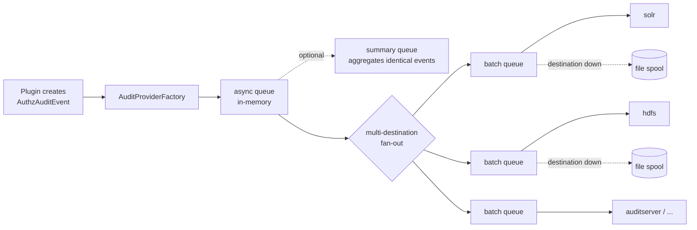

<!---
  Licensed to the Apache Software Foundation (ASF) under one or more
  contributor license agreements.  See the NOTICE file distributed with
  this work for additional information regarding copyright ownership.
  The ASF licenses this file to You under the Apache License, Version 2.0
  (the "License"); you may not use this file except in compliance with
  the License.  You may obtain a copy of the License at

      http://www.apache.org/licenses/LICENSE-2.0

  Unless required by applicable law or agreed to in writing, software
  distributed under the License is distributed on an "AS IS" BASIS,
  WITHOUT WARRANTIES OR CONDITIONS OF ANY KIND, either express or implied.
  See the License for the specific language governing permissions and
  limitations under the License.
-->

# Audit framework

Every Ranger plugin records who accessed what, when, from where, and whether the access was allowed.
These access audit records are the basis of the Audit tab in Ranger Admin, of compliance reporting, and of
security analytics. The audit framework (`agents-audit` module, artifact `ranger-plugins-audit`) is the
library inside each plugin, the PDP and Ranger Admin that collects these records and delivers them to one or
more **destinations** such as Solr, OpenSearch, Elasticsearch, HDFS, Amazon CloudWatch, a log file, or the
[Ranger Audit Server](../audit-server/service.md).

The framework is designed so that auditing never slows down or blocks the protected service: events are
handed off to an in-memory queue, batched, and written by background threads. If a destination is slow or
down, events are spooled to local disk and replayed later.

This page explains the pipeline and lists the `xasecure.audit.*` properties. Related pages:

- [Audit stores](audit-stores.md) — what Solr, OpenSearch, Elasticsearch and HDFS need, and how Ranger Admin reads from them.
- [Audit filters](audit-filters.md) — reducing audit volume per service, user, resource or result.
- [Audit schema](audit-schema.md) — the fields of an audit record.
- [Audit Server](../audit-server/service.md) — the centralized Kafka-based pipeline (not yet part of a release).

## Where audit configuration lives

Each plugin reads its audit settings from `ranger-<component>-audit.xml` (for example
`ranger-hive-audit.xml`). The file must be on the classpath of the process that hosts the plugin, normally
the component's configuration directory, next to `ranger-<component>-security.xml`. All properties on this
page go into that file.

Ranger Admin and the PDP use the same library. The PDP exposes the properties under the
`ranger.authz.audit.` prefix in `ranger-pdp-site.xml` (see [Ranger PDP](../pdp/service.md)); Ranger Admin uses
`ranger.audit.*` properties in `ranger-admin-site.xml` to *read* from a store (see [Audit stores](audit-stores.md)).

## The audit pipeline



`AuditProviderFactory` builds this chain at plugin start-up from the properties:

1. **Destinations.** Every property `xasecure.audit.destination.<name>` whose value is `true`, `enable` or
   `enabled` creates a destination named `<name>`. Built-in names map to classes automatically; any other
   name needs `xasecure.audit.destination.<name>.classname`.
2. **Queue per destination.** `xasecure.audit.destination.<name>.queue` selects the queue in front of the
   destination: `batch` (default), `async`, `none`, or a custom name with a `.classname`. The batch queue
   collects events into batches and owns the file spool.
3. **Fan-out.** With more than one destination a `MultiDestAuditProvider` copies each event to every
   destination's queue in parallel.
4. **Summary queue** (optional, `xasecure.audit.provider.summary.enabled=true`). Events that differ only in
   their timestamp within `summary.interval.ms` are merged into one record whose `event_count` and
   `event_dur_ms` fields hold the count and the time span. Useful for very chatty services such as Kafka or HBase.
5. **Async queue** (`AuditAsyncQueue`). The plugin thread only enqueues here and returns. If the queue is
   full (`queue.size`, default 1,048,576 events) the event is dropped and counted as failed in the status log.
   Alternatively, `xasecure.audit.provider.filecache.is.enabled=true` replaces the async queue with
   `AuditFileCacheProvider`, which writes every event to a local file first and feeds the downstream queues
   from that file, trading latency for durability.

### Batch queue and file spool

The batch queue (`AuditBatchQueue`) accumulates events until `batch.size` events or `batch.interval.ms`
milliseconds have passed, then calls the destination once with the whole batch. When the destination rejects
a batch, the batch is written to a spool file in `filespool.dir`. While spooled files are pending, new events
stay in memory until the queue is `filespool.drain.threshold.percent` full or `filespool.drain.full.wait.ms`
has passed since the spooler's last attempt, and are then written to the spool as well, so that events reach the
destination in order. A spool thread retries the destination every `filespool.destination.retry.ms` and
replays the files in order once it is back, tracking progress in an index file so that a restart resumes
where it left off. Replayed files are moved to the archive directory and the oldest ones deleted beyond
`filespool.archive.max.files`.

Setting `filespool.dir` is enough to enable spooling. Always set it for production destinations; without it,
events are lost when the destination is unavailable for longer than the in-memory queue can absorb.

## Destinations

A destination is enabled with `xasecure.audit.destination.<name>=true` and configured with keys under the
prefix `xasecure.audit.destination.<name>.`. Classes are in the package `org.apache.ranger.audit`.

| Name | Class | Module | Writes to |
| --- | --- | --- | --- |
| `solr` | `destination.SolrAuditDestination` | `dest-solr` | SolrCloud or standalone Solr |
| `opensearch` | `destination.OpenSearchAuditDestination` | `dest-os` | OpenSearch REST API |
| `elasticsearch` | `destination.ElasticSearchAuditDestination` | `dest-es` | Elasticsearch REST API |
| `hdfs` | `destination.HDFSAuditDestination` | `dest-hdfs` | Any Hadoop `FileSystem` URI, as JSON lines or ORC |
| `amazon_cloudwatch` | `destination.AmazonCloudWatchAuditDestination` | `dest-cloudwatch` | CloudWatch Logs |
| `auditserver` | `destination.RangerAuditServerDestination` | `dest-auditserver` | The [Audit Server](../audit-server/service.md) over HTTP |
| `log4j` | `destination.Log4JAuditDestination` | `dest-log4j` | An SLF4J logger, one JSON line per event |
| `kafka` | `provider.kafka.KafkaAuditProvider` | `dest-kafka` | A Kafka topic, directly from the plugin |
| `file` | `destination.FileAuditDestination` | `core` | Local files; intended for testing |

Only destinations present in the master code base are listed. There is no database destination: audit to
DB was removed in Ranger 0.6 (see [Version 2 property style](#version-2-property-style)).

In the tables below, keys are relative to the destination's prefix. Every destination also accepts the
[batch queue and spool keys](#batch-queue-and-spool-keys), for example
`xasecure.audit.destination.solr.batch.filespool.dir`.

### Solr

Prefix `xasecure.audit.destination.solr.` Set either `zookeepers` (SolrCloud) or `urls`.

| Key | Default | Type | Description |
| --- | --- | --- | --- |
| `zookeepers` | (none) | String | ZooKeeper connect string for SolrCloud, for example `zk1:2181,zk2:2181/ranger_audits`. |
| `urls` | (none) | List | Solr collection URLs, for example `http://solr1:6083/solr/ranger_audits`. Ignored when `zookeepers` is set. |
| `collection` | `ranger_audits` | String | Collection name, used with `zookeepers`. |
| `force.use.inmemory.jaas.config` | `false` | Boolean | Build the Kerberos JAAS configuration in memory from `xasecure.audit.jaas.Client.*`. |
| `batch.filespool.dir` | (none) | Path | Spool directory; recommended. |

When `force.use.inmemory.jaas.config` is `false`, SolrJ takes its Kerberos login from the JVM's
`java.security.auth.login.config`. The in-memory JAAS configuration is built from these keys:

| Key | Default | Type | Description |
| --- | --- | --- | --- |
| `xasecure.audit.jaas.Client.loginModuleName` | (none) | Class | Login module, normally `com.sun.security.auth.module.Krb5LoginModule`. |
| `xasecure.audit.jaas.Client.loginModuleControlFlag` | (none) | Enum | JAAS control flag, normally `required`. |
| `xasecure.audit.jaas.Client.option.keyTab` | (none) | Path | Keytab of the plugin's service user. |
| `xasecure.audit.jaas.Client.option.principal` | (none) | String | Principal in the keytab. |
| `xasecure.audit.jaas.Client.option.useKeyTab` | (none) | Boolean | Log in from the keytab. |
| `xasecure.audit.jaas.Client.option.storeKey` | (none) | Boolean | Store the key in the subject. |
| `xasecure.audit.jaas.Client.option.useTicketCache` | (none) | Boolean | Use the ticket cache. |
| `xasecure.audit.jaas.Client.option.serviceName` | (none) | String | Kerberos service name of Solr, normally `solr`. |

For HTTPS the destination reuses the plugin's `xasecure.policymgr.clientssl.*` keystore and truststore
settings. See [Audit stores](audit-stores.md#solr) for what the collection needs.

### OpenSearch

Prefix `xasecure.audit.destination.opensearch.`

| Key | Default | Type | Description |
| --- | --- | --- | --- |
| `urls` | `localhost` | List | Host names, without scheme or port. |
| `port` | `9200` | Integer | Port. |
| `protocol` | `http` | Enum | `http` or `https`. |
| `index` | `ranger_audits` | String | Index name. |
| `authentication.type` | (none) | Enum | `basic` or `kerberos`. |
| `user` | (none) | String | User for `basic`. |
| `password` | (none) | Password | Password for `basic`. |
| `kerberos.principal` | (none) | String | Principal for `kerberos`. |
| `kerberos.keytab` | (none) | Path | Keytab for `kerberos`. |
| `batch.filespool.dir` | (none) | Path | Spool directory; recommended. |

### Elasticsearch

Prefix `xasecure.audit.destination.elasticsearch.`

| Key | Default | Type | Description |
| --- | --- | --- | --- |
| `urls` | (none) | List | Required. Host names, without scheme or port. |
| `port` | `9200` | Integer | Port. |
| `protocol` | `http` | Enum | `http` or `https`. |
| `index` | `ranger_audits` | String | Index name. |
| `user` | (none) | String | Basic-auth user, or the Kerberos principal (see `password`). |
| `password` | (none) | Password | Basic-auth password. If the value is the path of an existing file whose name contains `keytab`, SPNEGO is used instead. |
| `batch.filespool.dir` | (none) | Path | Spool directory; recommended. |

### HDFS and object stores

Prefix `xasecure.audit.destination.hdfs.` The destination writes through the Hadoop `FileSystem` API, so
`hdfs://`, `abfs://`, `wasb://`, `s3a://` and other schemes work when their client is on the classpath.

| Key | Default | Type | Description |
| --- | --- | --- | --- |
| `dir` | (none) | URL | Required. Base URI, for example `hdfs://nn.example.com:8020/ranger/audit`. |
| `subdir` | `%app-type%/%time:yyyyMMdd%` | String | Sub-directory pattern; tokens are resolved when a file is created. |
| `filename.format` | `%app-type%_ranger_audit_%hostname%.log` | String | File name pattern. A numeric suffix is added if the file exists. |
| `batch.filequeue.filetype` | `json` | Enum | `json` (one JSON object per line) or `orc`. |
| `config.<hadoop-property>` | (none) | String | Any Hadoop configuration key passed to the `FileSystem`, for example `config.fs.s3a.endpoint`. |
| `batch.filespool.dir` | (none) | Path | Spool directory; recommended. |

Tokens available in `subdir` and `filename.format`: `%app-type%` (plugin type such as `hiveServer2`),
`%hostname%`, `%jvm-instance%`, `%time:<java-date-format>%`, `%property:<system-property>%` and
`%env:<variable>%`. The writer logs in with the plugin's Kerberos identity when the service is Kerberized.

File rollover:

| Key | Default | Type | Description |
| --- | --- | --- | --- |
| `file.rollover.sec` | `86400` | Integer | Roll to a new file after this many seconds. |
| `file.rollover.period` | (none) | String | Rollover as a calendar period; takes precedence over `file.rollover.sec`. |
| `file.rollover.enable.periodic.rollover` | `false` | Boolean | Roll over on a timer even when no events arrive. |
| `file.rollover.periodic.rollover.check.sec` | `60` | Integer | Timer interval for periodic rollover, in seconds. |
| `file.append.enabled` | `false` | Boolean | After a restart, reopen and append to the last file instead of creating a new one. |

Writer:

| Key | Default | Type | Description |
| --- | --- | --- | --- |
| `orc.compression` | (none) | String | ORC compression codec, with `batch.filequeue.filetype=orc`. |
| `orc.buffersize` | `100000` | Integer | ORC writer buffer size. |
| `orc.stripesize` | `100000` | Long | ORC stripe size. |
| `filewriter.impl` | (none) | Class | Custom `RangerAuditWriter` implementation. |

### Amazon CloudWatch

Prefix `xasecure.audit.destination.amazon_cloudwatch.` Credentials come from the AWS default provider chain.

| Key | Default | Type | Description |
| --- | --- | --- | --- |
| `region` | (none) | String | AWS region. |
| `log_group` | `ranger_audits` | String | Log group. |
| `log_stream_prefix` | (none) | String | Log stream prefix; a unique id is appended per process. |
| `batch.filespool.dir` | (none) | Path | Spool directory; recommended. |

### Audit Server

Prefix `xasecure.audit.destination.auditserver.` The ingestor side is described in
[Audit Server](../audit-server/service.md).

!!! note "Not yet part of a release"
    The audit server (audit ingestor and audit dispatchers) is not yet part of a release. On master it is the
    default audit path of the `dev-support/ranger-docker` setup, whose minimal stack is `ranger`, `ranger-db`,
    Kafka, OpenSearch (the default audit index), the audit ingestor and an audit dispatcher. The released
    Docker Hub images (`apache/ranger`, `apache/ranger-db`, `apache/ranger-solr`) do not include it; with them,
    plugins write audits directly to Solr.

| Key | Default | Type | Description |
| --- | --- | --- | --- |
| `url` | (none) | URL | Required. Base URL of the audit ingestor. |
| `authn.type` | (none) | Enum | `kerberos`, `basic` or `jwt`. |
| `authn.basic.username` | (none) | String | User for `basic`. |
| `authn.basic.password` | (none) | Password | Password for `basic`. |
| `authn.jwt.env` | (none) | String | Environment variable holding the bearer token for `jwt`. |
| `authn.jwt.file` | (none) | Path | File holding the bearer token for `jwt`. |
| `ssl.config.file` | (none) | Path | XML file with `xasecure.policymgr.clientssl.*` settings for HTTPS. |
| `connection.timeout.ms` | `120000` | Duration (ms) | HTTP connect timeout. |
| `read.timeout.ms` | `30000` | Duration (ms) | HTTP read timeout. |
| `max.retry.attempts` | `3` | Integer | Retries per batch before the batch is spooled. |
| `retry.interval.ms` | `1000` | Duration (ms) | Delay between retries. |
| `batch.filespool.dir` | (none) | Path | Spool directory; recommended. |

### Log4j (SLF4J)

The `log4j` destination has one key, `xasecure.audit.destination.log4j.logger` (String, default
`ranger.audit.log4j`): the name of the logger that receives each event as a JSON line at `INFO`. Route the
logger to a file, syslog or a Kafka appender in the host component's logging configuration
(Log4j 2 or Logback, depending on the component). See [Audit filters](audit-filters.md#streaming-audits-through-the-logging-framework).

### Kafka

`xasecure.audit.destination.kafka=true` makes the plugin produce audit events straight to a Kafka topic with
`KafkaAuditProvider`. This provider does not spool. For a buffered path into Kafka use the
[Audit Server](../audit-server/service.md) or a logging-framework Kafka appender.

| Key | Default | Type | Description |
| --- | --- | --- | --- |
| `xasecure.audit.kafka.broker_list` | `localhost:9092` | List | Kafka brokers. |
| `xasecure.audit.kafka.topic_name` | (none) | String | Topic name. |

### File

Prefix `xasecure.audit.destination.file.`

| Key | Default | Type | Description |
| --- | --- | --- | --- |
| `dir` | (none) | Path | Required. Local directory. |
| `filename.format` | `%app-type%_ranger_audit.log` | String | File name pattern. |
| `file.rollover.sec` | `86400` | Integer | Roll to a new file after this many seconds. |

## Queues and spooling

### Batch queue and spool keys

Keys are relative to `xasecure.audit.destination.<name>.`, for example
`xasecure.audit.destination.hdfs.batch.filespool.dir`. With a custom queue, replace `batch` with the queue name.

| Key | Default | Type | Description |
| --- | --- | --- | --- |
| `batch.filespool.dir` | (none) | Path | Spool directory. Setting it enables spooling. |
| `batch.batch.size` | `1000` | Integer | Maximum events per write to the destination. |
| `batch.batch.interval.ms` | `3000` | Duration (ms) | Maximum wait before a partial batch is flushed. |
| `batch.queue.size` | `1048576` | Integer | In-memory queue capacity, in events. |
| `batch.queuetype` | `memoryqueue` | Enum | `memoryqueue` or `filequeue`; see below. |
| `batch.filespool.enable` | `false` | Boolean | Enable spooling explicitly; implied when `batch.filespool.dir` is set. |

Spool behavior:

| Key | Default | Type | Description |
| --- | --- | --- | --- |
| `batch.filespool.drain.threshold.percent` | `80` | Integer | While spooled files are pending, move in-memory events to the spool once the queue is this full. |
| `batch.filespool.drain.full.wait.ms` | `300000` | Duration (ms) | While spooled files are pending, move in-memory events to the spool when the spooler's last delivery attempt is older than this. |
| `batch.filespool.destination.retry.ms` | `30000` | Duration (ms) | Retry interval while the destination is down. |
| `batch.filespool.file.rollover.sec` | `86400` | Integer | Roll the spool file after this many seconds. |
| `batch.filespool.filename.format` | see below | String | Spool file name pattern. |
| `batch.filespool.file.prefix` | (none) | String | Optional file name prefix. |
| `batch.filespool.index.filename` | (none) | String | Index file name; generated when empty. |
| `batch.filespool.archive.dir` | `<filespool.dir>/archive` | Path | Where replayed spool files are moved. |
| `batch.filespool.archive.max.files` | `100` | Integer | Archived files to keep. |

The default spool file name pattern is `spool_%app-type%_%time:yyyyMMdd-HHmm.ss%.log`.

With `batch.queuetype=filequeue` the batch queue writes every batch to local files first (`AuditFileQueue`)
and a background thread delivers them. The file queue takes the same spool keys under
`batch.filequeue.filespool.`, plus `batch.filequeue.filespool.buffer.size` (Integer, default `1000`, events per
file write) and `batch.filequeue.filetype`.

### Pipeline

These keys configure the queues in front of the destinations.

| Key | Default | Type | Description |
| --- | --- | --- | --- |
| `xasecure.audit.is.enabled` | `true` | Boolean | Master switch; `false` installs a no-op provider. |
| `xasecure.audit.provider.async.queue.size` | `1048576` | Integer | Async queue capacity, in events. |
| `xasecure.audit.provider.summary.enabled` | `false` | Boolean | Enable the summary queue. |
| `xasecure.audit.provider.summary.interval.ms` | `5000` | Duration (ms) | Summarization window. |
| `xasecure.audit.provider.queue.size` | `1048576` | Integer | Summary queue capacity, in events. |
| `xasecure.audit.provider.filecache.is.enabled` | `false` | Boolean | Use the file-cache provider instead of the async queue. |
| `xasecure.audit.provider.filecache.filespool.dir` | (none) | Path | Directory of the file cache; the other `filespool.*` keys apply under the same prefix. |
| `xasecure.audit.shutdown.hook.max.wait.seconds` | `30` | Integer | How long the JVM shutdown hook waits for queues to drain. |

### Custom destinations and queues

| Key | Default | Type | Description |
| --- | --- | --- | --- |
| `xasecure.audit.destination.<name>.classname` | (none) | Class | Class of a custom destination. |
| `xasecure.audit.destination.<name>.queue` | `batch` | String | Queue in front of the destination: `batch`, `async`, `none`, or a custom name. |
| `xasecure.audit.destination.<name>.<queue>.classname` | (none) | Class | Class of a custom queue; must extend `AuditQueue`. |
| `xasecure.audit.destination.<name>.name` | `<name>` | String | Display name in logs and status output. |
| `xasecure.audit.destination.<name>.config.<key>` | (none) | String | Arbitrary settings handed to the destination, for example Hadoop settings for HDFS. |

### Status logging

| Key | Default | Type | Description |
| --- | --- | --- | --- |
| `xasecure.audit.log.status.log.enabled` | `false` | Boolean | Periodically log per-handler counters (total, success, failed, deferred). |
| `xasecure.audit.log.status.log.interval.sec` | `300` | Integer | Status log interval, in seconds. |
| `xasecure.audit.log.failure.report.min.interval.ms` | `60000` | Duration (ms) | Minimum interval between repeated failure warnings. |

Both status keys can be overridden per handler with `<prefix>.status.log.enabled` and
`<prefix>.status.log.interval.sec`.

## Example

```xml title="ranger-hive-audit.xml"
<configuration>
  <property>
    <name>xasecure.audit.is.enabled</name>
    <value>true</value>
  </property>

  <!-- searchable store for the Admin UI -->
  <property>
    <name>xasecure.audit.destination.solr</name>
    <value>true</value>
  </property>
  <property>
    <name>xasecure.audit.destination.solr.zookeepers</name>
    <value>zk1:2181,zk2:2181,zk3:2181/ranger_audits</value>
  </property>
  <property>
    <name>xasecure.audit.destination.solr.batch.filespool.dir</name>
    <value>/var/log/hive/audit/solr/spool</value>
  </property>

  <!-- long-term archive -->
  <property>
    <name>xasecure.audit.destination.hdfs</name>
    <value>true</value>
  </property>
  <property>
    <name>xasecure.audit.destination.hdfs.dir</name>
    <value>hdfs://nn.example.com:8020/ranger/audit</value>
  </property>
  <property>
    <name>xasecure.audit.destination.hdfs.batch.filespool.dir</name>
    <value>/var/log/hive/audit/hdfs/spool</value>
  </property>

  <!-- collapse repeated identical events -->
  <property>
    <name>xasecure.audit.provider.summary.enabled</name>
    <value>true</value>
  </property>
</configuration>
```

## Version 2 property style

The plugin configuration templates still contain an earlier property family: `xasecure.audit.<dest>.is.enabled`,
`xasecure.audit.<dest>.is.async`, `xasecure.audit.<dest>.async.max.queue.size`, `xasecure.audit.hdfs.config.*`
and so on. `AuditProviderFactory` only falls back to these when no `xasecure.audit.destination.*` property is
enabled. Do not mix the two styles: if you enable one destination in the `xasecure.audit.destination.*`
style, configure every destination that way.

Audit to a relational database (`xasecure.audit.db.*`, `ranger.jpa.audit.jdbc.url`) was removed in
Ranger 0.6. Deployments that still hold audit rows in a database can migrate them to Solr with
`org.apache.ranger.patch.cliutil.DbToSolrMigrationUtil`; see the
[DB audit removal](https://cwiki.apache.org/confluence/display/RANGER/DB+Audit+Removal+in+Ranger+0.6) wiki page.

## Further reading

- [Audit stores](audit-stores.md), [Audit filters](audit-filters.md), [Audit schema](audit-schema.md), [Audit Server](../audit-server/service.md).
- [Admin UI guide](../admin/ui-guide.md) — browsing audits in Ranger Admin.
- Source: [`agents-audit`](https://github.com/apache/ranger/blob/master/agents-audit),
  [`AuditProviderFactory.java`](https://github.com/apache/ranger/blob/master/agents-audit/core/src/main/java/org/apache/ranger/audit/provider/AuditProviderFactory.java),
  [`hive-agent/conf/ranger-hive-audit.xml`](https://github.com/apache/ranger/blob/master/hive-agent/conf/ranger-hive-audit.xml).
- Historical: [Ranger 0.5 audit configuration](https://cwiki.apache.org/confluence/display/RANGER/Ranger+0.5+Audit+Configuration) (cwiki).
