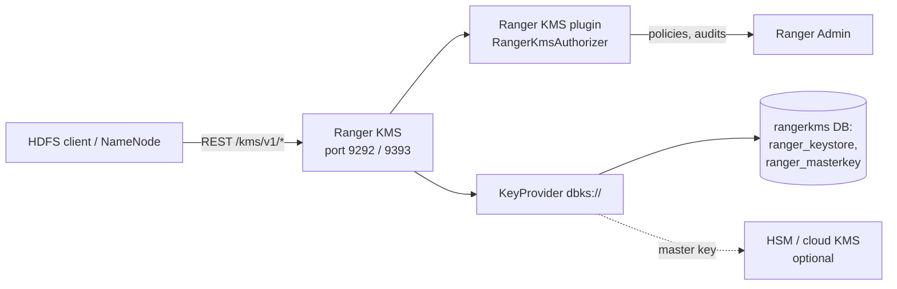

<!---
  Licensed to the Apache Software Foundation (ASF) under one or more
  contributor license agreements.  See the NOTICE file distributed with
  this work for additional information regarding copyright ownership.
  The ASF licenses this file to You under the Apache License, Version 2.0
  (the "License"); you may not use this file except in compliance with
  the License.  You may obtain a copy of the License at

      http://www.apache.org/licenses/LICENSE-2.0

  Unless required by applicable law or agreed to in writing, software
  distributed under the License is distributed on an "AS IS" BASIS,
  WITHOUT WARRANTIES OR CONDITIONS OF ANY KIND, either express or implied.
  See the License for the specific language governing permissions and
  limitations under the License.
-->

# Ranger KMS

Ranger KMS is a key management server that implements the Hadoop KMS REST API; its best-known client is
HDFS transparent data encryption. HDFS encrypts every file in an
*encryption zone* with its own data key, and that data key is itself encrypted with a *zone key* that only
the KMS can decrypt. Ranger KMS stores the zone keys, hands out encrypted data keys to HDFS clients, and
decides - through Ranger policies - who may create, roll over, read or use each key. It speaks the standard
Hadoop KMS REST protocol, so NameNodes and HDFS clients use it exactly like the Hadoop KMS that ships with
Hadoop.

Compared to the Hadoop KMS, Ranger KMS keeps its keys in a relational database (or an HSM or cloud key
vault for the master key), authorizes every operation with the Ranger KMS plugin instead of static ACL
files, audits to the Ranger audit stores, and gives key administrators a UI inside Ranger Admin.

## How it works



- **Web application**: an embedded Tomcat (`org.apache.ranger.server.tomcat.EmbeddedServer`) started by the
  `ranger-kms` script and configured by `ranger-kms-site.xml`. The Hadoop KMS servlet is mounted at `/kms`,
  so the base URL is `http://<host>:9292/kms` (`https://<host>:9393/kms` with SSL).
- **Key provider**: `hadoop.kms.key.provider.uri=dbks://http@localhost:9292/kms` selects
  `org.apache.hadoop.crypto.key.RangerKeyStoreProvider`, which keeps zone keys in the `ranger_keystore` table,
  encrypted with a *master key*. The master key is generated on first start, protected with the master key
  password, and stored (encrypted) in `ranger_masterkey`, or in an HSM / cloud vault - see
  [HSM and key stores](hsm-and-key-stores.md).
- **Authorization**: `hadoop.kms.security.authorization.manager` is set to
  `org.apache.ranger.authorization.kms.authorizer.RangerKmsAuthorizer`, the Ranger KMS plugin. It downloads
  policies for the service named by `ranger.plugin.kms.service.name` from Ranger Admin and evaluates every key operation
  (`create`, `delete`, `rollover`, `setkeymaterial`, `get`, `getkeys`, `getmetadata`, `generateeek`,
  `decrypteek`) against them. See [KMS plugin](../../plugins/kms.md) for the policy model and audit settings.
  `hadoop.kms.blacklist.DECRYPT_EEK` (default `hdfs`) additionally stops the HDFS superuser from decrypting
  data keys even if a policy would allow it.
- **Authentication**: `hadoop.kms.authentication.type` is `simple` (caller identified by the `user.name`
  query parameter) or `kerberos` (SPNEGO with the `HTTP/<host>` principal). Proxy-user settings
  `hadoop.kms.proxyuser.<user>.users|groups|hosts` let trusted services act on behalf of end users; the
  defaults allow the `ranger` user (Ranger Admin's Key Manager UI) to do so.
- **Caching**: key metadata and versions are cached for `hadoop.kms.cache.timeout.ms` (10 min) and the
  current key for `hadoop.kms.current.key.cache.timeout.ms` (30 s); `hadoop.kms.cache.enable=true`.

## Requirements

- A relational database (MySQL, PostgreSQL, Oracle, SQL Server or SQL Anywhere) with the KMS schema -
  `db/<flavor>/kms_core_db*.sql` in the KMS distribution - and the matching JDBC driver.
- A reachable Ranger Admin with a service of type **KMS**; the KMS plugin inside Ranger KMS downloads its
  policies from there. An audit store if audits are enabled.
- A JDK; `JAVA_HOME` must be set for the service script.
- A master key password that you keep safe, or an HSM / cloud key service for the master key.
- For Kerberos, `rangerkms/<host>` and `HTTP/<host>` principals with keytabs.

!!! danger "Keep the master key password"
    The master key password protects every zone key. If it is lost the keys in the database cannot be
    decrypted and every encryption zone becomes unreadable. Back up the credential store together with
    the database, and use the same value on every KMS instance.

## Running Ranger KMS

=== "Docker (dev-support/ranger-docker)"

    Ranger KMS has no released image on Docker Hub; the `dev-support/ranger-docker` compose files build it
    from the source tree. Prepare the directory (archives and a Ranger build in `dist/`) as described under
    *Build from source* in [Run with Docker](../admin/installation.md#run-with-docker), then add
    `docker-compose.ranger-kms.yml` to the compose command:

    ```bash
    cd dev-support/ranger-docker
    export RANGER_DB_TYPE=postgres          # postgres | mysql | oracle
    export AUDIT_INDEX_STORE=opensearch
    export AUDIT_DESTINATIONS=audit-store-${AUDIT_INDEX_STORE}
    docker compose --profile ${AUDIT_DESTINATIONS} -f docker-compose.ranger.yml \
      -f docker-compose.ranger-audit-service.yml -f docker-compose.ranger-kms.yml up -d
    ```

    The `ranger-kms` container shares the `ranger-db` database container with Ranger Admin and publishes
    port `9292`. With `KERBEROS_ENABLED=true` it waits for `rangerkms.keytab` and uses the Kerberos-enabled
    `scripts/kms/kms-site.xml` and `scripts/kms/core-site.xml`. `RANGER_KMS_MAX_HEAP` (`256m` in `.env`)
    sets the heap; the compose file fixes `JAVA_OPTS` to the `--add-exports` flag shown under
    [Operations](#operations). The configuration files are in
    `/opt/ranger/kms/ews/webapp/WEB-INF/classes/conf/` inside the container:

    ```bash
    docker logs -f ranger-kms
    docker exec ranger-kms ls /opt/ranger/kms/ews/webapp/WEB-INF/classes/conf
    curl 'http://localhost:9292/kms/v1/keys/names?user.name=keyadmin'
    ```

=== "Service script"

    The KMS distribution (`ranger-<version>-kms.tar.gz`) contains the service script. With the
    configuration files in `ews/webapp/WEB-INF/classes/conf/` and `JAVA_HOME` exported:

    ```bash
    ./ranger-kms start        # also: stop | restart | version | metric
    ```

### Files and directories

| Path | Purpose |
|---|---|
| `ranger-kms` | Service script (`start`, `stop`, `restart`, `version`, `metric`) |
| `ews/webapp/WEB-INF/classes/conf/` | All runtime configuration (`kms.config.dir`) |
| `ews/logs/` | Default log directory (`RANGER_KMS_LOG_DIR`) |
| `db/<flavor>/` | Core schema files |
| `cred/lib/` | Credential API jars used by the helper and migration scripts |
| `ranger_credential_helper.py` | Add a secret to the JCEKS credential store |
| `DBMK2HSM.sh`, `HSMMK2DB.sh`, `DBMKTOKEYSECURE.sh`, ... | Master key migration utilities, see [HSM and key stores](hsm-and-key-stores.md#migration-utilities) |
| `exportKeysToJCEKS.sh`, `importJCEKSKeys.sh` | Move zone keys between the database and a JCEKS file |

## Configuration

Ranger KMS reads these files from its configuration directory, `ews/webapp/WEB-INF/classes/conf/`:

- `dbks-site.xml` - database, master key and master key providers (`ranger.ks.*`, `ranger.kms.*`)
- `kms-site.xml` - Hadoop KMS settings (`hadoop.kms.*`)
- `ranger-kms-site.xml` - embedded web server
- `ranger-kms-security.xml`, `ranger-kms-audit.xml` and the client TLS file named by
  `ranger.plugin.kms.policy.rest.ssl.config.file` - the Ranger KMS plugin;
  see [KMS plugin](../../plugins/kms.md). At minimum set `ranger.plugin.kms.policy.rest.url` (Ranger Admin URL)
  and `ranger.plugin.kms.service.name` (name of the KMS service in Ranger Admin).
- `core-site.xml` - only for Kerberos (`hadoop.security.authentication`)

### dbks-site.xml: database

The JDBC connection to the key store database. Keep the password in the credential store rather than in
the XML: each secret has a clear-text property and an alias property, and the alias is looked up in
`ranger.ks.jpa.jdbc.credential.provider.path` first.

| Key | Default | Type | Description |
|---|---|---|---|
| `ranger.ks.jpa.jdbc.url` | `jdbc:log4jdbc:mysql://localhost:3306/rangerkms` | URL | JDBC URL of the KMS database |
| `ranger.ks.jpa.jdbc.user` | `kmsadmin` | String | Schema owner |
| `ranger.ks.jpa.jdbc.password` | `kmsadmin` | Password | Clear-text password; use `_` and the credential store instead |
| `ranger.ks.jpa.jdbc.credential.provider.path` | `/tmp/kms.jceks` | Path | JCEKS credential store for all KMS secrets |
| `ranger.ks.jpa.jdbc.credential.alias` | `ranger.ks.jdbc.password` | String | Alias of the database password |
| `ranger.ks.jpa.jdbc.driver` | `net.sf.log4jdbc.DriverSpy` | Class | JDBC driver class |
| `ranger.ks.jpa.jdbc.dialect` | `org.eclipse.persistence.platform.database.MySQLPlatform` | Class | EclipseLink platform class |
| `ranger.ks.jdbc.sqlconnectorjar` | `/usr/share/java/mysql-connector-java.jar` | Path | JDBC driver jar |

Typical values per database:

```properties
# MySQL
ranger.ks.jpa.jdbc.url=jdbc:log4jdbc:mysql://db.example.com:3306/rangerkms
ranger.ks.jpa.jdbc.driver=net.sf.log4jdbc.DriverSpy
ranger.ks.jpa.jdbc.dialect=org.eclipse.persistence.platform.database.MySQLPlatform
# PostgreSQL
ranger.ks.jpa.jdbc.url=jdbc:postgresql://db.example.com:5432/rangerkms
ranger.ks.jpa.jdbc.driver=org.postgresql.Driver
ranger.ks.jpa.jdbc.dialect=org.eclipse.persistence.platform.database.PostgreSQLPlatform
# Oracle
ranger.ks.jpa.jdbc.url=jdbc:oracle:thin:@db.example.com:1521:ORCL
ranger.ks.jpa.jdbc.driver=oracle.jdbc.OracleDriver
ranger.ks.jpa.jdbc.dialect=org.eclipse.persistence.platform.database.OraclePlatform
```

JDBC over TLS:

| Key | Default | Type | Description |
|---|---|---|---|
| `ranger.ks.db.ssl.enabled` | `false` | Boolean | Connect to the database over TLS |
| `ranger.ks.db.ssl.required` | `false` | Boolean | Fail if TLS cannot be negotiated |
| `ranger.ks.db.ssl.verifyServerCertificate` | `false` | Boolean | Verify the database server certificate |
| `ranger.ks.db.ssl.auth.type` | `2-way` | Enum | `1-way` or `2-way` |
| `ranger.ks.db.ssl.certificateFile` | (none) | Path | PostgreSQL only: root certificate, added to the JDBC URL as `sslrootcert` with `sslmode=verify-full` |
| `ranger.ks.truststore.file` | (none) | Path | Truststore with the database CA |
| `ranger.ks.truststore.password` | (none) | Password | Truststore password |
| `ranger.ks.keystore.file` | (none) | Path | Client keystore for `2-way` |
| `ranger.ks.keystore.password` | (none) | Password | Client keystore password |

### dbks-site.xml: master key

With the default (database) provider, the master key is wrapped with a key derived from the master key
password. Other providers are described on [HSM and key stores](hsm-and-key-stores.md).

| Key | Default | Type | Description |
|---|---|---|---|
| `ranger.db.encrypt.key.password` | `Str0ngPassw0rd` | Password | Master key password. Change it before the first start; use `_` and the credential store instead of clear text |
| `ranger.ks.masterkey.credential.alias` | `ranger.ks.masterkey.password` | String | Credential-store alias of the master key password |
| `ranger.kms.service.masterkey.password.cipher` | `AES` | String | Master key cipher |
| `ranger.kms.service.masterkey.password.size` | `256` | Integer | Master key size in bits |
| `ranger.kms.service.masterkey.password.encryption.algorithm` | `PBEWithMD5AndDES` | String | PBE algorithm that wraps the master key |
| `ranger.kms.service.masterkey.password.md.algorithm` | `SHA` | String | Digest for the PBE key |
| `ranger.kms.service.masterkey.password.salt` | `abcdefghijklmnopqrstuvwxyz01234567890` | String | PBE salt |
| `ranger.kms.service.masterkey.password.salt.size` | `8` | Integer | PBE salt size |
| `ranger.kms.service.masterkey.password.iteration.count` | `1000` | Integer | PBE iteration count |
| `ranger.keystore.file.type` | `jks` | String | Keystore type; `bcfks` switches on FIPS handling |

Store the secrets with the helper shipped in the KMS directory:

```bash
python3 ranger_credential_helper.py -l "cred/lib/*" \
  -f /etc/ranger/kms/rangerkms.jceks \
  -k ranger.ks.masterkey.password -v '<master key password>' -c 1
```

### dbks-site.xml: Kerberos identity

| Key | Default | Type | Description |
|---|---|---|---|
| `ranger.ks.kerberos.principal` | `rangerkms/_HOST@REALM` | String | Identity of the KMS process, used towards Ranger Admin for policy download |
| `ranger.ks.kerberos.keytab` | (none) | Path | Keytab for that principal |

### kms-site.xml: key provider and authorization

| Key | Default | Type | Description |
|---|---|---|---|
| `hadoop.kms.key.provider.uri` | `dbks://http@localhost:9292/kms` | String | Backing key provider; `dbks` is Ranger's database provider |
| `hadoop.kms.security.authorization.manager` | `org.apache.ranger.authorization.kms.authorizer.RangerKmsAuthorizer` | Class | Delegates authorization to Ranger |
| `hadoop.kms.proxyuser.ranger.users` | `*` | List | Users the `ranger` user may impersonate |
| `hadoop.kms.proxyuser.ranger.groups` | `*` | List | Groups whose members the `ranger` user may impersonate |
| `hadoop.kms.proxyuser.ranger.hosts` | `*` | List | Hosts the `ranger` user may impersonate from |

The blacklist that complements these settings, `hadoop.kms.blacklist.DECRYPT_EEK` (default `hdfs`), is
read from `dbks-site.xml`: the listed users are denied `DECRYPT_EEK` regardless of policy.

### kms-site.xml: authentication

| Key | Default | Type | Description |
|---|---|---|---|
| `hadoop.kms.authentication.type` | `simple` | Enum | `simple` or `kerberos` |
| `hadoop.kms.authentication.kerberos.principal` | `HTTP/localhost` | String | SPNEGO principal |
| `hadoop.kms.authentication.kerberos.keytab` | `${user.home}/kms.keytab` | Path | SPNEGO keytab |
| `hadoop.kms.authentication.kerberos.name.rules` | `DEFAULT` | String | `auth_to_local` rules for callers |
| `hadoop.kms.authentication.signer.secret.provider` | `random` | Enum | `random`, `string` or `zookeeper`; use `zookeeper` with several instances, see [High availability](high-availability.md) |

### kms-site.xml: caching and audit

| Key | Default | Type | Description |
|---|---|---|---|
| `hadoop.kms.cache.enable` | `true` | Boolean | Cache keys in the KMS |
| `hadoop.kms.cache.timeout.ms` | `600000` | Duration (ms) | Lifetime of cached key versions and metadata |
| `hadoop.kms.current.key.cache.timeout.ms` | `30000` | Duration (ms) | Lifetime of the cached current key version |
| `hadoop.kms.audit.aggregation.window.ms` | `10000` | Duration (ms) | Duplicate KMS audit events inside the window are collapsed |

### ranger-kms-site.xml: web server

| Key | Default | Type | Description |
|---|---|---|---|
| `ranger.service.host` | `localhost` | String | Bind host |
| `ranger.service.http.port` | `9292` | Integer | HTTP port |
| `ranger.service.https.attrib.ssl.enabled` | `false` | Boolean | Serve HTTPS instead of HTTP |
| `ranger.service.https.port` | `9393` | Integer | HTTPS port |
| `ranger.service.https.attrib.keystore.file` | (none) | Path | HTTPS keystore |
| `ranger.service.https.attrib.keystore.keyalias` | `rangerkms` | String | Alias of the server key |
| `ranger.service.https.attrib.keystore.credential.alias` | `keyStoreCredentialAlias` | String | Credential-store alias of the keystore password |
| `ranger.credential.provider.path` | `/etc/ranger/kms/rangerkms.jceks` | Path | Credential store for the keystore password |
| `ranger.service.https.attrib.client.auth` | `want` | Enum | Client certificates: `want`, `true` or `false` |
| `ranger.service.shutdown.port` | `7085` | Integer | Tomcat shutdown port |
| `ranger.contextName` | `/` | String | Context path; the KMS servlet is always under `/kms` |
| `ranger.valve.errorreportvalve.showserverinfo` | `false` | Boolean | Show Tomcat version in error pages |
| `ranger.valve.errorreportvalve.showreport` | `false` | Boolean | Show stack traces in error pages |

### Kerberos

1. Create `rangerkms/<host>@REALM` (process identity) and `HTTP/<host>@REALM` (SPNEGO) principals and
   keytabs readable by the account Ranger KMS runs as.
2. Set `ranger.ks.kerberos.principal` and `ranger.ks.kerberos.keytab` in `dbks-site.xml` and make sure the
   `core-site.xml` in the configuration directory has `hadoop.security.authentication=kerberos`.
3. In `kms-site.xml` set `hadoop.kms.authentication.type=kerberos`,
   `hadoop.kms.authentication.kerberos.principal=HTTP/<host>@REALM` and the keytab path; add
   `hadoop.kms.proxyuser.<service>.*` entries for every service that impersonates users (HiveServer2, Oozie,
   Knox, ...).
4. Restart and check `catalina.out` for the SPNEGO login. The `ranger-docker` Kerberos profile is a working
   reference (`scripts/kms/kms-site.xml`).

## Connecting Hadoop to Ranger KMS

Point HDFS and its clients at the KMS in `core-site.xml` (and, for older Hadoop releases, `hdfs-site.xml`):

```xml title="core-site.xml"
<property>
  <name>hadoop.security.key.provider.path</name>
  <value>kms://http@kms.example.com:9292/kms</value>
</property>
```

```xml title="hdfs-site.xml (Hadoop 2.x style)"
<property>
  <name>dfs.encryption.key.provider.uri</name>
  <value>kms://http@kms.example.com:9292/kms</value>
</property>
```

Use `kms://https@host:9393/kms` for an SSL-enabled KMS, and a load balancer address or a `;`-separated host
list for HA (see [High availability](high-availability.md)). Restart the NameNode after the change, then:

```bash
hadoop key create zone1key -size 256                      # needs "create" on key zone1key in Ranger
hadoop key list -metadata
hdfs dfs -mkdir /secure
hdfs crypto -createZone -keyName zone1key -path /secure    # NameNode needs "get metadata" + "generate EEK"
```

Typical policy set: `hdfs` gets `Get Metadata` and `Generate EEK` on `*`; key administrators get `Create`,
`Delete`, `Rollover`, `Get`, `Get Keys`, `Get Metadata`; end users of an encryption zone get `Decrypt EEK`
on that zone's key. `hdfs` must **not** get `Decrypt EEK` (and is blacklisted by default), which is the
point of separating key management from storage administration.

## Ranger Admin integration

1. In Ranger Admin, log in as `keyadmin`. Only users with the Key Admin role can manage KMS services and keys; `admin` cannot.
2. Create a service of type **KMS** with the name set in `ranger.plugin.kms.service.name`. Its configuration
   properties come from the servicedef: `provider` (KMS URL, e.g. `kms://http@kms.example.com:9292/kms`),
   `username` and `password` (used by **Test Connection** and the Key Manager UI), and optional
   `ranger.plugin.audit.filters`.
3. Write policies on the `keyname` resource with the access types listed above.
4. **Key Manager** in the Ranger Admin sidebar lists, creates, rolls over and deletes keys by calling
   `/kms/v1/keys/names` and the other key endpoints as the `keyadmin` user; the KMS proxy-user settings for
   `ranger` make this possible.

The Ranger Admin **Audit > Plugins** tab shows the KMS host polling policies once the plugin connects; if
it does not appear, check `ranger.plugin.kms.policy.rest.url` and `ranger.plugin.kms.service.name` in
`ews/webapp/WEB-INF/classes/conf/ranger-kms-security.xml`.

## REST API

All paths are relative to `http://<host>:9292/kms` and follow the Hadoop KMS protocol
(`kms/src/main/java/org/apache/hadoop/crypto/key/kms/server/KMS.java`). In `simple` mode add
`?user.name=<user>`; in `kerberos` mode use `curl --negotiate -u :`.

| Method | Path | Description | Access type |
|---|---|---|---|
| `POST` | `/v1/keys` | Create a key; with supplied key material `setkeymaterial` is required as well | `create` |
| `GET` | `/v1/keys/names` | List key names | `getkeys` |
| `GET` | `/v1/keys/metadata?key=k1&key=k2` | Metadata of several keys | `getmetadata` |
| `GET` | `/v1/key/{name}` | Key metadata (same response as `_metadata`) | `getmetadata` |
| `GET` | `/v1/key/{name}/_metadata` | Key metadata | `getmetadata` |
| `GET` | `/v1/key/{name}/_currentversion` | Current key version | `get` |
| `GET` | `/v1/key/{name}/_versions` | All versions | `get` |
| `GET` | `/v1/keyversion/{versionName}` | One key version | `get` |
| `POST` | `/v1/key/{name}` | Roll over; with supplied key material `setkeymaterial` is required as well | `rollover` |
| `DELETE` | `/v1/key/{name}` | Delete a key | `delete` |
| `POST` | `/v1/key/{name}/_invalidatecache` | Drop cached versions of a key | `rollover` |
| `GET` | `/v1/key/{name}/_eek?eek_op=generate&num_keys=N` | Generate encrypted data keys | `generateeek` |
| `POST` | `/v1/keyversion/{versionName}/_eek?eek_op=decrypt` | Decrypt an EEK | `decrypteek` |
| `POST` | `/v1/keyversion/{versionName}/_eek?eek_op=reencrypt` | Re-encrypt an EEK with the current version | `generateeek` |
| `POST` | `/v1/key/{name}/_reencryptbatch` | Re-encrypt a batch of EEKs | `generateeek` |
| `GET` | `/v1/key/{name}/_dek` | Generate a data key and return it both encrypted (`edek`) and decrypted (`dek`); the caller needs both access types | `generateeek`, `decrypteek` |

Ranger KMS adds `GET /kms/api/status` (liveness) and `GET /kms/metrics/prometheus` / `GET /kms/metrics/json`
(metrics). The JMX servlet is at `/jmx`.

```bash
curl -X POST -H 'Content-Type: application/json' \
  'http://kms.example.com:9292/kms/v1/keys?user.name=keyadmin' \
  -d '{"name":"zone1key","cipher":"AES/CTR/NoPadding","length":256,"description":"HR zone"}'
curl 'http://kms.example.com:9292/kms/v1/keys/names?user.name=keyadmin'
```

## Operations

- **Start/stop**: `./ranger-kms start|stop|restart|version`. `stop` invokes `StopEmbeddedServer` through the
  shutdown port and falls back to `kill -9` after 30 s. The PID is
  `${RANGER_KMS_PID_DIR_PATH}/rangerkms.pid` (default `/var/run/ranger_kms`). With Docker, use
  `docker restart ranger-kms`.
- **JVM**: `RANGER_KMS_MAX_HEAP`, `RANGER_JVM_METASPACE`/`RANGER_JVM_MAX_METASPACE` (`100m`/`256m`) and
  `JAVA_OPTS`; put overrides in `ews/webapp/WEB-INF/classes/conf/ranger-kms-env-<name>.sh`. The Docker setup passes
  `--add-exports=java.xml.crypto/com.sun.org.apache.xml.internal.security.utils=ALL-UNNAMED`.
- **Logs**: `${RANGER_KMS_LOG_DIR}/catalina.out` (default `ews/logs`) and the logback logs configured by
  `ews/webapp/WEB-INF/classes/conf/kms-logback.xml`. KMS audit events go to the `kms-audit` log; Ranger
  policy audits go to the destinations configured in `ranger-kms-audit.xml`.
- **Metrics**: `./ranger-kms metric -type hsmenabled|encryptedkey|encryptedkeybyalgorithm` prints
  counters from the database; the HTTP endpoints above serve Prometheus/JSON.
- **TLS**: set `ranger.service.https.attrib.ssl.enabled=true` and the keystore properties in
  `ranger-kms-site.xml`, and switch every client URL to `kms://https@host:9393/kms`. Clients must trust the
  certificate (`ssl-client.xml` on the Hadoop side).
- **Upgrade**: stop KMS, deploy the new version, carry over the files in the configuration directory and
  the credential store, and start. Keep the same master
  key password.
- **Backup**: the database (`ranger_keystore`, `ranger_masterkey`) plus the credential store are the
  minimum; `exportKeysToJCEKS.sh <file.jceks>` produces an additional JCEKS copy of all zone keys (it prompts
  for the keystore and key passwords).

## Troubleshooting

`Apache Ranger KMS Service failed to start`
:   Check `catalina.out`: database connectivity (`ranger.ks.jpa.jdbc.url`), missing JDBC driver, or port
    `9292` in use.

`The Ranger MasterKey Password is empty or not a valid Password`
:   Neither `ranger.db.encrypt.key.password` nor the alias named by `ranger.ks.masterkey.credential.alias`
    yields a password; check `ranger.ks.jpa.jdbc.credential.provider.path`.

Master key errors at start
:   The master key password changed after the first start; restore the original value or check one with
    `VerifyIsDBMasterkeyCorrect.sh <password>`.

`hadoop key create` returns 403
:   No Ranger policy grants `create` to the caller; check **Audit > Access** for the denied event.

NameNode cannot create an encryption zone
:   `hdfs` lacks `getmetadata`/`generateeek`, or the NameNode still points at the old provider URL.

Clients get 401
:   `hadoop.kms.authentication.type` mismatch, or the SPNEGO principal is not `HTTP/<host>`.

Key Manager UI empty
:   The `provider` URL of the KMS service is wrong, or the `ranger` proxy-user settings were removed from
    `kms-site.xml`.

Plugin never appears in Audit > Plugins
:   Wrong `ranger.plugin.kms.policy.rest.url` or `ranger.plugin.kms.service.name`, or missing TLS trust
    between KMS and Ranger Admin.

## Further reading

- [KMS plugin](../../plugins/kms.md) - resources, access types, audit configuration
- [High availability](high-availability.md)
- [HSM and key stores](hsm-and-key-stores.md)
- Hadoop documentation: Transparent Encryption in HDFS and Hadoop KMS
- Source: [`kms/config/kms-webapp`](https://github.com/apache/ranger/tree/master/kms/config/kms-webapp),
  [`RangerKeyStoreProvider.java`](https://github.com/apache/ranger/blob/master/kms/src/main/java/org/apache/hadoop/crypto/key/RangerKeyStoreProvider.java)
