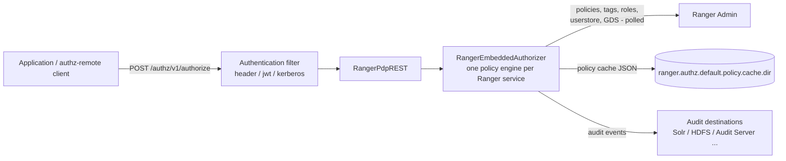

<!---
  Licensed to the Apache Software Foundation (ASF) under one or more
  contributor license agreements.  See the NOTICE file distributed with
  this work for additional information regarding copyright ownership.
  The ASF licenses this file to You under the Apache License, Version 2.0
  (the "License"); you may not use this file except in compliance with
  the License.  You may obtain a copy of the License at

      http://www.apache.org/licenses/LICENSE-2.0

  Unless required by applicable law or agreed to in writing, software
  distributed under the License is distributed on an "AS IS" BASIS,
  WITHOUT WARRANTIES OR CONDITIONS OF ANY KIND, either express or implied.
  See the License for the specific language governing permissions and
  limitations under the License.
-->

# Ranger PDP (Policy Decision Point)

The Ranger PDP is a standalone server that answers the question "is this user allowed to do this action on
this resource?" over HTTP. Ranger plugins run inside the protected service (a Polaris catalog server, a Trino
coordinator, HiveServer2, and so on). The PDP runs that same policy engine in its own process so that any
application, in any language, can call Ranger for an authorization decision with a JSON request.

The PDP downloads policies, tags, roles, users and groups from Ranger Admin, keeps them in memory, evaluates
requests locally, and writes audit records like any other plugin. It does not proxy requests to Ranger Admin
at decision time, so decisions are fast and keep working while Ranger Admin is down (from the local cache).

Use the PDP when you cannot, or do not want to, embed a Ranger plugin: non-JVM services, microservices,
sidecars, API gateways, or applications that use the `authz-remote` client library.

## How it works



The server (`org.apache.ranger.pdp.RangerPdpServer`) starts an embedded Tomcat, creates one
`RangerEmbeddedAuthorizer` from the `authz-embedded` module, registers the REST resources under `/authz/*`,
and exposes health and metrics servlets. Each request names a Ranger service in `context.serviceName` and
its service type in `context.serviceType` (the type can be omitted when
`ranger.authz.service.<name>.servicetype` is configured). The first request for a service loads that
service's policies (lazy initialization); you can pre-load services at startup with
`ranger.authz.init.services`.

Every request goes through two layers:

1. **Authentication** identifies the *caller* (the application that talks to the PDP).
2. **Authorization** evaluates the *end user* named in the request body (`user.name`) against the policies of
   the service in `context.serviceName`, and returns a decision plus any row filter or data mask.

The request and response JSON are defined by the `authz-api` module. The developer guide has the full model:
Authorization API.

## REST API

All authorization endpoints are `POST`, accept and return `application/json`, and live under `/authz/v1`.

| Method | Path | Description |
| --- | --- | --- |
| `POST` | `/authz/v1/authorize` | Authorize one access: a resource, optional sub-resources, one or more permissions. |
| `POST` | `/authz/v1/authorizeMulti` | Authorize several accesses in one round trip. |
| `POST` | `/authz/v1/permissions` | List effective permissions on a resource by user, group and role. |
| `POST` | `/authz/v1/filterResources` | Return the subset of resources the user may access. |
| `GET` | `/health/live` | Liveness; HTTP 503 when the server is not started. |
| `GET` | `/health/ready` | Readiness; `READY` once the authorizer is initialized and requests are accepted. |
| `GET` | `/metrics` | Prometheus text format, see [Metrics](#metrics). |

The health and metrics endpoints do not require authentication. `/health/ready` also reports
`loadedServicesCount`. A live server answers `/health/live` with:

```json
{"status":"UP","service":"ranger-pdp","live":true}
```

The request and response bodies are classes of the `authz-api` module:

| Path | Request type | Response type |
| --- | --- | --- |
| `/authorize` | `RangerAuthzRequest` | `RangerAuthzResult` |
| `/authorizeMulti` | `RangerMultiAuthzRequest` | `RangerMultiAuthzResult` |
| `/permissions` | `RangerResourcePermissionsRequest` | `RangerResourcePermissions` |
| `/filterResources` | `RangerFilterResourcesRequest` | `RangerFilterResourcesResult` |

### Example

```bash
curl -s -X POST http://ranger-pdp:6500/authz/v1/authorize \
  -H 'Content-Type: application/json' \
  -H 'X-Forwarded-User: hive' \
  -d '{
    "requestId": "9198b532-a386-4464-9770-d61a8e8bc206",
    "user":      { "name": "gary.adams", "groups": [ "fte", "mktg" ], "roles": [ "analyst" ] },
    "access":    { "resource": { "name": "path:/warehouse/hive/mktg/visitors" },
                   "action": "LIST", "permissions": [ "list" ] },
    "context":   { "serviceName": "dev_hdfs", "serviceType": "hdfs", "accessTime": 1755543894,
                   "clientIpAddress": "172.16.45.59",
                   "additionalInfo": { "clusterName": "cl1" } }
  }'
```

```json
{
  "requestId": "9198b532-a386-4464-9770-d61a8e8bc206",
  "decision":  "ALLOW",
  "permissions": {
    "list": { "permission": "list",
              "access": { "decision": "ALLOW", "policy": { "id": 1, "version": 1 } } }
  }
}
```

Resources are named `<resource-type>:<value>` (for example `table:db1.tbl1`, `path:/data`), sub-resources such
as columns can be listed in `subResources`, and responses for tables and columns can carry `rowFilter` and
`dataMask` entries. See Authorization API for the complete request and response
model, including multi-resource requests.

### HTTP status codes

| Status | Meaning |
| --- | --- |
| `200` | Decision returned (the decision itself may be `ALLOW`, `DENY`, `NOT_DETERMINED` or `PARTIAL`). |
| `400` | `user.name` is missing, or the authorizer rejected the request (service type not known, invalid resource, missing permissions). |
| `401` | No authentication handler accepted the request; see the `WWW-Authenticate` challenges in the response. |
| `403` | The request needs delegation and the caller is not a delegation user for the service (see below). |
| `500` | Internal error. |

## Callers, end users and delegation

The PDP distinguishes the authenticated **caller** from the **user** in the request body. A caller may
always ask about itself. To ask on behalf of somebody else, the caller must be a *delegation user* for the
target service. Delegation is required when any of the following is true:

- `user.name` differs from the authenticated caller;
- the request supplies `user.groups`, `user.roles` or `user.attributes` (these are trusted only from delegation users; otherwise groups are resolved by the PDP itself);
- the request supplies `resource.attributes` (for example the resource owner);
- the endpoint is `/permissions` or `/filterResources` (always restricted to delegation users).

Delegation users are configured per Ranger service, with `*` as a wildcard for all services. Users listed
under `*` are added to every service-specific list.

```xml title="ranger-pdp-site.xml"
<property>
  <name>ranger.pdp.service.dev_hive.delegation.users</name>
  <value>hive,trino</value>
</property>
<property>
  <name>ranger.pdp.service.*.delegation.users</name>
  <value>gateway</value>
</property>
```

## Requirements

- A reachable Ranger Admin. The PDP downloads policies, tags, roles and the userstore from it with basic
  authentication or Kerberos.
- A Ranger *service* in Ranger Admin for every `context.serviceName` the PDP receives.
- An audit destination if audits are enabled: Solr, OpenSearch, HDFS or the
  [Audit Server](../audit-server/service.md); see [Audit framework](../audit/index.md).
- A JDK, and writable directories for the policy cache (`ranger.authz.default.policy.cache.dir`), the logs
  and the audit spool.
- The PDP distribution, `ranger-<version>-pdp.tar.gz`, produced by the Ranger build
  (see Building from source), or the `ranger-pdp` image built by the compose files in
  `dev-support/ranger-docker`.

## Running the PDP

All settings live in `conf/ranger-pdp-site.xml`. At minimum set the Ranger Admin URL and credentials, enable
one inbound authentication type, and list the delegation users:

```xml title="ranger-pdp-site.xml"
<configuration>
  <property>
    <name>ranger.authz.default.policy.rest.url</name>
    <value>http://ranger-admin.example.com:6080</value>
  </property>
  <property>
    <name>ranger.pdp.authn.jwt.enabled</name>
    <value>true</value>
  </property>
  <property>
    <name>ranger.pdp.authn.jwt.provider.url</name>
    <value>https://idp.example.com/jwks</value>
  </property>
  <property>
    <name>ranger.pdp.service.*.delegation.users</name>
    <value>gateway</value>
  </property>
</configuration>
```

=== "Docker (dev-support/ranger-docker)"

    The PDP has no usable released image (`apache/ranger-pdp` on Docker Hub has no tags); the
    `dev-support/ranger-docker` compose files build it from the source tree. Prepare the directory (archives
    and a Ranger build in `dist/`) as described under *Build from source* in
    [Run with Docker](../admin/installation.md#run-with-docker).

    `dev-support/ranger-docker/docker-compose.ranger-pdp.yml` builds the `ranger-pdp` image from
    `Dockerfile.ranger-pdp` and publishes port `6500`. The compose service mounts
    `scripts/pdp/ranger-pdp-site.xml` and `scripts/pdp/logback.xml` into `/opt/ranger/pdp/conf/`, and its
    health check waits for `GET /health/ready`.

    ```bash
    cd dev-support/ranger-docker
    export RANGER_DB_TYPE=postgres               # mysql | postgres | oracle
    export AUDIT_INDEX_STORE=opensearch          # or solr
    export AUDIT_DESTINATIONS=audit-store-${AUDIT_INDEX_STORE}
    docker compose --profile ${AUDIT_DESTINATIONS} \
      -f docker-compose.ranger.yml \
      -f docker-compose.ranger-audit-service.yml \
      -f docker-compose.ranger-pdp.yml up -d
    ```

    Environment variables read by the container: `PDP_VERSION`, `KERBEROS_ENABLED`, `DEBUG_PDP`,
    `RANGER_PDP_MAX_HEAP`, `RANGER_JVM_METASPACE`, `RANGER_JVM_MAX_METASPACE` (defaults in `.env`). With
    `KERBEROS_ENABLED=true` the entrypoint waits for `HTTP.keytab` and copies `core-site.xml` into the PDP
    conf directory. The docker configuration enables all three authentication handlers (the header handler
    reads `X-Forwarded-User`) and sends audits to the [Audit Server](../audit-server/service.md).

=== "Service script"

    The distribution unpacks to a self-contained directory:

    `conf/`
    :   Active configuration directory. It is empty in the distribution; copy `ranger-pdp-site.xml` and
        `logback.xml` from `conf.dist/` and edit them. Optional `ranger-pdp-env*.sh` and `java_home.sh`
        files are sourced by the start script.

    `conf.dist/`
    :   Pristine copies of the configuration templates, plus `README-k8s.md`.

    `lib/`
    :   Server, `authz-embedded`, audit and dependency jars.

    `ranger-pdp-services.sh`
    :   Start/stop script, see [Operations](#operations).

    `ranger-pdp`
    :   init-style wrapper that runs `ranger-pdp-services.sh` as the `ranger` user.

    ```bash
    tar xzf ranger-3.0.0-SNAPSHOT-pdp.tar.gz -C /opt/ranger
    cd /opt/ranger/ranger-3.0.0-SNAPSHOT-pdp
    cp conf.dist/ranger-pdp-site.xml conf.dist/logback.xml conf/
    vi conf/ranger-pdp-site.xml
    ./ranger-pdp-services.sh start
    curl -s http://localhost:6500/health/ready
    ```

## Configuration reference

Configuration is read from `ranger-pdp-default.xml` (on the classpath, shipped in the server jar) and
overridden by `ranger-pdp-site.xml` in the directory given by `-Dranger.pdp.conf.dir` (the start script sets
it to `conf/`). Any `ranger.pdp.*` or `ranger.authz.*` property can also be passed as a JVM system property
(`-Dranger.pdp.port=7500`), which takes precedence over both files.

### Server

The HTTP listener and its Tomcat connector.

| Key | Default | Type | Description |
| --- | --- | --- | --- |
| `ranger.pdp.port` | `6500` | Integer | Listen port. |
| `ranger.pdp.log.dir` | `/var/log/ranger/pdp` | Path | Directory for the Tomcat access log. |
| `ranger.pdp.http2.enabled` | `true` | Boolean | Enable HTTP/2 (`h2` over TLS, `h2c` cleartext upgrade) alongside HTTP/1.1. |
| `ranger.pdp.http.connector.maxThreads` | `200` | Integer | Worker threads. |
| `ranger.pdp.http.connector.minSpareThreads` | `20` | Integer | Spare worker threads kept ready. |
| `ranger.pdp.http.connector.acceptCount` | `100` | Integer | Connection backlog when all workers are busy. |
| `ranger.pdp.http.connector.maxConnections` | `10000` | Integer | Maximum concurrent TCP connections. |

### TLS

Set these to serve HTTPS; add the truststore settings to require client certificates (mutual TLS).

| Key | Default | Type | Description |
| --- | --- | --- | --- |
| `ranger.pdp.ssl.enabled` | `false` | Boolean | Serve HTTPS. |
| `ranger.pdp.ssl.keystore.file` | (none) | Path | Server keystore; required when TLS is enabled. |
| `ranger.pdp.ssl.keystore.password` | (none) | Password | Keystore password. |
| `ranger.pdp.ssl.keystore.type` | `JKS` | Enum | `JKS` or `PKCS12`. |
| `ranger.pdp.ssl.truststore.enabled` | `false` | Boolean | Require and validate client certificates. |
| `ranger.pdp.ssl.truststore.file` | (none) | Path | Truststore used to validate client certificates. |
| `ranger.pdp.ssl.truststore.password` | (none) | Password | Truststore password. |
| `ranger.pdp.ssl.truststore.type` | `JKS` | Enum | `JKS` or `PKCS12`. |

### Delegation

See [Callers, end users and delegation](#callers-end-users-and-delegation).

| Key | Default | Type | Description |
| --- | --- | --- | --- |
| `ranger.pdp.service.<serviceName>.delegation.users` | (none) | List | Delegation users for one Ranger service. |
| `ranger.pdp.service.*.delegation.users` | (none) | List | Delegation users for all services. |

### Inbound authentication

Handlers are tried in the order listed in `ranger.pdp.authn.types`; the first one that authenticates wins.
A handler must be both listed and enabled.

| Key | Default | Type | Description |
| --- | --- | --- | --- |
| `ranger.pdp.authn.types` | `header,jwt,kerberos` | List | Ordered handlers to try: `header`, `jwt`, `kerberos`. |

**Header.** Trust an identity header set by a proxy or service mesh in front of the PDP.

| Key | Default | Type | Description |
| --- | --- | --- | --- |
| `ranger.pdp.authn.header.enabled` | `false` | Boolean | Enable the handler. Use only behind a trusted proxy. |
| `ranger.pdp.authn.header.username` | (none) | String | Header carrying the caller's user name, for example `X-Forwarded-User`. |
| `ranger.pdp.authn.header.spiffe` | (none) | List | Header names carrying a SPIFFE ID; used when the user-name header is absent. |

The SPIFFE ID has the form `spiffe://<trust-domain>/ns/<ns>/sa/<sa>`; the full ID becomes the caller principal.

**JWT.** Accept `Authorization: Bearer <jwt>`. Configure a provider URL, a public key, or both.

| Key | Default | Type | Description |
| --- | --- | --- | --- |
| `ranger.pdp.authn.jwt.enabled` | `false` | Boolean | Enable the handler. |
| `ranger.pdp.authn.jwt.provider.url` | (none) | URL | JWKS endpoint used to fetch signing keys. |
| `ranger.pdp.authn.jwt.public.key` | (none) | String | PEM-encoded public key for signature verification. |
| `ranger.pdp.authn.jwt.audiences` | (none) | List | Accepted `aud` values; empty accepts any audience. |

**Kerberos.** Accept SPNEGO (`Authorization: Negotiate`).

| Key | Default | Type | Description |
| --- | --- | --- | --- |
| `ranger.pdp.authn.kerberos.enabled` | `false` | Boolean | Enable the handler. |
| `ranger.pdp.authn.kerberos.spnego.principal` | (none) | String | Service principal, for example `HTTP/pdp.example.com@EXAMPLE.COM`. |
| `ranger.pdp.authn.kerberos.spnego.keytab` | (none) | Path | Keytab for the SPNEGO principal. |
| `ranger.pdp.authn.kerberos.token.valid.seconds` | `3600` | Integer | Validity of the Kerberos credential used by the server, in seconds. |
| `ranger.pdp.authn.kerberos.name.rules` | `DEFAULT` | String | `auth_to_local` rules that map principals to short names. |

The matching client-side settings for the `authz-remote` library are `ranger.authz.remote.authn.type`
(`header`, `jwt`, `kerberos`) and `ranger.authz.remote.pdp.url`;

### Policy engine

These properties configure the embedded authorizer. `ranger.authz.default.*` applies to all services;
`ranger.authz.servicetype.<type>.*` overrides it for one service type and `ranger.authz.service.<name>.*` for
one service. Internally each of them is mapped to the plugin property `ranger.plugin.<type>.*`, so
any plugin property from Plugin architecture can be set this way.

| Key | Default | Type | Description |
| --- | --- | --- | --- |
| `ranger.authz.init.services` | (none) | List | Services to load at startup. Empty means lazy loading on first request. |
| `ranger.authz.app.type` | `ranger-pdp` | String | Application type reported in audit records. |
| `ranger.authz.service.<name>.servicetype` | (none) | String | Service type of `<name>`, for example `hive`. Required for pre-loaded services and for requests that omit `context.serviceType`. |
| `ranger.authz.servicetype.<type>.default.service` | (none) | String | Service to use for requests that name only a service type. |
| `ranger.authz.default.use.rangerGroups` | `false` | Boolean | Resolve group membership from the Ranger userstore instead of the local OS. |

### Connection to Ranger Admin

| Key | Default | Type | Description |
| --- | --- | --- | --- |
| `ranger.authz.default.policy.rest.url` | `http://localhost:6080` | URL | Ranger Admin URL; comma-separated list for HA. |
| `ranger.authz.default.policy.rest.client.username` | `admin` | String | Basic-auth user for Ranger Admin. |
| `ranger.authz.default.policy.rest.client.password` | `admin` | Password | Basic-auth password. Change the default. |
| `ranger.authz.default.policy.rest.ssl.config.file` | (none) | Path | XML file with `xasecure.policymgr.clientssl.*` settings; required for `https://` URLs. |
| `ranger.authz.default.policy.pollIntervalMs` | `30000` | Duration (ms) | Poll interval for policy, tag and role updates. |
| `ranger.authz.default.policy.cache.dir` | `/var/ranger/cache/pdp` | Path | Local cache of policies, tags, roles, userstore and GDS; used when Admin is unavailable. |
| `ranger.authz.default.policy.rest.client.connection.timeoutMs` | `120000` | Duration (ms) | Connect timeout. |
| `ranger.authz.default.policy.rest.client.read.timeoutMs` | `30000` | Duration (ms) | Read timeout. |
| `ranger.authz.default.policy.source.impl` | `org.apache.ranger.admin.client.RangerAdminRESTClient` | Class | Policy source implementation. |

### Kerberos login

Set these when the PDP authenticates to Ranger Admin (and to Kerberized audit stores) with Kerberos.

| Key | Default | Type | Description |
| --- | --- | --- | --- |
| `ranger.authz.default.ugi.initialize` | `false` | Boolean | Log in with Kerberos before talking to Admin. |
| `ranger.authz.default.ugi.login.type` | (none) | Enum | `keytab` or `jaas`. |
| `ranger.authz.default.ugi.keytab.principal` | (none) | String | Principal for `keytab` login. |
| `ranger.authz.default.ugi.keytab.file` | (none) | Path | Keytab for `keytab` login. |
| `ranger.authz.default.ugi.jaas.appconfig` | (none) | String | JAAS application name for `jaas` login. |

### Audit

`ranger.authz.audit.<suffix>` is translated to `xasecure.audit.<suffix>`, so every property from the
[audit framework](../audit/index.md) is available under this prefix. Existing `xasecure.audit.*` entries are
also honored and take precedence.

| Key | Default | Type | Description |
| --- | --- | --- | --- |
| `ranger.authz.audit.is.enabled` | `true` | Boolean | Master switch. |
| `ranger.authz.audit.destination.solr` | `false` | Boolean | Audit to Solr. |
| `ranger.authz.audit.destination.solr.urls` | (none) | List | Solr URLs. |
| `ranger.authz.audit.destination.hdfs` | `false` | Boolean | Audit to HDFS. |
| `ranger.authz.audit.destination.hdfs.dir` | (none) | URL | HDFS directory. |

To audit through the [Audit Server](../audit-server/service.md) (not yet part of a release), as the
`dev-support/ranger-docker` configuration does:

```xml title="ranger-pdp-site.xml"
<property>
  <name>ranger.authz.audit.destination.auditserver</name>
  <value>true</value>
</property>
<property>
  <name>ranger.authz.audit.destination.auditserver.url</name>
  <value>http://ranger-audit-ingestor.example.com:7081</value>
</property>
<property>
  <name>ranger.authz.audit.destination.auditserver.batch.filespool.dir</name>
  <value>/var/log/ranger/pdp/audit/http/spool</value>
</property>
```

## Operations

### Start, stop, status

```bash
./ranger-pdp-services.sh start      # background, writes pid file
./ranger-pdp-services.sh run        # foreground (containers, systemd)
./ranger-pdp-services.sh stop       # SIGTERM, then SIGKILL after ~30s
./ranger-pdp-services.sh restart
./ranger-pdp-services.sh version
```

`ranger-pdp {start|stop|restart|status}` (`pdp/scripts/ranger-pdp.sh` in the source tree) is an init-script
wrapper that runs the commands above as the
`ranger` user via `/usr/bin/ranger-pdp-services.sh` and checks `/var/run/ranger/pdp.pid`.

Environment variables honored by `ranger-pdp-services.sh`. Set them in the process environment or in
`conf/ranger-pdp-env*.sh`; `RANGER_PDP_MAX_HEAP` is read before those files are sourced, so set it in the
environment:

| Variable | Default | Description |
| --- | --- | --- |
| `RANGER_PDP_MAX_HEAP` | `1g` | JVM heap, used for both `-Xmx` and `-Xms`. |
| `RANGER_JVM_METASPACE` | `100m` | Initial metaspace size. |
| `RANGER_JVM_MAX_METASPACE` | `200m` | Maximum metaspace size. |
| `JAVA_OPTS` | (none) | Extra JVM options, including `-Dranger.pdp.*` overrides. |
| `RANGER_PDP_CONF_DIR` | `<install>/conf` | Passed as `-Dranger.pdp.conf.dir`. |
| `RANGER_PDP_LOG_DIR` | `/var/log/ranger/pdp` | Location of `pdp.out`; passed to logback as `-Dlogdir`. |
| `RANGER_PDP_PID_DIR_PATH` | `/var/run/ranger` | Directory of the PID file. |
| `RANGER_PDP_PID_NAME` | `pdp.pid` | Name of the PID file. |
| `UNIX_PDP_USER` | `ranger` | Owner of the PID file. |
| `JAVA_HOME` | (none) | JDK location; also read from `conf/java_home.sh`. |

### Logs

- `${RANGER_PDP_LOG_DIR}/pdp.out` — stdout/stderr of the JVM when started with `start` (`run` writes to the console).
- `${ranger.pdp.log.dir}/ranger-pdp-access.<date>.log` — Tomcat access log (`%h %l %u %t "%r" %s %b %D`).
- Application logging is configured by `conf/logback.xml` (`-Dlogback.configurationFile`). Set the root or
  `org.apache.ranger` logger to `DEBUG` to trace authentication and evaluation.

### Metrics

`GET /metrics` returns Prometheus text (`text/plain; version=0.0.4`):

| Metric | Type | Meaning |
| --- | --- | --- |
| `ranger_pdp_requests_total` | counter | Requests that reached the `/authz/v1` resource; requests rejected by the authentication filter are not counted. |
| `ranger_pdp_requests_success_total` | counter | Requests answered with 2xx. |
| `ranger_pdp_requests_bad_request_total` | counter | Requests answered with 400. |
| `ranger_pdp_requests_error_total` | counter | Requests answered with other errors. |
| `ranger_pdp_auth_failures_total` | counter | Requests answered with 401 or 403 by the REST resource, for example a caller that is not a delegation user. |
| `ranger_pdp_request_latency_avg_ms` | gauge | Average latency since start. |
| `ranger_pdp_loaded_services_count` | gauge | Ranger services currently loaded. |

### High availability and scaling

The PDP is stateless apart from its policy cache. Run several instances behind a load balancer; each one
polls Ranger Admin independently and keeps its own cache directory. Give every instance a distinct
`ranger.authz.default.policy.cache.dir` when they share a filesystem.

### Kubernetes

`pdp/conf.dist/README-k8s.md` summarizes the recommendations: use `GET /health/live` as the liveness probe
and `GET /health/ready` as the readiness probe; scrape `GET /metrics`; mount `ranger-pdp-site.xml` from a
ConfigMap and keytabs or JWT keys from Secrets; run as non-root with a read-only root filesystem, giving
writable volumes only for the cache and log directories; allow egress only to Ranger Admin, the audit store
and the KDC. Log to stdout by adjusting `logback.xml`, or pass `-Dlogdir` for file logging.

### Securing the PDP

- Enable TLS (`ranger.pdp.ssl.*`); consider mutual TLS with `ranger.pdp.ssl.truststore.enabled=true`.
- Prefer `jwt` or `kerberos` authentication. Use `header` only behind a proxy that strips and sets the
  header itself.
- Keep delegation lists short: a delegation user can ask for decisions about any user.
- Change the default `admin/admin` credentials used to reach Ranger Admin, or switch to Kerberos.
  See [Security hardening](../admin/security-hardening.md) for the Admin side.

## Troubleshooting

`401 Authentication required` on every call
:   The header name does not match, or the token or ticket is missing or invalid. Check the
    `WWW-Authenticate` header in the response.

Server does not start: `No valid authentication handlers configured`
:   No handler listed in `ranger.pdp.authn.types` is enabled and initialized. Enable at least one of
    `header` (with a user-name or SPIFFE header configured), `jwt` or `kerberos`.

`403 <caller> is not authorized`
:   The request needs delegation (different user, groups/roles/attributes supplied, or `/permissions`) and
    the caller is not in `ranger.pdp.service.<name>.delegation.users`.

`400` with an authorizer message
:   The request has neither `context.serviceType` nor a configured
    `ranger.authz.service.<name>.servicetype`, or the resource name does not match the service definition.

`/health/ready` returns `NOT_READY` (HTTP 503)
:   The server is still starting or is shutting down. If the authorizer fails to initialize the process exits;
    check `pdp.out`.

Decisions are stale
:   Policies are polled every `ranger.authz.default.policy.pollIntervalMs`; when Admin is unreachable the PDP
    serves from `ranger.authz.default.policy.cache.dir`.

## Further reading

- [Audit framework](../audit/index.md) and [Audit Server](../audit-server/service.md).
- [Architecture](../../arch/architecture.md).
- Source: [`pdp/`](https://github.com/apache/ranger/blob/master/pdp),
  [`authz-api/README.txt`](https://github.com/apache/ranger/blob/master/authz-api/README.txt),
  [`authz-remote/README.md`](https://github.com/apache/ranger/blob/master/authz-remote/README.md).
