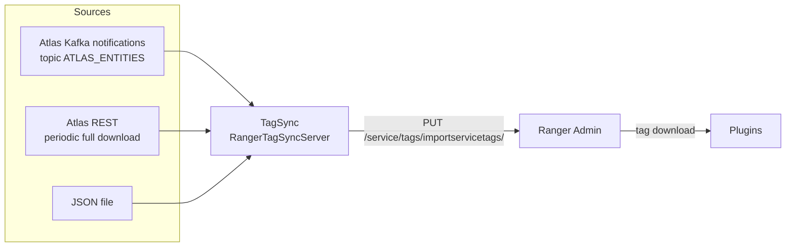

<!---
  Licensed to the Apache Software Foundation (ASF) under one or more
  contributor license agreements.  See the NOTICE file distributed with
  this work for additional information regarding copyright ownership.
  The ASF licenses this file to You under the Apache License, Version 2.0
  (the "License"); you may not use this file except in compliance with
  the License.  You may obtain a copy of the License at

      http://www.apache.org/licenses/LICENSE-2.0

  Unless required by applicable law or agreed to in writing, software
  distributed under the License is distributed on an "AS IS" BASIS,
  WITHOUT WARRANTIES OR CONDITIONS OF ANY KIND, either express or implied.
  See the License for the specific language governing permissions and
  limitations under the License.
-->

# Ranger TagSync

Ranger TagSync keeps Ranger's knowledge of *which resources carry which tags* up to date. Tags such as `PII`
or `EXPIRES_ON` are usually assigned to tables, columns, topics or paths in Apache Atlas; TagSync watches
Atlas (or a file) for those assignments and copies them into Ranger Admin, where
[tag-based policies](../../features/policies/tag-based-policies.md) turn them into access decisions. It runs
as its own service with no user interface; once configured it runs unattended.

A typical flow: a data steward classifies `hr.employee.ssn` as `PII` in Atlas; Atlas publishes an entity
notification on Kafka; TagSync maps the Atlas entity to the Ranger resource `database=hr, table=employee,
column=ssn` of the Hive service `cl1_hive` and uploads the tag; every Ranger plugin that downloads tags for
that service starts enforcing the `PII` policies on the column within its next policy refresh.

## How it works



`org.apache.ranger.tagsync.server.RangerTagSyncServer` starts an embedded web server (for metrics) and a
`TagSynchronizer` that instantiates every enabled *tag source* and one *tag sink*:

- **Atlas Kafka source** (`AtlasTagSource`, `ranger.tagsync.source.atlas=true`) consumes Atlas entity
  notifications (`ENTITY_CREATE`, `ENTITY_UPDATE`, `ENTITY_DELETE`, `CLASSIFICATION_ADD`,
  `CLASSIFICATION_UPDATE`, `CLASSIFICATION_DELETE`) from the `ATLAS_ENTITIES` Kafka topic using the standard
  Kafka consumer (`bootstrap.servers` only, no ZooKeeper). This is the near-real-time path.
- **Atlas REST source** (`AtlasRESTTagSource`, `ranger.tagsync.source.atlasrest=true`) periodically calls
  `/api/atlas/v2/search/basic` and `/api/atlas/v2/types/typedefs/` on Atlas, downloads every classified
  entity of a supported type in batches, and replaces Ranger's tag set for each service. Use it when Atlas
  Kafka is not reachable, or together with the Kafka source to reconcile missed notifications.
- **File source** (`FileTagSource`, `ranger.tagsync.source.file=true`) reads a JSON file with the
  `ServiceTags` structure and re-uploads it whenever the file changes. Useful without Atlas and for tests.
- **Sink** (`TagAdminRESTSink`, `ranger.tagsync.dest.ranger.impl.class`) authenticates to Ranger Admin as
  `rangertagsync` (or a Kerberos principal) and uploads `ServiceTags` objects with
  `PUT /service/tags/importservicetags/`. Uploads are batched (`ranger.tagsync.dest.ranger.max.batch.size`)
  and retried until Ranger Admin is reachable.

Every enabled source runs in its own thread; a source that fails to initialize is retried every
`ranger.tagsync.source.retry.initialization.interval.millis` (10 s).

### Atlas entity to Ranger resource mapping

`AtlasResourceMapper` implementations translate Atlas entity types into Ranger service types and resource
elements. Entities of other types are ignored.

| Atlas entity types | Ranger service type | Resource elements |
|---|---|---|
| `hive_db`, `hive_table`, `hive_column` | `hive` | `database`, `table`, `column` |
| `hdfs_path` | `hdfs` | `path` |
| `hbase_table`, `hbase_column_family`, `hbase_column` | `hbase` | `table`, `column-family`, `column` |
| `kafka_topic` | `kafka` | `topic` |
| `ozone_volume`, `ozone_bucket`, `ozone_key` | `ozone` | `volume`, `bucket`, `key` |
| `adls_gen2_account`, `adls_gen2_container`, `adls_gen2_directory` | `adls` | `storageaccount`, `container`, `relativepath` |
| `trino_catalog`, `trino_schema`, `trino_table`, `trino_column` | `trino` | `catalog`, `schema`, `table`, `column` |

Add further mappers (subclasses of `AtlasResourceMapper`) with
`ranger.tagsync.atlas.custom.resource.mappers` (comma-separated class names on the classpath). Two mappers
ship with TagSync but are not registered by default and must be named there to be used:
`org.apache.ranger.tagsync.source.atlas.AtlasStormResourceMapper` (`storm_topology` to the `storm` resource
`topology`) and `org.apache.ranger.tagsync.nestedstructureplugin.AtlasNestedStructureResourceMapper`
(`json_object`, `json_field` to the `nestedstructure` resources `schema`, `field`).

### Deriving the Ranger service name

Atlas qualified names end in `@<clusterName>` (for example `hr.employee.ssn@cl1`). TagSync derives the Ranger
service name as `<clusterName>_<component>` - `cl1_hive`, `cl1_hbase`, `cl1_kafka`; HDFS uses
`<clusterName>_hadoop`, and with HDFS federation `<clusterName>_hadoop_<nameservice>`. If your services are
named differently, map them explicitly in `ranger-tagsync-site.xml` with one property per Atlas cluster and
component, `ranger.tagsync.atlas.<component>.instance.<clusterName>.ranger.service`:

```xml title="conf/ranger-tagsync-site.xml"
<property>
  <name>ranger.tagsync.atlas.hive.instance.cl1.ranger.service</name>
  <value>prod_hive</value>
</property>
<property>
  <name>ranger.tagsync.atlas.hdfs.instance.cl1.ranger.service</name>
  <value>prod_hdfs</value>
</property>
```

All service-name properties are listed under [Service name mapping](#service-name-mapping).

## Requirements

- A reachable Ranger Admin and a Ranger Admin user with the Admin role for the sink (`rangertagsync` exists
  by default). The resource services named in the uploads (`cl1_hive`, ...) must already exist.
- For the Atlas Kafka source: network access to the Kafka brokers Atlas publishes to, and read access to the
  `ATLAS_ENTITIES` topic. For the Atlas REST source: the Atlas URL and an Atlas user.
- A JDK; `JAVA_HOME` must be set for the service script.
- For Kerberos towards Ranger Admin, a keytab for the TagSync principal and a `core-site.xml` on the
  classpath that sets `hadoop.security.authentication=kerberos`.

## Running TagSync

=== "Docker (dev-support/ranger-docker)"

    TagSync has no released image on Docker Hub; the `dev-support/ranger-docker` compose files build it
    from the source tree. Prepare the directory (archives and a Ranger build in `dist/`) as described under
    *Build from source* in [Run with Docker](../admin/installation.md#run-with-docker), then add
    `docker-compose.ranger-tagsync.yml` to the compose command:

    ```bash
    cd dev-support/ranger-docker
    export RANGER_DB_TYPE=postgres
    export AUDIT_INDEX_STORE=opensearch
    export AUDIT_DESTINATIONS=audit-store-${AUDIT_INDEX_STORE}
    docker compose --profile ${AUDIT_DESTINATIONS} -f docker-compose.ranger.yml \
      -f docker-compose.ranger-audit-service.yml -f docker-compose.ranger-tagsync.yml up -d
    ```

    There is no Atlas in `ranger-docker`, so the `ranger-tagsync` container runs with the **file source**:
    `scripts/tagsync/ranger-tagsync-tags.json` (tags for the `dev_hive` service) is mounted as
    `/opt/ranger/tagsync/data/tags.json`, and both Atlas sources are off. Edit the JSON file on the host and
    TagSync uploads the change on its next file check. The container publishes ports `8180` (embedded web
    server) and `8185` (shutdown port). Environment variables understood by the compose file:
    `DEBUG_TAGSYNC=true` (debug logging), `KERBEROS_ENABLED=true`, `RANGER_TAGSYNC_MAX_HEAP` (`256m` in
    `.env`) and `JAVA_OPTS`.

    ```bash
    docker logs -f ranger-tagsync
    docker exec ranger-tagsync cat /opt/ranger/tagsync/conf/ranger-tagsync-site.xml
    curl http://localhost:8180/metrics/status
    ```

=== "Service script"

    The TagSync distribution (`ranger-<version>-tagsync.tar.gz`) contains the service script. With
    `conf/ranger-tagsync-site.xml` (and, for the Atlas Kafka source, `conf/atlas-application.properties`) in
    place and `JAVA_HOME` exported:

    ```bash
    ./ranger-tagsync-services.sh start      # also: stop | restart | version
    ```

### Ranger Admin side

The sink user `rangertagsync` exists in Ranger Admin by default with the Admin role. TagSync reads its
password from the credential store named by `ranger.tagsync.keystore.filename`, alias
`tagadmin.user.password`. After changing the password in Ranger Admin, run
`python3 updatetagadminpassword.py`, which updates the credential store and
`ranger.tagsync.dest.ranger.username`. For tag policies to take effect, create a service of
type `tag` and select it in the resource service's **Select Tag Service** field; see
[Tag-based policies](../../features/policies/tag-based-policies.md).

## Configuration

TagSync reads `ranger-tagsync-site.xml` from its classpath (`conf/`); built-in defaults come from
`ranger-tagsync-default.xml`. The Atlas Kafka consumer is configured separately in
`conf/atlas-application.properties`.

```xml title="conf/ranger-tagsync-site.xml (minimal, Atlas Kafka source)"
<configuration>
  <property>
    <name>ranger.tagsync.dest.ranger.endpoint</name>
    <value>http://ranger-admin.example.com:6080</value>
  </property>
  <property>
    <name>ranger.tagsync.keystore.filename</name>
    <value>/etc/ranger/tagsync/conf/rangertagsync.jceks</value>
  </property>
  <property>
    <name>ranger.tagsync.source.atlas</name>
    <value>true</value>
  </property>
</configuration>
```

### Ranger Admin destination

Where tags are uploaded and with which identity.

| Key | Default | Type | Description |
|---|---|---|---|
| `ranger.tagsync.dest.ranger.endpoint` | `http://localhost:6080` | URL | Ranger Admin URL |
| `ranger.tagsync.dest.ranger.username` | `rangertagsync` | String | Ranger Admin user for uploads |
| `ranger.tagsync.keystore.filename` | (none) | Path | Credential store holding that user's password under the alias `tagadmin.user.password`, e.g. `/etc/ranger/tagsync/conf/rangertagsync.jceks` |
| `ranger.tagsync.dest.ranger.ssl.config.filename` | (none) | Path | Client TLS configuration file for an `https://` endpoint, see [Operations](#operations) |
| `ranger.tagsync.dest.ranger.max.batch.size` | `1` | Integer | Number of `ServiceTags` objects sent per request |
| `ranger.tagsync.dest.ranger.connection.check.interval` | `15000` | Duration (ms) | Time between connectivity probes while Ranger Admin is down |
| `ranger.tagsync.cookie.enabled` | `true` | Boolean | Reuse the Ranger Admin session between calls |
| `ranger.tagsync.dest.ranger.session.cookie.name` | `RANGERADMINSESSIONID` | String | Name of the session cookie |
| `ranger.tagsync.dest.ranger.impl.class` | `ranger` | Class | Sink class; `ranger` stands for `TagAdminRESTSink` |
| `ranger.tagsync.enabled` | `true` | Boolean | Set `false` to run the process without syncing |

### Kerberos

With both properties set and `hadoop.security.authentication=kerberos` in the `core-site.xml` on the
classpath, uploads use SPNEGO instead of the password.

| Key | Default | Type | Description |
|---|---|---|---|
| `ranger.tagsync.kerberos.principal` | (none) | String | TagSync principal, e.g. `rangertagsync/_HOST@EXAMPLE.COM` |
| `ranger.tagsync.kerberos.keytab` | (none) | Path | Keytab for that principal |

### Tag sources

Each source is switched on by its own property; several can be enabled at once. A source counts as enabled
when the value is `true`, `enable` or `enabled`.

| Key | Default | Type | Description |
|---|---|---|---|
| `ranger.tagsync.source.atlas` | `false` | Boolean | Enable the Atlas Kafka source |
| `ranger.tagsync.source.atlasrest` | `false` | Boolean | Enable the Atlas REST source |
| `ranger.tagsync.source.file` | `false` | Boolean | Enable the file source |
| `ranger.tagsync.source.retry.initialization.interval.millis` | `10000` | Duration (ms) | Retry interval for sources that failed to initialize |

### Atlas REST source

| Key | Default | Type | Description |
|---|---|---|---|
| `ranger.tagsync.source.atlasrest.endpoint` | (none) | URL | Atlas URL, e.g. `http://atlas.example.com:21000` |
| `ranger.tagsync.source.atlasrest.username` | `admin` | String | Atlas user |
| `ranger.tagsync.source.atlasrest.keystore.filename` | (none) | Path | Credential store holding the Atlas password under the alias `atlas.user.password`, e.g. `/etc/ranger/tagsync/conf/atlasuser.jceks` |
| `ranger.tagsync.source.atlasrest.download.interval.millis` | `900000` | Duration (ms) | Time between full downloads |
| `ranger.tagsync.source.atlasrest.entities.batch.size` | `10000` | Integer | Entities per search request |
| `ranger.tagsync.source.atlasrest.ssl.config.filename` | (none) | Path | Client TLS configuration file for an `https://` Atlas |

### File source

| Key | Default | Type | Description |
|---|---|---|---|
| `ranger.tagsync.source.file.filename` | (none) | Path | Input file, see [File source in detail](#file-source-in-detail). Required for the file source |
| `ranger.tagsync.source.file.check.interval.millis` | `60000` | Duration (ms) | How often the file's modification time is checked |

### Service name mapping

| Key | Default | Type | Description |
|---|---|---|---|
| `ranger.tagsync.atlas.<component>.instance.<cluster>.ranger.service` | `<cluster>_<component>` | String | Ranger service for that Atlas cluster and component. For `hdfs` the default is `<cluster>_hadoop` |
| `ranger.tagsync.atlas.hdfs.instance.<cluster>.nameservice.<ns>.ranger.service` | `<cluster>_hadoop_<ns>` | String | Service name for a federated HDFS name service |
| `ranger.tagsync.atlas.default.cluster.name` | (none) | String | Cluster name to assume when an entity's qualified name has no `@cluster` suffix |
| `ranger.tagsync.atlas.custom.resource.mappers` | (none) | List | Additional `AtlasResourceMapper` classes |

### Embedded web server

`RangerTagSyncServer` starts an embedded Tomcat that serves `GET /metrics/status`,
`GET /metrics/prometheus` and `GET /metrics/json`.

| Key | Default | Type | Description |
|---|---|---|---|
| `ranger.tagsync.service.host` | (none) | String | Bind address |
| `ranger.tagsync.service.http.port` | `8180` | Integer | HTTP port |
| `ranger.tagsync.service.https.attrib.ssl.enabled` | `false` | Boolean | Serve HTTPS instead of HTTP |
| `ranger.tagsync.service.https.port` | `8183` | Integer | HTTPS port |
| `ranger.tagsync.service.shutdown.port` | `8185` | Integer | Tomcat shutdown port |
| `ranger.tagsync.service.https.attrib.keystore.file` | (none) | Path | HTTPS keystore |
| `ranger.tagsync.service.https.attrib.keystore.keyalias` | (none) | String | Alias of the server key in the HTTPS keystore |
| `ranger.tagsync.service.https.attrib.keystore.credential.alias` | `keyStoreCredentialAlias` | String | Credential-store alias of the keystore password |
| `ranger.tagsync.credential.provider.path` | (none) | Path | Credential store holding the HTTPS keystore password |
| `ranger.tagsync.service.https.attrib.client.auth` | `want` | Enum | Client certificates: `want`, `true` or `false` |
| `ranger.tagsync.keystore.file.type` | JVM default | String | Keystore type, e.g. `jks` or `bcfks` |
| `ranger.tagsync.truststore.file.type` | JVM default | String | Truststore type |

### Metrics file

| Key | Default | Type | Description |
|---|---|---|---|
| `ranger.tagsync.metrics.enabled` | `false` | Boolean | Write JVM metrics to a JSON file |
| `ranger.tagsync.metrics.filepath` | log directory | Path | Directory; without a log directory, `/tmp/` |
| `ranger.tagsync.metrics.filename` | `ranger_tagsync_metric.json` | String | File name |
| `ranger.tagsync.metrics.frequencytimeinmillis` | `10000` | Duration (ms) | Write interval |
| `ranger.tagsync.logdir` | `log` | Path | Log directory |

### High availability

Several TagSync instances can run against one ZooKeeper ensemble; only the elected active instance consumes
and uploads, the others sleep. Give all instances the same configuration, including the Kafka consumer
group id. The `ranger-tagsync` prefix of the keys below is the value of `ranger.service.name`, which must be
set to `ranger-tagsync` in `ranger-tagsync-site.xml`.

| Key | Default | Type | Description |
|---|---|---|---|
| `ranger.service.name` | (none) | String | Must be `ranger-tagsync`; it is the prefix under which the HA properties are looked up |
| `ranger-tagsync.server.ha.enabled` | `false` | Boolean | Turn on leader election |
| `ranger-tagsync.server.ha.zookeeper.connect` | (none) | String | ZooKeeper connection string |
| `ranger-tagsync.server.ha.ids` | (none) | List | Instance ids, e.g. `id1,id2` |
| `ranger-tagsync.server.ha.address.<id>` | (none) | String | `host:port` of the instance with that id |
| `ranger-tagsync.service.http.port` | (none) | Integer | Port of this instance, used to find its own entry among the `address.<id>` values |
| `ranger-tagsync.server.ha.zookeeper.zkroot` | `/apacheranger.service.name_zkroot` | String | ZNode used for the latch; set it explicitly, e.g. `/ranger-tagsync` |
| `ranger-tagsync.server.ha.zookeeper.session.timeout.ms` | `20000` | Duration (ms) | ZooKeeper session timeout |
| `ranger-tagsync.server.ha.zookeeper.retry.sleeptime.ms` | `1000` | Duration (ms) | Wait between connection retries |
| `ranger-tagsync.server.ha.zookeeper.num.retries` | `3` | Integer | Connection retries |
| `ranger-tagsync.server.ha.zookeeper.acl` | (none) | String | ZooKeeper ACL for secured ensembles |
| `ranger-tagsync.server.ha.zookeeper.auth` | (none) | String | ZooKeeper auth for secured ensembles |

## Atlas Kafka source in detail

The Kafka consumer settings are not in the site XML: `AtlasTagSource` loads `atlas-application.properties`
from the classpath (`conf/`) and refuses to start if `atlas.kafka.bootstrap.servers` or
`atlas.kafka.entities.group.id` is missing. `atlas.kafka.zookeeper.connect` is not required ([RANGER-5658](https://issues.apache.org/jira/browse/RANGER-5658));
Kafka 3.x/KRaft brokers are supported.

| Key | Default | Type | Description |
|---|---|---|---|
| `atlas.kafka.bootstrap.servers` | (none) | List | Kafka brokers Atlas publishes to. Required |
| `atlas.kafka.entities.group.id` | (none) | String | Consumer group, e.g. `ranger_entities_consumer`; use a different id per TagSync deployment. Required |
| `atlas.kafka.security.protocol` | (none) | Enum | `PLAINTEXT`, `SASL_PLAINTEXT` or `SASL_SSL` |
| `atlas.kafka.sasl.kerberos.service.name` | (none) | String | Kafka Kerberos service name, usually `kafka`; for `SASL_*` |
| `atlas.jaas.KafkaClient.option.principal` | (none) | String | Kafka client principal; for `SASL_*` |
| `atlas.jaas.KafkaClient.option.keyTab` | (none) | Path | Keytab for that principal |
| `atlas.kafka.offsets.topic.replication.factor` | (none) | Integer | Only needed for single-broker test setups (`1`) |

=== "PLAINTEXT broker"

    ```properties title="conf/atlas-application.properties"
    atlas.kafka.bootstrap.servers=atlas-kafka.example.com:9092
    atlas.kafka.entities.group.id=ranger_entities_consumer
    atlas.kafka.security.protocol=PLAINTEXT
    ```

    This works even when TagSync uses Kerberos towards Ranger Admin; no JAAS section is needed.

=== "Kerberized broker"

    ```properties title="conf/atlas-application.properties"
    atlas.kafka.bootstrap.servers=kafka.example.com:9092
    atlas.kafka.entities.group.id=ranger_entities_consumer
    atlas.kafka.security.protocol=SASL_PLAINTEXT
    atlas.kafka.sasl.kerberos.service.name=kafka
    atlas.jaas.KafkaClient.loginModuleName=com.sun.security.auth.module.Krb5LoginModule
    atlas.jaas.KafkaClient.loginModuleControlFlag=required
    atlas.jaas.KafkaClient.option.useKeyTab=true
    atlas.jaas.KafkaClient.option.storeKey=true
    atlas.jaas.KafkaClient.option.serviceName=kafka
    atlas.jaas.KafkaClient.option.keyTab=/etc/security/keytabs/rangertagsync.keytab
    atlas.jaas.KafkaClient.option.principal=rangertagsync/tagsync.example.com@EXAMPLE.COM
    ```

    The TagSync principal needs read access to the `ATLAS_ENTITIES` topic (and to the consumer group) in
    the Kafka Ranger policies.

Verify after start:

```bash
grep -E 'bootstrap.servers|security.protocol' conf/atlas-application.properties
tail -f /var/log/ranger/tagsync/tagsync-*.log
```

## File source in detail

The file uses the same `ServiceTags` JSON that the sink sends to Ranger Admin:

```json title="tags.json"
{
  "op":          "add_or_update",
  "serviceName": "dev_hive",
  "tagVersion":  0,
  "tagDefinitions": {
    "0": { "name": "PII" },
    "1": { "name": "EMPLOYEE_ID" }
  },
  "tags": {
    "0": { "type": "PII" },
    "1": { "type": "EMPLOYEE_ID" }
  },
  "serviceResources": [
    { "id": 0, "serviceName": "dev_hive",
      "resourceElements": { "database": { "values": ["hr"] }, "table": { "values": ["employee"] }, "column": { "values": ["ssn"] } } },
    { "id": 1, "serviceName": "dev_hive",
      "resourceElements": { "database": { "values": ["hr"] }, "table": { "values": ["employee"] }, "column": { "values": ["id"] } } }
  ],
  "resourceToTagIds": { "0": ["0"], "1": ["1"] }
}
```

`serviceName` is the *resource* service in Ranger Admin. Tag attributes go into `tags.<id>.attributes`
(for example `{"expiry_date": "2026/12/31"}`) and must match the tag definition's attribute definitions.
Edit and save the file; TagSync re-uploads it within `ranger.tagsync.source.file.check.interval.millis`.

For a one-off upload without the running service, `ranger-tagsync-upload.sh` runs a source class once with the
configuration in `conf/`:

```bash
./ranger-tagsync-upload.sh file          # FileTagSource, reads ranger.tagsync.source.file.filename
./ranger-tagsync-upload.sh atlasrest     # one full download from Atlas REST
```

## Operations

- **Start/stop**: `./ranger-tagsync-services.sh start|stop|restart|version`. The PID is
  `${TAGSYNC_PID_DIR_PATH}/tagsync.pid` (default `/var/run/ranger`). Heap is `RANGER_TAGSYNC_MAX_HEAP`
  (default `1g`, `256m` in Docker); `RANGER_JVM_METASPACE`/`RANGER_JVM_MAX_METASPACE` and `JAVA_OPTS` are
  honored. Permanent overrides go into `conf/ranger-tagsync-env-<name>.sh` files, which the script sources.
  With Docker, use `docker restart ranger-tagsync`.
- **Logs**: `${RANGER_TAGSYNC_LOG_DIR}/catalina.out` (default `/var/log/ranger/tagsync`) plus the logback
  logs configured in `conf/logback.xml`; `DEBUG_TAGSYNC=true` switches the Docker container to `debug`.
- **Kerberos**: with `ranger.tagsync.kerberos.principal` and `ranger.tagsync.kerberos.keytab` set and a
  `core-site.xml` on the classpath, uploads use SPNEGO; map the principal to `rangertagsync` (or another
  Admin user) with `hadoop.security.auth_to_local` on the Ranger Admin side.
- **TLS to Ranger Admin / Atlas**: create a `ranger-tagsync-policymgr-ssl.xml` with
  `xasecure.policymgr.clientssl.truststore` and `xasecure.policymgr.clientssl.truststore.credential.file`
  and name it in `ranger.tagsync.dest.ranger.ssl.config.filename` (and
  `ranger.tagsync.source.atlasrest.ssl.config.filename` for Atlas).
- **Metrics**: `GET http://<host>:8180/metrics/prometheus` (or `/metrics/json`, `/metrics/status`); the
  JVM metrics file is written when `ranger.tagsync.metrics.enabled=true`.

## Troubleshooting

`missing value for mandatory property 'atlas.kafka.bootstrap.servers'`
:   The property is empty or `conf/atlas-application.properties` is not on the classpath.

Consumer connects but nothing is uploaded
:   Atlas must publish V2 entity notifications for supported types; check the mapping table and the
    `@cluster` suffix of the qualified name.

Tags land in a service that does not exist
:   The derived name `<cluster>_<component>` does not match; add a
    [service name mapping](#service-name-mapping).

HTTP 401/403 from Ranger Admin
:   The password under `tagadmin.user.password` differs from the one in Ranger Admin, or the user lost the
    Admin role.

Sink keeps retrying the connection to Ranger Admin
:   Wrong `ranger.tagsync.dest.ranger.endpoint`, or missing truststore for HTTPS.

Plugins do not see new tags
:   Plugins download tags on their own poll interval; confirm the resource service is linked to its tag
    service in Ranger Admin.

Kerberos Kafka: `Could not login`
:   Keytab or principal wrong, or the `atlas.jaas.KafkaClient.*` entries are missing from
    `atlas-application.properties`.

## Further reading

- [Tag-based policies](../../features/policies/tag-based-policies.md)
- [Atlas plugin](../../plugins/atlas.md) (authorizing access to Atlas itself)
- [`dev-support/README-TAGSYNC-ATLAS-KAFKA-CONFIG.md`](https://github.com/apache/ranger/blob/master/dev-support/README-TAGSYNC-ATLAS-KAFKA-CONFIG.md)
- Source: [`ranger-tagsync-default.xml`](https://github.com/apache/ranger/blob/master/tagsync/src/main/resources/ranger-tagsync-default.xml),
  [`TagSyncConfig.java`](https://github.com/apache/ranger/blob/master/tagsync/src/main/java/org/apache/ranger/tagsync/process/TagSyncConfig.java),
  [`tagsync/src/main/java/org/apache/ranger/tagsync/source`](https://github.com/apache/ranger/tree/master/tagsync/src/main/java/org/apache/ranger/tagsync/source)
- cwiki: [Tag synchronizer installation and configuration](https://cwiki.apache.org/confluence/pages/viewpage.action?pageId=61326068)
