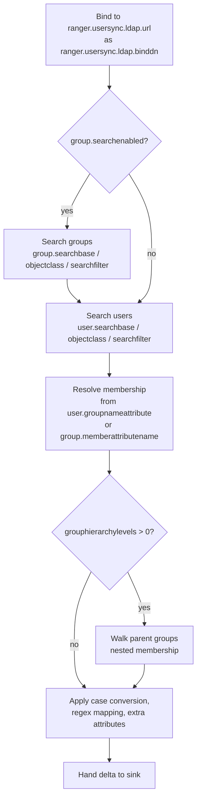

<!---
  Licensed to the Apache Software Foundation (ASF) under one or more
  contributor license agreements.  See the NOTICE file distributed with
  this work for additional information regarding copyright ownership.
  The ASF licenses this file to You under the Apache License, Version 2.0
  (the "License"); you may not use this file except in compliance with
  the License.  You may obtain a copy of the License at

      http://www.apache.org/licenses/LICENSE-2.0

  Unless required by applicable law or agreed to in writing, software
  distributed under the License is distributed on an "AS IS" BASIS,
  WITHOUT WARRANTIES OR CONDITIONS OF ANY KIND, either express or implied.
  See the License for the specific language governing permissions and
  limitations under the License.
-->

# LDAP and Active Directory

Most organizations keep their users in Active Directory or an LDAP directory such as OpenLDAP. The
LDAP source of UserSync searches that directory for user and group entries, works out who belongs to which
group, and uploads the result to Ranger Admin. Once configured it needs no further attention: it picks up
new users and membership changes on every cycle and, with delta sync, only asks the directory for entries
that changed since the last run.

Getting the search bases, object classes and attribute names right is the hard part, because every
directory is laid out differently. This page lists every property, gives working examples for AD and
OpenLDAP, and introduces the LDAP connection check tool that can discover most values for you.

## How the LDAP source works

`org.apache.ranger.ldapusersync.process.LdapUserGroupBuilder` runs the following steps in each cycle:



- **User search** runs against each base in `ranger.usersync.ldap.user.searchbase` (several bases separated
  by `;`), with the filter `(objectclass=<user.objectclass>)` combined with `user.searchfilter`. Results are
  paged (`ranger.usersync.pagedresultsenabled`, page size `ranger.usersync.pagedresultssize`) so that AD's
  1000-entry limit does not truncate the result.
- **Group search** (on by default) runs against `ranger.usersync.group.searchbase` the same way and reads
  the `group.memberattributename` (usually `member`) of each group. When group search is off, membership
  comes only from the user's `user.groupnameattribute` (`memberOf` in AD).
- **Order**: when group search is on, groups are always fetched before users. Only users found by the user
  search are kept as group members, unless `ranger.usersync.user.searchenabled` is `false`; then the users
  are taken from the group member lists instead. User search can be switched off only while
  `ranger.usersync.group.search.first.enabled` and group search are both `true`.
- Group names in `memberOf` values and user names in `member` values are DNs; UserSync takes the `uid` or
  `cn` value of the first RDN as the short name.

## Minimal configuration

Everything goes into `ranger-ugsync-site.xml`. Properties that are left out keep the defaults listed in the
[configuration reference](#configuration-reference): group search is on, paging is on with 500 entries per
page, the search scope is `sub`, and a cycle runs every hour.

=== "Active Directory"

    ```xml title="conf/ranger-ugsync-site.xml"
    <property><name>ranger.usersync.sync.source</name><value>ldap</value></property>
    <property><name>ranger.usersync.ldap.url</name><value>ldaps://ad.example.com:636</value></property>
    <property><name>ranger.usersync.ldap.binddn</name><value>CN=ranger-sync,OU=Service Accounts,DC=example,DC=com</value></property>
    <property><name>ranger.usersync.credstore.filename</name><value>/etc/ranger/usersync/conf/rangerusersync.jceks</value></property>
    <property><name>ranger.usersync.ldap.deltasync</name><value>true</value></property>
    <property><name>ranger.usersync.ldap.referral</name><value>follow</value></property>
    <property><name>ranger.usersync.ldap.user.searchbase</name><value>OU=Users,DC=example,DC=com;OU=Contractors,DC=example,DC=com</value></property>
    <property><name>ranger.usersync.ldap.user.objectclass</name><value>person</value></property>
    <property><name>ranger.usersync.ldap.user.searchfilter</name><value>(memberOf=CN=data-users,OU=Groups,DC=example,DC=com)</value></property>
    <property><name>ranger.usersync.ldap.user.nameattribute</name><value>sAMAccountName</value></property>
    <property><name>ranger.usersync.ldap.username.caseconversion</name><value>lower</value></property>
    <property><name>ranger.usersync.ldap.groupname.caseconversion</name><value>lower</value></property>
    <property><name>ranger.usersync.group.searchbase</name><value>OU=Groups,DC=example,DC=com</value></property>
    <property><name>ranger.usersync.group.objectclass</name><value>group</value></property>
    <property><name>ranger.usersync.group.memberattributename</name><value>member</value></property>
    ```

=== "OpenLDAP"

    ```xml title="conf/ranger-ugsync-site.xml"
    <property><name>ranger.usersync.sync.source</name><value>ldap</value></property>
    <property><name>ranger.usersync.ldap.url</name><value>ldap://ldap.example.com:389</value></property>
    <property><name>ranger.usersync.ldap.binddn</name><value>cn=admin,dc=example,dc=com</value></property>
    <property><name>ranger.usersync.credstore.filename</name><value>/etc/ranger/usersync/conf/rangerusersync.jceks</value></property>
    <property><name>ranger.usersync.ldap.deltasync</name><value>true</value></property>
    <property><name>ranger.usersync.ldap.user.searchbase</name><value>ou=people,dc=example,dc=com</value></property>
    <property><name>ranger.usersync.ldap.user.objectclass</name><value>posixAccount</value></property>
    <property><name>ranger.usersync.ldap.user.nameattribute</name><value>uid</value></property>
    <property><name>ranger.usersync.group.searchbase</name><value>ou=groups,dc=example,dc=com</value></property>
    <property><name>ranger.usersync.group.objectclass</name><value>groupOfNames</value></property>
    <property><name>ranger.usersync.group.memberattributename</name><value>member</value></property>
    ```

    For `posixGroup` entries set `ranger.usersync.group.objectclass` to `posixGroup` and
    `ranger.usersync.group.memberattributename` to `memberUid`.

### Bind password

Keep the bind password out of the XML: store it in the JCEKS credential store named by
`ranger.usersync.credstore.filename` under the fixed alias `ranger.usersync.ldap.bindalias`. UserSync reads
that alias at startup and falls back to `ranger.usersync.ldap.ldapbindpassword` only when the alias is
missing. The UserSync distribution ships a helper for this:

```bash
python3 ranger_credential_helper.py -l "ews/lib/*" \
  -f /etc/ranger/usersync/conf/rangerusersync.jceks \
  -k ranger.usersync.ldap.bindalias -v '<bind password>' -c 1
```

For `ldaps://` URLs and StartTLS, UserSync must trust the directory's certificate. When
`ranger.usersync.truststore.file` is set (see [TLS towards Ranger Admin](service.md#tls-towards-ranger-admin)),
the LDAP connection uses that truststore, so add the directory's CA certificate to it. Otherwise the JVM
default applies: import the CA certificate into the JDK `cacerts` or pass `-Djavax.net.ssl.trustStore` in
`JAVA_OPTS`.

## Configuration reference

### Connection

How UserSync reaches and binds to the directory.

| Key | Default | Type | Description |
|---|---|---|---|
| `ranger.usersync.ldap.url` | (none) | URL | `ldap://host:389` or `ldaps://host:636`. Required |
| `ranger.usersync.ldap.binddn` | (none) | String | DN used to bind; needs read access to users and groups. Required |
| `ranger.usersync.ldap.ldapbindpassword` | (none) | Password | Bind password; prefer the credential store, see [Bind password](#bind-password) |
| `ranger.usersync.credstore.filename` | (none) | Path | JCEKS credential store that holds the bind password |
| `ranger.usersync.ldap.authentication.mechanism` | `simple` | String | JNDI authentication mechanism |
| `ranger.usersync.ldap.starttls` | `false` | Boolean | Issue StartTLS on a plain `ldap://` connection |
| `ranger.usersync.ldap.referral` | `ignore` | Enum | `ignore` or `follow`; AD forests usually need `follow` |
| `ranger.usersync.pagedresultsenabled` | `true` | Boolean | Use the paged-results control |
| `ranger.usersync.pagedresultssize` | `500` | Integer | Entries per page |
| `ranger.usersync.ldap.searchBase` | (none) | String | Fallback base for user and group searches |

### Users

Which entries are users and which attribute becomes the Ranger user name.

| Key | Default | Type | Description |
|---|---|---|---|
| `ranger.usersync.ldap.user.searchbase` | value of `ranger.usersync.ldap.searchBase` | List | One or more bases separated by `;`. Each is searched in turn and the results are merged. Required unless the fallback base is set |
| `ranger.usersync.ldap.user.searchscope` | `sub` | Enum | `base`, `one` or `sub` |
| `ranger.usersync.ldap.user.objectclass` | `person` | String | Object class that identifies a user (`posixAccount`, `user`, ...) |
| `ranger.usersync.ldap.user.searchfilter` | (none) | String | Extra filter ANDed with the object class |
| `ranger.usersync.ldap.user.nameattribute` | `cn` | String | Attribute used as the Ranger user name (`sAMAccountName` for AD, `uid` for OpenLDAP) |
| `ranger.usersync.ldap.user.groupnameattribute` | `memberof,ismemberof` | List | Attributes on the user entry that list its groups |
| `ranger.usersync.ldap.username.caseconversion` | `none` | Enum | `none`, `lower` or `upper` |
| `ranger.usersync.user.searchenabled` | `true` | Boolean | Set `false` to derive users only from group membership; honored only when group search and `ranger.usersync.group.search.first.enabled` are `true` |
| `ranger.usersync.ldap.user.otherattributes` | `userurincipaluame,` | List | Extra attributes to sync, see [Additional attributes](#additional-attributes) |
| `ranger.usersync.ldap.user.cloudid.attribute` | `objectid` | String | Attribute stored as the user's cloud id |
| `ranger.usersync.ldap.user.cloudid.attribute.datatype` | `byte[]` | String | JNDI type of that attribute |

### Groups

Which entries are groups and how membership is read.

| Key | Default | Type | Description |
|---|---|---|---|
| `ranger.usersync.group.searchenabled` | `true` | Boolean | Search group entries instead of relying only on the user's `memberOf` |
| `ranger.usersync.group.search.first.enabled` | `true` | Boolean | Must be `true` for `ranger.usersync.user.searchenabled=false` to take effect; treated as `false` when group search is off. Groups are fetched before users in either case |
| `ranger.usersync.group.searchbase` | fallback base, then the user search base | List | One or more bases separated by `;` |
| `ranger.usersync.group.searchscope` | `sub` | Enum | `base`, `one` or `sub` |
| `ranger.usersync.group.objectclass` | `groupofnames` | String | `group` for AD, `posixGroup` for POSIX schemas |
| `ranger.usersync.group.searchfilter` | (none) | String | Extra filter ANDed with the object class |
| `ranger.usersync.group.nameattribute` | `cn` | String | Attribute used as the Ranger group name |
| `ranger.usersync.group.memberattributename` | `member` | String | Attribute listing members (`memberUid` for `posixGroup`) |
| `ranger.usersync.ldap.groupname.caseconversion` | `none` | Enum | `none`, `lower` or `upper` |
| `ranger.usersync.ldap.groupnames` | (none) | List | Restrict the user search to members of these groups; see below |
| `ranger.usersync.ldap.grouphierarchylevels` | `0` | Integer | Levels of nested groups to resolve, see [Nested groups](#nested-groups) |
| `ranger.usersync.ldap.largegroupsync` | `false` | Boolean | Read AD ranged member attributes (`member;range=0-1499`) for groups with more than 1500 members |
| `ranger.usersync.ldap.group.otherattributes` | `displayname,` | List | Extra group attributes to sync |
| `ranger.usersync.ldap.group.cloudid.attribute` | `objectid` | String | Attribute stored as the group's cloud id |
| `ranger.usersync.ldap.group.cloudid.attribute.datatype` | `byte[]` | String | JNDI type of that attribute |

`ranger.usersync.ldap.groupnames` takes a `;`-separated list of `cn=<name>` or `memberof=<group DN>` entries and
is used only when `ranger.usersync.ldap.user.searchfilter` is empty: UserSync looks up the DN of each group and
uses `(|(memberof=<DN>)...)` as the user search filter. It does not restrict which groups are synced; use
`ranger.usersync.group.searchfilter` for that.

### Sync schedule

| Key | Default | Type | Description |
|---|---|---|---|
| `ranger.usersync.ldap.deltasync` | `false` | Boolean | Only fetch entries changed since the last cycle, see [Delta sync](#delta-sync) |
| `ranger.usersync.sleeptimeinmillisbetweensynccycle` | `3600000` | Duration (ms) | Time between cycles. Values below one hour are raised to one hour |
| `ranger.usersync.ldap.force.sleeptimeinmillisbetweensynccycle.enabled` | `false` | Boolean | Accept an LDAP interval below one hour |

## Multiple OUs

Active Directory does not support extensible-match filters, so UserSync searches each configured base
separately and merges the results. List the bases with `;`:

```xml title="conf/ranger-ugsync-site.xml"
<property>
  <name>ranger.usersync.ldap.user.searchbase</name>
  <value>OU=PlatformUsers,DC=example,DC=com;OU=BusinessUsers,DC=example,DC=com</value>
</property>
<property>
  <name>ranger.usersync.group.searchbase</name>
  <value>OU=PlatformGroups,DC=example,DC=com;OU=Groups,DC=example,DC=com</value>
</property>
```

Group membership is computed after all bases have been processed, so a user in one OU can belong to a
group in another. Be aware that `cn` is not guaranteed to be unique across OUs; if two users share the
configured name attribute, the last one wins and the DN is recorded in `full_name`.

## Nested groups

By default only direct membership is synced. Set `ranger.usersync.ldap.grouphierarchylevels` in
`ranger-ugsync-site.xml` to the number of levels to climb: with `2`, a user in `team-a`, where `team-a` is a
member of `dept-eng` and `dept-eng` is a member of `all-staff`, is reported as a member of all three. Each
level costs one extra LDAP search per group, so keep the value as low as your directory allows. Group search
must be enabled for this to work.

## Additional attributes

UserSync can copy arbitrary directory attributes into the `other_attributes` JSON of each user and group,
where Ranger Admin shows them under **Settings > Users/Groups** and where policy conditions and the
UserStore can use them (see ABAC).

```xml title="conf/ranger-ugsync-site.xml"
<property>
  <name>ranger.usersync.ldap.user.otherattributes</name>
  <value>userPrincipalName,displayName,objectGUID</value>
</property>
<property>
  <name>ranger.usersync.ldap.user.otherattributes.objectGUIDdatatype</name>
  <value>byte[]</value>
</property>
<property>
  <name>ranger.usersync.ldap.group.otherattributes</name>
  <value>displayName,objectGUID</value>
</property>
<property>
  <name>ranger.usersync.ldap.group.otherattributes.objectGUIDdatatype</name>
  <value>byte[]</value>
</property>
```

The data type property is `ranger.usersync.ldap.<user|group>.otherattributes.<attributeName>datatype` and
defaults to `String`; AD binary attributes such as `objectGUID`/`objectSid` need `byte[]`. The JNDI LDAP
provider represents every attribute as either `String` or `byte[]`.

## Name transformation

Independently of case conversion, user and group names can be rewritten with `sed`-style regular
expressions before they reach Ranger Admin. The original value is kept in `original_name`.

| Key | Default | Type | Description |
|---|---|---|---|
| `ranger.usersync.mapping.username.regex` | (none) | String | First rule for user names; add more as `.1`, `.2`, ... |
| `ranger.usersync.mapping.groupname.regex` | (none) | String | First rule for group names; add more as `.1`, `.2`, ... |
| `ranger.usersync.mapping.regex.separator` | `/` | String | Separator character used in the rules |
| `ranger.usersync.mapping.username.handler` | `org.apache.ranger.ugsyncutil.transform.RegEx` | Class | Class implementing the user name transformation |
| `ranger.usersync.mapping.groupname.handler` | `org.apache.ranger.ugsyncutil.transform.RegEx` | Class | Class implementing the group name transformation |

Rules have the form `s/<match>/<replacement>/` with an optional trailing `g`. For example, to replace spaces
with underscores and strip a domain suffix:

```xml
<property><name>ranger.usersync.mapping.username.regex</name><value>s/[ ]/_/g</value></property>
<property><name>ranger.usersync.mapping.username.regex.1</name><value>s/@example.com//</value></property>
```

## Delta sync

With `ranger.usersync.ldap.deltasync=true`, UserSync remembers the highest `uSNChanged` (AD) or the latest
`modifyTimestamp` (OpenLDAP) it saw for users and for groups and adds
`(|(uSNChanged>=N)(modifyTimestamp>=T))` to the search filter on the next cycle. The tracked values are kept in memory, so the first cycle after a
start is a full search; a full user search also runs in every cycle in which the group search returned
group members and in cycles that compute deletes. Because the directory only returns
changed entries, membership of unchanged groups is taken from the previous cycle's cache.

Deletions are not visible through delta sync. If you rely on `ranger.usersync.deletes.enabled`, the
periodic delete check (`ranger.usersync.deletes.frequency`) performs a full comparison against the sink;
see [Operations](operations.md#deleting-users-and-groups).

## LDAP connection check tool

`ldaptool/` in the UserSync distribution contains a command-line tool that discovers the search properties
above from a live directory, verifies them by retrieving the first 20 users and groups, optionally suggests
the matching Ranger Admin authentication properties, and writes the discovered values to a file.

```bash
cd ldaptool
# edit conf/input.properties (URL, bind DN, search base, filter, sample user), then:
./run.sh -i conf/input.properties -d all -o /tmp/ldapcheck
```

| Option | Meaning |
|---|---|
| `-i <file>` | Input properties file; without it the tool prompts for the mandatory values |
| `-o <dir>` | Output directory (default `output/`) |
| `-d {all\|users\|groups}` | Discover user and/or group search properties |
| `-r {all\|users\|groups}` | Only retrieve entries using the properties in the input file |
| `-a` | Skip discovery of Ranger Admin authentication properties |
| `-h` | Help |

`run.sh` prompts for the bind password (and the sample user's password unless `-a` is given) so that no
password needs to be in the input file. The mandatory inputs are `ranger.usersync.ldap.url`,
`ranger.usersync.ldap.binddn`, and for non-AD directories `ranger.usersync.ldap.user.searchbase` and
`ranger.usersync.ldap.user.searchfilter`; `ranger.admin.auth.sampleuser` is needed for authentication
discovery. The tool writes `ambari.properties`, which lists the discovered values under their
`ranger.usersync.*` property names, and `ldapConfigCheck.log` into the output directory. It assumes common attribute names (`sAMAccountName`/`uid`/`cn` for users,
`group`/`groupOfNames`/`posixGroup` for group classes, `member`/`memberUid` for members) and picks the OU
holding most of the first 20 hits as the search base, so review its suggestions before using them.

## Troubleshooting

- **`javax.naming.AuthenticationException`** - wrong bind DN or password. Update the
  `ranger.usersync.ldap.bindalias` entry in the credential store (see [Bind password](#bind-password)); a
  value in the credential store wins over `ranger.usersync.ldap.ldapbindpassword`.
- **`PartialResultException`** with AD - set `ranger.usersync.ldap.referral` to `follow` or point the URL at the global
  catalog port `3268`.
- **No users synced, no error** - the object class or filter matches nothing. Test with the connection
  check tool or `ldapsearch` using the same base and filter.
- **Groups are empty** - the member attribute is wrong (`member` vs `memberUid`), or `memberOf` is not
  populated on user entries in your directory; enable group search.
- **Only 1000 users appear** - paging is disabled or the directory does not support the paged-results
  control.
- **Names have wrong case** - Ranger user names are case sensitive; keep
  `ranger.usersync.ldap.username.caseconversion` consistent with how Ranger Admin authentication and the plugins
  report user names (Kerberos short names are usually lower case).

## Further reading

- [UserSync overview](service.md)
- [Operations](operations.md)
- [Ranger Admin authentication](../admin/authentication.md) for the matching LDAP/AD login settings
- Source: [`LdapUserGroupBuilder.java`](https://github.com/apache/ranger/blob/master/ugsync/src/main/java/org/apache/ranger/ldapusersync/process/LdapUserGroupBuilder.java),
  [`ldapconfigchecktool`](https://github.com/apache/ranger/tree/master/ugsync/ldapconfigchecktool)
- cwiki: [Multiple OU support](https://cwiki.apache.org/confluence/pages/viewpage.action?pageId=61335387),
  [Additional user/group attributes ([RANGER-2697](https://issues.apache.org/jira/browse/RANGER-2697))](https://cwiki.apache.org/confluence/pages/viewpage.action?pageId=199531294),
  [LDAP connection check tool](https://cwiki.apache.org/confluence/pages/viewpage.action?pageId=61323314)
