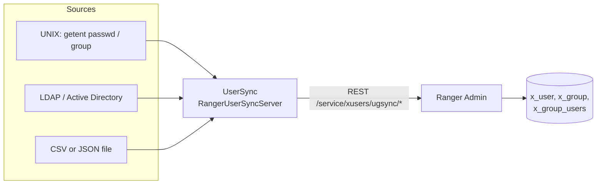

<!---
  Licensed to the Apache Software Foundation (ASF) under one or more
  contributor license agreements.  See the NOTICE file distributed with
  this work for additional information regarding copyright ownership.
  The ASF licenses this file to You under the Apache License, Version 2.0
  (the "License"); you may not use this file except in compliance with
  the License.  You may obtain a copy of the License at

      http://www.apache.org/licenses/LICENSE-2.0

  Unless required by applicable law or agreed to in writing, software
  distributed under the License is distributed on an "AS IS" BASIS,
  WITHOUT WARRANTIES OR CONDITIONS OF ANY KIND, either express or implied.
  See the License for the specific language governing permissions and
  limitations under the License.
-->

# Ranger UserSync

Ranger UserSync copies users, groups and group memberships from an identity source into Ranger Admin, so
that policy authors can pick real user and group names instead of typing them. It reads from one of three
sources - the UNIX accounts of the host, an LDAP or Active Directory server, or a text file - and pushes the
result to Ranger Admin over its REST API. It runs the sync on a fixed interval and only sends what changed.

UserSync never authenticates users; Ranger Admin does that itself (see
[Authentication](../admin/authentication.md)). UserSync can also assign Ranger roles to the users and groups
it syncs, which is how administrators are bootstrapped from a directory group.

## How it works



The process is `org.apache.ranger.authentication.server.RangerUserSyncServer`. It starts an embedded web
server for metrics and one `UserGroupSync` thread. The thread runs a first sync as soon as the source and sink
are initialized and then loops forever:

1. Sleep for `ranger.usersync.sleeptimeinmillisbetweensynccycle`.
2. If this instance is the active one (see [High availability](#high-availability)), call the configured
   *source* class to fetch users, groups and memberships.
3. Hand the result to the *sink* class `PolicyMgrUserGroupBuilder`, which compares it with what Ranger Admin
   already has and uploads only new or changed users, groups and group memberships in pages of
   `ranger.usersync.policymanager.maxrecordsperapicall` records.
4. Post a summary of the cycle to `/service/xusers/ugsync/auditinfo/`; it appears in Ranger Admin under
   **Audit > User Sync**.

Users created this way are *external* users in Ranger Admin. Each user and group carries a JSON
`other_attributes` field with `sync_source`, `full_name` (the DN for LDAP), `original_name` and, for LDAP, the
`ldap_url` and any additional attributes you configured. Ranger Admin uses `sync_source` to decide which
UserSync instance owns a record; see [Operations](operations.md#sync-source-enforcement).

The sink authenticates to Ranger Admin as the user `rangerusersync` (password `rangerusersync` by default),
which must have the Admin role. Change it as described in
[Operations](operations.md#changing-the-ranger-admin-credentials). With Kerberos configured the sink uses
`ranger.usersync.kerberos.principal` instead.

## Sync sources

`ranger.usersync.sync.source` selects the source: with `unix` or `ldap`, UserSync picks the matching source
class itself. `ranger.usersync.source.impl.class` names a source class directly and, when set, takes
precedence; this is how the file source is enabled. One of the two properties must be set.

UNIX (`unix`)
:   `org.apache.ranger.unixusersync.process.UnixUserGroupBuilder` reads the accounts and groups visible on the
    host UserSync runs on. See
    [UNIX and file sources](unix-and-file-sources.md).

LDAP / Active Directory (`ldap`)
:   `org.apache.ranger.ldapusersync.process.LdapUserGroupBuilder` searches a directory and supports delta
    sync, nested groups and additional attributes. See [LDAP and Active Directory](ldap-ad.md).

File
:   `org.apache.ranger.unixusersync.process.FileSourceUserGroupBuilder` reads a CSV or JSON file; useful for
    tests, air-gapped setups and bulk loads from another system. See
    [UNIX and file sources](unix-and-file-sources.md#file-source).

## Requirements

- A reachable Ranger Admin, and a Ranger Admin user with the Admin role for the sink (`rangerusersync`
  exists by default).
- A JDK; `JAVA_HOME` must be set for the service script.
- Read access to the identity source: `getent` on the host for the UNIX source, a bind DN with read access
  to users and groups for LDAP, or a readable file for the file source.
- For Kerberos towards Ranger Admin, a keytab for the UserSync principal and a `core-site.xml` on the
  classpath that sets `hadoop.security.authentication=kerberos`.

## Running UserSync

=== "Docker (dev-support/ranger-docker)"

    UserSync has no released image on Docker Hub; the `dev-support/ranger-docker` compose files build it
    from the source tree. Prepare the directory (archives and a Ranger build in `dist/`) as described under
    *Build from source* in [Run with Docker](../admin/installation.md#run-with-docker), then add
    `docker-compose.ranger-usersync.yml` to the compose command:

    ```bash
    cd dev-support/ranger-docker
    export RANGER_DB_TYPE=postgres
    export AUDIT_INDEX_STORE=opensearch
    export AUDIT_DESTINATIONS=audit-store-${AUDIT_INDEX_STORE}
    # optional: sync test users from scripts/usersync/ugsync-file-source.csv instead of UNIX accounts
    export ENABLE_FILE_SYNC_SOURCE=true
    docker compose --profile ${AUDIT_DESTINATIONS} -f docker-compose.ranger.yml \
      -f docker-compose.ranger-audit-service.yml -f docker-compose.ranger-usersync.yml up -d
    ```

    The `ranger-usersync` container publishes port `8280` (metrics). Environment variables understood by
    the compose file: `ENABLE_FILE_SYNC_SOURCE` (use the file source with the mounted CSV),
    `DEBUG_USERSYNC=true` (debug logging), `KERBEROS_ENABLED=true` (wait for `rangerusersync.keytab` and use
    Kerberos towards Ranger Admin), `RANGER_USERSYNC_MAX_HEAP` (`256m` in `.env`) and `JAVA_OPTS`. The
    effective configuration is `/opt/ranger/usersync/conf/ranger-ugsync-site.xml` inside the container:

    ```bash
    docker logs -f ranger-usersync
    docker exec ranger-usersync cat /opt/ranger/usersync/conf/ranger-ugsync-site.xml
    curl http://localhost:8280/metrics/status
    ```

=== "Service script"

    The UserSync distribution (`ranger-<version>-usersync.tar.gz`) contains the service script. With
    `conf/ranger-ugsync-site.xml` in place and `JAVA_HOME` exported:

    ```bash
    ./ranger-usersync-services.sh start      # also: stop | restart | version
    ```

    See [Operations](operations.md) for the environment variables, logs and PID file.

### Files and directories

| Path | Purpose |
|---|---|
| `conf/ranger-ugsync-site.xml` | Your configuration; every property on these pages goes here |
| `conf/ranger-ugsync-default.xml` | Built-in defaults, loaded before the site file |
| `conf/logback.xml` | Logging; the root level is `info` |
| `conf/core-site.xml` | Only for Kerberos: sets `hadoop.security.authentication` and `auth_to_local` rules |
| `ranger-usersync-services.sh` | `start`, `stop`, `restart`, `version` |
| `updatepolicymgrpassword.py` | Rotate the Ranger Admin credentials used by the sink |
| `ranger_credential_helper.py` | Add a secret to a JCEKS credential store |
| `ldaptool/` | [LDAP connection check tool](ldap-ad.md#ldap-connection-check-tool) |
| `filesourceusersynctool/` | One-shot file-source loader (`run-filesource-usersync.sh`) |

## Configuration

All configuration is in `ranger-ugsync-site.xml` on the UserSync classpath (`conf/`). The tables below list
the properties that apply to every source; source-specific properties are on the
[UNIX and file sources](unix-and-file-sources.md) and [LDAP and Active Directory](ldap-ad.md) pages.

```xml title="conf/ranger-ugsync-site.xml (minimal, UNIX source)"
<configuration>
  <property>
    <name>ranger.usersync.policymanager.baseURL</name>
    <value>http://ranger-admin.example.com:6080</value>
  </property>
  <property>
    <name>ranger.usersync.sync.source</name>
    <value>unix</value>
  </property>
  <property>
    <name>ranger.usersync.policymgr.keystore</name>
    <value>/etc/ranger/usersync/conf/rangerusersync.jceks</value>
  </property>
  <property>
    <name>ranger.usersync.policymgr.alias</name>
    <value>ranger.usersync.policymgr.password</value>
  </property>
</configuration>
```

### Source and schedule

What to sync and how often. The interval has a floor that depends on the source: 1 minute for UNIX and the
file source, 1 hour for LDAP.

| Key | Default | Type | Description |
|---|---|---|---|
| `ranger.usersync.sync.source` | (none) | Enum | `unix` or `ldap`. Selects the source class when `ranger.usersync.source.impl.class` is not set |
| `ranger.usersync.source.impl.class` | (none) | Class | Source class; overrides `ranger.usersync.sync.source`. Needed for the file source |
| `ranger.usersync.sleeptimeinmillisbetweensynccycle` | `60000` (UNIX), `3600000` (LDAP) | Duration (ms) | Time between sync cycles. Values below the source's floor are raised to the floor |
| `ranger.usersync.enabled` | `true` | Boolean | Set `false` to run the process without syncing |
| `ranger.usersync.sink.impl.class` | `org.apache.ranger.unixusersync.process.PolicyMgrUserGroupBuilder` | Class | Sink that uploads to Ranger Admin |

### Ranger Admin connection

How the sink reaches Ranger Admin and which identity it uses.

| Key | Default | Type | Description |
|---|---|---|---|
| `ranger.usersync.policymanager.baseURL` | (none) | URL | Ranger Admin URL, e.g. `http://host:6080` or `https://host:6182`. Required |
| `ranger.usersync.policymgr.username` | `rangerusersync` | String | Ranger Admin user used by the sink |
| `ranger.usersync.policymgr.keystore` | (none) | Path | JCEKS credential store that holds that user's password |
| `ranger.usersync.policymgr.alias` | (none) | String | Alias of the password inside the credential store |
| `ranger.usersync.policymanager.maxrecordsperapicall` | `1000` | Integer | Page size for uploads |
| `ranger.usersync.policymgr.max.retry.attempts` | `0` | Integer | Retries for failed Ranger Admin calls |
| `ranger.usersync.policymgr.retry.interval.ms` | `1000` | Duration (ms) | Wait between retries |
| `ranger.usersync.cookie.enabled` | `true` | Boolean | Reuse the Ranger Admin session cookie between calls |
| `ranger.usersync.dest.ranger.session.cookie.name` | `RANGERADMINSESSIONID` | String | Name of that cookie |
| `ranger.usersync.policymanager.mockrun` | `false` | Boolean | Log what would be sent without calling Ranger Admin |

### Kerberos

With both properties set and `hadoop.security.authentication=kerberos` in the `core-site.xml` on the
classpath, the sink authenticates with SPNEGO and the password is not used.

| Key | Default | Type | Description |
|---|---|---|---|
| `ranger.usersync.kerberos.principal` | (none) | String | UserSync principal, e.g. `rangerusersync/_HOST@EXAMPLE.COM` |
| `ranger.usersync.kerberos.keytab` | (none) | Path | Keytab for that principal |

### TLS towards Ranger Admin

When the Ranger Admin URL is `https://`, UserSync needs a truststore that contains the Ranger Admin
certificate. The truststore password is read from the credential store named by
`ranger.usersync.credstore.filename` under the alias `usersync.ssl.truststore.password`; if that alias is
absent, the value of `ranger.usersync.truststore.password` is used.

| Key | Default | Type | Description |
|---|---|---|---|
| `ranger.usersync.truststore.file` | (none) | Path | Truststore with the Ranger Admin certificate |
| `ranger.usersync.truststore.password` | (none) | Password | Truststore password when it is not in the credential store |
| `ranger.usersync.credstore.filename` | (none) | Path | JCEKS credential store for the truststore and LDAP bind passwords |
| `ranger.truststore.file.type` | JVM default | String | Truststore type, e.g. `jks` or `bcfks` |
| `ranger.keystore.file.type` | JVM default | String | Keystore and credential store type; `bcfks` for FIPS setups |

### Sync behavior

| Key | Default | Type | Description |
|---|---|---|---|
| `ranger.usersync.deletes.enabled` | `false` | Boolean | Hide users and groups that disappeared from the source; see [Operations](operations.md#deleting-users-and-groups) |
| `ranger.usersync.deletes.frequency` | `1` | Long | Run delete detection every N sync cycles. When unset, detection runs in every cycle; an explicit value below 10 is raised to 10 |
| `ranger.usersync.syncsource.validation.enabled` | `true` | Boolean | Do not overwrite users and groups owned by a different sync source |
| `ranger.usersync.name.validation.enabled` | `false` | Boolean | Skip names that do not match Ranger's user and group name pattern |

### Role assignment rules

UserSync can assign Ranger roles to synced users and groups. The rule string is parsed with three
delimiters, each of which can be overridden. When a user matches several group rules, the rule that appears
last in the string wins; a `u` rule for a user takes precedence over group rules.

| Key | Default | Type | Description |
|---|---|---|---|
| `ranger.usersync.group.based.role.assignment.rules` | (none) | String | The rules, see the example below |
| `ranger.usersync.role.assignment.list.delimiter` | `&` | String | Separates rules |
| `ranger.usersync.users.groups.assignment.list.delimiter` | `:` | String | Separates role, `u`/`g` and the name list |
| `ranger.usersync.username.groupname.assignment.list.delimiter` | `,` | String | Separates names |
| `ranger.usersync.whitelist.users.role.assignment.rules` | `&ROLE_SYS_ADMIN:u:admin,rangerusersync,rangertagsync&ROLE_KEY_ADMIN:u:keyadmin` | String | Rules that always apply, so that the built-in accounts keep their roles |

```xml title="conf/ranger-ugsync-site.xml"
<property>
  <name>ranger.usersync.group.based.role.assignment.rules</name>
  <value>&amp;ROLE_SYS_ADMIN:g:platform-admins&amp;ROLE_KEY_ADMIN:u:alice,bob&amp;ROLE_ADMIN_AUDITOR:g:sec-audit</value>
</property>
<property><name>ranger.usersync.role.assignment.list.delimiter</name><value>&amp;</value></property>
<property><name>ranger.usersync.users.groups.assignment.list.delimiter</name><value>:</value></property>
<property><name>ranger.usersync.username.groupname.assignment.list.delimiter</name><value>,</value></property>
```

Valid roles are `ROLE_SYS_ADMIN`, `ROLE_KEY_ADMIN`, `ROLE_USER`, `ROLE_ADMIN_AUDITOR` and
`ROLE_KEY_ADMIN_AUDITOR`. Role changes are pushed through `/service/xusers/users/roleassignments`.

### Embedded web server

The embedded Tomcat serves `GET /metrics/status`, `GET /metrics/prometheus` and `GET /metrics/json`.

| Key | Default | Type | Description |
|---|---|---|---|
| `ranger.usersync.service.host` | (none) | String | Host name of this instance; the service script passes `$HOSTNAME` as a system property |
| `ranger.usersync.service.http.port` | `8280` | Integer | HTTP port |
| `ranger.usersync.service.https.attrib.ssl.enabled` | `false` | Boolean | Serve HTTPS instead of HTTP |
| `ranger.usersync.service.https.port` | `8283` | Integer | HTTPS port |
| `ranger.usersync.service.https.attrib.keystore.file` | (none) | Path | HTTPS keystore |
| `ranger.usersync.service.https.attrib.keystore.keyalias` | (none) | String | Alias of the server key in the keystore |
| `ranger.usersync.service.https.attrib.keystore.credential.alias` | `keyStoreCredentialAlias` | String | Credential-store alias of the keystore password |
| `ranger.usersync.credential.provider.path` | (none) | Path | Credential store that holds the keystore password |
| `ranger.usersync.service.https.attrib.client.auth` | `want` | Enum | Client certificates: `want`, `true` or `false` |
| `ranger.usersync.service.https.attrib.ssl.enabled.protocols` | `TLSv1.2` | List | Allowed TLS versions |
| `ranger.usersync.service.shutdown.port` | `8285` | Integer | Tomcat shutdown port |

### Metrics file

In addition to the HTTP endpoints, UserSync can write JVM and sync metrics to a JSON file.

| Key | Default | Type | Description |
|---|---|---|---|
| `ranger.usersync.metrics.enabled` | `false` | Boolean | Write the metrics file |
| `ranger.usersync.metrics.filepath` | log directory | Path | Directory; falls back to `ranger.usersync.logdir`, then `/tmp/` |
| `ranger.usersync.metrics.filename` | `ranger_usersync_metric.json` | String | File name |
| `ranger.usersync.metrics.frequencytimeinmillis` | `10000` | Duration (ms) | Write interval |
| `ranger.usersync.logdir` | `./log` | Path | Log directory |

## High availability

Two or more UserSync instances can share a ZooKeeper ensemble and elect one active instance; the passive
ones skip their sync cycles ("Sleeping ... as this server is running in passive mode" in the log). All
instances must use the same sync source and configuration. The `ranger-ugsync` prefix of the keys below is
the value of `ranger.service.name`, which must be set to `ranger-ugsync` in `ranger-ugsync-site.xml`.

| Key | Default | Type | Description |
|---|---|---|---|
| `ranger.service.name` | (none) | String | Must be `ranger-ugsync`; it is the prefix under which the HA properties are looked up |
| `ranger-ugsync.server.ha.enabled` | `false` | Boolean | Turn on leader election |
| `ranger-ugsync.server.ha.zookeeper.connect` | (none) | String | ZooKeeper connection string |
| `ranger-ugsync.server.ha.ids` | (none) | List | Instance ids, e.g. `id1,id2` |
| `ranger-ugsync.server.ha.address.<id>` | (none) | String | `host:port` of the instance with that id |
| `ranger-ugsync.service.http.port` | (none) | Integer | Port of this instance, used to find its own entry among the `address.<id>` values |
| `ranger-ugsync.server.ha.zookeeper.zkroot` | `/apacheranger.service.name_zkroot` | String | ZNode used for the latch; set it explicitly, e.g. `/ranger-ugsync` |
| `ranger-ugsync.server.ha.zookeeper.session.timeout.ms` | `20000` | Duration (ms) | ZooKeeper session timeout |
| `ranger-ugsync.server.ha.zookeeper.retry.sleeptime.ms` | `1000` | Duration (ms) | Wait between connection retries |
| `ranger-ugsync.server.ha.zookeeper.num.retries` | `3` | Integer | Connection retries |
| `ranger-ugsync.server.ha.zookeeper.acl` | (none) | String | ZooKeeper ACL for secured ensembles |
| `ranger-ugsync.server.ha.zookeeper.auth` | (none) | String | ZooKeeper auth for secured ensembles |

## Further reading

- [UNIX and file sources](unix-and-file-sources.md)
- [LDAP and Active Directory](ldap-ad.md)
- [Operations](operations.md)
- [Users, groups and roles in Ranger Admin](../admin/users-groups-roles.md)
- Source: [`UserGroupSyncConfig.java`](https://github.com/apache/ranger/blob/master/ugsync/src/main/java/org/apache/ranger/unixusersync/config/UserGroupSyncConfig.java)
